#### [方法二：栈](https://leetcode.cn/problems/brace-expansion-ii/solutions/2150290/hua-gua-hao-zhan-kai-ii-by-leetcode-solu-1s1y/)

**思路与算法**

如果把题目中的表达式并列关系看做是求和，把相接看做是求积，那么求解整个表达式的过程可以类比于求解中缀表达式的过程，例如：$\{a,b\}\{c,\{d,e\}\}$ 可以看做是 $\{a,b\} \times \{c + \{d + e\}\}$。

与求解中缀表达式一样，在遍历表达式的过程中我们需要用到两个栈，一个用来存放运算符（即加号和乘号，以及左大括号），另一个用来存运算对象（即集合）。

在本题中有一个特殊情况需要处理，就是乘号需要我们自己来添加，我们按照当前字符的种类来判断前面是否需要添加乘号：

1.  如果当前字符是 $“\{”$，并且前面是 $"\}"$ 或者小写英文字母时，需要添加乘号运算。
2.  如果当前字符是小写字母，并且前面是 $"\}"$ 或者是小写英文字母时，需要添加乘号运算。
3.  如果当前字符是 $","$ ，则前面一定不需要添加乘号运算。
4.  如果当前字符是 $"\}"$，则前面一定不需要添加乘号运算。

因此，只有当前字符是 $“\{”$ 或者小写字母时，才需要考虑是否在前面添加乘号。

接下来我们分析运算优先级的问题，在本题中只涉及加法和乘法两种运算。如果一个表达式同时有并列和相接，那我们应该先计算相接的结果，再计算并列的结果。因此，乘法的优先级要大于加法。

至此，我们可以按照如下流程来计算表达式的值：

1.  如果遇到 $","$，则先判断运算符栈顶是否是乘号，如果是乘号则需要先计算乘法，直到栈顶不是乘号为止，再将加号放入运算符栈中。
2.  如果遇到 $“\{”$，则先判断是否需要添加乘号，再将 $\{$ 放入运算符栈。
3.  如果遇到 $"\}"$，则不断地弹出运算符栈顶，并进行相应的计算，直到栈顶为左括号为止。
4.  如果遇到小写字母，则先判断是否需要添加乘号，再构造一个只包含当前小写字母的字符串集合，放入集合栈中。

按照上述流程遍历完一次之后，由于题目给定的表达式中最外层可能没有大括号，例如 $\{a,b\}\{c,\{d,e\}\}$，因此运算符栈中可能依然有元素，我们需要依次将他们弹出并进行计算。最终，集合栈栈顶元素即为答案。

下面展示了以 $\{a,b\}\{c,\{d,e\}\}$ 为例求解的全过程：

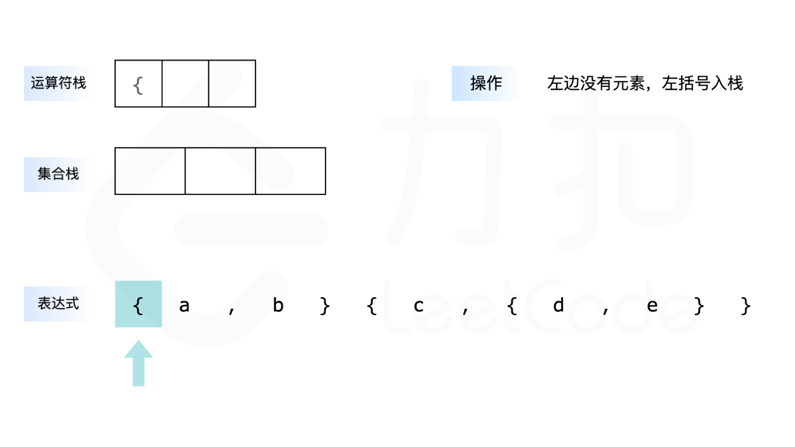
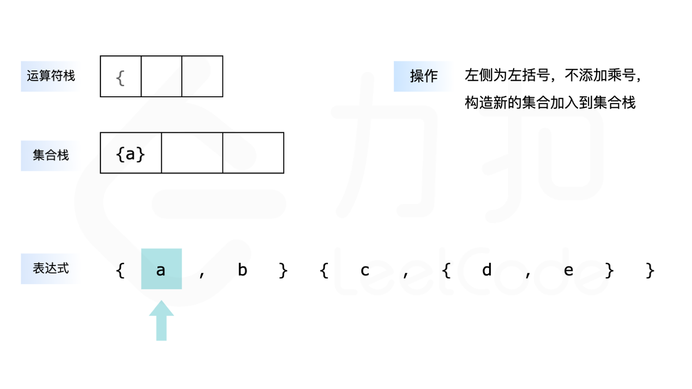
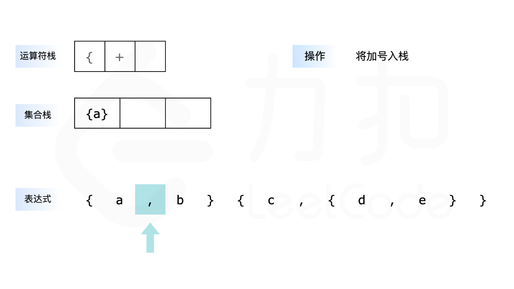
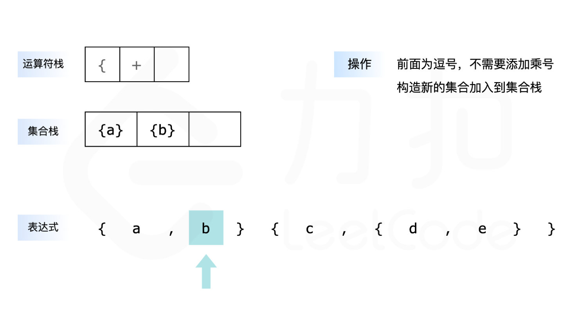
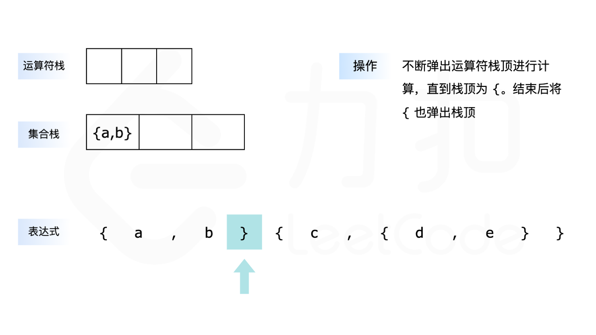
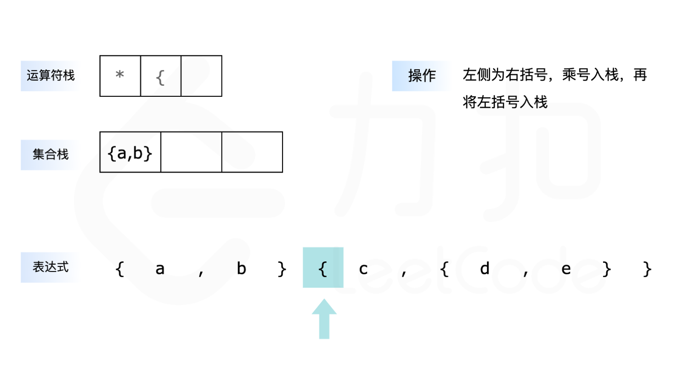
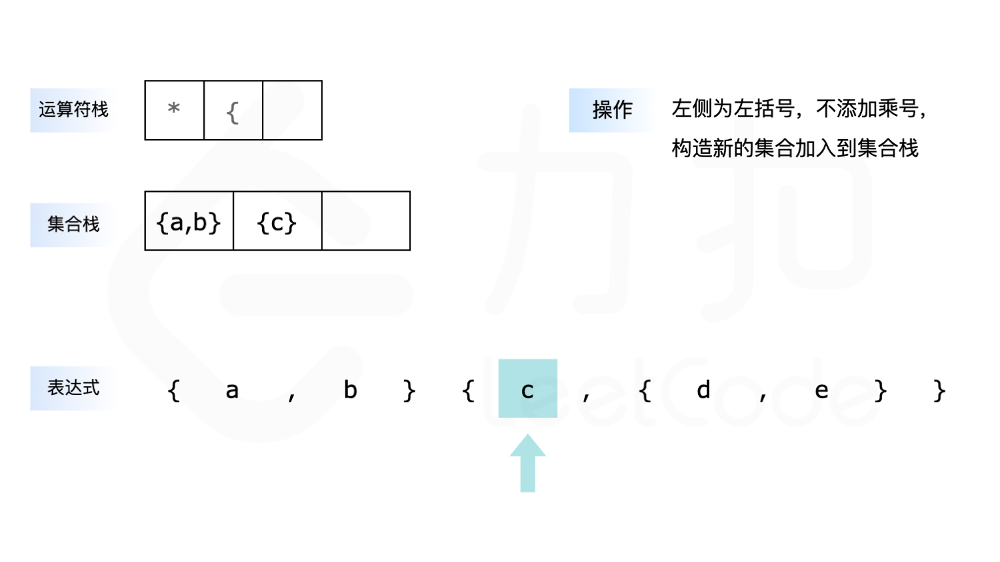
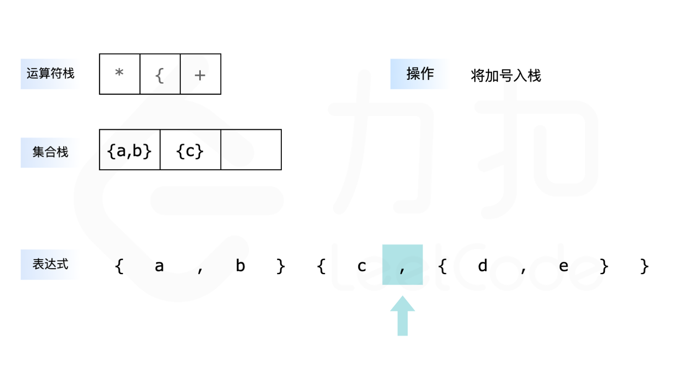
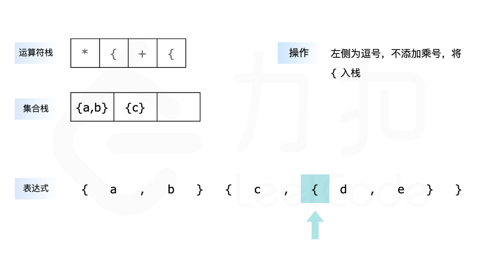
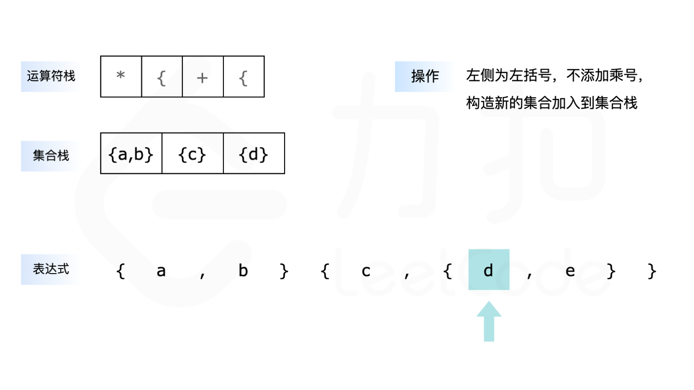
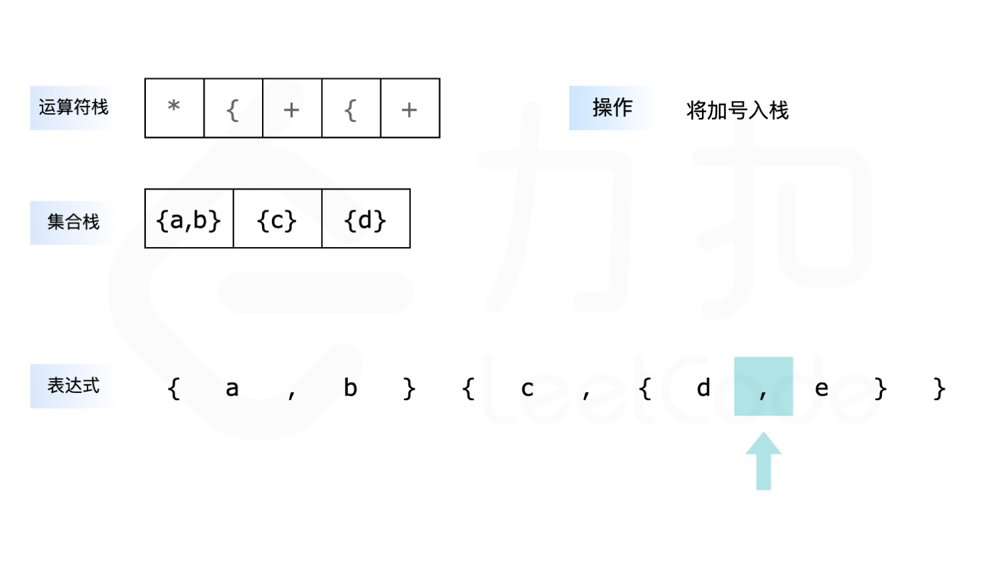
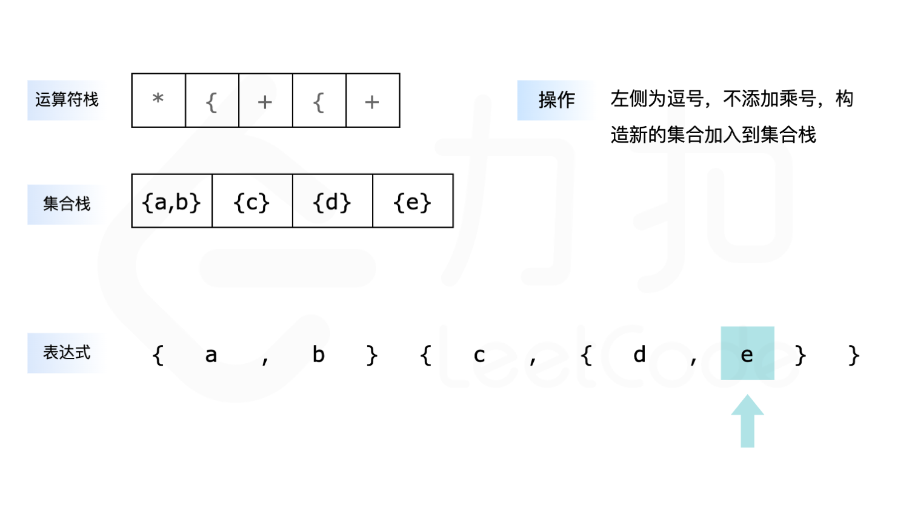
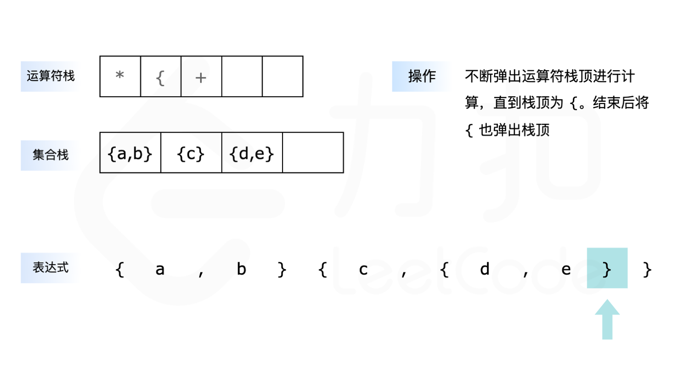
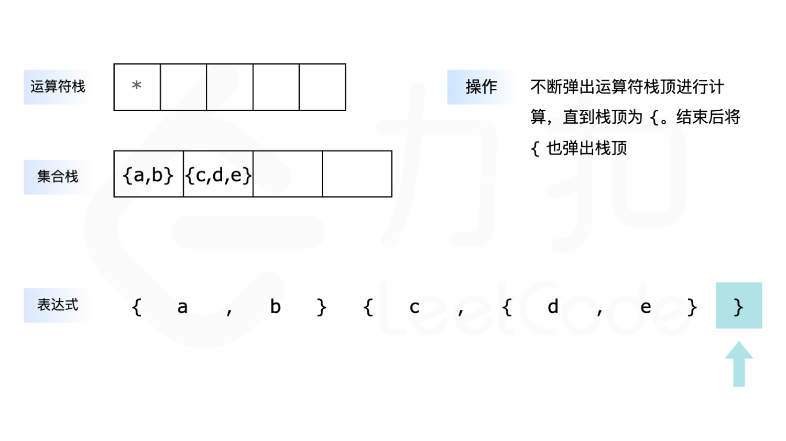
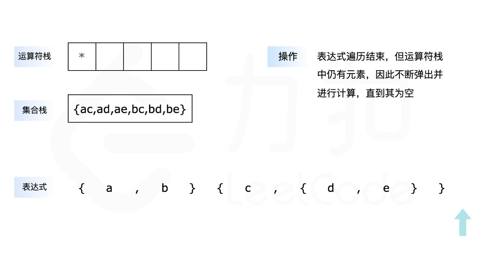

**代码**

```cpp
class Solution {
public:
    vector<string> braceExpansionII(string expression) {
        vector<char> op;
        vector<set<string>> stk;

        // 弹出栈顶运算符，并进行计算
        auto ope = [&]() {
            int l = stk.size() - 2, r = stk.size() - 1;
            if (op.back() == '+') {
                stk[l].merge(stk[r]);
            } else {
                set<string> tmp;
                for (auto &left : stk[l]) {
                    for (auto &right : stk[r]) {
                        tmp.insert(left + right);
                    }
                }
                stk[l] = move(tmp);
            }
            op.pop_back();
            stk.pop_back();
        };

        for (int i = 0; i < expression.size(); i++) {
            if (expression[i] == ',') {
                // 不断地弹出栈顶运算符，直到栈为空或者栈顶不为乘号
                while (op.size() && op.back() == '*') {
                    ope();
                }
                op.push_back('+');
            } else if (expression[i] == '{') {
                // 首先判断是否需要添加乘号，再将 { 添加到运算符栈中
                if (i > 0 && (expression[i - 1] == '}' || isalpha(expression[i - 1]))) {
                    op.push_back('*');
                }
                op.push_back('{');
            } else if (expression[i] == '}') {
                // 不断地弹出栈顶运算符，直到栈顶为 {
                while (op.size() && op.back() != '{') {
                    ope();
                }
                op.pop_back();
            } else {
                // 首先判断是否需要添加乘号，再将新构造的集合添加到集合栈中
                if (i > 0 && (expression[i - 1] == '}' || isalpha(expression[i - 1]))) {
                    op.push_back('*');
                }
                stk.push_back({string(1, expression[i])});
            }
        }
        
        while (op.size()) {
            ope();
        }
        return {stk.back().begin(), stk.back().end()};
    }
};
```

```java
class Solution {
    public List<String> braceExpansionII(String expression) {
        Deque<Character> op = new ArrayDeque<Character>();
        List<Set<String>> stk = new ArrayList<Set<String>>();

        for (int i = 0; i < expression.length(); i++) {
            if (expression.charAt(i) == ',') {
                // 不断地弹出栈顶运算符，直到栈为空或者栈顶不为乘号
                while (!op.isEmpty() && op.peek() == '*') {
                    ope(op, stk);
                }
                op.push('+');
            } else if (expression.charAt(i) == '{') {
                // 首先判断是否需要添加乘号，再将 { 添加到运算符栈中
                if (i > 0 && (expression.charAt(i - 1) == '}' || Character.isLetter(expression.charAt(i - 1)))) {
                    op.push('*');
                }
                op.push('{');
            } else if (expression.charAt(i) == '}') {
                // 不断地弹出栈顶运算符，直到栈顶为 {
                while (!op.isEmpty() && op.peek() != '{') {
                    ope(op, stk);
                }
                op.pop();
            } else {
                // 首先判断是否需要添加乘号，再将新构造的集合添加到集合栈中
                if (i > 0 && (expression.charAt(i - 1) == '}' || Character.isLetter(expression.charAt(i - 1)))) {
                    op.push('*');
                }
                StringBuilder sb = new StringBuilder();
                sb.append(expression.charAt(i));
                stk.add(new TreeSet<String>() {{
                    add(sb.toString());
                }});
            }
        }
        
        while (!op.isEmpty()) {
            ope(op, stk);
        }
        return new ArrayList<String>(stk.get(stk.size() - 1));
    }

    // 弹出栈顶运算符，并进行计算
    public void ope(Deque<Character> op, List<Set<String>> stk) {
        int l = stk.size() - 2, r = stk.size() - 1;
        if (op.peek() == '+') {
            stk.get(l).addAll(stk.get(r));
        } else {
            Set<String> tmp = new TreeSet<String>();
            for (String left : stk.get(l)) {
                for (String right : stk.get(r)) {
                    tmp.add(left + right);
                }
            }
            stk.set(l, tmp);
        }
        op.pop();
        stk.remove(stk.size() - 1);
    }
}
```

**复杂度分析**

-   时间复杂度：$O(n\log n)$，其中 $n$ 是 $expression$ 的长度。整个 $expression$ 只会遍历一次，时间复杂度为 $O(n)$，集合合并以及求积运算的时间复杂度为 $O(n\log n)$，因此总的时间复杂度为 $O(n \log n)$。
-   空间复杂度：$O(n)$。过程中用到了两个栈，他们都满足在任意时刻元素个数不超过 $O(n)$，包含 $n$ 个元素的集合的时间复杂度为 $O(n)$，因此总的空间复杂度为 $O(n)$。
