### [花括号展开 II](https://leetcode.cn/problems/brace-expansion-ii/solutions/2150290/hua-gua-hao-zhan-kai-ii-by-leetcode-solu-1s1y/)

#### 方法一：递归解析

**思路与算法**

表达式可以拆分为多个子表达式，以逗号分隔或者直接相接。我们应当先按照逗号分割成多个子表达式进行求解，然后再对所有结果求并集。这样做的原因是求积的优先级高于求并集的优先级。

我们用 $expr$ 表示一个任意一种表达式，用 $term$ 表示一个最外层没有逗号分割的表达式，那么 $expr$ 可以按照如下规则分解：

$$expr\rightarrow term \vert term,expr$$

其中的 $\vert $ 表示或者，即 $expr$ 可以分解为前者，也可以分解为后者。

再来看 $term, term$ 可以由小写英文字母或者花括号包括的表达式直接相接组成，我们用 $item$ 来表示每一个相接单元，那么 $term$ 可以按照如下规则分解：

$$term\rightarrow item \vert item term$$

item 可以进一步分解为小写英文字母 $letter$ 或者花括号包括的表达式，它的分解如下：

$$item\rightarrow letter \vert {expr}$$

在代码中，我们编写三个函数，分别负责以上三种规则的分解：

1. $expr$ 函数，不断的调用 $term$，并与其结果进行合并。如果匹配到表达式末尾或者当前字符不是逗号时，则返回。
2. $term$ 函数，不断的调用 $item$，并与其结果求积。如果匹配到表达式末尾或者当前字符不是小写字母，并且也不是左括号时，则返回。
3. $item$ 函数，根据当前字符是不是左括号来求解。如果是左括号，则调用 $expr$，返回结果；否则构造一个只包含当前字符的字符串集合，返回结果。

以下示意图以 ${a,b}{c,{d,e}}$ 为例，展示了表达式递归拆解以及回溯的全过程。

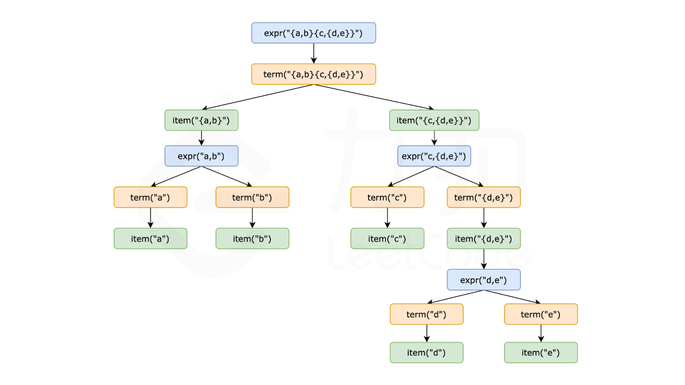
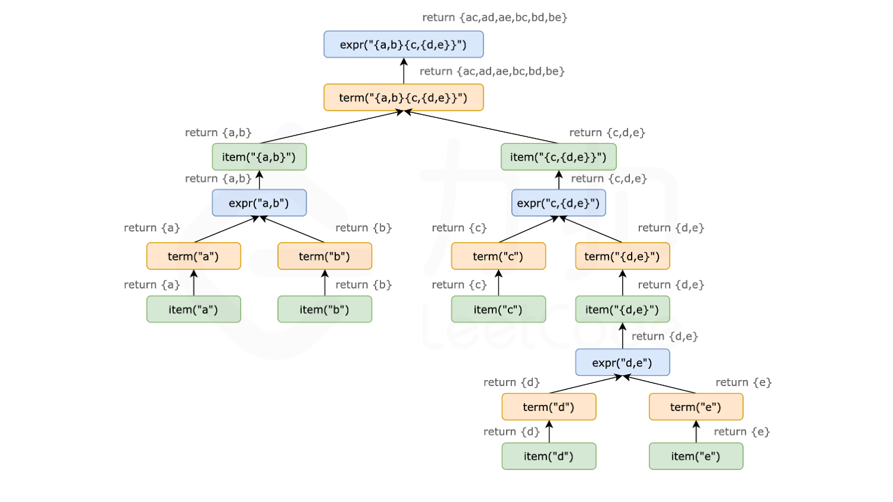

在代码实现过程中有以下细节：

1. 维护一个外部指针来遍历整个表达式，或者将表达式和当前遍历下标以引用的方式传递给被调函数。
2. 因为最终答案需要去重，所以可以先用集合来求解中间结果，最后再转换成已排序的列表作为最终答案。

**代码**

```C++
class Solution {
    string expression;
    int idx;

    // item -> letter | { expr }
    set<string> item() {
        set<string> ret;
        if (expression[idx] == '{') {
            idx++;
            ret = expr();
        } else {
            ret = {string(1, expression[idx])};
        }
        idx++;
        return move(ret);
    }

    // term -> item | item term
    set<string> term() {
        // 初始化空集合，与之后的求解结果求笛卡尔积
        set<string> ret = {""};
        // item 的开头是 { 或小写字母，只有符合时才继续匹配
        while (idx < expression.size() && (expression[idx] == '{' || isalpha(expression[idx]))) {
            auto sub = item();
            set<string> tmp;
            for (auto &left : ret) {
                for (auto &right : sub) {
                    tmp.insert(left + right);
                }
            }
            ret = move(tmp);
        }
        return move(ret);
    }

    // expr -> term | term, expr
    set<string> expr() {
        set<string> ret;
        while (true) {
            // 与 term() 求解结果求并集
            ret.merge(term());
            // 如果匹配到逗号则继续，否则结束匹配
            if (idx < expression.size() && expression[idx] == ',') {
                idx++;
                continue;
            } else {
                break;
            }
        }
        return move(ret);
    }

public:
    vector<string> braceExpansionII(string expression) {
        this->expression = expression;
        this->idx = 0;
        auto ret = expr();
        return {ret.begin(), ret.end()};
    }
};
```

```Java
class Solution {
    String expression;
    int idx;

    public List<String> braceExpansionII(String expression) {
        this.expression = expression;
        this.idx = 0;
        Set<String> ret = expr();
        return new ArrayList<String>(ret);
    }

    // item . letter | { expr }
    private Set<String> item() {
        Set<String> ret = new TreeSet<String>();
        if (expression.charAt(idx) == '{') {
            idx++;
            ret = expr();
        } else {
            StringBuilder sb = new StringBuilder();
            sb.append(expression.charAt(idx));
            ret.add(sb.toString());
        }
        idx++;
        return ret;
    }

    // term . item | item term
    private Set<String> term() {
        // 初始化空集合，与之后的求解结果求笛卡尔积
        Set<String> ret = new TreeSet<String>() {{
            add("");
        }};
        // item 的开头是 { 或小写字母，只有符合时才继续匹配
        while (idx < expression.length() && (expression.charAt(idx) == '{' || Character.isLetter(expression.charAt(idx)))) {
            Set<String> sub = item();
            Set<String> tmp = new TreeSet<String>();
            for (String left : ret) {
                for (String right : sub) {
                    tmp.add(left + right);
                }
            }
            ret = tmp;
        }
        return ret;
    }

    // expr . term | term, expr
    private Set<String> expr() {
        Set<String> ret = new TreeSet<String>();
        while (true) {
            // 与 term() 求解结果求并集
            ret.addAll(term());
            // 如果匹配到逗号则继续，否则结束匹配
            if (idx < expression.length() && expression.charAt(idx) == ',') {
                idx++;
                continue;
            } else {
                break;
            }
        }
        return ret;
    }
}
```

```CSharp
public class Solution {
    private string expression;
    private int idx;

    // item -> letter | { expr }
    private HashSet<string> Item() {
        HashSet<string> ret = new HashSet<string>();
        if (expression[idx] == '{') {
            idx++;
            ret = Expr();
        } else {
            ret = new HashSet<string> { expression[idx].ToString() };
        }
        idx++;
        return ret;
    }

    // term -> item | item term
    private HashSet<string> Term() {
        // 初始化空集合，与之后的求解结果求笛卡尔积
        HashSet<string> ret = new HashSet<string> { "" };
        // item 的开头是 { 或小写字母，只有符合时才继续匹配
        while (idx < expression.Length && (expression[idx] == '{' || char.IsLetter(expression[idx]))) {
            var sub = Item();
            HashSet<string> tmp = new HashSet<string>();
            foreach (var left in ret) {
                foreach (var right in sub) {
                    tmp.Add(left + right);
                }
            }
            ret = tmp;
        }
        return ret;
    }

    // expr -> term | term, expr
    private HashSet<string> Expr() {
        HashSet<string> ret = new HashSet<string>();
        while (true) {
            // 与 term() 求解结果求并集
            ret.UnionWith(Term());
            // 如果匹配到逗号则继续，否则结束匹配
            if (idx < expression.Length && expression[idx] == ',') {
                idx++;
                continue;
            } else {
                break;
            }
        }
        return ret;
    }

    public IList<string> BraceExpansionII(string expression) {
        this.expression = expression;
        this.idx = 0;
        var ret = Expr();
        var result = new List<string>(ret);
        result.Sort();
        return result;
    }
}
```

```Go
func braceExpansionII(expression string) []string {
    idx := 0
    expr := expression

    isLetter := func(c byte) bool {
        return c >= 'a' && c <= 'z'
    }

    // item -> letter | { expr }
    var item func() map[string]bool
    var term func() map[string]bool
    var exprFunc func() map[string]bool

    item = func() map[string]bool {
        ret := make(map[string]bool)
        if expr[idx] == '{' {
            idx++
            ret = exprFunc()
        } else {
            ret[string(expr[idx])] = true
        }
        idx++
        return ret
    }

    // term -> item | item term
    term = func() map[string]bool {
        // 初始化空集合，与之后的求解结果求笛卡尔积
        ret := map[string]bool{"": true}
        // item 的开头是 { 或小写字母，只有符合时才继续匹配
        for idx < len(expr) && (expr[idx] == '{' || isLetter(expr[idx])) {
            sub := item()
            tmp := make(map[string]bool)
            for left := range ret {
                for right := range sub {
                    tmp[left+right] = true
                }
            }
            ret = tmp
        }
        return ret
    }

    // expr -> term | term, expr
    exprFunc = func() map[string]bool {
        ret := make(map[string]bool)
        for {
            // 与 term() 求解结果求并集
            for k := range term() {
                ret[k] = true
            }
            // 如果匹配到逗号则继续，否则结束匹配
            if idx < len(expr) && expr[idx] == ',' {
                idx++
                continue
            }
            break
        }
        return ret
    }

    retMap := exprFunc()
    result := make([]string, 0, len(retMap))
    for k := range retMap {
        result = append(result, k)
    }
    sort.Strings(result)
    return result
}
```

```Python
class Solution:
    def braceExpansionII(self, expression: str) -> List[str]:
        idx = 0
        n = len(expression)

        def is_letter(c: str) -> bool:
            return 'a' <= c <= 'z'

        # 递归下降解析器
        def expr() -> set:
            nonlocal idx
            ret = set()
            while True:
                # 与 term() 求解结果求并集
                ret |= term()
                # 如果匹配到逗号则继续，否则结束匹配
                if idx < n and expression[idx] == ',':
                    idx += 1
                    continue
                else:
                    break
            return ret

        # term -> item | item term
        def term() -> set:
            nonlocal idx
            # 初始化空集合，与之后的求解结果求笛卡尔积
            ret = {""}
            # item 的开头是 { 或小写字母，只有符合时才继续匹配
            while idx < n and (expression[idx] == '{' or is_letter(expression[idx])):
                sub = item()
                tmp = set()
                for left in ret:
                    for right in sub:
                        tmp.add(left + right)
                ret = tmp
            return ret

        # item -> letter | { expr }
        def item() -> set:
            nonlocal idx
            ret = set()
            if expression[idx] == '{':
                idx += 1
                ret = expr()
            else:
                ret = {expression[idx]}
            idx += 1
            return ret

        ret = expr()
        return sorted(list(ret))

```

```C
typedef struct {
    char *key;
    UT_hash_handle hh;
} HashItem;

HashItem *hashFindItem(HashItem **obj, char *key) {
    HashItem *pEntry = NULL;
    HASH_FIND_STR(*obj, key, pEntry);
    return pEntry;
}

bool hashAddItem(HashItem **obj, char *key) {
    if (hashFindItem(obj, key)) {
        return false;
    }
    HashItem *pEntry = (HashItem *)malloc(sizeof(HashItem));
    pEntry->key = strdup(key);
    HASH_ADD_STR(*obj, key, pEntry);
    return true;
}

void hashFree(HashItem **obj) {
    HashItem *curr = NULL, *tmp = NULL;
    HASH_ITER(hh, *obj, curr, tmp) {
        HASH_DEL(*obj, curr);
        free(curr->key);
        free(curr);
    }
}

typedef struct {
    char* expression;
    int idx;
    int len;
} Parser;

bool isLetter(char c) {
    return c >= 'a' && c <= 'z';
}

void setUnion(HashItem **dest, HashItem** src) {
    HashItem *curr = NULL, *tmp = NULL;
    HASH_ITER(hh, *src, curr, tmp) {
        hashAddItem(dest, curr->key);
    }
}

int cmpstr(const void* a, const void* b) {
    return strcmp(*(const char**)a, *(const char**)b);
}

HashItem* expr_impl(Parser* parser);
HashItem* term_impl(Parser* parser);
HashItem* item_impl(Parser* parser);

// item -> letter | { expr }
HashItem* item_impl(Parser* parser) {
    HashItem* ret = NULL;
    if (parser->expression[parser->idx] == '{') {
        parser->idx++;
        HashItem* subResult = expr_impl(parser);
        setUnion(&ret, &subResult);
        hashFree(&subResult);
    } else {
        char str[2] = {parser->expression[parser->idx], '\0'};
        hashAddItem(&ret, str);
    }
    parser->idx++;
    return ret;
}

// term -> item | item term
HashItem* term_impl(Parser* parser) {
    // 初始化空集合，与之后的求解结果求笛卡尔积
    HashItem* ret = NULL;
    hashAddItem(&ret, "");

    // item 的开头是 { 或小写字母，只有符合时才继续匹配
    while (parser->idx < parser->len &&
           (parser->expression[parser->idx] == '{' || isLetter(parser->expression[parser->idx]))) {
        HashItem* sub = item_impl(parser);
        HashItem* tmp = NULL;

        // 笛卡尔积运算
        HashItem *currLeft = NULL, *tmpLeft = NULL;
        HASH_ITER(hh, ret, currLeft, tmpLeft) {
            HashItem *currRight = NULL, *tmpRight = NULL;
            HASH_ITER(hh, sub, currRight, tmpRight) {
                // 拼接字符串
                char* combined = (char*)malloc(strlen(currLeft->key) + strlen(currRight->key) + 1);
                strcpy(combined, currLeft->key);
                strcat(combined, currRight->key);
                hashAddItem(&tmp, combined);
                free(combined);
            }
        }

        // 释放旧集合
        hashFree(&ret);
        hashFree(&sub);
        ret = tmp;
    }
    return ret;
}

// expr -> term | term, expr
HashItem* expr_impl(Parser* parser) {
    HashItem* ret = NULL;
    while (true) {
        // 与 term() 求解结果求并集
        HashItem* termResult = term_impl(parser);
        setUnion(&ret, &termResult);
        hashFree(&termResult);

        // 如果匹配到逗号则继续，否则结束匹配
        if (parser->idx < parser->len && parser->expression[parser->idx] == ',') {
            parser->idx++;
            continue;
        } else {
            break;
        }
    }
    return ret;
}


char** braceExpansionII(char* expression, int* returnSize) {
    Parser parser;
    parser.expression = expression;
    parser.idx = 0;
    parser.len = strlen(expression);

    HashItem* resultSet = expr_impl(&parser);

    int count = HASH_COUNT(resultSet);
    *returnSize = count;
    char** result = (char**)malloc(count * sizeof(char*));
    HashItem *curr = NULL, *tmp = NULL;
    int i = 0;
    HASH_ITER(hh, resultSet, curr, tmp) {
        result[i] = strdup(curr->key);
        i++;
    }

    qsort(result, count, sizeof(char*), cmpstr);
    hashFree(&resultSet);

    return result;
}
```

```JavaScript
var braceExpansionII = function(expression) {
    let idx = 0;
    const n = expression.length;

    // 判断是否为字母
    const isLetter = (c) => {
        return c >= 'a' && c <= 'z';
    };

    // item -> letter | { expr }
    const item = () => {
        let ret = new Set();
        if (expression[idx] === '{') {
            idx++;
            ret = expr();
        } else {
            ret = new Set([expression[idx]]);
        }
        idx++;
        return ret;
    };

    // term -> item | item term
    const term = () => {
        // 初始化空集合，与之后的求解结果求笛卡尔积
        let ret = new Set([""]);
        // item 的开头是 { 或小写字母，只有符合时才继续匹配
        while (idx < n && (expression[idx] === '{' || isLetter(expression[idx]))) {
            const sub = item();
            const tmp = new Set();
            for (const left of ret) {
                for (const right of sub) {
                    tmp.add(left + right);
                }
            }
            ret = tmp;
        }
        return ret;
    };

    // expr -> term | term, expr
    const expr = () => {
        const ret = new Set();
        while (true) {
            // 与 term() 求解结果求并集
            for (const item of term()) {
                ret.add(item);
            }
            // 如果匹配到逗号则继续，否则结束匹配
            if (idx < n && expression[idx] === ',') {
                idx++;
                continue;
            } else {
                break;
            }
        }
        return ret;
    };

    const result = Array.from(expr());
    return result.sort();
};
```

```TypeScript
var braceExpansionII = function(expression: string): string[] {
    let idx: number = 0;
    const n: number = expression.length;

    // 判断是否为字母
    const isLetter = (c: string): boolean => {
        return c >= 'a' && c <= 'z';
    };

    // item -> letter | { expr }
    const item = (): Set<string> => {
        let ret: Set<string> = new Set();
        if (expression[idx] === '{') {
            idx++;
            ret = expr();
        } else {
            ret = new Set<string>([expression[idx]]);
        }
        idx++;
        return ret;
    };

    // term -> item | item term
    const term = (): Set<string> => {
        // 初始化空集合，与之后的求解结果求笛卡尔积
        let ret: Set<string> = new Set([""]);
        // item 的开头是 { 或小写字母，只有符合时才继续匹配
        while (idx < n && (expression[idx] === '{' || isLetter(expression[idx]))) {
            const sub: Set<string> = item();
            const tmp: Set<string> = new Set();
            for (const left of ret) {
                for (const right of sub) {
                    tmp.add(left + right);
                }
            }
            ret = tmp;
        }
        return ret;
    };

    // expr -> term | term, expr
    const expr = (): Set<string> => {
        const ret: Set<string> = new Set();
        while (true) {
            // 与 term() 求解结果求并集
            for (const item of term()) {
                ret.add(item);
            }
            // 如果匹配到逗号则继续，否则结束匹配
            if (idx < n && expression[idx] === ',') {
                idx++;
                continue;
            } else {
                break;
            }
        }
        return ret;
    };

    const result: string[] = Array.from(expr());
    return result.sort();
};
```

```Rust
use std::collections::BTreeSet;

impl Solution {
    pub fn brace_expansion_ii(expression: String) -> Vec<String> {
        let chars: Vec<char> = expression.chars().collect();
        let mut idx = 0;
        let n = chars.len();

        // 判断是否为字母
        fn is_letter(c: char) -> bool {
            c >= 'a' && c <= 'z'
        }

        // item -> letter | { expr }
        fn item_impl(idx: &mut usize, chars: &[char]) -> BTreeSet<String> {
            let mut ret = BTreeSet::new();
            if chars[*idx] == '{' {
                *idx += 1;
                ret = expr_impl(idx, chars);
            } else {
                ret.insert(chars[*idx].to_string());
            }
            *idx += 1;
            ret
        }

        // term -> item | item term
        fn term_impl(idx: &mut usize, chars: &[char]) -> BTreeSet<String> {
            // 初始化空集合，与之后的求解结果求笛卡尔积
            let mut ret = BTreeSet::new();
            ret.insert(String::new());
            // item 的开头是 { 或小写字母，只有符合时才继续匹配
            while *idx < chars.len() && (chars[*idx] == '{' || is_letter(chars[*idx])) {
                let sub = item_impl(idx, chars);
                let mut tmp = BTreeSet::new();
                for left in &ret {
                    for right in &sub {
                        tmp.insert(format!("{}{}", left, right));
                    }
                }
                ret = tmp;
            }
            ret
        }

        // expr -> term | term, expr
        fn expr_impl(idx: &mut usize, chars: &[char]) -> BTreeSet<String> {
            let mut ret = BTreeSet::new();
            loop {
                // 与 term() 求解结果求并集
                for item in term_impl(idx, chars) {
                    ret.insert(item);
                }
                // 如果匹配到逗号则继续，否则结束匹配
                if *idx < chars.len() && chars[*idx] == ',' {
                    *idx += 1;
                    continue;
                } else {
                    break;
                }
            }
            ret
        }

        let result = expr_impl(&mut idx, &chars);
        result.into_iter().collect()
    }
}
```

**复杂度分析**

- 时间复杂度：$O(n\log n)$，其中 $n$ 是 $expression$ 的长度。整个 $expression$ 只会遍历一次，时间复杂度为 $O(n)$，集合合并以及求积运算的时间复杂度为 $O(n\log n)$，因此总的时间复杂度为 $O(n\log n)$。
- 空间复杂度：$O(n)$。递归过程所需的栈空间为 $O(n)$，以及存放中间答案的空间复杂度为 $O(n)$，因此总的空间复杂度为 $O(n)$。

#### 方法二：栈

**思路与算法**

如果把题目中的表达式并列关系看做是求和，把相接看做是求积，那么求解整个表达式的过程可以类比于求解中缀表达式的过程，例如：${a,b}{c,{d,e}}$ 可以看做是 ${a,b}\times {c+{d+e}}$。

与求解中缀表达式一样，在遍历表达式的过程中我们需要用到两个栈，一个用来存放运算符（即加号和乘号，以及左大括号），另一个用来存运算对象（即集合）。

在本题中有一个特殊情况需要处理，就是乘号需要我们自己来添加，我们按照当前字符的种类来判断前面是否需要添加乘号：

1. 如果当前字符是 "{"，并且前面是 "}" 或者小写英文字母时，需要添加乘号运算。
2. 如果当前字符是小写字母，并且前面是 "}" 或者是小写英文字母时，需要添加乘号运算。
3. 如果当前字符是 ","，则前面一定不需要添加乘号运算。
4. 如果当前字符是 "}"，则前面一定不需要添加乘号运算。

因此，只有当前字符是 "{" 或者小写字母时，才需要考虑是否在前面添加乘号。

接下来我们分析运算优先级的问题，在本题中只涉及加法和乘法两种运算。如果一个表达式同时有并列和相接，那我们应该先计算相接的结果，再计算并列的结果。因此，乘法的优先级要大于加法。

至此，我们可以按照如下流程来计算表达式的值：

1. 如果遇到 ","，则先判断运算符栈顶是否是乘号，如果是乘号则需要先计算乘法，直到栈顶不是乘号为止，再将加号放入运算符栈中。
2. 如果遇到 "{"，则先判断是否需要添加乘号，再将 "{"" 放入运算符栈。
3. 如果遇到 "}"，则不断地弹出运算符栈顶，并进行相应的计算，直到栈顶为左括号为止。
4. 如果遇到小写字母，则先判断是否需要添加乘号，再构造一个只包含当前小写字母的字符串集合，放入集合栈中。

按照上述流程遍历完一次之后，由于题目给定的表达式中最外层可能没有大括号，例如 ${a,b}{c,{d,e}}$，因此运算符栈中可能依然有元素，我们需要依次将他们弹出并进行计算。最终，集合栈栈顶元素即为答案。

下面展示了以 ${a,b}{c,{d,e}}$ 为例求解的全过程：

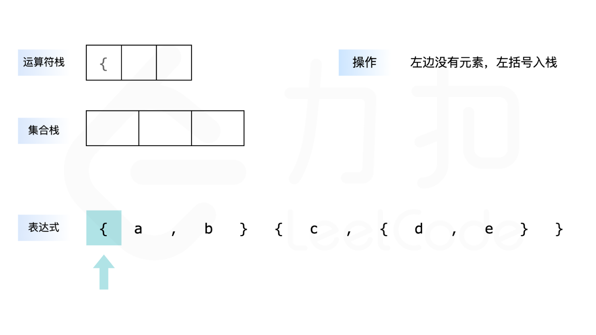
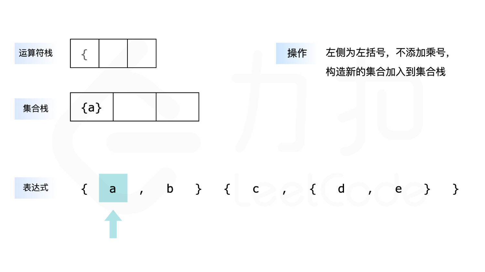
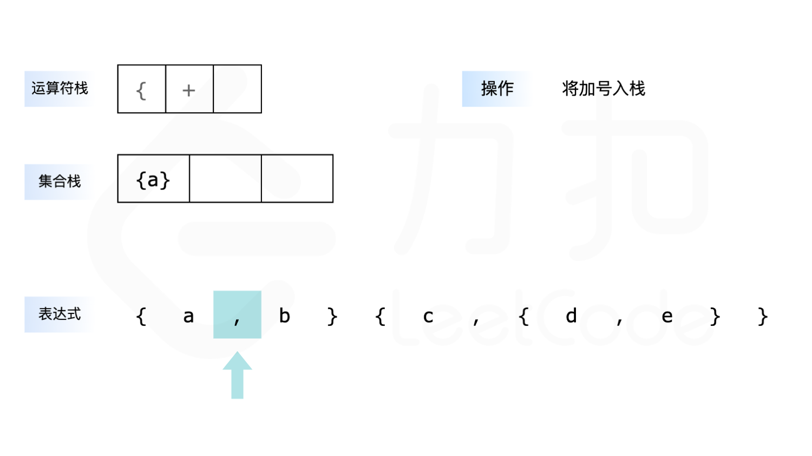
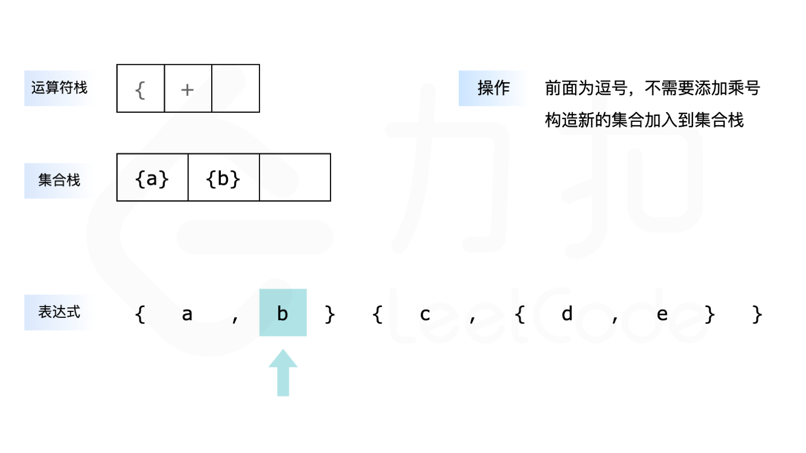
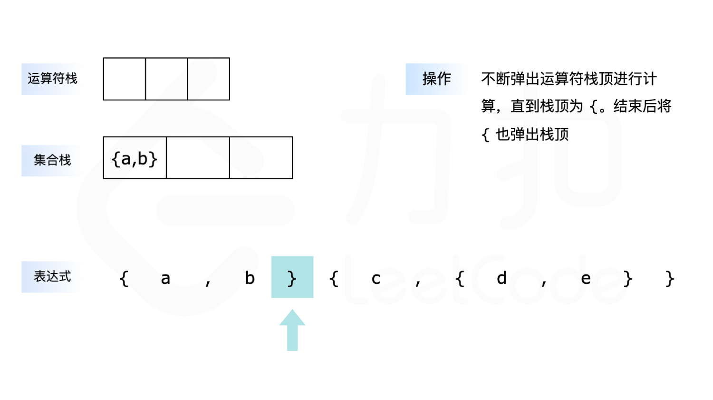
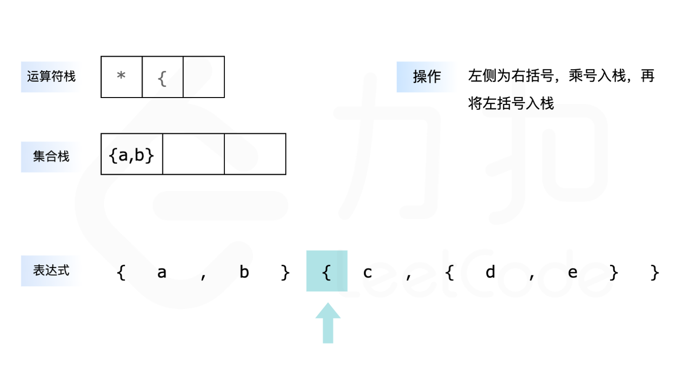
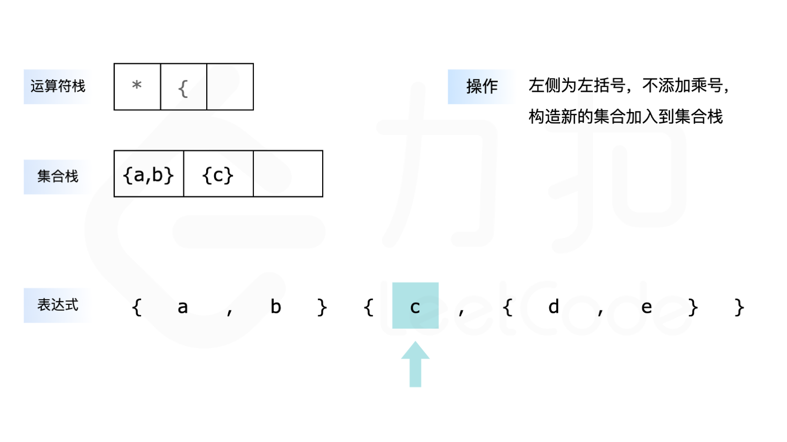
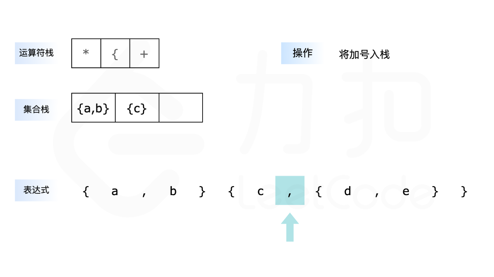
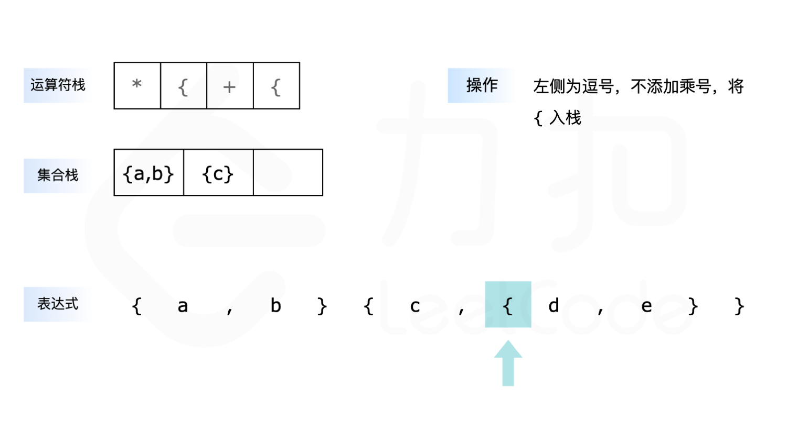
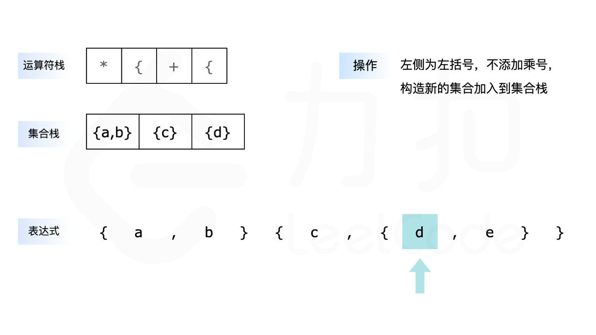
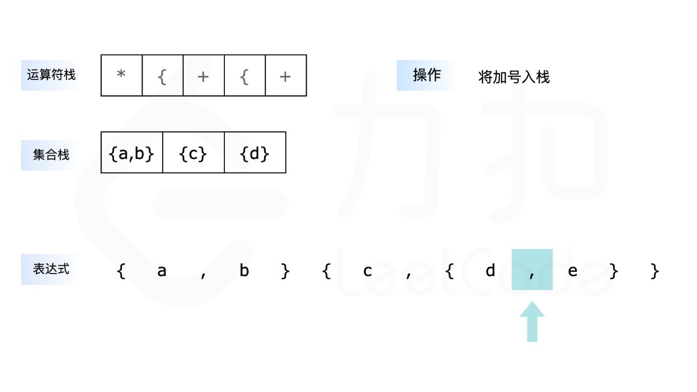
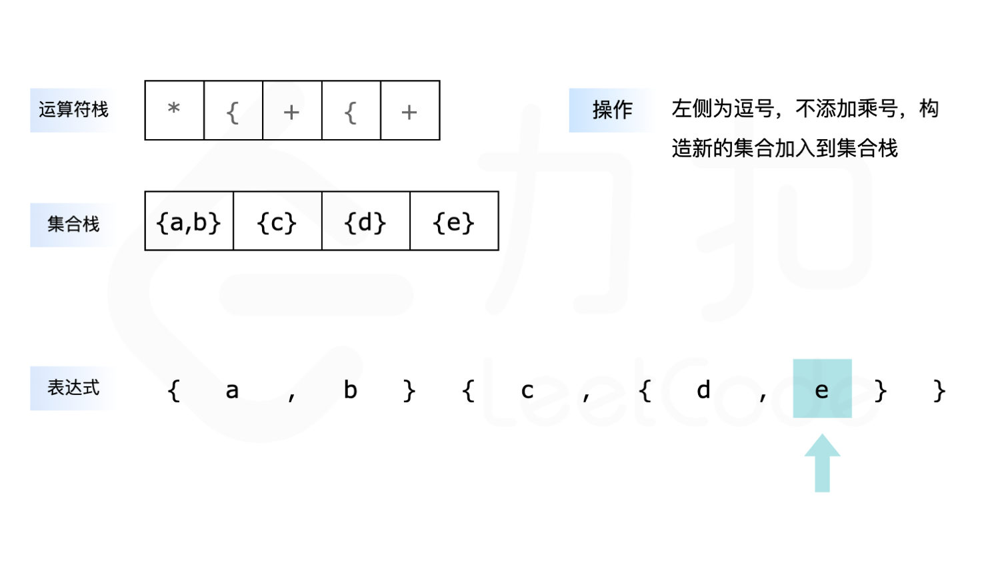
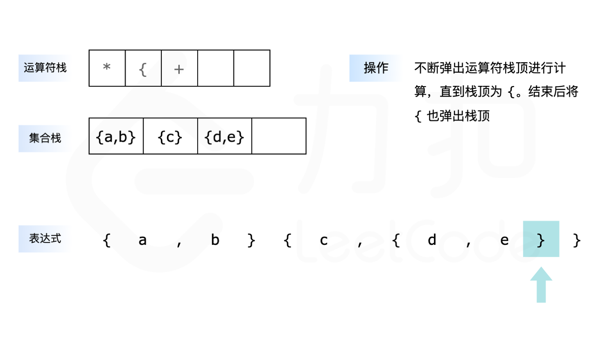
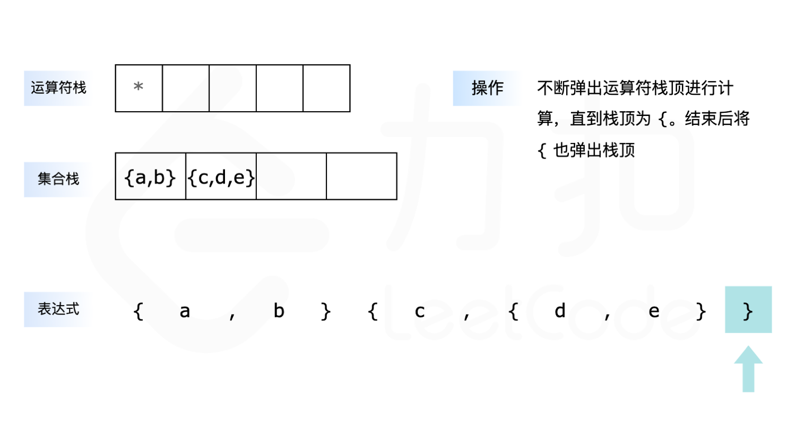
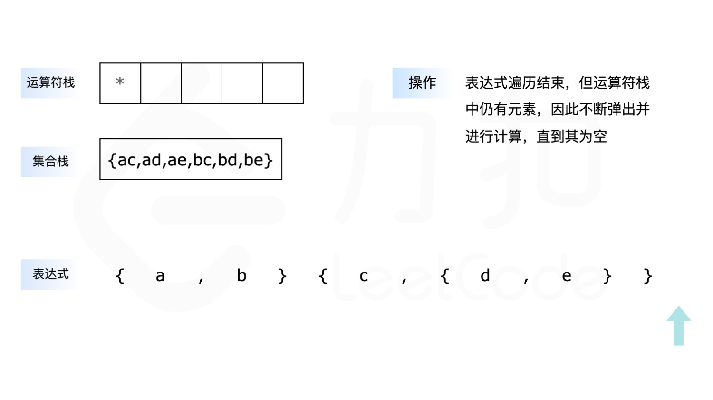

**代码**

```C++
class Solution {
public:
    vector<string> braceExpansionII(string expression) {
        vector<char> op;
        vector<set<string>> stk;

        // 弹出栈顶运算符，并进行计算
        auto ope = [&]() {
            int l = stk.size() - 2, r = stk.size() - 1;
            if (op.back() == '+') {
                stk[l].merge(stk[r]);
            } else {
                set<string> tmp;
                for (auto &left : stk[l]) {
                    for (auto &right : stk[r]) {
                        tmp.insert(left + right);
                    }
                }
                stk[l] = move(tmp);
            }
            op.pop_back();
            stk.pop_back();
        };

        for (int i = 0; i < expression.size(); i++) {
            if (expression[i] == ',') {
                // 不断地弹出栈顶运算符，直到栈为空或者栈顶不为乘号
                while (op.size() && op.back() == '*') {
                    ope();
                }
                op.push_back('+');
            } else if (expression[i] == '{') {
                // 首先判断是否需要添加乘号，再将 { 添加到运算符栈中
                if (i > 0 && (expression[i - 1] == '}' || isalpha(expression[i - 1]))) {
                    op.push_back('*');
                }
                op.push_back('{');
            } else if (expression[i] == '}') {
                // 不断地弹出栈顶运算符，直到栈顶为 {
                while (op.size() && op.back() != '{') {
                    ope();
                }
                op.pop_back();
            } else {
                // 首先判断是否需要添加乘号，再将新构造的集合添加到集合栈中
                if (i > 0 && (expression[i - 1] == '}' || isalpha(expression[i - 1]))) {
                    op.push_back('*');
                }
                stk.push_back({string(1, expression[i])});
            }
        }

        while (op.size()) {
            ope();
        }
        return {stk.back().begin(), stk.back().end()};
    }
};
```

```Java
class Solution {
    public List<String> braceExpansionII(String expression) {
        Deque<Character> op = new ArrayDeque<Character>();
        List<Set<String>> stk = new ArrayList<Set<String>>();

        for (int i = 0; i < expression.length(); i++) {
            if (expression.charAt(i) == ',') {
                // 不断地弹出栈顶运算符，直到栈为空或者栈顶不为乘号
                while (!op.isEmpty() && op.peek() == '*') {
                    ope(op, stk);
                }
                op.push('+');
            } else if (expression.charAt(i) == '{') {
                // 首先判断是否需要添加乘号，再将 { 添加到运算符栈中
                if (i > 0 && (expression.charAt(i - 1) == '}' || Character.isLetter(expression.charAt(i - 1)))) {
                    op.push('*');
                }
                op.push('{');
            } else if (expression.charAt(i) == '}') {
                // 不断地弹出栈顶运算符，直到栈顶为 {
                while (!op.isEmpty() && op.peek() != '{') {
                    ope(op, stk);
                }
                op.pop();
            } else {
                // 首先判断是否需要添加乘号，再将新构造的集合添加到集合栈中
                if (i > 0 && (expression.charAt(i - 1) == '}' || Character.isLetter(expression.charAt(i - 1)))) {
                    op.push('*');
                }
                StringBuilder sb = new StringBuilder();
                sb.append(expression.charAt(i));
                stk.add(new TreeSet<String>() {{
                    add(sb.toString());
                }});
            }
        }

        while (!op.isEmpty()) {
            ope(op, stk);
        }
        return new ArrayList<String>(stk.get(stk.size() - 1));
    }

    // 弹出栈顶运算符，并进行计算
    public void ope(Deque<Character> op, List<Set<String>> stk) {
        int l = stk.size() - 2, r = stk.size() - 1;
        if (op.peek() == '+') {
            stk.get(l).addAll(stk.get(r));
        } else {
            Set<String> tmp = new TreeSet<String>();
            for (String left : stk.get(l)) {
                for (String right : stk.get(r)) {
                    tmp.add(left + right);
                }
            }
            stk.set(l, tmp);
        }
        op.pop();
        stk.remove(stk.size() - 1);
    }
}
```

```CSharp
public class Solution {
    public IList<string> BraceExpansionII(string expression) {
        List<char> op = new List<char>();
        List<SortedSet<string>> stk = new List<SortedSet<string>>();
        var comparer = Comparer<string>.Create((a, b) => string.CompareOrdinal(a, b));

        // 弹出栈顶运算符，并进行计算
        void Ope() {
            int l = stk.Count - 2, r = stk.Count - 1;
            if (op[op.Count - 1] == '+') {
                stk[l].UnionWith(stk[r]);
            } else {
                SortedSet<string> tmp = new SortedSet<string>(comparer);
                foreach (var left in stk[l]) {
                    foreach (var right in stk[r]) {
                        tmp.Add(left + right);
                    }
                }
                stk[l] = tmp;
            }
            op.RemoveAt(op.Count - 1);
            stk.RemoveAt(stk.Count - 1);
        }

        for (int i = 0; i < expression.Length; i++) {
            if (expression[i] == ',') {
                // 不断地弹出栈顶运算符，直到栈为空或者栈顶不为乘号
                while (op.Count > 0 && op[op.Count - 1] == '*') {
                    Ope();
                }
                op.Add('+');
            } else if (expression[i] == '{') {
                // 首先判断是否需要添加乘号，再将 { 添加到运算符栈中
                if (i > 0 && (expression[i - 1] == '}' || char.IsLetter(expression[i - 1]))) {
                    op.Add('*');
                }
                op.Add('{');
            } else if (expression[i] == '}') {
                // 不断地弹出栈顶运算符，直到栈顶为 {
                while (op.Count > 0 && op[op.Count - 1] != '{') {
                    Ope();
                }
                op.RemoveAt(op.Count - 1);
            } else {
                // 首先判断是否需要添加乘号，再将新构造的集合添加到集合栈中
                if (i > 0 && (expression[i - 1] == '}' || char.IsLetter(expression[i - 1]))) {
                    op.Add('*');
                }
                SortedSet<string> set = new SortedSet<string>(comparer);
                set.Add(expression[i].ToString());
                stk.Add(set);
            }
        }

        while (op.Count > 0) {
            Ope();
        }
        return new List<string>(stk[stk.Count - 1]);
    }
}
```

```Go
func braceExpansionII(expression string) []string {
    op := []byte{}
    stk := []map[string]bool{}

    // 弹出栈顶运算符，并进行计算
    ope := func() {
        l, r := len(stk)-2, len(stk)-1
        if op[len(op)-1] == '+' {
            // 并集操作
            for k := range stk[r] {
                stk[l][k] = true
            }
        } else {
            // 笛卡尔积操作
            tmp := make(map[string]bool)
            for left := range stk[l] {
                for right := range stk[r] {
                    tmp[left+right] = true
                }
            }
            stk[l] = tmp
        }
        op = op[:len(op)-1]
        stk = stk[:len(stk)-1]
    }

    for i := 0; i < len(expression); i++ {
        if expression[i] == ',' {
            // 不断地弹出栈顶运算符，直到栈为空或者栈顶不为乘号
            for len(op) > 0 && op[len(op)-1] == '*' {
                ope()
            }
            op = append(op, '+')
        } else if expression[i] == '{' {
            // 首先判断是否需要添加乘号，再将 { 添加到运算符栈中
            if i > 0 && (expression[i-1] == '}' || (expression[i-1] >= 'a' && expression[i-1] <= 'z')) {
                op = append(op, '*')
            }
            op = append(op, '{')
        } else if expression[i] == '}' {
            // 不断地弹出栈顶运算符，直到栈顶为 {
            for len(op) > 0 && op[len(op)-1] != '{' {
                ope()
            }
            op = op[:len(op)-1]
        } else {
            // 首先判断是否需要添加乘号，再将新构造的集合添加到集合栈中
            if i > 0 && (expression[i-1] == '}' || (expression[i-1] >= 'a' && expression[i-1] <= 'z')) {
                op = append(op, '*')
            }
            set := map[string]bool{string(expression[i]): true}
            stk = append(stk, set)
        }
    }

    for len(op) > 0 {
        ope()
    }

    result := make([]string, 0, len(stk[0]))
    for k := range stk[0] {
        result = append(result, k)
    }
    sort.Strings(result)
    return result
}
```

```Python
class Solution:
    def braceExpansionII(self, expression: str) -> List[str]:
        op = []  # 运算符栈
        stk = []  # 集合栈

        # 弹出栈顶运算符，并进行计算
        def ope():
            l, r = len(stk) - 2, len(stk) - 1
            if op[-1] == '+':
                # 并集操作
                stk[l] |= stk[r]
            else:
                # 笛卡尔积操作
                tmp = set()
                for left in stk[l]:
                    for right in stk[r]:
                        tmp.add(left + right)
                stk[l] = tmp
            op.pop()
            stk.pop()

        for i, ch in enumerate(expression):
            if ch == ',':
                # 不断地弹出栈顶运算符，直到栈为空或者栈顶不为乘号
                while op and op[-1] == '*':
                    ope()
                op.append('+')
            elif ch == '{':
                # 首先判断是否需要添加乘号，再将 { 添加到运算符栈中
                if i > 0 and (expression[i-1] == '}' or expression[i-1].isalpha()):
                    op.append('*')
                op.append('{')
            elif ch == '}':
                # 不断地弹出栈顶运算符，直到栈顶为 {
                while op and op[-1] != '{':
                    ope()
                op.pop()
            else:
                # 首先判断是否需要添加乘号，再将新构造的集合添加到集合栈中
                if i > 0 and (expression[i-1] == '}' or expression[i-1].isalpha()):
                    op.append('*')
                stk.append({ch})

        while op:
            ope()

        return sorted(stk[-1])
```

```C
typedef struct {
    char *key;
    UT_hash_handle hh;
} HashItem;

HashItem *hashFindItem(HashItem **obj, char *key) {
    HashItem *pEntry = NULL;
    HASH_FIND_STR(*obj, key, pEntry);
    return pEntry;
}

bool hashAddItem(HashItem **obj, char *key) {
    if (hashFindItem(obj, key)) {
        return false;
    }
    HashItem *pEntry = (HashItem *)malloc(sizeof(HashItem));
    pEntry->key = strdup(key);
    HASH_ADD_STR(*obj, key, pEntry);
    return true;
}

void hashFree(HashItem **obj) {
    HashItem *curr = NULL, *tmp = NULL;
    HASH_ITER(hh, *obj, curr, tmp) {
        HASH_DEL(*obj, curr);
        free(curr->key);
        free(curr);
    }
}

bool isLetter(char c) {
    return c >= 'a' && c <= 'z';
}

void setUnion(HashItem **dest, HashItem** src) {
    HashItem *curr = NULL, *tmp = NULL;
    HASH_ITER(hh, *src, curr, tmp) {
        hashAddItem(dest, curr->key);
    }
}

int cmpstr(const void* a, const void* b) {
    return strcmp(*(const char**)a, *(const char**)b);
}

char** braceExpansionII(char* expression, int* returnSize) {
    int len = strlen(expression);

    // 运算符栈
    char* op = (char*)malloc((len + 1) * sizeof(char));
    int opLen = 0;

    // 集合栈
    HashItem** stk = (HashItem**)malloc((len + 1) * sizeof(HashItem*));
    int stkLen = 0;

    for (int i = 0; i < len; i++) {
        if (expression[i] == ',') {
            // 不断地弹出栈顶运算符，直到栈为空或者栈顶不为乘号
            while (opLen > 0 && op[opLen - 1] == '*') {
                int l = stkLen - 2, r = stkLen - 1;

                // 笛卡尔积操作
                HashItem* tmp = NULL;
                HashItem *currLeft = NULL, *tmpLeft = NULL;
                HASH_ITER(hh, stk[l], currLeft, tmpLeft) {
                    HashItem *currRight = NULL, *tmpRight = NULL;
                    HASH_ITER(hh, stk[r], currRight, tmpRight) {
                        char* combined = (char*)malloc(strlen(currLeft->key) + strlen(currRight->key) + 1);
                        strcpy(combined, currLeft->key);
                        strcat(combined, currRight->key);
                        hashAddItem(&tmp, combined);
                        free(combined);
                    }
                }

                hashFree(&stk[l]);
                stk[l] = tmp;
                hashFree(&stk[r]);
                stk[r] = NULL;
                opLen--;
                stkLen--;
            }
            op[opLen++] = '+';
        } else if (expression[i] == '{') {
            // 首先判断是否需要添加乘号，再将 { 添加到运算符栈中
            if (i > 0 && (expression[i-1] == '}' || isLetter(expression[i-1]))) {
                op[opLen++] = '*';
            }
            op[opLen++] = '{';
        } else if (expression[i] == '}') {
            // 不断地弹出栈顶运算符，直到栈顶为 {
            while (opLen > 0 && op[opLen - 1] != '{') {
                int l = stkLen - 2, r = stkLen - 1;

                if (op[opLen - 1] == '+') {
                    // 并集操作
                    setUnion(&stk[l], &stk[r]);
                } else {
                    // 笛卡尔积操作
                    HashItem* tmp = NULL;
                    HashItem *currLeft = NULL, *tmpLeft = NULL;
                    HASH_ITER(hh, stk[l], currLeft, tmpLeft) {
                        HashItem *currRight = NULL, *tmpRight = NULL;
                        HASH_ITER(hh, stk[r], currRight, tmpRight) {
                            char* combined = (char*)malloc(strlen(currLeft->key) + strlen(currRight->key) + 1);
                            strcpy(combined, currLeft->key);
                            strcat(combined, currRight->key);
                            hashAddItem(&tmp, combined);
                            free(combined);
                        }
                    }

                    hashFree(&stk[l]);
                    stk[l] = tmp;
                }

                hashFree(&stk[r]);
                stk[r] = NULL;
                opLen--;
                stkLen--;
            }
            opLen--; // 弹出 '{'
        } else {
            // 首先判断是否需要添加乘号，再将新构造的集合添加到集合栈中
            if (i > 0 && (expression[i-1] == '}' || isLetter(expression[i-1]))) {
                op[opLen++] = '*';
            }
            // 创建单字符集合
            stk[stkLen] = NULL;
            char str[2] = {expression[i], '\0'};
            hashAddItem(&stk[stkLen], str);
            stkLen++;
        }
    }

    // 处理剩余运算符
    while (opLen > 0) {
        int l = stkLen - 2, r = stkLen - 1;

        if (op[opLen - 1] == '+') {
            // 并集操作
            setUnion(&stk[l], &stk[r]);
        } else {
            // 笛卡尔积操作
            HashItem* tmp = NULL;
            HashItem *currLeft = NULL, *tmpLeft = NULL;
            HASH_ITER(hh, stk[l], currLeft, tmpLeft) {
                HashItem *currRight = NULL, *tmpRight = NULL;
                HASH_ITER(hh, stk[r], currRight, tmpRight) {
                    char* combined = (char*)malloc(strlen(currLeft->key) + strlen(currRight->key) + 1);
                    strcpy(combined, currLeft->key);
                    strcat(combined, currRight->key);
                    hashAddItem(&tmp, combined);
                    free(combined);
                }
            }

            hashFree(&stk[l]);
            stk[l] = tmp;
        }

        hashFree(&stk[r]);
        stk[r] = NULL;
        opLen--;
        stkLen--;
    }

    HashItem* resultSet = stk[0];
    int count = HASH_COUNT(resultSet);
    *returnSize = count;

    char** result = (char**)malloc(count * sizeof(char*));
    HashItem *curr = NULL, *tmp = NULL;
    int i = 0;
    HASH_ITER(hh, resultSet, curr, tmp) {
        result[i] = strdup(curr->key);
        i++;
    }

    qsort(result, count, sizeof(char*), cmpstr);
    hashFree(&resultSet);
    free(op);
    free(stk);

    return result;
}
```

```JavaScript
var braceExpansionII = function(expression) {
    const op = [];  // 运算符栈
    const stk = [];  // 集合栈

    // 弹出栈顶运算符，并进行计算
    const ope = () => {
        const l = stk.length - 2, r = stk.length - 1;
        if (op[op.length - 1] === '+') {
            // 并集操作
            for (const item of stk[r]) {
                stk[l].add(item);
            }
        } else {
            // 笛卡尔积操作
            const tmp = new Set();
            for (const left of stk[l]) {
                for (const right of stk[r]) {
                    tmp.add(left + right);
                }
            }
            stk[l] = tmp;
        }
        op.pop();
        stk.pop();
    };

    for (let i = 0; i < expression.length; i++) {
        const ch = expression[i];
        if (ch === ',') {
            // 不断地弹出栈顶运算符，直到栈为空或者栈顶不为乘号
            while (op.length > 0 && op[op.length - 1] === '*') {
                ope();
            }
            op.push('+');
        } else if (ch === '{') {
            // 首先判断是否需要添加乘号，再将 { 添加到运算符栈中
            if (i > 0 && (expression[i-1] === '}' || /[a-z]/.test(expression[i-1]))) {
                op.push('*');
            }
            op.push('{');
        } else if (ch === '}') {
            // 不断地弹出栈顶运算符，直到栈顶为 {
            while (op.length > 0 && op[op.length - 1] !== '{') {
                ope();
            }
            op.pop();
        } else {
            // 首先判断是否需要添加乘号，再将新构造的集合添加到集合栈中
            if (i > 0 && (expression[i-1] === '}' || /[a-z]/.test(expression[i-1]))) {
                op.push('*');
            }
            stk.push(new Set([ch]));
        }
    }

    while (op.length > 0) {
        ope();
    }

    return Array.from(stk[stk.length - 1]).sort();
};
```

```TypeScript
var braceExpansionII = function(expression: string): string[] {
    const op: string[] = [];  // 运算符栈
    const stk: Set<string>[] = [];  // 集合栈

    // 弹出栈顶运算符，并进行计算
    const ope = (): void => {
        const l: number = stk.length - 2, r: number = stk.length - 1;
        if (op[op.length - 1] === '+') {
            // 并集操作
            for (const item of stk[r]) {
                stk[l].add(item);
            }
        } else {
            // 笛卡尔积操作
            const tmp: Set<string> = new Set();
            for (const left of stk[l]) {
                for (const right of stk[r]) {
                    tmp.add(left + right);
                }
            }
            stk[l] = tmp;
        }
        op.pop();
        stk.pop();
    };

    for (let i = 0; i < expression.length; i++) {
        const ch: string = expression[i];
        if (ch === ',') {
            // 不断地弹出栈顶运算符，直到栈为空或者栈顶不为乘号
            while (op.length > 0 && op[op.length - 1] === '*') {
                ope();
            }
            op.push('+');
        } else if (ch === '{') {
            // 首先判断是否需要添加乘号，再将 { 添加到运算符栈中
            if (i > 0 && (expression[i-1] === '}' || /[a-z]/.test(expression[i-1]))) {
                op.push('*');
            }
            op.push('{');
        } else if (ch === '}') {
            // 不断地弹出栈顶运算符，直到栈顶为 {
            while (op.length > 0 && op[op.length - 1] !== '{') {
                ope();
            }
            op.pop();
        } else {
            // 首先判断是否需要添加乘号，再将新构造的集合添加到集合栈中
            if (i > 0 && (expression[i-1] === '}' || /[a-z]/.test(expression[i-1]))) {
                op.push('*');
            }
            stk.push(new Set([ch]));
        }
    }

    while (op.length > 0) {
        ope();
    }

    return Array.from(stk[stk.length - 1]).sort();
};
```

```Rust
use std::collections::BTreeSet;

impl Solution {
    pub fn brace_expansion_ii(expression: String) -> Vec<String> {
        let mut op: Vec<char> = Vec::new();  // 运算符栈
        let mut stk: Vec<BTreeSet<String>> = Vec::new();  // 集合栈

        // 弹出栈顶运算符，并进行计算
        let ope = |op: &mut Vec<char>, stk: &mut Vec<BTreeSet<String>>| {
            let l = stk.len() - 2;
            let r = stk.len() - 1;
            if op[op.len() - 1] == '+' {
                // 并集操作 - 需要手动合并
                let right = stk.pop().unwrap();
                let left = &mut stk[l];
                for item in right {
                    left.insert(item);
                }
            } else {
                // 笛卡尔积操作
                let right = stk.pop().unwrap();
                let left = &stk[l];
                let mut tmp = BTreeSet::new();
                for l_item in left {
                    for r_item in &right {
                        tmp.insert(format!("{}{}", l_item, r_item));
                    }
                }
                stk[l] = tmp;
            }
            op.pop();
        };

        let chars: Vec<char> = expression.chars().collect();
        for i in 0..chars.len() {
            if chars[i] == ',' {
                // 不断地弹出栈顶运算符，直到栈为空或者栈顶不为乘号
                while !op.is_empty() && op[op.len() - 1] == '*' {
                    ope(&mut op, &mut stk);
                }
                op.push('+');
            } else if chars[i] == '{' {
                // 首先判断是否需要添加乘号，再将 { 添加到运算符栈中
                if i > 0 && (chars[i-1] == '}' || chars[i-1].is_alphabetic()) {
                    op.push('*');
                }
                op.push('{');
            } else if chars[i] == '}' {
                // 不断地弹出栈顶运算符，直到栈顶为 {
                while !op.is_empty() && op[op.len() - 1] != '{' {
                    ope(&mut op, &mut stk);
                }
                op.pop(); // 弹出 '{'
            } else {
                // 首先判断是否需要添加乘号，再将新构造的集合添加到集合栈中
                if i > 0 && (chars[i-1] == '}' || chars[i-1].is_alphabetic()) {
                    op.push('*');
                }
                let mut set = BTreeSet::new();
                set.insert(chars[i].to_string());
                stk.push(set);
            }
        }

        while !op.is_empty() {
            ope(&mut op, &mut stk);
        }

        stk.pop().unwrap().into_iter().collect()
    }
}
```

**复杂度分析**

- 时间复杂度：$O(n\log n)$，其中 $n$ 是 $expression$ 的长度。整个 $expression$ 只会遍历一次，时间复杂度为 $O(n)$，集合合并以及求积运算的时间复杂度为 $O(n\log n)$，因此总的时间复杂度为 $O(n\log n)$。
- 空间复杂度：$O(n)$。过程中用到了两个栈，他们都满足在任意时刻元素个数不超过 $O(n)$，包含 $n$ 个元素的集合的时间复杂度为 $O(n)$，因此总的空间复杂度为 $O(n)$。
