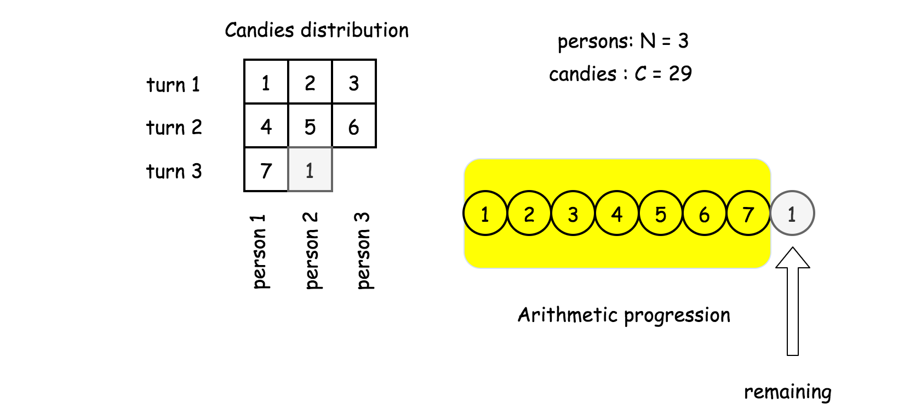
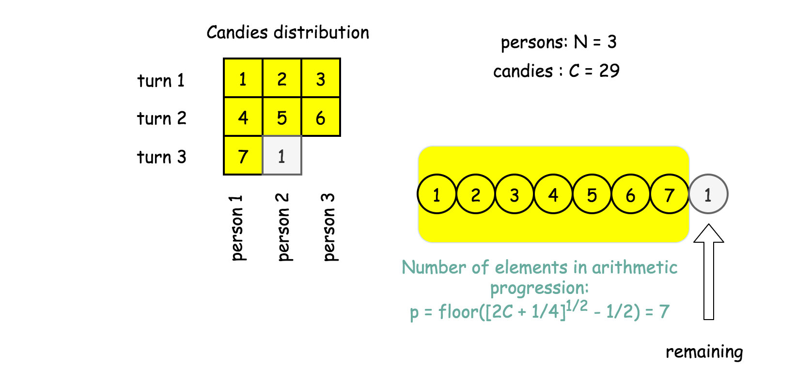
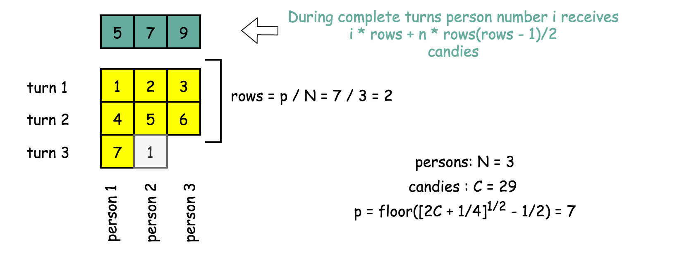
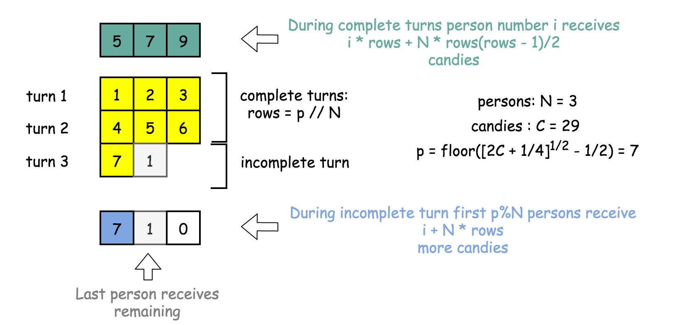

### [分糖果 II](https://leetcode.cn/problems/distribute-candies-to-people/solutions/127471/fen-tang-guo-ii-by-leetcode-solution/)

#### 方法一：暴力

**思路**

最直观的方法是不断地遍历数组，如果还有糖就一直分，直到没有糖为止。

```python
class Solution:
    def distributeCandies(self, candies: int, num_people: int) -> List[int]:
        ans = [0] * num_people
        i = 0
        while candies != 0:
            ans[i % num_people] += min(i + 1, candies)
            candies -= min(i + 1, candies)
            i += 1
        return ans
```

```java
class Solution {
    public int[] distributeCandies(int candies, int num_people) {
        int[] ans = new int[num_people];
        int i = 0;
        while (candies != 0) {
            ans[i % num_people] += Math.min(candies, i + 1);
            candies -= Math.min(candies, i + 1);
            i += 1;
        }
        return ans;
    }
}
```

```cpp
class Solution {
public:
    vector<int> distributeCandies(int candies, int num_people) {
        vector<int> ans(num_people,0);
        int i = 0;
        while (candies != 0) {
            ans[i % num_people] += min(candies, i + 1);
            candies -= min(candies, i + 1);
            ++i;
        }
        return ans;
    }
};
```

**复杂度分析**

- 时间复杂度：$\mathcal{O}(max(\sqrt{G}, N))$，$G$ 为糖果数量，$N$ 为人数。
    本方法的时间复杂度取决于循环到底走多少步。设总的步数为 $s$，用[等差数列求和公式](https://leetcode.cn/link/?target=https%3A%2F%2Fbaike.baidu.com%2Fitem%2F%E7%AD%89%E5%B7%AE%E6%95%B0%E5%88%97%E6%B1%82%E5%92%8C%E5%85%AC%E5%BC%8F%2F7527418)可以求得 $s$ 步时发放的糖果数量为 $\frac{s(s+1)}{2}$。那么只要 $s^2+s\geq 2G$ 糖果就可以保证被发完。
    而只要当 $s\geq \sqrt{2G}$ 时，就有 $s^2\geq 2G$，显然也有 $s^2+s\geq 2G$。
    因此可知总的步数 $s\leq \left \lceil{\sqrt{2G}}\right \rceil$，时间复杂度为 $\mathcal{O}(\sqrt G)$。
    另外建立糖果分配数组并初值赋值需要 $\mathcal{O}(N)$ 的时间，因此总的时间复杂度为 $\mathcal{O}(max(\sqrt{G}, N))$。
- 空间复杂度：$\mathcal{O}(1)$，除了答案数组只需要常数空间来存储若干变量。

#### 方法二：等差数列求和

**思路**

这是一个数学问题，可以对其简化。

更好的做法是使用一个简单的公式代表糖果分配，可以在 $\mathcal{O}(N)$ 时间内完成糖果分发，并生成最终的分配数组。

接下来逐步推导该公式。

**获得完整礼物的人数**

除了最后一份礼物数量由剩余糖果数量决定以外，其他礼物的数量都是从 1 开始构成的等差数列。



假设数列一共有 `p` 个元素，剩余的糖果就是糖果数量 $C$ 与等差数列前 $p$ 项之差。

$$\textrm{remaining} = C - \sum\limits_{k = 0}^{k = p}{k}$$

等差数列求和公式是[中学知识](https://leetcode.cn/link/?target=https%3A%2F%2Fbaike.baidu.com%2Fitem%2F%E7%AD%89%E5%B7%AE%E6%95%B0%E5%88%97%E6%B1%82%E5%92%8C%E5%85%AC%E5%BC%8F%2F7527418)，剩余糖果数量可以表示为：

$$\textrm{remaining} = C - \frac{p(p + 1)}{2}$$

剩余糖果数量大于等于 $0$，小于下一份礼物数量 $p + 1$。

$$0 \le C - \frac{p(p + 1)}{2} < p + 1$$

化简上式得

$$\sqrt{2C + \frac{1}{4}} - \frac{3}{2} < p \le \sqrt{2C + \frac{1}{4}} - \frac{1}{2}$$

该区间内只有一个整数，因此可以知道等差数列的元素数量

$$p = \textrm{floor}\left(\sqrt{2C + \frac{1}{4}} - \frac{1}{2}\right)$$



**完整分发礼物的回合**

一个回合表示给每个人都分发一份完整的礼物。将 $p$ 份完整的礼物分发给 $N$ 个人，共可以分发的回合数：`rows = p / N`。

在 `rows` 个完整回合中，第 `i` 个人获得礼物：

$$d[i] = i + (i + N) + (i + 2N) + ... (i + (\textrm{rows} - 1) N) = i \times \textrm{rows} + N \frac{\textrm{rows}(\textrm{rows} - 1)}{2}$$



**不完整分发礼物的回合**

最后一个回合可能不完整，因为有可能只是一部分人收到了礼物。

在最后一个回合中，可以计算出收到完整礼物的人数 `cols = p % N`。这些人比其他人多获得一份完整的礼物。

$$d[i] += i + N \times \textrm{rows}$$

最后一位拥有礼物的人获得所有剩余的糖果。

$$d[\textrm{cols} + 1] += \textrm{remaining}$$



这就是分发所有糖果的过程。

**算法**

- 计算完整礼物的份数
    $$p = \textrm{floor}\left(\sqrt{2C + \frac{1}{4}} - \frac{1}{2}\right)$$
    最后一份礼物的糖果数量
    $$\textrm{remaining} = C - \frac{p(p + 1)}{2}$$
- 完整的分发回合数：`rows = p // n`。此时每个人拥有的礼物数量：
    $$d[i] = i \times \textrm{rows} + N \frac{\textrm{rows}(\textrm{rows} - 1)}{2}$$
- 前 `p % N` 个人最后再获得一份完整的礼物：$d[i] += i + N \times \textrm{rows}$。
- 将剩余的糖果分发给第 `p % N` 个后面的一个人。
- 返回糖果分配数组：`d`。

```python
class Solution:
    def distributeCandies(self, candies: int, num_people: int) -> List[int]:
        n = num_people
        # how many people received complete gifts
        p = int((2 * candies + 0.25)**0.5 - 0.5) 
        remaining = int(candies - (p + 1) * p * 0.5)
        rows, cols = p // n, p % n
        
        d = [0] * n
        for i in range(n):
            # complete rows
            d[i] = (i + 1) * rows + int(rows * (rows - 1) * 0.5) * n
            # cols in the last row
            if i < cols:
                d[i] += i + 1 + rows * n
        # remaining candies        
        d[cols] += remaining
        return d
```

```java
class Solution {
    public int[] distributeCandies(int candies, int num_people) {
        int n = num_people;
        // how many people received complete gifts
        int p = (int) (Math.sqrt(2 * candies + 0.25) - 0.5);
        int remaining = (int)(candies - (p + 1) * p * 0.5);
        int rows = p / n, cols = p % n;

        int[] d = new int[n];
        for (int i = 0; i < n; ++i) {
            // complete rows
            d[i] = (i + 1) * rows + (int)(rows * (rows - 1) * 0.5) * n;
            // cols in the last row
            if (i < cols) {
                d[i] += i + 1 + rows * n;
            }
        }
        // remaining candies
        d[cols] += remaining;
        return d;
    }
}
```

```cpp
class Solution {
public:
    vector<int> distributeCandies(int candies, int num_people) {
        int n = num_people;
        // how many people received complete gifts
        int p = (int)(sqrt(2 * candies + 0.25) - 0.5);
        int remaining = (int)(candies - (p + 1) * p * 0.5);
        int rows = p / n, cols = p % n;

        vector<int> d(n, 0);
        for (int i = 0; i < n; ++i) {
            // complete rows
            d[i] = (i + 1) * rows + (int)(rows * (rows - 1) * 0.5) * n;
            // cols in the last row
            if (i < cols) d[i] += i + 1 + rows * n;
        }
        // remaining candies 
        d[cols] += remaining;
        return d;
    }
};
```

**复杂度分析**

- 时间复杂度：$\mathcal{O}(N)$，计算 $N$ 个人的糖果数量。
- 空间复杂度：$\mathcal{O}(1)$，，除了答案数组只需要常数空间来存储若干变量。
