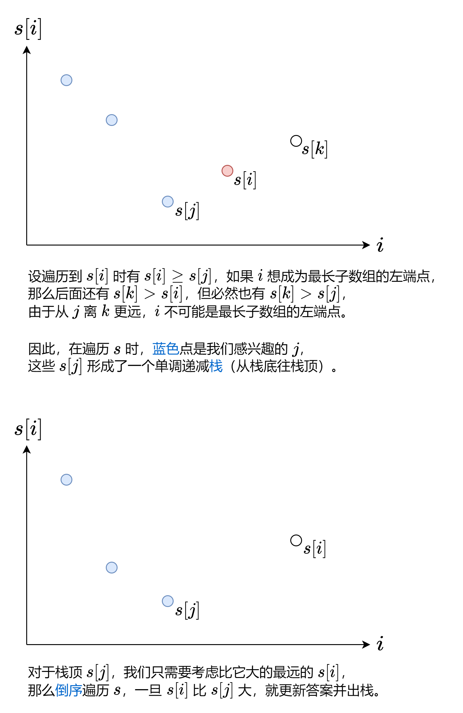

#### [前置知识：前缀和](https://leetcode.cn/problems/longest-well-performing-interval/solutions/2110211/liang-chong-zuo-fa-liang-zhang-tu-miao-d-hysl/)

对于数组 $nums$，定义它的前缀和 $s[0] = 0$，$s[i+1] = \sum\limits_{j=0}^{i}nums[j]$。

例如 $nums = [1,2,−1,2]$，对应的前缀和数组为 $s = [0,1,3,2,4]$。

通过前缀和，我们可以把**子数组的元素和转换成两个前缀和的差**，即

$$\sum_{j=left}^{right}nums[j] = \sum\limits_{j=0}^{right}nums[j] - \sum\limits_{j=0}^{left-1}nums[j] = s[right+1] - s[left]$$

例如 $nums$ 的子数组 $[2,−1,2]$ 的和就可以用 $s[4] − s[1] = 4 − 1 = 3$ 算出来。

> 注：为方便计算，常用左闭右开区间 $[left, right)$ 来表示子数组，此时子数组的和为 $s[right] - s[left]$，子数组的长度为 $right - left$。

#### [方法一：单调栈](https://leetcode.cn/problems/longest-well-performing-interval/solutions/2110211/liang-chong-zuo-fa-liang-zhang-tu-miao-d-hysl/)

先把问题转换到我们熟悉的东西上。

「劳累天数大于不劳累天数」等价于「劳累天数减去不劳累天数大于 $0$」。

那么把劳累的一天视作 $nums[i] = 1$，不劳累的一天视作 $nums[i] = -1$，则问题变为：

计算 $nums$ 的最长子数组，其元素和大于 $0$。

既然说到了「子数组的元素和」，那么利用前缀和 $s$，将问题变为：

找到两个下标 $i$ 和 $j$，满足 $j < i$ 且 $s[j] < s[i]$，最大化 $i - j$ 的值。

想一想，哪些值可以作为 $j$（最长子数组的左端点）呢？



#### 答疑

**问**：我怎么觉得这题和我做过的单调栈题目不太一样呢？~没法快乐套模板~

**答**：通常的单调栈题目（例如 [496\. 下一个更大元素 I](https://leetcode.cn/problems/next-greater-element-i/)）都是求的「最近」或「最短」，本题求的是「最长」，不能一概而论。~就当成是新的模板~

```python
class Solution:
    def longestWPI(self, hours: List[int]) -> int:
        n = len(hours)
        s = [0] * (n + 1)  # 前缀和
        st = [0]  # s[0]
        for j, h in enumerate(hours, 1):
            s[j] = s[j - 1] + (1 if h > 8 else -1)
            if s[j] < s[st[-1]]: st.append(j)  # 感兴趣的 j
        ans = 0
        for i in range(n, 0, -1):
            while st and s[i] > s[st[-1]]:
                ans = max(ans, i - st.pop())  # [st[-1],i) 可能是最长子数组
        return ans
```

```java
class Solution {
    public int longestWPI(int[] hours) {
        int n = hours.length, ans = 0;
        var s = new int[n + 1]; // 前缀和
        var st = new ArrayDeque<Integer>();
        st.push(0); // s[0]
        for (int j = 1; j <= n; ++j) {
            s[j] = s[j - 1] + (hours[j - 1] > 8 ? 1 : -1);
            if (s[j] < s[st.peek()]) st.push(j); // 感兴趣的 j
        }
        for (int i = n; i > 0; --i)
            while (!st.isEmpty() && s[i] > s[st.peek()])
                ans = Math.max(ans, i - st.pop()); // [栈顶,i) 可能是最长子数组
        return ans;
    }
}
```

```cpp
class Solution {
public:
    int longestWPI(vector<int> &hours) {
        int n = hours.size(), ans = 0, s[n + 1]; // 前缀和
        stack<int> st;
        st.push(s[0] = 0);
        for (int j = 1; j <= n; ++j) {
            s[j] = s[j - 1] + (hours[j - 1] > 8 ? 1 : -1);
            if (s[j] < s[st.top()]) st.push(j); // 感兴趣的 j
        }
        for (int i = n; i; --i)
            while (!st.empty() && s[i] > s[st.top()]) {
                ans = max(ans, i - st.top()); // [栈顶,i) 可能是最长子数组
                st.pop();
            }
        return ans;
    }
};
```

```go
func longestWPI(hours []int) (ans int) {
    n := len(hours)
    s := make([]int, n+1) // 前缀和
    st := []int{0} // s[0]
    for j, h := range hours {
        j++
        s[j] = s[j-1]
        if h > 8 {
            s[j]++
        } else {
            s[j]--
        }
        if s[j] < s[st[len(st)-1]] {
            st = append(st, j) // 感兴趣的 j
        }
    }
    for i := n; i > 0; i-- {
        for len(st) > 0 && s[i] > s[st[len(st)-1]] {
            ans = max(ans, i-st[len(st)-1]) // [栈顶,i) 可能是最长子数组
            st = st[:len(st)-1]
        }
    }
    return
}

func max(a, b int) int { if b > a { return b }; return a }
```

#### 复杂度分析

-   时间复杂度：$O(n)$，其中 $n$ 为 $hours$ 的长度。注意每个元素至多入栈出栈各一次，因此二重循环的时间复杂度是 $O(n)$ 的。
-   空间复杂度：$O(n)$。
