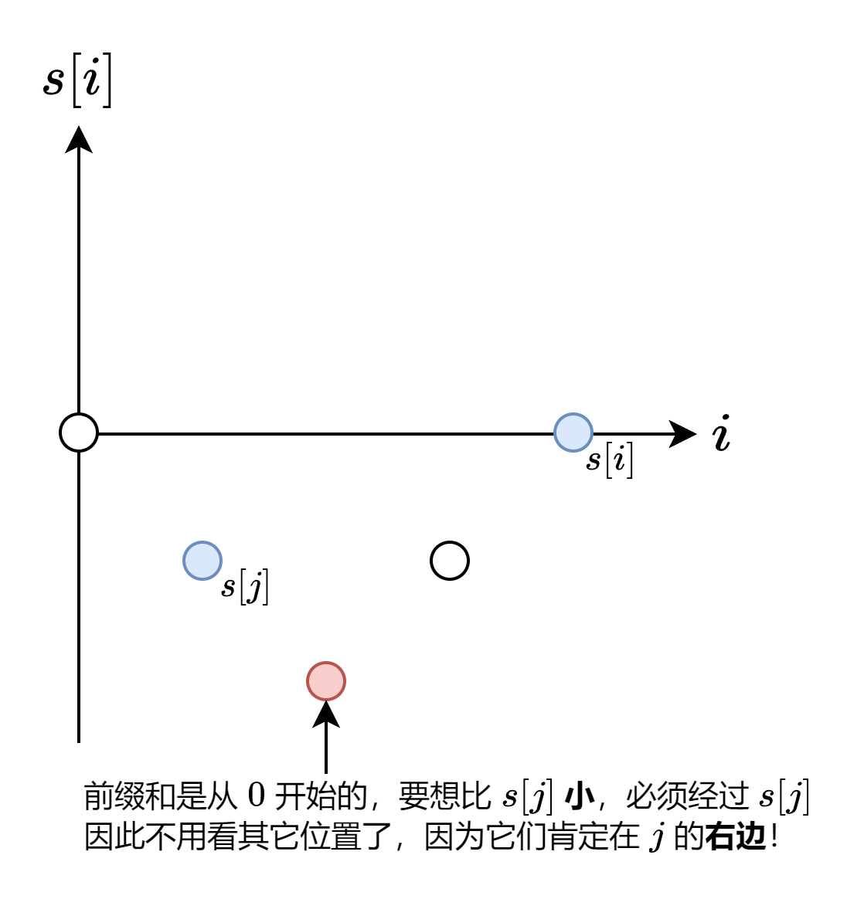

#### [方法二：利用前缀和的连续性](https://leetcode.cn/problems/longest-well-performing-interval/solutions/2110211/liang-chong-zuo-fa-liang-zhang-tu-miao-d-hysl/)

虽说方法一更加通用，不过利用 $nums$ 中只有 $1$ 和 $-1$ 的特点，可以做到**一次遍历**。

考虑 $s[i]$：

-   如果 $s[i] > 0$，那么 $j = 0$ 就是最远的左端点，因为 $s[0] = 0$，故 $s[i] - s[0] = s[i] > 0$，符合要求。
-   如果 $s[i] \le 0$，那么 $j$ 就是 $s[i]-1$ 首次出现的位置。为什么是 $s[i]-1$ 而不是其它更小的数？这是因为前缀和是从 $0$ 开始的，由于 $nums$ 中只有 $1$ 和 $-1$，那么相邻前缀和的差都恰好为 $1$，要想算出比 $s[i]-1$ 更小的数，必然会先算出 $s[i]-1$，那么这些更小数必然在 $s[i]-1$ 首次出现的位置的**右边**。



代码实现时，可以用哈希表记录每个 $s[i]$ 首次出现的下标。

不过，由于我们只需要考虑值在闭区间 $[-n, 0]$ 内的前缀和，用数组记录是更加高效的。同时，为了避免用负数访问数组，可以在计算过程中把前缀和取反。

```python
class Solution:
    def longestWPI(self, hours: List[int]) -> int:
        pos = [0] * (len(hours) + 2)  # 记录前缀和首次出现的位置
        ans = s = 0
        for i, h in enumerate(hours, 1):
            s -= 1 if h > 8 else -1  # 取反，改为减法
            if s < 0:
                ans = i
            else:
                if pos[s + 1]:  # 原本是 s-1，取反改为 s+1
                    ans = max(ans, i - pos[s + 1])  # 这里手写 if 会更快
                if pos[s] == 0:
                    pos[s] = i
        return ans
```

```java
class Solution {
    public int longestWPI(int[] hours) {
        int n = hours.length, ans = 0, s = 0;
        var pos = new int[n + 2]; // 记录前缀和首次出现的位置
        for (int i = 1; i <= n; ++i) {
            s -= hours[i - 1] > 8 ? 1 : -1; // 取反，改为减法
            if (s < 0) ans = i;
            else {
                if (pos[s + 1] > 0) ans = Math.max(ans, i - pos[s + 1]);
                if (pos[s] == 0) pos[s] = i;
            }
        }
        return ans;
    }
}
```

```cpp
class Solution {
public:
    int longestWPI(vector<int> &hours) {
        int n = hours.size(), ans = 0, s = 0, pos[n + 2]; // 记录前缀和首次出现的位置
        memset(pos, 0, sizeof(pos));
        for (int i = 1; i <= n; ++i) {
            hours[i - 1] > 8 ? --s : ++s; // 所有和前缀和相关的都取反
            if (s < 0) ans = i;
            else {
                if (pos[s + 1]) ans = max(ans, i - pos[s + 1]);
                if (pos[s] == 0) pos[s] = i;
            }
        }
        return ans;
    }
};
```

```go
func longestWPI(hours []int) (ans int) {
    pos := make([]int, len(hours)+2) // 记录前缀和首次出现的位置
    s := 0 // 前缀和
    for i, h := range hours {
        i++
        if h > 8 {
            s-- // 所有和前缀和相关的都取反
        } else {
            s++
        }
        if s < 0 {
            ans = i
        } else {
            if pos[s+1] > 0 { // 原本是 s-1，取反改为 s+1
                ans = max(ans, i-pos[s+1])
            }
            if pos[s] == 0 {
                pos[s] = i
            }
        }
    }
    return
}

func max(a, b int) int { if b > a { return b }; return a }
```

#### 复杂度分析

-   时间复杂度：$O(n)$，其中 $n$ 为 $hours$ 的长度。
-   空间复杂度：$O(n)$。
