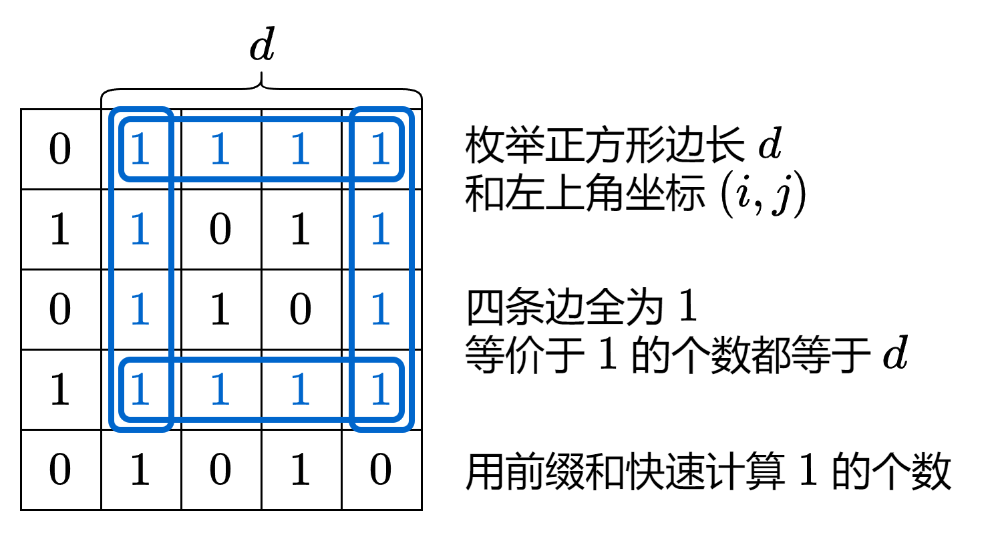

#### [前置知识：前缀和](https://leetcode.cn/problems/largest-1-bordered-square/solutions/2115990/tu-jie-qian-zhui-he-qing-song-acpythonja-5mnn/)

对于数组 $nums$，定义它的前缀和 $s[0]=0$，$s[i+1] = \sum\limits_{j=0}^{i}nums[j]$。

例如 $nums=[1,2,−1,2]$，对应的前缀和数组为 $s=[0,1,3,2,4]$。

通过前缀和，我们可以把**子数组的元素和转换成两个前缀和的差**，即

$$\sum_{j=left}^{right}nums[j] = \sum\limits_{j=0}^{right}nums[j] - \sum\limits_{j=0}^{left-1}nums[j] = s[right+1] - s[left]$$

例如 $nums$ 的子数组 $[2,-1,2]$ 的和就可以用 $s[4]-s[1]=4-1=3$ 算出来。

> 注：为方便计算，常用左闭右开区间 $[left,right)$ 来表示子数组，此时子数组的和为 $s[right]-s[left]$，子数组的长度为 $right-left$。
> 
> 注 2：$s[0]=0$ 表示的是一个空数组的元素和。为什么要额外定义它？想一想，如果要计算的子数组恰好是一个前缀（从 $nums[0]$ 开始），你要用 $s[right]$ 减去谁呢？通过定义 $s[0]=0$，任意子数组（包括前缀）都可以表示为两个前缀和的差。

#### 思路



```python
class Solution:
    def largest1BorderedSquare(self, grid: List[List[int]]) -> int:
        m, n = len(grid), len(grid[0])
        rs = [list(accumulate(row, initial=0)) for row in grid]  # 每行的前缀和
        cs = [list(accumulate(col, initial=0)) for col in zip(*grid)]  # 每列的前缀和
        for d in range(min(m, n), 0, -1):  # 从大到小枚举正方形边长 d
            for i in range(m - d + 1):
                for j in range(n - d + 1):  # 枚举正方形左上角坐标 (i,j)
                    # 上 左 下 右 四条边 1 的个数均为 d
                    if rs[i][j + d] - rs[i][j] == d and \
                       cs[j][i + d] - cs[j][i] == d and \
                       rs[i + d - 1][j + d] - rs[i + d - 1][j] == d and \
                       cs[j + d - 1][i + d] - cs[j + d - 1][i] == d:
                        return d * d
        return 0
```

```java
class Solution {
    public int largest1BorderedSquare(int[][] grid) {
        int m = grid.length, n = grid[0].length;
        int[][] rs = new int[m][n + 1], cs = new int[n][m + 1];
        for (int i = 0; i < m; ++i)
            for (int j = 0; j < n; ++j) {
                rs[i][j + 1] = rs[i][j] + grid[i][j]; // 每行的前缀和
                cs[j][i + 1] = cs[j][i] + grid[i][j]; // 每列的前缀和
            }
        for (int d = Math.min(m, n); d > 0; --d) // 从大到小枚举正方形边长 d
            for (int i = 0; i <= m - d; ++i)
                for (int j = 0; j <= n - d; ++j) // 枚举正方形左上角坐标 (i,j)
                    if (rs[i][j + d] - rs[i][j] == d && // 上边
                        cs[j][i + d] - cs[j][i] == d && // 左边 
                        rs[i + d - 1][j + d] - rs[i + d - 1][j] == d && // 下边
                        cs[j + d - 1][i + d] - cs[j + d - 1][i] == d)   // 右边
                        return d * d;
        return 0;
    }
}
```

```cpp
class Solution {
public:
    int largest1BorderedSquare(vector<vector<int>> &grid) {
        int m = grid.size(), n = grid[0].size();
        vector<vector<int>> rs(m, vector<int>(n + 1)), cs(n, vector<int>(m + 1));
        for (int i = 0; i < m; ++i)
            for (int j = 0; j < n; ++j) {
                rs[i][j + 1] = rs[i][j] + grid[i][j]; // 每行的前缀和
                cs[j][i + 1] = cs[j][i] + grid[i][j]; // 每列的前缀和
            }
        for (int d = min(m, n); d; --d) // 从大到小枚举正方形边长 d
            for (int i = 0; i <= m - d; ++i)
                for (int j = 0; j <= n - d; ++j) // 枚举正方形左上角坐标 (i,j)
                    if (rs[i][j + d] - rs[i][j] == d && // 上边
                        cs[j][i + d] - cs[j][i] == d && // 左边 
                        rs[i + d - 1][j + d] - rs[i + d - 1][j] == d && // 下边
                        cs[j + d - 1][i + d] - cs[j + d - 1][i] == d)   // 右边
                        return d * d;
        return 0;
    }
};
```

```go
func largest1BorderedSquare(grid [][]int) int {
    m, n := len(grid), len(grid[0])
    rs := make([][]int, m)
    for i := range rs {
        rs[i] = make([]int, n+1)
    }
    cs := make([][]int, n)
    for i := range cs {
        cs[i] = make([]int, m+1)
    }
    for i, row := range grid {
        for j, x := range row {
            rs[i][j+1] = rs[i][j] + x // 每行的前缀和
            cs[j][i+1] = cs[j][i] + x // 每列的前缀和
        }
    }
    for d := min(m, n); d > 0; d-- {
        for i := 0; i <= m-d; i++ {
            for j := 0; j <= n-d; j++ {
                if rs[i][j+d]-rs[i][j] == d && // 上边
                   cs[j][i+d]-cs[j][i] == d && // 左边
                   rs[i+d-1][j+d]-rs[i+d-1][j] == d && // 下边
                   cs[j+d-1][i+d]-cs[j+d-1][i] == d {  // 右边
                    return d * d
                }
            }
        }
    }
    return 0
}

func min(a, b int) int { if b < a { return b }; return a }
```

#### 复杂度分析

-   时间复杂度：$O(mn\min(m,n))$，其中 $m$ 和 $n$ 分别为 $grid$ 的行数和列数。
-   空间复杂度：$O(mn)$。
