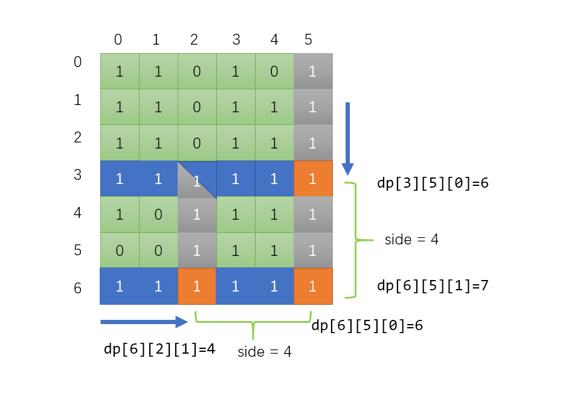

#### [思路](https://leetcode.cn/problems/largest-1-bordered-square/solutions/345335/java-dong-tai-gui-hua-by-resolmi/)

首先定义DP数组

```
dp[i][j][0]: i,j左边连续的1的个数（包括自身）
dp[i][j][1]: i,j上边连续的1的个数（包括自身）
```

然后递推预处理这一部分

Java

```java
int[][][] dp = new int[m+1][n+1][2];
for (int i = 1; i <= m; i++) {
    for (int j = 1; j <= n; j++) {
        if (grid[i-1][j-1] == 1){
            dp[i][j][0] = 1 + dp[i][j-1][0];
            dp[i][j][1] = 1 + dp[i-1][j][1];
        }
    }
}
```

简单画了个图（和实际代码有一点出入，实际代码为了方便初始化，`dp[i][j]`代表的其实是`grid[i-1][j-1]`）



求以某个点为右下角的正方形，首先我们考虑这个点为右下角可能构成的最大正方形边长是多大

很明显应该是该点左边和上边连续1个数的**最小值**，如上图的（6，5）点，最大的可能边长就应该是6，然后我们枚举所有的小于等于6大于等于1的边长`side`，验证`side`能否构成正方形

验证`side`是否合法也很容易，如上图，我们只需要考虑（6，5）**上边**距离为`side`的点的**左边**连续1的个数是否大于等于`side`（`dp[i-side+1][j][0] >= side`），以及**左边**距离为`side`的点的**上边**连续的1的个数是否大于等于`side`（`dp[i][j-side+1][1] >= side`），如果都大于等于`side`那么该`side`就是合法的，我们统计这些合法的`side`的最大值就ok了

#### Code

Java

```java
public int largest1BorderedSquare(int[][] grid) {
    int m = grid.length;
    int n = grid[0].length;
    //dp[i][j][0]: i,j左边连续的1的个数
    //dp[i][j][1]: i,j上边连续的1的个数
    int[][][] dp = new int[m+1][n+1][2];
    for (int i = 1; i <= m; i++) {
        for (int j = 1; j <= n; j++) {
            if (grid[i-1][j-1] == 1){
                dp[i][j][0] = 1 + dp[i][j-1][0];
                dp[i][j][1] = 1 + dp[i-1][j][1];
            }
        }
    }
    int res = 0;
    for (int i = 1; i <= m; i++) {
        for (int j = 1; j <= n; j++) {
            //最短的那条边不一定是合法的边长，如果该边长不合法就需要缩减边长，直到找到合法的
            for (int side = Math.min(dp[i][j][0], dp[i][j][1]); side >= 1; side--){
                if (dp[i][j-side+1][1] >= side && dp[i-side+1][j][0] >= side){
                    res = Math.max(res, side);
                    break; //更短的就没必要考虑了
                }
            }
        }
    }
    return res * res;
}
```
