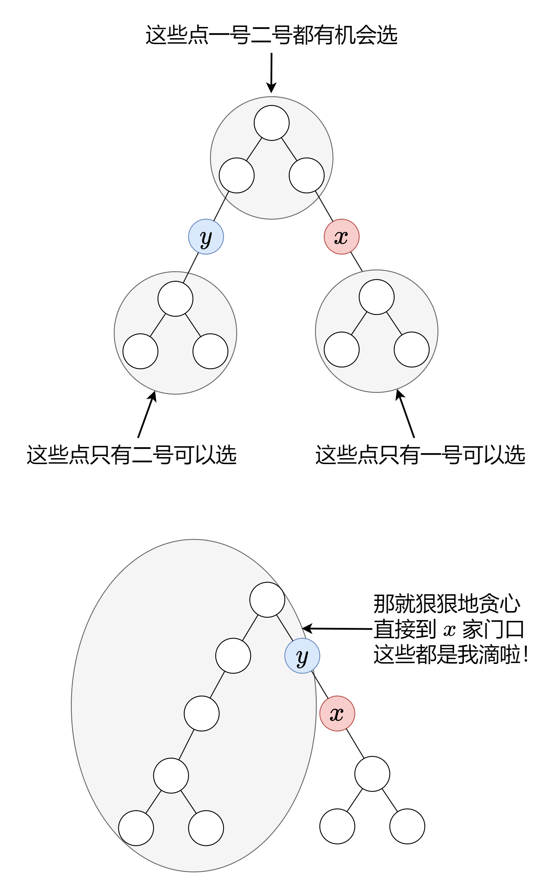

#### [没有思路？一张图秒懂！（Python/Java/C++/Go）](https://leetcode.cn/problems/binary-tree-coloring-game/solutions/2089813/mei-you-si-lu-yi-zhang-tu-miao-dong-pyth-btav/)



以 $x$ 为根，它的三个邻居（左儿子、右儿子和父节点）就对应着三棵子树：

-   左子树
-   右子树
-   父节点子树

哪棵子树最大，二号玩家就选哪棵。

设 $n_2$ 为二号玩家最多可以染的节点个数，左子树的大小为 $lsz$，右子树的大小为 $rsz$，那么父节点子树的大小就是 $n−1−lsz−rsz$，因此

$n_2 = \max(lsz,rsz,n-1-lsz-rsz)$

一号玩家染的节点个数为 $n-n_2$，获胜条件为 $n_2 > n-n_2$，即 $2 \cdot n_2 > n$。

计算子树大小可以用**深度优先搜索**，如果你不了解这块内容，可以看我精心制作的[【基础算法精讲 09】](https://leetcode.cn/link/?target=https%3A%2F%2Fwww.bilibili.com%2Fvideo%2FBV1UD4y1Y769%2F)。

```py
class Solution:
    def btreeGameWinningMove(self, root: Optional[TreeNode], n: int, x: int) -> bool:
        lsz = rsz = 0
        def dfs(node: Optional[TreeNode]) -> int:
            if node is None:
                return 0
            ls = dfs(node.left)
            rs = dfs(node.right)
            if node.val == x:
                nonlocal lsz, rsz
                lsz, rsz = ls, rs
            return ls + rs + 1
        dfs(root)
        return max(lsz, rsz, n - 1 - lsz - rsz) * 2 > n
```

```java
class Solution {
    private int x, lsz, rsz;

    public boolean btreeGameWinningMove(TreeNode root, int n, int x) {
        this.x = x;
        dfs(root);
        return Math.max(Math.max(lsz, rsz), n - 1 - lsz - rsz) * 2 > n;
    }

    private int dfs(TreeNode node) {
        if (node == null) 
            return 0;
        int ls = dfs(node.left);
        int rs = dfs(node.right);
        if (node.val == x) {
            lsz = ls;
            rsz = rs;
        }
        return ls + rs + 1;
    }
}
```

```cpp
class Solution {
public:
    bool btreeGameWinningMove(TreeNode *root, int n, int x) {
        int lsz, rsz;
        function<int(TreeNode *)> dfs = [&](TreeNode *node) {
            if (node == nullptr)
                return 0;
            int ls = dfs(node->left);
            int rs = dfs(node->right);
            if (node->val == x)
                lsz = ls, rsz = rs;
            return ls + rs + 1;
        };
        dfs(root);
        return max({lsz, rsz, n - 1 - lsz - rsz}) * 2 > n;
    }
};
```

```go
func btreeGameWinningMove(root *TreeNode, n, x int) bool {
    lsz, rsz := 0, 0
    var dfs func(*TreeNode) int
    dfs = func(node *TreeNode) int {
        if node == nil {
            return 0
        }
        ls := dfs(node.Left)
        rs := dfs(node.Right)
        if node.Val == x {
            lsz, rsz = ls, rs
        }
        return ls + rs + 1
    }
    dfs(root)
    return max(max(lsz, rsz), n-1-lsz-rsz)*2 > n
}

func max(a, b int) int { if b > a { return b }; return a }
```

### 复杂度分析

-   时间复杂度：$O(n)$，其中 $n$ 为二叉树的节点个数。每个节点仅被访问一次。
-   空间复杂度：$O(n)$。最坏情况下，二叉树是一条链，递归需要 $O(n)$ 的栈空间。

### 思考题

假如你是一号玩家，$x$ 由你决定，你是否有**必胜**策略？

如果题目给的是一般的树呢（不是二叉树）？

见 [树的重心](https://leetcode.cn/link/?target=https%3A%2F%2Foi-wiki.org%2Fgraph%2Ftree-centroid%2F)。

把 $x$ 选在重心上，一号玩家是必胜的。
