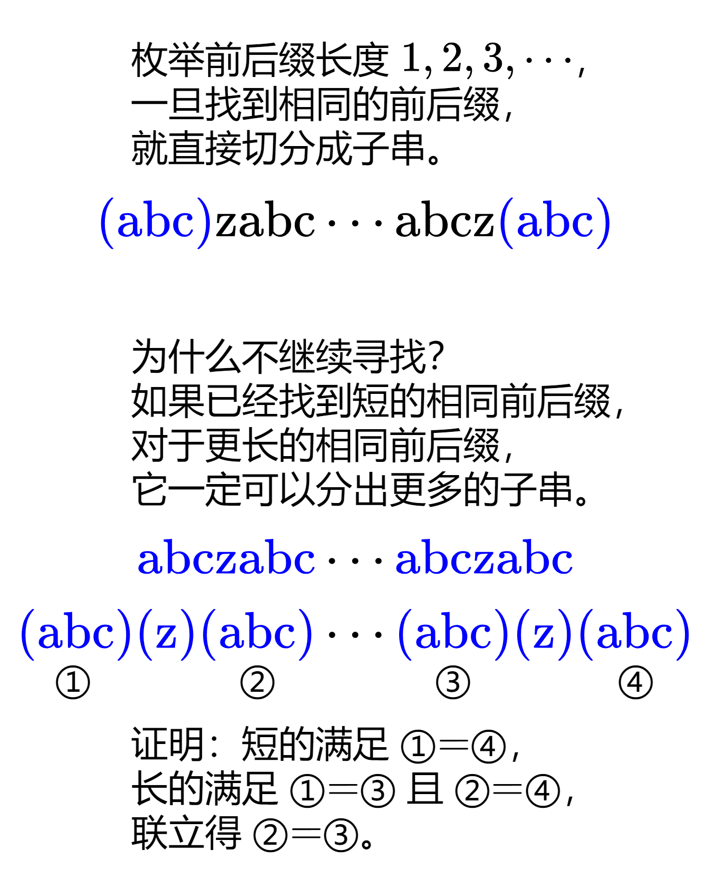

#### [【图解】贪心做法，一图秒懂！（Python/Java/C++/Go）](https://leetcode.cn/problems/longest-chunked-palindrome-decomposition/solutions/2221544/tu-jie-tan-xin-zuo-fa-yi-tu-miao-dong-py-huik/)



#### 答疑

**问**：如果短的长度超过了长的长度的一半呢？

**答**：这是不可能的。用反证法证明。假设短的长度超过了长的长度的一半，上图证明中还可以得到 ①=②，结合前面的假设，说明 ① 和 ② 有重叠，且重叠部分既是短的前缀，也是短的后缀。比如 $ababa \cdots ababa$ 中 ①=②=$aba$，重叠部分为 $a$，既是 $aba$ 的前缀，也是 $aba$ 的后缀。这说明短的 $aba$ 还可以继续分割出更短的子串 $a$，而不是作为一个无法分割的整体，矛盾，所以不会出现短的长度超过了长的长度的一半的情况。

#### 递归写法

```python
class Solution:
    def longestDecomposition(self, s: str) -> int:
        if s == "":
            return 0
        for i in range(1, len(s) // 2 + 1):  # 枚举前后缀长度
            if s[:i] == s[-i:]:  # 立刻分割
                return 2 + self.longestDecomposition(s[i:-i])
        return 1  # 无法分割
```

```java
class Solution {
    public int longestDecomposition(String s) {
        if (s.isEmpty())
            return 0;
        for (int i = 1, n = s.length(); i <= n / 2; ++i) // 枚举前后缀长度
            if (s.substring(0, i).equals(s.substring(n - i))) // 立刻分割
                return 2 + longestDecomposition(s.substring(i, n - i));
        return 1; // 无法分割
    }
}
```

```cpp
class Solution {
public:
    int longestDecomposition(string s) {
        if (s.empty())
            return 0;
        for (int i = 1, n = s.length(); i <= n / 2; ++i) // 枚举前后缀长度
            if (s.substr(0, i) == s.substr(n - i)) // 立刻分割
                return 2 + longestDecomposition(s.substr(i, n - i * 2));
        return 1; // 无法分割
    }
};
```

```go
func longestDecomposition(s string) int {
    if s == "" {
        return 0
    }
    for i, n := 1, len(s); i <= n/2; i++ { // 枚举前后缀长度
        if s[:i] == s[n-i:] { // 立刻分割
            return 2 + longestDecomposition(s[i:n-i])
        }
    }
    return 1 // 无法分割
}
```

#### 迭代写法

```python
class Solution:
    def longestDecomposition(self, s: str) -> int:
        ans = 0
        while s:
            i = 1
            while i <= len(s) // 2 and s[:i] != s[-i:]:  # 枚举前后缀
                i += 1
            if i > len(s) // 2:  # 无法分割
                ans += 1
                break
            ans += 2  # 分割出 s[:i] 和 s[-i:]
            s = s[i:-i]
        return ans
```

```java
class Solution {
    public int longestDecomposition(String s) {
        int ans = 0;
        while (!s.isEmpty()) {
            int i = 1, n = s.length();
            while (i <= n / 2 && !s.substring(0, i).equals(s.substring(n - i))) // 枚举前后缀
                ++i;
            if (i > n / 2) { // 无法分割
                ++ans;
                break;
            }
            ans += 2; // 分割出 s[:i] 和 s[n-i:]
            s = s.substring(i, n - i);
        }
        return ans;
    }
}
```

```cpp
class Solution {
public:
    int longestDecomposition(string s) {
        int ans = 0;
        while (!s.empty()) {
            int i = 1, n = s.length();
            while (i <= n / 2 && s.substr(0, i) != s.substr(n - i)) // 枚举前后缀
                ++i;
            if (i > n / 2) { // 无法分割
                ++ans;
                break;
            }
            ans += 2; // 分割出 s[:i] 和 s[n-i:]
            s = s.substr(i, n - i * 2);
        }
        return ans;
    }
};
```

```go
func longestDecomposition(s string) (ans int) {
    for s != "" {
        i, n := 1, len(s)
        for i <= n/2 && s[:i] != s[n-i:] { // 枚举前后缀
            i++
        }
        if i > n/2 { // 无法分割
            ans++
            break
        }
        ans += 2 // 分割出 s[:i] 和 s[n-i:]
        s = s[i : n-i]
    }
    return
}
```

#### 复杂度分析

-   时间复杂度：$O(n^2)$，其中 $n$ 为字符串的长度。最坏情况下无法分割，需要执行 $O(n)$ 次长为 $O(n)$ 的字符串比较，所以时间复杂度为 $O(n^2)$。
-   空间复杂度：$O(n)$ 或 $O(1)$。Go 语言切片不会有拷贝，所以空间复杂度为 $O(1)$。当然，也可以手动比较字符串，这样无需生成子串。
