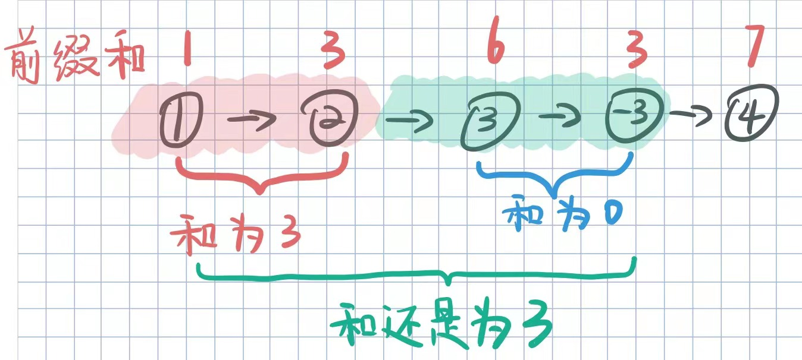

#### [【前缀和】单链表的前缀和超详细解法](https://leetcode.cn/problems/remove-zero-sum-consecutive-nodes-from-linked-list/solutions/1142176/qian-zhui-he-dan-lian-biao-de-qian-zhui-kwr05/)

#### 题目翻译

将给定链表中`和为0`的子链表全部删除，最后得到的链表节点值之和应当不为0.

#### 最初的思考

-   当某个子链表之和为0时，我们就把它从链表中断掉。


> 所以，我们应当知道被断开子链表的**前驱节点**。

-   再观察一下这个链表的前缀和，我们发现红色部分之和为3，加上了绿色部分还是3，所以绿色的部分应当被去除，我们就可以从**红色部分的末尾**直接连接到**绿色部分末尾的下一个结点**。



-   分析到这里，思路就基本确定了，我们一边遍历链表，一遍记录当前的和，如果之前存在这个和，那么就把他们中间的节点都断掉。

步骤如下：

-   利用Map记录前缀和`sum`以及当前节点`p`
-   如果Map中不存在该`sum`,则加入Map
-   如果Map中存在该`sum`,则将该`sum`对应的节点`node.next`指向当前节点`p.next`
-   处理完之后，需要更新Map，将被断开部分的节点和从Map中去除。

注意事项：

-   利用虚拟头节点来防止第一个节点需要被删除而导致的空指针
-   map中初始化放入(0, dummy)

图解如下： 

#### 不重要的题解代码

```java
    public ListNode removeZeroSumSublists(ListNode head) {
        // <sum, lastNode>
        HashMap<Integer, ListNode> sumMap = new HashMap<>();
        ListNode dummy = new ListNode(-1, head);
        ListNode p = head;
        int sum = 0;
        sumMap.put(0,dummy);
        while(p != null){
            sum += p.val;
            if(sumMap.containsKey(sum)){
                ListNode node = sumMap.get(sum);
                ListNode del = node.next;
                node.next = p.next;

                int dSum = sum;
                while(del != p){
                    dSum += del.val;
                    sumMap.remove(dSum);
                    del = del.next;
                }
                
            }else{
                sumMap.put(sum, p);
            }
            p = p.next;
        }
        return dummy.next;
        
    }
```

#### 不需要中途维护Map的另一种思路

1.  可以先遍历整个链表，得到前缀和以及最后一个节点的映射关系。
2.  再次遍历链表，计算前缀和，从Map取对应和的节点，重新建立关系。

为什么就不需要维护map了呢？

> 因为在计算前缀和的时候，如果有相同的`sum`，对应的节点已经被后续的节点所覆盖了，所以不需要特殊维护。

图解： 1.一趟遍历完成后，红色的部分就是存在Map中的映射关系。 


2.第二趟遍历： 当指针指向第一个结点时，`sum == 1`，此时Map中存在`sum==1`的节点\[-2\],将`[1].next = [-2].next`; 

如此遍历下去，所有节点都将正确连接：

最后返回`dummy.next`即可。

这种方法的代码部分就留给大家去实践吧~
