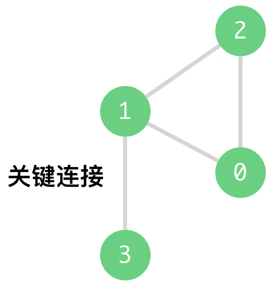

### [1192\. 查找集群内的关键连接](https://leetcode.cn/problems/critical-connections-in-a-network/)

难度：困难

力扣数据中心有 `n` 台服务器，分别按从 `0` 到 `n-1` 的方式进行了编号。它们之间以 **服务器到服务器** 的形式相互连接组成了一个内部集群，连接是无向的。用  `connections` 表示集群网络，`connections[i] = [a, b]` 表示服务器 `a` 和 `b` 之间形成连接。任何服务器都可以直接或者间接地通过网络到达任何其他服务器。

**关键连接** 是在该集群中的重要连接，假如我们将它移除，便会导致某些服务器无法访问其他服务器。

请你以任意顺序返回该集群内的所有 **关键连接**。

**示例 1：**

> 
> **输入：** n = 4, connections = \[[0,1],[1,2],[2,0],[1,3]]
> **输出：** \[[1,3]]
> **解释：** \[[3,1]] 也是正确的。

**示例 2:**

> **输入：** n = 2, connections = \[[0,1]]
> **输出：** \[[0,1]]

**提示：**

- <code>2 <= n <= 105</code>
- <code>n - 1 <= connections.length <= 105</code>
- <code>0 <= ai, bi <= n - 1</code>
- <code>ai != bi</code>
- 不存在重复的连接
