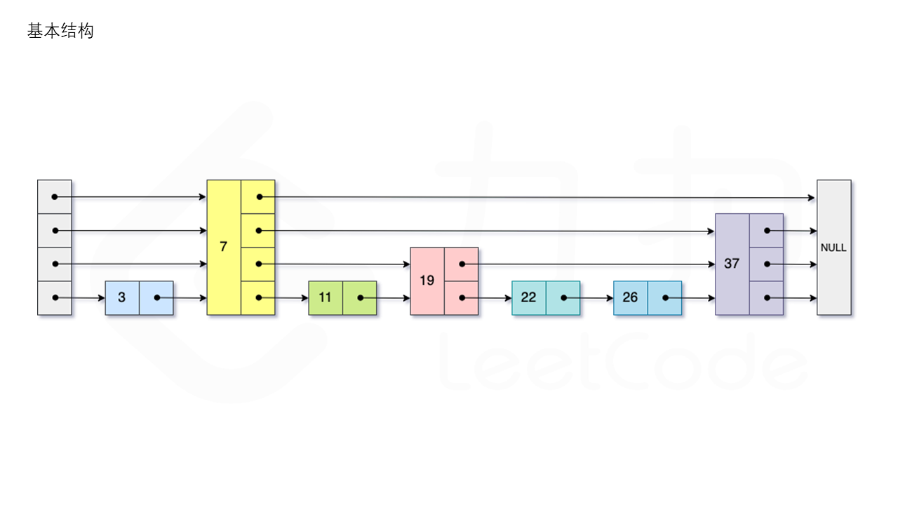
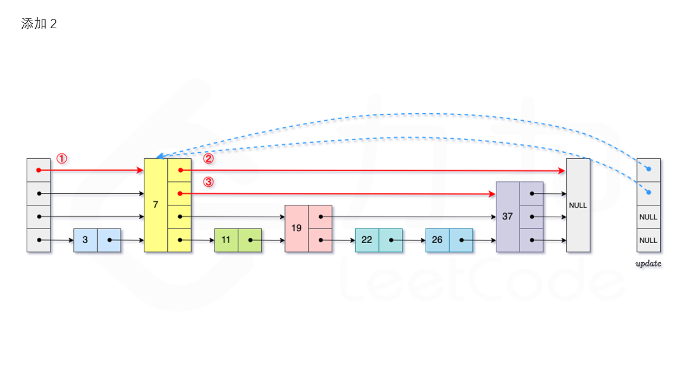
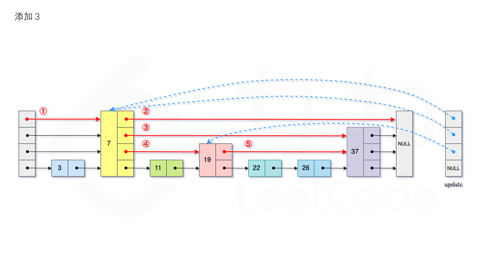
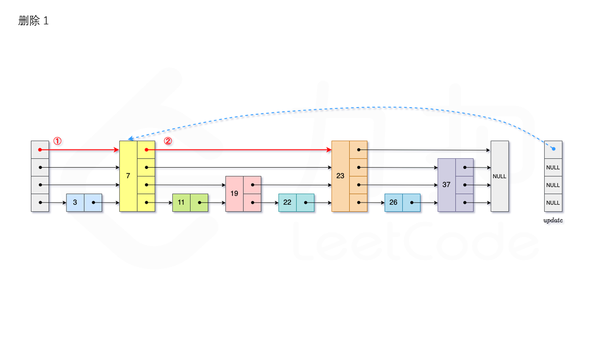
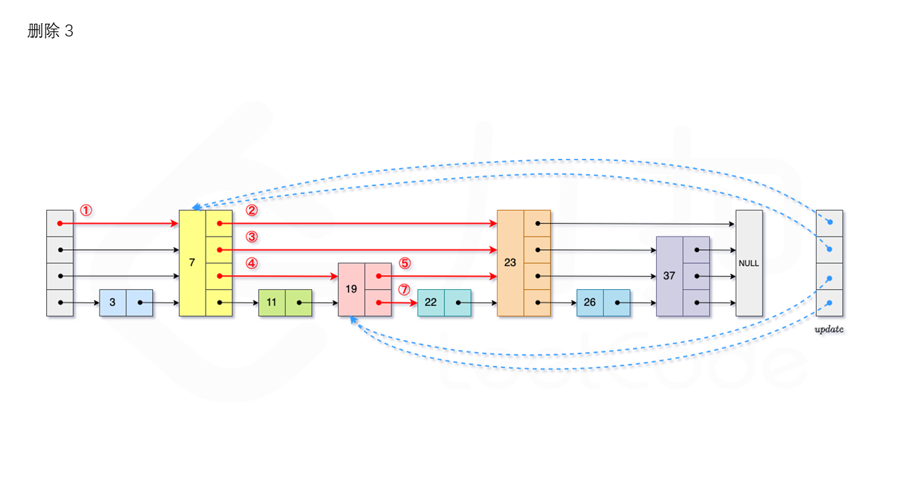
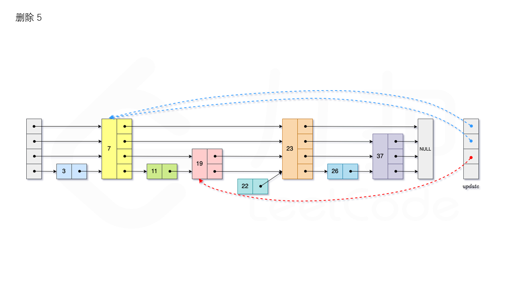

### [设计跳表](https://leetcode.cn/problems/design-skiplist/solutions/1696545/she-ji-tiao-biao-by-leetcode-solution-e8yh/)

#### 方法一：直接构造

跳表这种数据结构是由 William Pugh 发明的，关于跳表的详细介绍可以参考论文:「[Skip Lists: A Probabilistic Alternative to Balanced Trees](https://leetcode.cn/link/?target=https%3A%2F%2F15721.courses.cs.cmu.edu%2Fspring2018%2Fpapers%2F08-oltpindexes1%2Fpugh-skiplists-cacm1990.pdf)」，论文中详细阐述了关于 $skiplist$ 查找元素、删除元素、插入元素的算法伪代码，以及时间复杂度的分析。跳表是一种随机化的数据结构，可以被看做二叉树的一个变种，它在性能上和红黑树、$AVL$ 树不相上下，但是跳表的原理非常简单，目前在 $Redis$ 和 $LevelDB$ 中都有用到。跳表的期望空间复杂度为 $O(n)$，跳表的查询，插入和删除操作的期望时间复杂度均为 $O(\log n)$。跳表实际为一种多层的有序链表，跳表的每一层都为一个有序链表，且满足每个位于第 $i$ 层的节点有 $p$ 的概率出现在第 $i+1$ 层，其中 $p$ 为常数。

它的结构类似于如下图所示:

跳表在进行查找时，首先从当前的最高层 $L(n)$ 层开始查找，在当前层水平地逐个比较直至当前节点的下一个节点大于等于目标节点，然后移动至下一层进行查找，重复这个过程直至到达第一层。此时，若下一个节点是目标节点，则成功查找；反之，则元素不存在。由于从高层往低层开始查找，由于低层出现的元素可能不会出现在高层，因此跳表在进行查找的过程中会跳过一些元素，相比于有序链表的查询，跳表的查询速度会更快。
跳表的初始化、查找、添加、删除操作详细描述如下：



- $search$：从跳表的当前的最大层数 $level$ 层开始查找，在当前层水平地逐个比较直至当前节点的下一个节点大于等于目标节点，然后移动至下一层进行查找，重复这个过程直至到达第 $1$ 层。此时，若第 $1$ 层的下一个节点的值等于 $target$，则返回 $true$；反之，则返回 $false$。如图所示：


- $add$：从跳表的当前的最大层数 $level$ 层开始查找，在当前层水平地逐个比较直至当前节点的下一个节点大于等于目标节点，然后移动至下一层进行查找，重复这个过程直至到达第 $1$ 层。设新加入的节点为 $newNode$，我们需要计算出此次节点插入的层数 $lv$，如果 $level$ 小于 $lv$，则同时需要更新 $level$。我们用数组 $update$ 保存每一层查找的最后一个节点，第 $i$ 层最后的节点为 $update[i]$。我们将 $newNode$ 的后续节点指向 $update[i]$ 的下一个节点，同时更新 $update[i]$ 的后续节点为 $newNode$。如图所示：






- $erase$：首先我们需要查找当前元素是否存在跳表中。从跳表的当前的最大层数 $level$ 层开始查找，在当前层水平地逐个比较直至当前节点的下一个节点大于等于目标节点，然后移动至下一层进行查找，重复这个过程直至到达第 $1$ 层。如果第 $1$ 层的下一个节点不等于 $num$ 时，则表示当前元素不存在直接返回。我们用数组 $update$ 保存每一层查找的最后一个节点，第 $i$ 层最后的节点为 $update[i]$。此时第 $i$ 层的下一个节点的值为 $num$，则我们需要将其从跳表中将其删除。由于第 $i$ 层的以 $p$ 的概率出现在第 $i+1$ 层，因此我们应当从第 $1$ 层开始往上进行更新，将 $num$ 从 $update[i]$ 的下一跳中删除，同时更新 $update[i]$ 的后续节点，直到当前层的链表中没有出现 $num$ 的节点为止。最后我们还需要更新跳表中当前的最大层数 $level$。如图所示：








关于跳表的复杂度的分析如下：

- 空间复杂度分析：我们知道每次添加节点时，节点出现在第 $i$ 层的概率为 $(1-p) \times p^{i-1}$，跳表插入时的期望层数为:

$$\begin{array}{rcl} E(L) & = & 1 \times (1-p)+2 \times (1-p) \times p+3 \times (1-p) \times p^2+ \cdots \\ & = & \sum\limits_{i=1}^\infty i \times (1-p) \times p^{i-1} \\ & = & (1-p) \times \sum\limits_{i=1}^\infty i \times p^{i-1} \\ & = & (1-p) \times \dfrac{1}{(1-p)^2} \\ & = & \dfrac{1}{1-p}\end{array}$$

如果节点的目标层数为 $L$，则此时需要的空间为 $O(L)$，因此总的空间复杂度为 $O(n \times E(L))=O(n \times \dfrac{1}{1-p})=O(n)$。

- 时间复杂度分析: 在含有 $n$ 个节点的跳表中，当前最大层数 $L(n)$ 包含的元素个数期望为 $\dfrac{1}{p}$，根据跳表的定义可以知道第 $1$ 层的每个元素出现在 $L(n)$ 的概率为 $p^{L(n)-1}$，则此时我们可以推出如下：

$$\begin{array}{rcl}\dfrac{1}{p} & = & np^{L(n)-1} \\ p^{L(n)} & = & \dfrac{1}{n} \\ L(n) & = & \log_p \dfrac{1}{n}\end{array}$$

根据以上结论可以知道在含有 $n$ 个节点的跳表中，当前最大层数期望 $L(n)=\log_p \dfrac{1}{n}$。

我们首先思考一下搜索目标节点 $x$ 的过程，每次我们搜索第 $i$ 层时，如果第 $i$ 层的当前节点小于 $x$ 时，则我们会在第 $i$ 层向右进行搜索，直到下一个节点的值大于等于 $x$；如果第 $i$ 层的节点值大于等于 $x$，则我们则会下降到 $i-1$ 层。根据之前的定义，如果节点 $x$ 在第 $i$ 层出现，则节点 $x$ 一定会出现在第 $i-1$ 层。现在假设我们从 $L(n)$ 的第一个节点搜索到第 $1$ 层的目标节点 $x$ 的路径为 $S$，现在我们将路径 $S$ 反过来，即从第 $1$ 的节点 $x$ 回到 $L(n)$ 层的第一个节点，我们可以观察到从第 $1$ 层的节点 $x$ 一直往上一层，直到 $x$ 的最大层数，然后再向左走一步到达节点 $y$，再向上走，再重复上述步骤，实际搜索时如果在上一层可以到访问到节点 $x$，则在下一层遍历时一定不会访问所有小于 $x$ 的节点。假设当前我们处于一个第 $i$ 层的节点 $x$，此时并不知道 $x$ 的最大层数和 $x$ 左侧节点的最大层数，只知道 $x$ 的最大层数至少为 $i$。我们可以知道 $x$ 的最大层数大于 $i$，那么下一步按照最优选择应该是向上一层，这种情况的概率为 $p$；如果 $x$ 的最大层数等于 $i$，那么下一步应该是同一层向左侧后退一个节点，这种情况概率为 $1-p$。令 $C(i)$ 为在一个无限长度的跳表中向上爬 $i$ 层的期望代价，则知道:

$$\begin{array}{rcl}C(0) & = & 0 \\ C(i) & = & (1-p)(1+C(i))+p(1+C(i-1)) \\ C(i) & = & \dfrac{1}{p}+C(i-1) \\ C(i) & = & \dfrac{i}{p}\end{array}$$

在含有 $n$ 个元素的跳表中，从第 $1$ 层爬到第 $L(n)$ 层的期望步数存在上界 $\dfrac{L(n)-1}{p}$。现在只需要分析爬到第 $L(n)$ 层后还要再走多少步。当达到第 $L(n)$ 层后，我们需要向左走。我们已知 $L(n)$ 层的节点总数的期望存在上界为 $\dfrac{1}{p}$。所以我们知道搜索的总的代价为:

$$\dfrac{L(n)-1}{p} + \dfrac{1}{p} = \dfrac{\log_\frac{1}{p} n-1}{p} + \dfrac{1}{p} = \dfrac{\log_\frac{1}{p} n}{p}$$

根据以上推理可以得到查询的平均时间复杂度为 $O(\log n)$。

上述的推理过程与原本的论文相比还是有所忽略细节，如果对复杂度分析的详细细节感兴趣的可以参考原始论文:「[Skip Lists: A Probabilistic Alternative to Balanced Trees](https://leetcode.cn/link/?target=https%3A%2F%2F15721.courses.cs.cmu.edu%2Fspring2018%2Fpapers%2F08-oltpindexes1%2Fpugh-skiplists-cacm1990.pdf)」。

```Python
MAX_LEVEL = 32
P_FACTOR = 0.25

def random_level() -> int:
    lv = 1
    while lv < MAX_LEVEL and random.random() < P_FACTOR:
        lv += 1
    return lv

class SkiplistNode:
    __slots__ = 'val', 'forward'

    def __init__(self, val: int, max_level=MAX_LEVEL):
        self.val = val
        self.forward = [None] * max_level

class Skiplist:
    def __init__(self):
        self.head = SkiplistNode(-1)
        self.level = 0

    def search(self, target: int) -> bool:
        curr = self.head
        for i in range(self.level - 1, -1, -1):
            # 找到第 i 层小于且最接近 target 的元素
            while curr.forward[i] and curr.forward[i].val < target:
                curr = curr.forward[i]
        curr = curr.forward[0]
        # 检测当前元素的值是否等于 target
        return curr is not None and curr.val == target

    def add(self, num: int) -> None:
        update = [self.head] * MAX_LEVEL
        curr = self.head
        for i in range(self.level - 1, -1, -1):
            # 找到第 i 层小于且最接近 num 的元素
            while curr.forward[i] and curr.forward[i].val < num:
                curr = curr.forward[i]
            update[i] = curr
        lv = random_level()
        self.level = max(self.level, lv)
        new_node = SkiplistNode(num, lv)
        for i in range(lv):
            # 对第 i 层的状态进行更新，将当前元素的 forward 指向新的节点
            new_node.forward[i] = update[i].forward[i]
            update[i].forward[i] = new_node

    def erase(self, num: int) -> bool:
        update = [None] * MAX_LEVEL
        curr = self.head
        for i in range(self.level - 1, -1, -1):
            # 找到第 i 层小于且最接近 num 的元素
            while curr.forward[i] and curr.forward[i].val < num:
                curr = curr.forward[i]
            update[i] = curr
        curr = curr.forward[0]
        if curr is None or curr.val != num:  # 值不存在
            return False
        for i in range(self.level):
            if update[i].forward[i] != curr:
                break
            # 对第 i 层的状态进行更新，将 forward 指向被删除节点的下一跳
            update[i].forward[i] = curr.forward[i]
        # 更新当前的 level
        while self.level > 1 and self.head.forward[self.level - 1] is None:
            self.level -= 1
        return True
```

```C++
constexpr int MAX_LEVEL = 32;
constexpr double P_FACTOR = 0.25;

struct SkiplistNode {
    int val;
    vector<SkiplistNode *> forward;
    SkiplistNode(int _val, int _maxLevel = MAX_LEVEL) : val(_val), forward(_maxLevel, nullptr) {
        
    }
};

class Skiplist {
private:
    SkiplistNode * head;
    int level;
    mt19937 gen{random_device{}()};
    uniform_real_distribution<double> dis;

public:
    Skiplist(): head(new SkiplistNode(-1)), level(0), dis(0, 1) {

    }

    bool search(int target) {
        SkiplistNode *curr = this->head;
        for (int i = level - 1; i >= 0; i--) {
            /* 找到第 i 层小于且最接近 target 的元素*/
            while (curr->forward[i] && curr->forward[i]->val < target) {
                curr = curr->forward[i];
            }
        }
        curr = curr->forward[0];
        /* 检测当前元素的值是否等于 target */
        if (curr && curr->val == target) {
            return true;
        } 
        return false;
    }

    void add(int num) {
        vector<SkiplistNode *> update(MAX_LEVEL, head);
        SkiplistNode *curr = this->head;
        for (int i = level - 1; i >= 0; i--) {
            /* 找到第 i 层小于且最接近 num 的元素*/
            while (curr->forward[i] && curr->forward[i]->val < num) {
                curr = curr->forward[i];
            }
            update[i] = curr;
        }
        int lv = randomLevel();
        level = max(level, lv);
        SkiplistNode *newNode = new SkiplistNode(num, lv);
        for (int i = 0; i < lv; i++) {
            /* 对第 i 层的状态进行更新，将当前元素的 forward 指向新的节点 */
            newNode->forward[i] = update[i]->forward[i];
            update[i]->forward[i] = newNode;
        }
    }

    bool erase(int num) {
        vector<SkiplistNode *> update(MAX_LEVEL, nullptr);
        SkiplistNode *curr = this->head;
        for (int i = level - 1; i >= 0; i--) {
            /* 找到第 i 层小于且最接近 num 的元素*/
            while (curr->forward[i] && curr->forward[i]->val < num) {
                curr = curr->forward[i];
            }
            update[i] = curr;
        }
        curr = curr->forward[0];
        /* 如果值不存在则返回 false */
        if (!curr || curr->val != num) {
            return false;
        }
        for (int i = 0; i < level; i++) {
            if (update[i]->forward[i] != curr) {
                break;
            }
            /* 对第 i 层的状态进行更新，将 forward 指向被删除节点的下一跳 */
            update[i]->forward[i] = curr->forward[i];
        }
        delete curr;
        /* 更新当前的 level */
        while (level > 1 && head->forward[level - 1] == nullptr) {
            level--;
        }
        return true;
    }

    int randomLevel() {
        int lv = 1;
        /* 随机生成 lv */
        while (dis(gen) < P_FACTOR && lv < MAX_LEVEL) {
            lv++;
        }
        return lv;
    }
};
```

```Java
class Skiplist {
    static final int MAX_LEVEL = 32;
    static final double P_FACTOR = 0.25;
    private SkiplistNode head;
    private int level;
    private Random random;

    public Skiplist() {
        this.head = new SkiplistNode(-1, MAX_LEVEL);
        this.level = 0;
        this.random = new Random();
    }

    public boolean search(int target) {
        SkiplistNode curr = this.head;
        for (int i = level - 1; i >= 0; i--) {
            /* 找到第 i 层小于且最接近 target 的元素*/
            while (curr.forward[i] != null && curr.forward[i].val < target) {
                curr = curr.forward[i];
            }
        }
        curr = curr.forward[0];
        /* 检测当前元素的值是否等于 target */
        if (curr != null && curr.val == target) {
            return true;
        } 
        return false;
    }

    public void add(int num) {
        SkiplistNode[] update = new SkiplistNode[MAX_LEVEL];
        Arrays.fill(update, head);
        SkiplistNode curr = this.head;
        for (int i = level - 1; i >= 0; i--) {
            /* 找到第 i 层小于且最接近 num 的元素*/
            while (curr.forward[i] != null && curr.forward[i].val < num) {
                curr = curr.forward[i];
            }
            update[i] = curr;
        }
        int lv = randomLevel();
        level = Math.max(level, lv);
        SkiplistNode newNode = new SkiplistNode(num, lv);
        for (int i = 0; i < lv; i++) {
            /* 对第 i 层的状态进行更新，将当前元素的 forward 指向新的节点 */
            newNode.forward[i] = update[i].forward[i];
            update[i].forward[i] = newNode;
        }
    }

    public boolean erase(int num) {
        SkiplistNode[] update = new SkiplistNode[MAX_LEVEL];
        SkiplistNode curr = this.head;
        for (int i = level - 1; i >= 0; i--) {
            /* 找到第 i 层小于且最接近 num 的元素*/
            while (curr.forward[i] != null && curr.forward[i].val < num) {
                curr = curr.forward[i];
            }
            update[i] = curr;
        }
        curr = curr.forward[0];
        /* 如果值不存在则返回 false */
        if (curr == null || curr.val != num) {
            return false;
        }
        for (int i = 0; i < level; i++) {
            if (update[i].forward[i] != curr) {
                break;
            }
            /* 对第 i 层的状态进行更新，将 forward 指向被删除节点的下一跳 */
            update[i].forward[i] = curr.forward[i];
        }
        /* 更新当前的 level */
        while (level > 1 && head.forward[level - 1] == null) {
            level--;
        }
        return true;
    }

    private int randomLevel() {
        int lv = 1;
        /* 随机生成 lv */
        while (random.nextDouble() < P_FACTOR && lv < MAX_LEVEL) {
            lv++;
        }
        return lv;
    }
}

class SkiplistNode {
    int val;
    SkiplistNode[] forward;

    public SkiplistNode(int val, int maxLevel) {
        this.val = val;
        this.forward = new SkiplistNode[maxLevel];
    }
}
```

```CSharp
public class Skiplist {
    const int MAX_LEVEL = 32;
    const double P_FACTOR = 0.25;
    private SkiplistNode head;
    private int level;
    private Random random;

    public Skiplist() {
        this.head = new SkiplistNode(-1, MAX_LEVEL);
        this.level = 0;
        this.random = new Random();
    }
    
    public bool Search(int target) {
        SkiplistNode curr = this.head;
        for (int i = level - 1; i >= 0; i--) {
            /* 找到第 i 层小于且最接近 target 的元素*/
            while (curr.forward[i] != null && curr.forward[i].val < target) {
                curr = curr.forward[i];
            }
        }
        curr = curr.forward[0];
        /* 检测当前元素的值是否等于 target */
        if (curr != null && curr.val == target) {
            return true;
        } 
        return false;
    }
    
    public void Add(int num) {
        SkiplistNode[] update = new SkiplistNode[MAX_LEVEL];
        Array.Fill(update, head);
        SkiplistNode curr = this.head;
        for (int i = level - 1; i >= 0; i--) {
            /* 找到第 i 层小于且最接近 num 的元素*/
            while (curr.forward[i] != null && curr.forward[i].val < num) {
                curr = curr.forward[i];
            }
            update[i] = curr;
        }
        int lv = RandomLevel();
        level = Math.Max(level, lv);
        SkiplistNode newNode = new SkiplistNode(num, lv);
        for (int i = 0; i < lv; i++) {
            /* 对第 i 层的状态进行更新，将当前元素的 forward 指向新的节点 */
            newNode.forward[i] = update[i].forward[i];
            update[i].forward[i] = newNode;
        }
    }
    
    public bool Erase(int num) {
        SkiplistNode[] update = new SkiplistNode[MAX_LEVEL];
        SkiplistNode curr = this.head;
        for (int i = level - 1; i >= 0; i--) {
            /* 找到第 i 层小于且最接近 num 的元素*/
            while (curr.forward[i] != null && curr.forward[i].val < num) {
                curr = curr.forward[i];
            }
            update[i] = curr;
        }
        curr = curr.forward[0];
        /* 如果值不存在则返回 false */
        if (curr == null || curr.val != num) {
            return false;
        }
        for (int i = 0; i < level; i++) {
            if (update[i].forward[i] != curr) {
                break;
            }
            /* 对第 i 层的状态进行更新，将 forward 指向被删除节点的下一跳 */
            update[i].forward[i] = curr.forward[i];
        }
        /* 更新当前的 level */
        while (level > 1 && head.forward[level - 1] == null) {
            level--;
        }
        return true;
    }

    private int RandomLevel() {
        int lv = 1;
        /* 随机生成 lv */
        while (random.NextDouble() < P_FACTOR && lv < MAX_LEVEL) {
            lv++;
        }
        return lv;
    }
}

public class SkiplistNode {
    public int val;
    public SkiplistNode[] forward;

    public SkiplistNode(int val, int maxLevel) {
        this.val = val;
        this.forward = new SkiplistNode[maxLevel];
    }
}
```

```C
#define MAX(a, b) ((a) > (b) ? (a) : (b))
const int MAX_LEVEL = 32;
const int P_FACTOR = RAND_MAX >> 2;

typedef struct SkiplistNode {
    int val;
    int maxLevel;
    struct SkiplistNode **forward;
} SkiplistNode;

typedef struct {
    SkiplistNode *head;
    int level;
} Skiplist;

SkiplistNode *skiplistNodeCreat(int val, int maxLevel) {
    SkiplistNode *obj = (SkiplistNode *)malloc(sizeof(SkiplistNode));
    obj->val = val;
    obj->maxLevel = maxLevel;
    obj->forward = (SkiplistNode **)malloc(sizeof(SkiplistNode *) * maxLevel);
    for (int i = 0; i < maxLevel; i++) {
        obj->forward[i] = NULL;
    }
    return obj;
}

void skiplistNodeFree(SkiplistNode* obj) {
    if (obj->forward) {
        free(obj->forward);
        obj->forward = NULL;
        obj->maxLevel = 0;
    }
    free(obj);
}

Skiplist* skiplistCreate() {
    Skiplist *obj = (Skiplist *)malloc(sizeof(Skiplist));
    obj->head = skiplistNodeCreat(-1, MAX_LEVEL);
    obj->level = 0;
    srand(time(NULL));
    return obj;
}

static inline int randomLevel() {
    int lv = 1;
    /* 随机生成 lv */
    while (rand() < P_FACTOR && lv < MAX_LEVEL) {
        lv++;
    }
    return lv;
}

bool skiplistSearch(Skiplist* obj, int target) {
    SkiplistNode *curr = obj->head;
    for (int i = obj->level - 1; i >= 0; i--) {
        /* 找到第 i 层小于且最接近 target 的元素*/
        while (curr->forward[i] && curr->forward[i]->val < target) {
            curr = curr->forward[i];
        }
    }
    curr = curr->forward[0];
    /* 检测当前元素的值是否等于 target */
    if (curr && curr->val == target) {
        return true;
    } 
    return false;
}

void skiplistAdd(Skiplist* obj, int num) {
    SkiplistNode *update[MAX_LEVEL];
    SkiplistNode *curr = obj->head;
    for (int i = obj->level - 1; i >= 0; i--) {
        /* 找到第 i 层小于且最接近 num 的元素*/
        while (curr->forward[i] && curr->forward[i]->val < num) {
            curr = curr->forward[i];
        }
        update[i] = curr;
    }
    int lv = randomLevel();
    if (lv > obj->level) {
        for (int i = obj->level; i < lv; i++) {
            update[i] = obj->head;
        }
        obj->level = lv;
    }
    SkiplistNode *newNode = skiplistNodeCreat(num, lv);
    for (int i = 0; i < lv; i++) {
        /* 对第 i 层的状态进行更新，将当前元素的 forward 指向新的节点 */
        newNode->forward[i] = update[i]->forward[i];
        update[i]->forward[i] = newNode;
    }
}

bool skiplistErase(Skiplist* obj, int num) {
    SkiplistNode *update[MAX_LEVEL];
    SkiplistNode *curr = obj->head;
    for (int i = obj->level - 1; i >= 0; i--) {
        /* 找到第 i 层小于且最接近 num 的元素*/
        while (curr->forward[i] && curr->forward[i]->val < num) {
            curr = curr->forward[i];
        }
        update[i] = curr;
    }
    curr = curr->forward[0];
    /* 如果值不存在则返回 false */
    if (!curr || curr->val != num) {
        return false;
    }
    for (int i = 0; i < obj->level; i++) {
        if (update[i]->forward[i] != curr) {
            break;
        } 
        /* 对第 i 层的状态进行更新，将 forward 指向被删除节点的下一跳 */
        update[i]->forward[i] = curr->forward[i];
    }
    skiplistNodeFree(curr);
    /* 更新当前的 level */
    while (obj->level > 1 && obj->head->forward[obj->level - 1] == NULL) {
        obj->level--;
    }
    return true;
}

void skiplistFree(Skiplist* obj) {
    for (SkiplistNode * curr = obj->head; curr; ) {
        SkiplistNode *prev = curr;
        curr = curr->forward[0];
        skiplistNodeFree(prev);
    }
    free(obj);
}
```

```JavaScript
const MAX_LEVEL = 32;
const P_FACTOR = 0.25;
var Skiplist = function() {
    this.head = new SkiplistNode(-1, MAX_LEVEL);
    this.level = 0;
};

Skiplist.prototype.search = function(target) {
    let curr = this.head;
    for (let i = this.level - 1; i >= 0; i--) {
        /* 找到第 i 层小于且最接近 target 的元素*/
        while (curr.forward[i] && curr.forward[i].val < target) {
            curr = curr.forward[i];
        }
    }
    curr = curr.forward[0];
    /* 检测当前元素的值是否等于 target */
    if (curr && curr.val === target) {
        return true;
    } 
    return false;
};

Skiplist.prototype.add = function(num) {
    const update = new Array(MAX_LEVEL).fill(this.head);
    let curr = this.head;
    for (let i = this.level - 1; i >= 0; i--) {
        /* 找到第 i 层小于且最接近 num 的元素*/
        while (curr.forward[i] && curr.forward[i].val < num) {
            curr = curr.forward[i];
        }
        update[i] = curr;
    }
    const lv = randomLevel();
    this.level = Math.max(this.level, lv);
    const newNode = new SkiplistNode(num, lv);
    for (let i = 0; i < lv; i++) {
        /* 对第 i 层的状态进行更新，将当前元素的 forward 指向新的节点 */
        newNode.forward[i] = update[i].forward[i];
        update[i].forward[i] = newNode;
    }
};

Skiplist.prototype.erase = function(num) {
    const update = new Array(MAX_LEVEL).fill(0);
    let curr = this.head;
    for (let i = this.level - 1; i >= 0; i--) {
        /* 找到第 i 层小于且最接近 num 的元素*/
        while (curr.forward[i] && curr.forward[i].val < num) {
            curr = curr.forward[i];
        }
        update[i] = curr;
    }
    curr = curr.forward[0];
    /* 如果值不在存则返回 false */
    if (!curr || curr.val !== num) {
        return false;
    }
    for (let i = 0; i < this.level; i++) {
        if (update[i].forward[i] !== curr) {
            break;
        }
        /* 对第 i 层的状态进行更新，将 forward 指向被删除节点的下一跳 */
        update[i].forward[i] = curr.forward[i];
    }
    /* 更新当前的 level */
    while (this.level > 1 && !this.head.forward[this.level - 1]) {
        this.level--;
    }
    return true;
};

const randomLevel = () => {
    let lv = 1;
    /* 随机生成 lv */
    while (Math.random() < P_FACTOR && lv < MAX_LEVEL) {
        lv++;
    }
    return lv;
}

class SkiplistNode {
    constructor(val, maxLevel) {
        this.val = val;
        this.forward = new Array(maxLevel).fill(0);
    }
}
```

```Go
const maxLevel = 32
const pFactor = 0.25

type SkiplistNode struct {
    val     int
    forward []*SkiplistNode
}

type Skiplist struct {
    head  *SkiplistNode
    level int
}

func Constructor() Skiplist {
    return Skiplist{&SkiplistNode{-1, make([]*SkiplistNode, maxLevel)}, 0}
}

func (Skiplist) randomLevel() int {
    lv := 1
    for lv < maxLevel && rand.Float64() < pFactor {
        lv++
    }
    return lv
}

func (s *Skiplist) Search(target int) bool {
    curr := s.head
    for i := s.level - 1; i >= 0; i-- {
        // 找到第 i 层小于且最接近 target 的元素
        for curr.forward[i] != nil && curr.forward[i].val < target {
            curr = curr.forward[i]
        }
    }
    curr = curr.forward[0]
    // 检测当前元素的值是否等于 target
    return curr != nil && curr.val == target
}

func (s *Skiplist) Add(num int) {
    update := make([]*SkiplistNode, maxLevel)
    for i := range update {
        update[i] = s.head
    }
    curr := s.head
    for i := s.level - 1; i >= 0; i-- {
        // 找到第 i 层小于且最接近 num 的元素
        for curr.forward[i] != nil && curr.forward[i].val < num {
            curr = curr.forward[i]
        }
        update[i] = curr
    }
    lv := s.randomLevel()
    s.level = max(s.level, lv)
    newNode := &SkiplistNode{num, make([]*SkiplistNode, lv)}
    for i, node := range update[:lv] {
        // 对第 i 层的状态进行更新，将当前元素的 forward 指向新的节点
        newNode.forward[i] = node.forward[i]
        node.forward[i] = newNode
    }
}

func (s *Skiplist) Erase(num int) bool {
    update := make([]*SkiplistNode, maxLevel)
    curr := s.head
    for i := s.level - 1; i >= 0; i-- {
        // 找到第 i 层小于且最接近 num 的元素
        for curr.forward[i] != nil && curr.forward[i].val < num {
            curr = curr.forward[i]
        }
        update[i] = curr
    }
    curr = curr.forward[0]
    // 如果值不存在则返回 false
    if curr == nil || curr.val != num {
        return false
    }
    for i := 0; i < s.level && update[i].forward[i] == curr; i++ {
        // 对第 i 层的状态进行更新，将 forward 指向被删除节点的下一跳
        update[i].forward[i] = curr.forward[i]
    }
    // 更新当前的 level
    for s.level > 1 && s.head.forward[s.level-1] == nil {
        s.level--
    }
    return true
}

func max(a, b int) int {
    if b > a {
        return b
    }
    return a
}
```

**复杂度分析**

- 时间复杂度：$O(\log n)$，其中 $n$ 为 $add$ 的调用次数。详细分析参考题解描述。
- 空间复杂度：$O(n)$，其中 $n$ 为 $add$ 的调用次数。详细分析参考题解描述。
