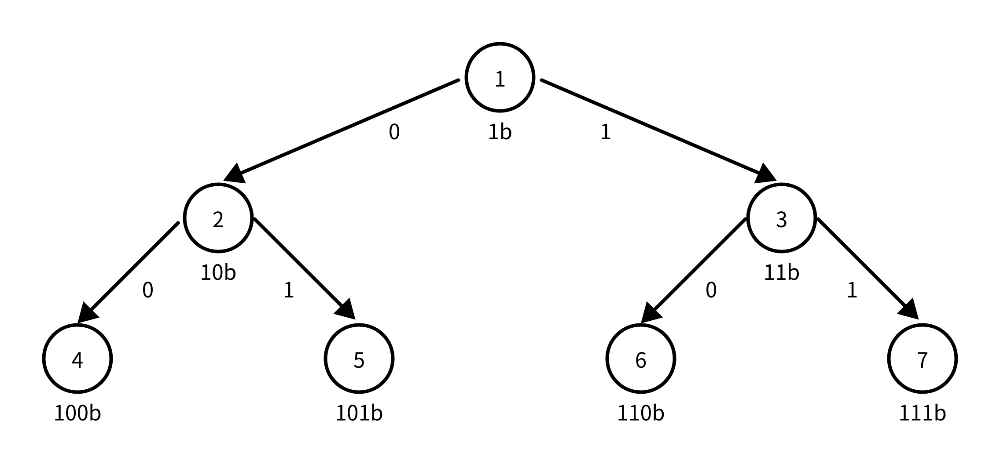

### [在受污染的二叉树中查找元素](https://leetcode.cn/problems/find-elements-in-a-contaminated-binary-tree/solutions/2674238/zai-shou-wu-ran-de-er-cha-shu-zhong-cha-5l56x/)

#### 方法一：深度优先搜索 + 哈希表

对二叉树的根节点 $\textit{root}$ 进行深度优先搜索，在搜索过程中，根据规则对遍历的节点的值进行恢复，并且将遍历的节点的值加入哈希表 $\textit{valSet}$ 中。调用 $\text{find}$ 函数时，返回 $\textit{target}$ 值是否存在哈希表 $\textit{valSet}$ 中。

##### 代码

```c++
class FindElements {
private:
    unordered_set<int> valSet;

    void dfs(TreeNode *node, int val) {
        if (node == nullptr) {
            return;
        }
        node->val = val;
        valSet.insert(val);
        dfs(node->left, val * 2 + 1);
        dfs(node->right, val * 2 + 2);
    }

public:
    FindElements(TreeNode* root) {
        dfs(root, 0);
    }

    bool find(int target) {
        return valSet.count(target) > 0;
    }
};
```

```go
type FindElements struct {
    ValSet map[int]bool
}

func Constructor(root *TreeNode) FindElements {
    valSet := map[int]bool{}
    dfs(root, 0, valSet)
    return FindElements {
        ValSet: valSet,
    }
}

func dfs(node *TreeNode, val int, valSet map[int]bool) {
    if node == nil {
        return
    }
    node.Val = val
    valSet[val] = true
    dfs(node.Left, val * 2 + 1, valSet)
    dfs(node.Right, val * 2 + 2, valSet)
}

func (this *FindElements) Find(target int) bool {
    return this.ValSet[target]
}
```

```python
class FindElements:
    def __init__(self, root: Optional[TreeNode]):
        self.valSet = set()
        self.dfs(root, 0)

    def find(self, target: int) -> bool:
        return target in self.valSet

    def dfs(self, node: TreeNode, val: int):
        if node is None:
            return
        node.val = val
        self.valSet.add(val)
        self.dfs(node.left, val * 2 + 1)
        self.dfs(node.right, val * 2 + 2)
```

```java
class FindElements {
    private Set<Integer> valSet;

    public FindElements(TreeNode root) {
        this.valSet = new HashSet<>();
        dfs(root, 0);
    }

    public boolean find(int target) {
        return valSet.contains(target);
    }

    private void dfs(TreeNode node, int val) {
        if (node == null) {
            return;
        }
        node.val = val;
        valSet.add(val);
        dfs(node.left, val * 2 + 1);
        dfs(node.right, val * 2 + 2);
    }
}
```

```csharp
public class FindElements {
    private ISet<int> valSet;

    public FindElements(TreeNode root) {
        this.valSet = new HashSet<int>();
        DFS(root, 0);
    }

    public bool Find(int target) {
        return valSet.Contains(target);
    }

    private void DFS(TreeNode node, int val) {
        if (node == null) {
            return;
        }
        node.val = val;
        valSet.Add(val);
        DFS(node.left, val * 2 + 1);
        DFS(node.right, val * 2 + 2);
    }
}
```

```c
typedef struct {
    int key;
    UT_hash_handle hh;
} HashItem; 

HashItem *hashFindItem(HashItem **obj, int key) {
    HashItem *pEntry = NULL;
    HASH_FIND_INT(*obj, &key, pEntry);
    return pEntry;
}

bool hashAddItem(HashItem **obj, int key) {
    if (hashFindItem(obj, key)) {
        return false;
    }
    HashItem *pEntry = (HashItem *)malloc(sizeof(HashItem));
    pEntry->key = key;
    HASH_ADD_INT(*obj, key, pEntry);
    return true;
}

void hashFree(HashItem **obj) {
    HashItem *curr = NULL, *tmp = NULL;
    HASH_ITER(hh, *obj, curr, tmp) {
        HASH_DEL(*obj, curr);  
        free(curr);
    }
}

void dfs(struct TreeNode *node, int val, HashItem **valSet) {
    if (node == NULL) {
        return;
    }
    node->val = val;
    hashAddItem(valSet, val);
    dfs(node->left, val * 2 + 1, valSet);
    dfs(node->right, val * 2 + 2, valSet);
}

typedef struct {
    HashItem *valSet;
} FindElements;

FindElements* findElementsCreate(struct TreeNode* root) {
    FindElements *obj = (FindElements *)malloc(sizeof(FindElements));
    obj->valSet = NULL;
    dfs(root, 0, &obj->valSet);
    return obj;
}

bool findElementsFind(FindElements* obj, int target) {
    return hashFindItem(&obj->valSet, target) != NULL;
}

void findElementsFree(FindElements* obj) {
    hashFree(&obj->valSet);
    free(obj);
}
```

```javascript
var FindElements = function(root) {
    this.valSet = new Set();
    const dfs = (node, val) => {
        if (node == null) {
            return;
        }
        node.val = val;
        this.valSet.add(val);
        dfs(node.left, val * 2 + 1)
        dfs(node.right, val * 2 + 2)
    }
    dfs(root, 0);
};

FindElements.prototype.find = function(target) {
    return this.valSet.has(target);
};
```

```typescript
class FindElements {
    valSet: Set<number>;
    constructor(root: TreeNode | null) {
        this.valSet = new Set();
        const dfs = (node: TreeNode | null, val: number) => {
            if (node === null) {
                return;
            }
            node.val = val;
            this.valSet.add(val);
            dfs(node.left, val * 2 + 1);
            dfs(node.right, val * 2 + 2);
        };
        dfs(root, 0);
    }

    find(target: number): boolean {
        return this.valSet.has(target);
    }
}
```

##### 复杂度分析

- 时间复杂度：
    - 构造函数的时间复杂度为 $O(n)$，其中 $n$ 是树的节点个数。
    - $\text{find}$ 函数的时间复杂度为 $O(1)$。
- 空间复杂度：$O(n)$。主要为哈希表占用的空间。

#### 方法二：深度优先搜索 + 位运算

为了使二叉树的节点值具有规律性，我们将二叉树的节点值都增加 $1$，分别记：

- 增加前节点 $\textit{node}$ 的值为 $v$，左节点值为 $\textit{lv}$，右节点值为 $\textit{rv}$。
- 增加 $1$ 后节点 $\textit{node}$ 的值为 $v_1 = v + 1$，左节点值为 $\textit{lv}_1 = \textit{lv} + 1$，右节点值为 $\textit{rv}_1 = \textit{rv} + 1$。

那么有：

$\textit{lv}_1 = \textit{lv} + 1 = v \times 2 + 1 + 1 = v_1 \times 2$
$\textit{rv}_1 = \textit{rv} + 1 = v \times 2 + 2 + 1 = v_1 \times 2 + 1$

使用文字描述增加 $1$ 后节点之间的关系，即 $\textit{lv}_1$ 等于 $v_1$ 左移一位后的结果，$\textit{rv}_1$ 等于 $v_1$ 左移一位再加 $1$ 的结果，节点之间的规律可以参考下图：



对于某个节点的值 $v_1$，假设其二进制表示有 $m$ 位，即 $b_{m-1}b_{m-2}b_{m-1} \ldots b_{0}$，其中 $b_{m-1} = 1$，根据以上规律，可以通过以下方法找到该节点：

1. 起始节点为根节点，即 $\textit{node} = \textit{root}$，初始时 $k = m - 2$，表示取 $v_1$ 的第 $k$ 位 $b_{k}$。
2. 如果 $v_1$ 的第 $k$ 位 $b_{k}$ 为 $0$，那么令 $\textit{node}$ 为它的左节点，否则令 $\textit{node}$ 为它的右节点。然后令 $k = k - 1$。
3. 如果 $k \lt 0$ 或 $\textit{node}$ 为空节点，直接跳出查找过程，否则继续执行步骤 $2$。

最后，如果 $\textit{node}$ 为空节点，说明二叉树不存在节点值为 $v_1$ 的节点，否则 $\textit{node}$ 即为节点值为 $v_1$ 的节点。

因此，我们需要将 $\textit{target}$ 也加上 $1$，然后使用以上方法查找节点即可。

##### 代码

```c++
class FindElements {
private:
    TreeNode *root;

public:
    FindElements(TreeNode* root) {
        this->root = root;
        dfs(root, 0);
    }

    void dfs(TreeNode *node, int val) {
        if (node == nullptr) {
            return;
        }
        node->val = val;
        dfs(node->left, val * 2 + 1);
        dfs(node->right, val * 2 + 2);
    }

    bool find(int target) {
        target++;
        int k = 30 - __builtin_clz(target);
        TreeNode *node = root;
        while (k >= 0 && node != nullptr) {
            if ((target & (1 << k)) == 0) {
                node = node->left;
            } else {
                node = node->right;
            }
            k--;
        }
        return node != nullptr;
    }
};
```

```go
type FindElements struct {
    Root *TreeNode
}

func Constructor(root *TreeNode) FindElements {
    dfs(root, 0)
    return FindElements {
        Root: root,
    }
}

func dfs(node *TreeNode, val int) {
    if node == nil {
        return
    }
    node.Val = val
    dfs(node.Left, val * 2 + 1)
    dfs(node.Right, val * 2 + 2)
}

func (this *FindElements) Find(target int) bool {
    target++
    k := 30 - bits.LeadingZeros32(uint32(target))
    node := this.Root
    for k >= 0 && node != nil {
        if (target & (1 << k)) == 0 {
            node = node.Left
        } else {
            node = node.Right
        }
        k--
    }
    return node != nil
}
```

```python
class FindElements:
    def __init__(self, root: Optional[TreeNode]):
        self.dfs(root, 0)
        self.root = root

    def dfs(self, node: TreeNode, val: int):
        if node is None:
            return
        node.val = val
        self.dfs(node.left, val * 2 + 1)
        self.dfs(node.right, val * 2 + 2)

    def find(self, target: int) -> bool:
        target += 1
        k = target.bit_length() - 2
        node = self.root
        while k >= 0 and node is not None:
            if (target & (1 << k)) == 0:
                node = node.left
            else:
                node = node.right
            k -= 1
        return node is not None
```

```java
class FindElements {
    private TreeNode root;

    public FindElements(TreeNode root) {
        dfs(root, 0);
        this.root = root;
    }
    
    public boolean find(int target) {
        target++;
        int k = 30 - Integer.numberOfLeadingZeros(target);
        TreeNode node = root;
        while (k >= 0 && node != null) {
            if ((target & (1 << k)) == 0) {
                node = node.left;
            } else {
                node = node.right;
            }
            k--;
        }
        return node != null;
    }

    private void dfs(TreeNode node, int val) {
        if (node == null) {
            return;
        }
        node.val = val;
        dfs(node.left, val * 2 + 1);
        dfs(node.right, val * 2 + 2);
    }
}
```

```c
typedef struct {
    struct TreeNode *root;
} FindElements;

FindElements* findElementsCreate(struct TreeNode* root) {
    FindElements *obj = (FindElements *)malloc(sizeof(FindElements));
    obj->root = root;
    return obj;
}

void dfs(struct TreeNode *node, int val) {
    if (node == NULL) {
        return;
    }
    node->val = val;
    dfs(node->left, val * 2 + 1);
    dfs(node->right, val * 2 + 2);
}

bool findElementsFind(FindElements* obj, int target) {
    target++;
    int k = 30 - __builtin_clz(target);
    struct TreeNode *node = obj->root;
    while (k >= 0 && node != NULL) {
        if ((target & (1 << k)) == 0) {
            node = node->left;
        } else {
            node = node->right;
        }
        k--;
    }
    return node != NULL;
}

void findElementsFree(FindElements* obj) {
    free(obj);
}
```

```javascript
var FindElements = function(root) {
    const dfs = (node, val) => {
        if (node == null) {
            return;
        }
        node.val = val;
        dfs(node.left, val * 2 + 1)
        dfs(node.right, val * 2 + 2)
    }
    dfs(root, 0);
    this.root = root
};

FindElements.prototype.find = function(target) {
    target++;
    let k = 30 - numberOfLeadingZeros(target);
    let node = this.root;
    while (k >= 0 && node != null) {
        if ((target & (1 << k)) == 0) {
            node = node.left;
        } else {
            node = node.right;
        }
        k--;
    }
    return node != null;
};

function numberOfLeadingZeros(value) {
    let count = 0;
    while (value > 0) {
        value = value >>> 1; 
        count++;
    }
    return 32 - count;
}
```

```typescript
class FindElements {
    root: TreeNode | null;
    
    constructor(root: TreeNode | null) {
        const dfs = (node: TreeNode | null, val: number) => {
            if (node === null) {
                return;
            }
            node.val = val;
            dfs(node.left, val * 2 + 1);
            dfs(node.right, val * 2 + 2);
        };
        dfs(root, 0);
        this.root = root
    }

    find(target: number): boolean {
        target++;
        let k = 30 - numberOfLeadingZeros(target);
        let node = this.root;
        while (k >= 0 && node !== null) {
            if ((target & (1 << k)) === 0) {
                node = node.left;
            } else {
                node = node.right;
            }
            k--;
        }
        return node !== null;
    }
}

const numberOfLeadingZeros = (value)=> {
    let count = 0;
    while (value > 0) {
        value = value >>> 1; 
        count++;
    }
    return 32 - count;
}
```

##### 复杂度分析

- 时间复杂度：
    - 构造函数的时间复杂度为 $O(n)$，其中 $n$ 为二叉树的节点数目。
    - $\text{find}$ 函数的时间复杂度为 $O(\min(H, \log \textit{target}))$，其中 $H$ 是二叉树的高度。
- 空间复杂度：
    - 构造函数的空间复杂度为 $O(H)$。主要为搜索过程的栈空间。
    - $\text{find}$ 函数的空间复杂度为 $O(1)$。
