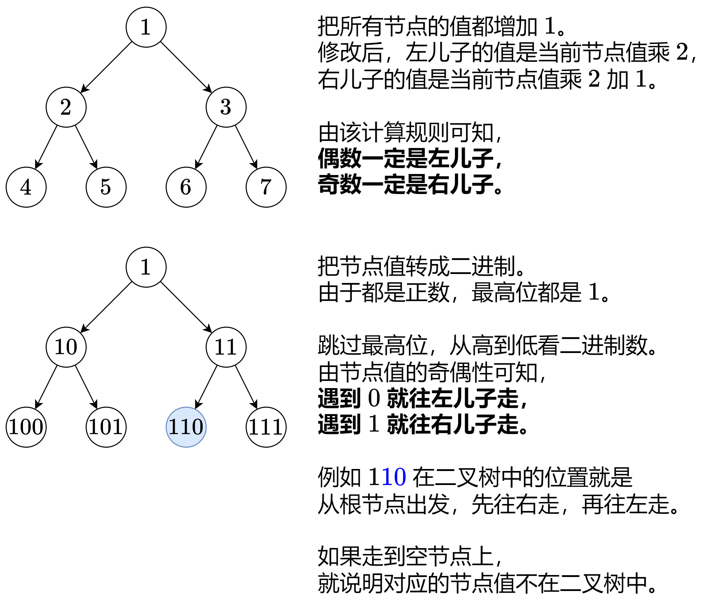

### [两种方法：哈希表/位运算（Python/Java/C++/Go/JS/Rust）](https://leetcode.cn/problems/find-elements-in-a-contaminated-binary-tree/solutions/2681672/liang-chong-fang-fa-ha-xi-biao-wei-yun-s-6m7w/)

#### 方法一：哈希表

从 $\textit{root}$ 出发 DFS 这棵树，除了传入当前节点 $\textit{node}$，还传入需要还原的值 $\textit{val}$。

递归左儿子：传入 $\textit{val}\cdot 2 + 1$。

递归右儿子：传入 $\textit{val}\cdot 2 + 2$。

递归的同时，把还原后的节点值加到一个哈希表中。这样对于 $\texttt{find}$，只需要看 $\textit{target}$ 是否在哈希表中即可。

晕递归的同学推荐先看 [深入理解递归【基础算法精讲 09】](https://leetcode.cn/link/?target=https%3A%2F%2Fwww.bilibili.com%2Fvideo%2FBV1UD4y1Y769%2F)

##### 代码

```python
class FindElements:
    def __init__(self, root: Optional[TreeNode]):
        s = set()
        def dfs(node: Optional[TreeNode], val: int) -> None:
            if node is None:
                return
            s.add(val)
            dfs(node.left, val * 2 + 1)
            dfs(node.right, val * 2 + 2)
        dfs(root, 0)
        self.s = s

    def find(self, target: int) -> bool:
        return target in self.s
```

```java
class FindElements {
    private final Set<Integer> s = new HashSet<>();

    public FindElements(TreeNode root) {
        dfs(root, 0);
    }

    public boolean find(int target) {
        return s.contains(target);
    }

    private void dfs(TreeNode node, int val) {
        if (node == null) {
            return;
        }
        s.add(val);
        dfs(node.left, val * 2 + 1);
        dfs(node.right, val * 2 + 2);
    }
}
```

```c++
class FindElements {
    unordered_set<int> s;

    void dfs(TreeNode *node, int val) {
        if (node == nullptr) {
            return;
        }
        s.insert(val);
        dfs(node->left, val * 2 + 1);
        dfs(node->right, val * 2 + 2);
    }

public:
    FindElements(TreeNode *root) {
        dfs(root, 0);
    }

    bool find(int target) {
        return s.contains(target);
    }
};
```

```go
type FindElements map[int]bool

func Constructor(root *TreeNode) FindElements {
    f := FindElements{}
    var dfs func(*TreeNode, int)
    dfs = func(node *TreeNode, val int) {
        if node == nil {
            return
        }
        f[val] = true
        dfs(node.Left, val*2+1)
        dfs(node.Right, val*2+2)
    }
    dfs(root, 0)
    return f
}

func (f FindElements) Find(target int) bool {
    return f[target]
}
```

```javascript
class FindElements {
    constructor(root) {
        const s = new Set();
        function dfs(node, val) {
            if (node === null) {
                return;
            }
            s.add(val);
            dfs(node.left, val * 2 + 1);
            dfs(node.right, val * 2 + 2);
        }
        dfs(root, 0);

        this.find = function(target) {
            return s.has(target);
        }
    }
}
```

```rust
use std::rc::Rc;
use std::cell::RefCell;
use std::collections::HashSet;

struct FindElements {
    s: HashSet<i32>,
}

impl FindElements {
    fn new(root: Option<Rc<RefCell<TreeNode>>>) -> Self {
        fn dfs(node: Option<&Rc<RefCell<TreeNode>>>, val: i32, s: &mut HashSet<i32>) {
            if let Some(x) = node {
                s.insert(val);
                let x = x.borrow();
                dfs(x.left.as_ref(), val * 2 + 1, s);
                dfs(x.right.as_ref(), val * 2 + 2, s);
            }
        }
        let mut s = HashSet::new();
        dfs(root.as_ref(), 0, &mut s);
        Self { s }
    }

    fn find(&self, target: i32) -> bool {
        self.s.contains(&target)
    }
}
```

##### 复杂度分析

- 时间复杂度：初始化为 $\mathcal{O}(n)$，其中 $n$ 为二叉树的节点个数。$\texttt{find}$ 为 $\mathcal{O}(1)$。
- 空间复杂度：$\mathcal{O}(n)$。

#### 方法二：二进制即路径



下面代码用到了一些位运算的技巧，请看 [从集合论到位运算，常见位运算技巧分类总结！](https://leetcode.cn/circle/discuss/CaOJ45/)

##### 代码

```python
class FindElements:
    def __init__(self, root: Optional[TreeNode]):
        self.root = root

    def find(self, target: int) -> bool:
        target += 1
        cur = self.root  # 从根节点出发
        for i in range(target.bit_length() - 2, -1, -1):  # 从次高位开始枚举
            bit = (target >> i) & 1  # target 第 i 位的比特值
            cur = cur.right if bit else cur.left
            if cur is None:  # 走到空节点，说明 target 不在二叉树中
                return False
        return True  # 没有走到空节点，说明 target 在二叉树中
```

```java
class FindElements {
    private TreeNode root;

    public FindElements(TreeNode root) {
        this.root = root;
    }

    public boolean find(int target) {
        target++;
        TreeNode cur = root; // 从根节点出发
        for (int i = 30 - Integer.numberOfLeadingZeros(target); i >= 0; i--) { // 从次高位开始枚举
            int bit = (target >> i) & 1; // target 第 i 位的比特值
            cur = bit == 0 ? cur.left : cur.right;
            if (cur == null) { // 走到空节点，说明 target 不在二叉树中
                return false;
            }
        }
        return true; // 没有走到空节点，说明 target 在二叉树中
    }
}
```

```c++
class FindElements {
    TreeNode *root;
public:
    FindElements(TreeNode *root) : root(root) {}

    bool find(int target) {
        target++;
        auto cur = root; // 从根节点出发
        for (int i = 30 - __builtin_clz(target); i >= 0; i--) { // 从次高位开始枚举
            int bit = target >> i & 1; // target 第 i 位的比特值
            cur = bit ? cur->right : cur->left;
            if (cur == nullptr) { // 走到空节点，说明 target 不在二叉树中
                return false;
            }
        }
        return true; // 没有走到空节点，说明 target 在二叉树中
    }
};
```

```go
type FindElements struct {
    root *TreeNode
}

func Constructor(root *TreeNode) FindElements {
    return FindElements{root}
}

func (f FindElements) Find(target int) bool {
    target++
    cur := f.root // 从根节点出发
    for i := bits.Len(uint(target)) - 2; i >= 0; i-- { // 从次高位开始枚举
        bit := target >> i & 1 // target 第 i 位的比特值
        if bit == 0 {
            cur = cur.Left
        } else {
            cur = cur.Right
        }
        if cur == nil { // 走到空节点，说明 target 不在二叉树中
            return false
        }
    }
    return true // 没有走到空节点，说明 target 在二叉树中
}
```

```javascript
class FindElements {
    constructor(root) {
        this.root = root;
    }

    find(target) {
        target++;
        let cur = this.root; // 从根节点出发
        for (let i = 30 - Math.clz32(target); i >= 0; i--) { // 从次高位开始枚举
            const bit = (target >> i) & 1; // target 第 i 位的比特值
            cur = bit ? cur.right : cur.left;
            if (cur === null) { // 走到空节点，说明 target 不在二叉树中
                return false;
            }
        }
        return true; // 没有走到空节点，说明 target 在二叉树中
    }
}
```

```rust
use std::rc::Rc;
use std::cell::RefCell;

struct FindElements {
    root: Option<Rc<RefCell<TreeNode>>>,
}

impl FindElements {
    fn new(root: Option<Rc<RefCell<TreeNode>>>) -> Self {
        Self { root }
    }

    fn find(&self, target: i32) -> bool {
        let mut target = target + 1;
        let mut cur = self.root.clone(); // 从根节点出发
        for i in (0..target.ilog2()).rev() { // 从次高位开始枚举
            let bit = (target >> i) & 1; // target 第 i 位的比特值
            cur = if bit == 0 {
                cur.unwrap().borrow().left.clone()
            } else {
                cur.unwrap().borrow().right.clone()
            };
            if cur.is_none() { // 走到空节点，说明 target 不在二叉树中
                return false;
            }
        }
        true // 没有走到空节点，说明 target 在二叉树中
    }
}
```

##### 复杂度分析

- 时间复杂度：初始化为 $\mathcal{O}(1)$。$\texttt{find}$ 为 $\mathcal{O}(\min(h, \log \textit{target}))$，其中 $h$ 为二叉树的高度。
- 空间复杂度：$\mathcal{O}(1)$。
