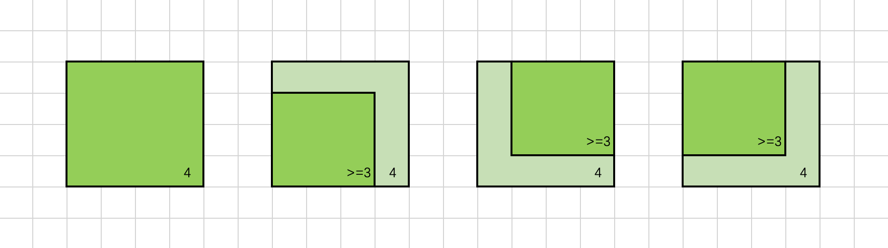
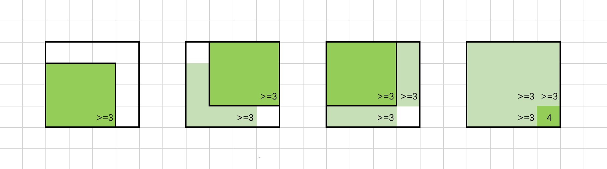

### [统计全为 1 的正方形子矩阵](https://leetcode.cn/problems/count-square-submatrices-with-all-ones/solutions/101706/tong-ji-quan-wei-1-de-zheng-fang-xing-zi-ju-zhen-2/)

#### 方法一：动态规划

**思路**

我们用 $f[i][j]$ 表示以 $(i,j)$ 为右下角的正方形的最大边长，那么除此定义之外，$f[i][j]=x$ 也表示以 $(i,j)$ 为右下角的正方形的数目为 $x$（即边长为 $1,2,\dots ,x$ 的正方形各一个）。在计算出所有的 $f[i][j]$ 后，我们将它们进行累加，就可以得到矩阵中正方形的数目。

我们尝试挖掘 $f[i][j]$ 与相邻位置的关系来计算出 $f[i][j]$ 的值。



如上图所示，若对于位置 $(i,j)$ 有 $f[i][j]=4$，我们将以 $(i,j)$ 为右下角、边长为 $4$ 的正方形涂上色，可以发现其左侧位置 $(i,j-1)$，上方位置 $(i-1,j)$ 和左上位置 $(i-1,j-1)$ 均可以作为一个边长为 $4-1=3$ 的正方形的右下角。也就是说，这些位置的的 $f$ 值至少为 $3$，即：

- $f[i][j-1]\ge f[i][j]-1$
- $f[i-1][j]\ge f[i][j]-1$
- $f[i-1][j-1]\ge f[i][j]-1$

将这三个不等式联立，可以得到：

$min(f[i][j-1],f[i-1][j],f[i-1][j-1])\ge f[i][j]-1$

这是我们通过固定 $f[i][j]$ 的值，判断其相邻位置与之的关系得到的不等式。同理，我们也可以固定 $f[i][j]$ 相邻位置的值，得到另外的限制条件。



如上图所示，假设 $f[i][j-1]$，f[i-1][j] 和 $f[i-1][j-1]$ 中的最小值为 $3$，即，$(i,j-1)$，(i-1,j) 和 $(i-1,j-1)$ 均可以作为一个边长为 $3$ 的正方形的右下角。我们将这些边长为 $3$ 的正方形依次涂上色，可以发现，如果位置 $(i,j)$ 的元素为 $1$，那么它可以作为一个边长为 $4$ 的正方形的右下角，$f$ 值至少为 $4$，即：

$f[i][j]\ge min(f[i][j-1],f[i-1][j],f[i-1][j-1])+1$

将其与上一个不等式联立，可以得到：

$f[i][j]=min(f[i][j-1],f[i-1][j],f[i-1][j-1])+1$

再考虑一些边界情况，我们就得到了完整的递推式：

$$f[i][j]=\begin{cases}matrix[i][j] & if\enspace i=0\enspace or\enspace j=0\\ 0 & if\enspace matrix[i][j]=0\\ min(f[i][j-1],f[i-1][j],f[i-1][j-1])+1 & otherwise\end{cases}$$

我们按照行优先的顺序依次计算 $f[i][j]$ 的值，累加就可以得到最终的答案。

**代码**

```Python
class Solution:
    def countSquares(self, matrix: List[List[int]]) -> int:
        m, n = len(matrix), len(matrix[0])
        f = [[0] * n for _ in range(m)]
        ans = 0
        for i in range(m):
            for j in range(n):
                if i == 0 or j == 0:
                    f[i][j] = matrix[i][j]
                elif matrix[i][j] == 0:
                    f[i][j] = 0
                else:
                    f[i][j] = min(f[i][j - 1], f[i - 1][j], f[i - 1][j - 1]) + 1
                ans += f[i][j]
        return ans
```

```C++
class Solution {
public:
    int countSquares(vector<vector<int>>& matrix) {
        int m = matrix.size(), n = matrix[0].size();
        vector<vector<int>> f(m, vector<int>(n, 0));
        int ans = 0;
        for (int i = 0; i < m; ++i) {
            for (int j = 0; j < n; ++j) {
                if (i == 0 || j == 0) {
                    f[i][j] = matrix[i][j];
                } else if (matrix[i][j] == 0) {
                    f[i][j] = 0;
                } else {
                    f[i][j] = min({f[i][j - 1], f[i - 1][j], f[i - 1][j - 1]}) + 1;
                }
                ans += f[i][j];
            }
        }
        return ans;
    }
};
```

```Java
class Solution {
    public int countSquares(int[][] matrix) {
        int m = matrix.length, n = matrix[0].length;
        int[][] f = new int[m][n];
        int ans = 0;
        for (int i = 0; i < m; ++i) {
            for (int j = 0; j < n; ++j) {
                if (i == 0 || j == 0) {
                    f[i][j] = matrix[i][j];
                } else if (matrix[i][j] == 0) {
                    f[i][j] = 0;
                } else {
                    f[i][j] = Math.min(Math.min(f[i][j - 1], f[i - 1][j]), f[i - 1][j - 1]) + 1;
                }
                ans += f[i][j];
            }
        }
        return ans;
    }
}
```

```CSharp
public class Solution {
    public int CountSquares(int[][] matrix) {
        int m = matrix.Length, n = matrix[0].Length;
        int[,] f = new int[m, n];
        int ans = 0;
        for (int i = 0; i < m; ++i) {
            for (int j = 0; j < n; ++j) {
                if (i == 0 || j == 0) {
                    f[i, j] = matrix[i][j];
                } else if (matrix[i][j] == 0) {
                    f[i, j] = 0;
                } else {
                    f[i, j] = Math.Min(Math.Min(f[i, j - 1], f[i - 1, j]), f[i - 1, j - 1]) + 1;
                }
                ans += f[i, j];
            }
        }
        return ans;
    }
}
```

```Go
func countSquares(matrix [][]int) int {
    m, n := len(matrix), len(matrix[0])
    f := make([][]int, m)
    for i := range f {
        f[i] = make([]int, n)
    }
    ans := 0
    for i := 0; i < m; i++ {
        for j := 0; j < n; j++ {
            if i == 0 || j == 0 {
                f[i][j] = matrix[i][j]
            } else if matrix[i][j] == 0 {
                f[i][j] = 0
            } else {
                f[i][j] = min(min(f[i][j - 1], f[i - 1][j]), f[i - 1][j - 1]) + 1
            }
            ans += f[i][j]
        }
    }
    return ans
}
```

```C
int countSquares(int** matrix, int matrixSize, int* matrixColSize) {
    int m = matrixSize, n = matrixColSize[0];
    int** f = (int**)malloc(m * sizeof(int*));
    for (int i = 0; i < m; ++i) {
        f[i] = (int*)malloc(n * sizeof(int));
    }
    int ans = 0;
    for (int i = 0; i < m; ++i) {
        for (int j = 0; j < n; ++j) {
            if (i == 0 || j == 0) {
                f[i][j] = matrix[i][j];
            } else if (matrix[i][j] == 0) {
                f[i][j] = 0;
            } else {
                f[i][j] = fmin(f[i][j - 1], fmin(f[i - 1][j], f[i - 1][j - 1])) + 1;
            }
            ans += f[i][j];
        }
    }
    for (int i = 0; i < m; ++i) {
        free(f[i]);
    }
    free(f);
    return ans;
}
```

```JavaScript
var countSquares = function(matrix) {
    const m = matrix.length, n = matrix[0].length;
    const f = new Array(m).fill(0).map(() => new Array(n).fill(0));
    let ans = 0;
    for (let i = 0; i < m; ++i) {
        for (let j = 0; j < n; ++j) {
            if (i === 0 || j === 0) {
                f[i][j] = matrix[i][j];
            } else if (matrix[i][j] === 0) {
                f[i][j] = 0;
            } else {
                f[i][j] = Math.min(f[i][j - 1], f[i - 1][j], f[i - 1][j - 1]) + 1;
            }
            ans += f[i][j];
        }
    }
    return ans;
};
```

```TypeScript
function countSquares(matrix: number[][]): number {
    const m = matrix.length, n = matrix[0].length;
    const f: number[][] = new Array(m).fill(0).map(() => new Array(n).fill(0));
    let ans = 0;
    for (let i = 0; i < m; ++i) {
        for (let j = 0; j < n; ++j) {
            if (i === 0 || j === 0) {
                f[i][j] = matrix[i][j];
            } else if (matrix[i][j] === 0) {
                f[i][j] = 0;
            } else {
                f[i][j] = Math.min(f[i][j - 1], f[i - 1][j], f[i - 1][j - 1]) + 1;
            }
            ans += f[i][j];
        }
    }
    return ans;
}
```

```Rust
impl Solution {
    pub fn count_squares(matrix: Vec<Vec<i32>>) -> i32 {
        let m = matrix.len();
        let n = matrix[0].len();
        let mut f = vec![vec![0; n]; m];
        let mut ans = 0;
        for i in 0..m {
            for j in 0..n {
                if i == 0 || j == 0 {
                    f[i][j] = matrix[i][j];
                } else if matrix[i][j] == 0 {
                    f[i][j] = 0;
                } else {
                    f[i][j] = f[i][j - 1].min(f[i - 1][j]).min(f[i - 1][j - 1]) + 1;
                }
                ans += f[i][j];
            }
        }
        ans
    }
}
```

**复杂度分析**

- 时间复杂度：$O(m\times n)$，其中 $m$ 和 $n$ 是输入 $matrix$ 的行和列。
- 空间复杂度：$O(m\times n)$。
