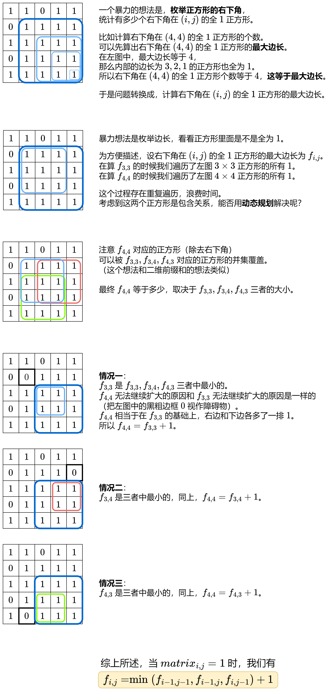
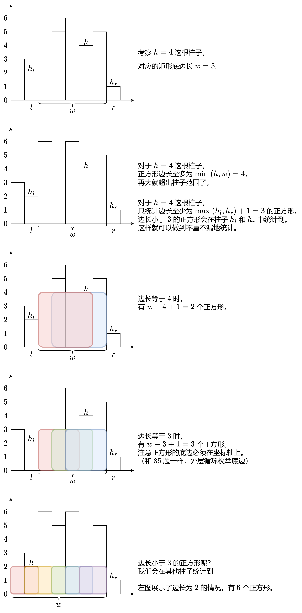

### [三种方法：枚举上下边界 / 动态规划 / 单调栈（$Python/Java/C++/Go$）](https://leetcode.cn/problems/count-square-submatrices-with-all-ones/solutions/3751608/tu-jie-dong-tai-gui-hua-jian-ji-xie-fa-p-1kiy/)

#### 方法一：枚举正方形的上下边界

枚举正方形的上下边界，统计每一列的 $1$ 的个数，把原问题「压缩」为一维数组上的问题。

$$\begin{bmatrix}0&1&0&1\\1&1&1&1\\1&1&1&1\end{bmatrix}$$

在示例 $1$ 中，假设现在枚举到正方形的上边界为 $0$ 行，下边界为 $1$ 行，即 $matrix$ 的前两行。正方形的边长 $h=2$。

统计每一列 $1$ 的个数，得到一个一维数组 $a=[1,2,2,2]$。我们要找的正方形，就是 $a$ 的长度恰好为 $h=2$ 的子数组。由于全 $1$ 正方形的每一列都是 $1$，所以子数组的每一项都得是正方形的边长 $h=2$。问题变成：

- 统计 $a$ 的长度恰好为 $h$ 的全 $h$ 子数组的数目。

思路类似 [2348\. 全 0 子数组的数目](https://leetcode.cn/problems/number-of-zero-filled-subarrays/)。

代码实现时，外层循环枚举上边界，内层循环枚举下边界。当下边界 $bottom$ 加一时，只需把每个 $a[j]$ 都增加相应的 $matrix[bottom][j]$，无需整个重新统计。

```Python
class Solution:
    def countSquares(self, matrix: List[List[int]]) -> int:
        m, n = len(matrix), len(matrix[0])
        ans = 0
        for top in range(m):  # 枚举上边界
            a = [0] * n
            for bottom in range(top, m):  # 枚举下边界
                h = bottom - top + 1  # 高
                # 2348. 全 h 子数组的数目
                last = -1
                for j in range(n):
                    a[j] += matrix[bottom][j]  # 把 bottom 这一行的值加到 a 中
                    if a[j] != h:
                        last = j  # 记录上一个非 h 元素的位置
                    elif j - last >= h:  # 右端点为 j 的长为 h 的子数组全是 h
                        ans += 1
        return ans
```

```Java
class Solution {
    public int countSquares(int[][] matrix) {
        int m = matrix.length;
        int n = matrix[0].length;
        int ans = 0;
        for (int top = 0; top < m; top++) { // 枚举上边界
            int[] a = new int[n];
            for (int bottom = top; bottom < m; bottom++) { // 枚举下边界
                int h = bottom - top + 1; // 高
                // 2348. 全 h 子数组的数目
                int last = -1;
                for (int j = 0; j < n; j++) {
                    a[j] += matrix[bottom][j]; // 把 bottom 这一行的值加到 a 中
                    if (a[j] != h) {
                        last = j; // 记录上一个非 h 元素的位置
                    } else if (j - last >= h) { // 右端点为 j 的长为 h 的子数组全是 h
                        ans++;
                    }
                }
            }
        }
        return ans;
    }
}
```

```C++
class Solution {
public:
    int countSquares(vector<vector<int>>& matrix) {
        int m = matrix.size(), n = matrix[0].size();
        int ans = 0;
        for (int top = 0; top < m; top++) { // 枚举上边界
            vector<int> a(n);
            for (int bottom = top; bottom < m; bottom++) { // 枚举下边界
                int h = bottom - top + 1; // 高
                // 2348. 全 h 子数组的数目
                int last = -1;
                for (int j = 0; j < n; j++) {
                    a[j] += matrix[bottom][j]; // 把 bottom 这一行的值加到 a 中
                    if (a[j] != h) {
                        last = j; // 记录上一个非 h 元素的位置
                    } else if (j - last >= h) { // 右端点为 j 的长为 h 的子数组全是 h
                        ans++;
                    }
                }
            }
        }
        return ans;
    }
};
```

```Go
func countSquares(matrix [][]int) (ans int) {
    m, n := len(matrix), len(matrix[0])
    for top := range m { // 枚举上边界
        a := make([]int, n)
        for bottom := top; bottom < m; bottom++ { // 枚举下边界
            h := bottom - top + 1 // 高
            // 2348. 全 h 子数组的数目
            last := -1
            for j := range n {
                a[j] += matrix[bottom][j] // 把 bottom 这一行的值加到 a 中
                if a[j] != h {
                    last = j // 记录上一个非 h 元素的位置
                } else if j-last >= h { // 右端点为 j 的长为 h 的子数组全是 h
                    ans++
                }
            }
        }
    }
    return
}
```

#### 复杂度分析

- 时间复杂度：$O(m^2n)$，其中 $m$ 和 $n$ 分别为 $matrix$ 的行数和列数。
- 空间复杂度：$O(n)$。

#### 方法二：动态规划

思路启发：学习 [二维前缀和](https://leetcode.cn/problems/range-sum-query-2d-immutable/solution/tu-jie-yi-zhang-tu-miao-dong-er-wei-qian-84qp/) 对于想出本题的转移方程有帮助。



整理上图中的结论。定义 $f_{i,j}$ 为右下角在 $(i,j)$ 的全 $1$ 正方形的最大边长。我们有

$$f_{i,j}=\begin{cases}0, & matrix_{i,j}=0\\ min(f_{i-1,j-1},f_{i-1,j},f_{i,j-1})+1, & matrix_{i,j}=1\end{cases}$$

然而，当 $i=0$ 或者 $j=0$ 时，上式会产生负数下标 $-1$。

为避免出现负数下标，可以在 $f$ 矩阵的最上边添加一行 $0$，最左边添加一列 $0$，对应下标出界的状态（正方形的最大边长为 $0$）。

由于修改了 $f$，状态转移方程中的 $f$ 的下标要加一，即

$$f_{i+1,j+1}=\begin{cases}0, & matrix_{i,j}=0\\min(f_{i,j},f_{i,j+1},f_{i+1,j})+1, & matrix_{i,j}=1\end{cases}$$

> 注意 $matrix$ 的下标是不用变的，因为我们只是在 $f$ 矩阵的上边和左边插入了 $0$，所以只有 $f$ 的下标受此影响需要加一。

初始值 $f_{0,j}=f_{i,0}=0$。

根据图中的结论（**正方形个数等价于正方形最大边长**），答案为整个 $f$ 矩阵的元素和。

##### 优化前

```Python
class Solution:
    def countSquares(self, matrix: List[List[int]]) -> int:
        m, n = len(matrix), len(matrix[0])
        f = [[0] * (n + 1) for _ in range(m + 1)]
        for i, row in enumerate(matrix):
            for j, x in enumerate(row):
                if x:
                    f[i + 1][j + 1] = min(f[i][j], f[i][j + 1], f[i + 1][j]) + 1
        return sum(map(sum, f))
```

```Java
class Solution {
    public int countSquares(int[][] matrix) {
        int m = matrix.length;
        int n = matrix[0].length;
        int[][] f = new int[m + 1][n + 1];
        int ans = 0;
        for (int i = 0; i < m; i++) {
            for (int j = 0; j < n; j++) {
                if (matrix[i][j] > 0) {
                    f[i + 1][j + 1] = Math.min(Math.min(f[i][j], f[i][j + 1]), f[i + 1][j]) + 1;
                    ans += f[i + 1][j + 1];
                }
            }
        }
        return ans;
    }
}
```

```C++
class Solution {
public:
    int countSquares(vector<vector<int>>& matrix) {
        int m = matrix.size(), n = matrix[0].size();
        vector f(m + 1, vector<int>(n + 1));
        int ans = 0;
        for (int i = 0; i < m; i++) {
            for (int j = 0; j < n; j++) {
                if (matrix[i][j]) {
                    f[i + 1][j + 1] = min({f[i][j], f[i][j + 1], f[i + 1][j]}) + 1;
                    ans += f[i + 1][j + 1];
                }
            }
        }
        return ans;
    }
};
```

```Go
func countSquares(matrix [][]int) (ans int) {
    m, n := len(matrix), len(matrix[0])
    f := make([][]int, m+1)
    for i := range f {
        f[i] = make([]int, n+1)
    }
    for i, row := range matrix {
        for j, x := range row {
            if x > 0 {
                f[i+1][j+1] = min(f[i][j], f[i][j+1], f[i+1][j]) + 1
                ans += f[i+1][j+1]
            }
        }
    }
    return
}
```

##### 优化

直接把 $matrix$ 当作 $f$，原地修改。

```Python
class Solution:
    def countSquares(self, matrix: List[List[int]]) -> int:
        for i, row in enumerate(matrix):
            for j, x in enumerate(row):
                if x and i and j:
                    row[j] += min(matrix[i - 1][j], matrix[i - 1][j - 1], row[j - 1])
        return sum(map(sum, matrix))
```

```Java
class Solution {
    public int countSquares(int[][] matrix) {
        int ans = 0;
        for (int i = 0; i < matrix.length; i++) {
            int[] row = matrix[i];
            for (int j = 0; j < row.length; j++) {
                if (row[j] > 0 && i > 0 && j > 0) {
                    row[j] += Math.min(Math.min(matrix[i - 1][j], matrix[i - 1][j - 1]), row[j - 1]);
                }
                ans += row[j];
            }
        }
        return ans;
    }
}
```

```C++
class Solution {
public:
    int countSquares(vector<vector<int>>& matrix) {
        int ans = 0;
        for (int i = 0; i < matrix.size(); i++) {
            auto& row = matrix[i];
            for (int j = 0; j < row.size(); j++) {
                if (i && j && row[j]) {
                    row[j] += min({matrix[i - 1][j], matrix[i - 1][j - 1], row[j - 1]});
                }
                ans += row[j];
            }
        }
        return ans;
    }
};
```

```Go
func countSquares(matrix [][]int) (ans int) {
    for i, row := range matrix {
        for j, x := range row {
            if x > 0 && i > 0 && j > 0 {
                row[j] += min(matrix[i-1][j], matrix[i-1][j-1], row[j-1])
            }
            ans += row[j]
        }
    }
    return
}
```

#### 复杂度分析

- 时间复杂度：$O(mn)$，其中 $m$ 和 $n$ 分别为 $matrix$ 的行数和列数。
- 空间复杂度：优化前 $O(mn)$，优化后 $O(1)$。

#### 方法三：单调栈

**请先完成前置题目** [85\. 最大矩形](https://leetcode.cn/problems/maximal-rectangle/)，接着 [我的题解](https://leetcode.cn/problems/maximal-rectangle/solutions/3704011/zhi-jie-diao-yong-84-ti-dai-ma-jie-jue-p-49at/) 继续讲。



**注**：在宽度为 $w$ 的空间内，有 $w-k+1$ 个不同位置可以放边长为 $k$ 的正方形。

对于某个高为 $h$ 的柱子，设其对应的矩形底边长为 $w=heights[r]-heights[l]+1$。其中 $heights[l]$ 是 $h$ 左侧的高度小于 $h$ 的最近柱子（没有则为 $0$），$heights[r]$ 是 $h$ 右侧的高度小于 $h$ 的最近柱子（没有则为 $0$）。

正方形边长下界为 $lower=max(heights[l],heights[r])+1$。

正方形边长上界为 $upper=min(h,w)$。

枚举正方形边长为 $k=lower,lower+1,\dots ,upper$，累加正方形个数 $w-k+1$，那么高为 $h$ 的柱子对答案的**贡献**为

$$\sum\limits_{k=lower}^{upper}w-k+1=\dfrac{(2w+2-lower-upper)(upper-lower+1)}{2}$$

```Python
class Solution:
    def solve(self, heights: List[int]) -> int:
        st = [-1]  # 哨兵：在栈中只有一个数的时候，栈顶的「下面那个数」是 -1，对应 left[i] = -1 的情况
        ans = 0
        for r, hr in enumerate(heights):
            while len(st) > 1 and heights[st[-1]] >= hr:
                h = heights[st.pop()]  # 矩形的高
                l = st[-1]  # 栈顶下面那个数就是 l
                w = r - l - 1
                upper = min(h, w)
                lower = (hr if l < 0 else max(heights[l], hr)) + 1
                if lower <= upper:
                    ans += (w * 2 + 2 - lower - upper) * (upper - lower + 1) // 2
            st.append(r)
        return ans

    def countSquares(self, matrix: List[List[int]]) -> int:
        heights = [0] * (len(matrix[0]) + 1)  # 末尾多一个 0，理由见我 84 题题解
        ans = 0
        for row in matrix:
            # 计算底边为 row 的柱子高度
            for j, x in enumerate(row):
                if x == 0:
                    heights[j] = 0  # 柱子高度为 0
                else:
                    heights[j] += 1  # 柱子高度加一
            ans += self.solve(heights)
        return ans
```

```Java
class Solution {
    public int countSquares(int[][] matrix) {
        int n = matrix[0].length;
        int[] heights = new int[n + 1]; // 末尾多一个 0，理由见我 84 题题解
        int ans = 0;
        for (int[] row : matrix) {
            // 计算底边为 row 的柱子高度
            for (int j = 0; j < n; j++) {
                int x = row[j];
                if (x == 0) {
                    heights[j] = 0; // 柱子高度为 0
                } else {
                    heights[j]++; // 柱子高度加一
                }
            }
            ans += solve(heights);
        }
        return ans;
    }

    private int solve(int[] heights) {
        Deque<Integer> st = new ArrayDeque<>();
        st.push(-1); // 哨兵：在栈中只有一个数的时候，栈顶的「下面那个数」是 -1，对应 left[i] = -1 的情况
        int ans = 0;
        for (int r = 0; r < heights.length; r++) {
            int hr = heights[r];
            while (st.size() > 1 && heights[st.peek()] >= hr) {
                int h = heights[st.pop()]; // 矩形的高
                int l = st.peek(); // 栈顶下面那个数就是 l
                int w = r - l - 1;
                int upper = Math.min(h, w);
                int lower = (l < 0 ? hr : Math.max(heights[l], hr)) + 1;
                if (lower <= upper) {
                    ans += (w * 2 + 2 - lower - upper) * (upper - lower + 1) / 2;
                }
            }
            st.push(r);
        }
        return ans;
    }
}
```

```C++
class Solution {
    int solve(vector<int>& heights) {
        stack<int> st;
        st.push(-1); // 哨兵：在栈中只有一个数的时候，栈顶的「下面那个数」是 -1，对应 left[i] = -1 的情况
        int ans = 0;
        for (int r = 0; r < heights.size(); r++) {
            int hr = heights[r];
            while (st.size() > 1 && heights[st.top()] >= hr) {
                int h = heights[st.top()]; // 矩形的高
                st.pop();
                int l = st.top(); // 栈顶下面那个数就是 l
                int w = r - l - 1;
                int upper = min(h, w);
                int lower = (l < 0 ? hr : max(heights[l], hr)) + 1;
                if (lower <= upper) {
                    ans += (w * 2 + 2 - lower - upper) * (upper - lower + 1) / 2;
                }
            }
            st.push(r);
        }
        return ans;
    }

public:
    int countSquares(vector<vector<int>>& matrix) {
        int n = matrix[0].size();
        vector<int> heights(n + 1); // 末尾多一个 0，理由见我 84 题题解
        int ans = 0;
        for (auto& row : matrix) {
            // 计算底边为 row 的柱子高度
            for (int j = 0; j < n; j++) {
                int x = row[j];
                if (x == 0) {
                    heights[j] = 0; // 柱子高度为 0
                } else {
                    heights[j]++; // 柱子高度加一
                }
            }
            ans += solve(heights);
        }
        return ans;
    }
};
```

```Go
func solve(heights []int) (ans int) {
    st := []int{-1} // 哨兵：在栈中只有一个数的时候，栈顶的「下面那个数」是 -1，对应 left[i] = -1 的情况
    for r, hr := range heights {
        for len(st) > 1 && heights[st[len(st)-1]] >= hr {
            h := heights[st[len(st)-1]] // 矩形的高
            st = st[:len(st)-1]
            l := st[len(st)-1] // 栈顶下面那个数就是 l
            w := r - l - 1
            upper := min(h, w)
            lower := hr + 1
            if l >= 0 {
                lower = max(heights[l], hr) + 1
            }
            if lower <= upper {
                ans += (w*2 + 2 - lower - upper) * (upper - lower + 1) / 2
            }
        }
        st = append(st, r)
    }
    return
}

func countSquares(matrix [][]int) (ans int) {
    heights := make([]int, len(matrix[0])+1) // 末尾多一个 0，理由见我 84 题题解
    for _, row := range matrix {
        // 计算底边为 row 的柱子高度
        for j, x := range row {
            if x == 0 {
                heights[j] = 0 // 柱子高度为 0
            } else {
                heights[j]++ // 柱子高度加一
            }
        }
        ans += solve(heights)
    }
    return
}
```

#### 复杂度分析

- 时间复杂度：$O(mn)$，其中 $m$ 和 $n$ 分别为 $matrix$ 的行数和列数。
- 空间复杂度：$O(n)$。

#### 专题训练

1. 动态规划题单的「**§7.5 子矩形 DP**」。
2. 单调栈题单的「**二、矩形**」。

#### 分类题单

[如何科学刷题？](https://leetcode.cn/circle/discuss/RvFUtj/)

1. [滑动窗口与双指针（定长/不定长/单序列/双序列/三指针/分组循环）](https://leetcode.cn/circle/discuss/0viNMK/)
2. [二分算法（二分答案/最小化最大值/最大化最小值/第K小）](https://leetcode.cn/circle/discuss/SqopEo/)
3. [单调栈（基础/矩形面积/贡献法/最小字典序）](https://leetcode.cn/circle/discuss/9oZFK9/)
4. [网格图（DFS/BFS/综合应用）](https://leetcode.cn/circle/discuss/YiXPXW/)
5. [位运算（基础/性质/拆位/试填/恒等式/思维）](https://leetcode.cn/circle/discuss/dHn9Vk/)
6. [图论算法（DFS/BFS/拓扑排序/基环树/最短路/最小生成树/网络流）](https://leetcode.cn/circle/discuss/01LUak/)
7. [动态规划（入门/背包/划分/状态机/区间/状压/数位/数据结构优化/树形/博弈/概率期望）](https://leetcode.cn/circle/discuss/tXLS3i/)
8. [常用数据结构（前缀和/差分/栈/队列/堆/字典树/并查集/树状数组/线段树）](https://leetcode.cn/circle/discuss/mOr1u6/)
9. [数学算法（数论/组合/概率期望/博弈/计算几何/随机算法）](https://leetcode.cn/circle/discuss/IYT3ss/)
10. [贪心与思维（基本贪心策略/反悔/区间/字典序/数学/思维/脑筋急转弯/构造）](https://leetcode.cn/circle/discuss/g6KTKL/)
11. [链表、二叉树与回溯（前后指针/快慢指针/DFS/BFS/直径/LCA/一般树）](https://leetcode.cn/circle/discuss/K0n2gO/)
12. [字符串（KMP/Z函数/Manacher/字符串哈希/AC自动机/后缀数组/子序列自动机）](https://leetcode.cn/circle/discuss/SJFwQI/)
