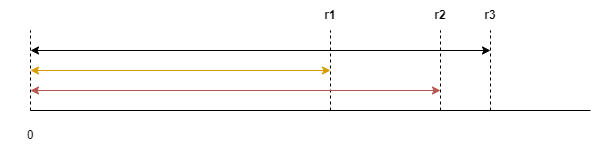
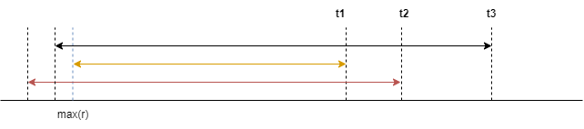

#### 方法二：贪心算法

**思路与算法**

方法一中的状态转移方程看上去非常简单，给我们一种直观的感受：它可以继续优化下去。我们不妨倒过来考虑这个问题，对于花园区间 $[0, n]$，首先我们必须选取左端点以 $0$ 开始的某个区间 $[0,j]$。假设当前有 $k$ 个待选区间 $[0,r_1],[0,r_2],\cdots[0,r_k]$，我们直观的感受是应该是尽可能的选择右端点最大的区间 $[0,\max(r)]$，这样即保障用最少的区间数量覆盖的区域足够大。如果所示我们应当选择区间 $[0,r_3]$，即可保证覆盖的区间最大。



当我们选择下一个区间时，此时该区间的左端点 $start$ 一定要满足 $start \le \max(r)$，而右端点 $end$ 要尽可能的大。如图所示我们当前应选择右端点为 $t_3$ 的区间，这样即可保证覆盖区间 $[0,t_3]$ 用的子区间数目最少，我们可以通过反证法来证明，在此不再详细描述。



按照上述的贪心选择法，我们依次选择最优的区间即可保证最终找到覆盖区间 $[0,n]$ 的最少区间数目。

上述的贪心算法与「[1024\. 视频拼接](https://leetcode.cn/problems/video-stitching/solutions/458461/shi-pin-pin-jie-by-leetcode-solution/)」中的方法二原理一样，我们参考该题的题解算法，具体算法描述如下：

-   预处理所有的子区间，对于每一个位置 $i$，我们记录以其为左端点的子区间中最远的右端点，记为 $rightMost[i]$。
-   我们枚举每一个位置，假设当枚举到位置 $i$ 时，记左端点不大于 $i$ 的所有子区间的最远右端点为 $last$。这样 $last$ 就代表了当前能覆盖到的最远的右端点。
-   每次我们枚举到一个新位置 $i$ ，我们都用 $rightMost[i]$ 来更新 $last$。如果更新后 $last=i$，那么说明下一个位置无法被覆盖，我们无法完成目标。同时我们还需要记录上一个被使用的子区间的结束位置为 $pre$，每次我们越过一个被使用的子区间，就说明我们要启用一个新子区间，这个新子区间的结束位置即为当前的 $last$。也就是说，每次我们遇到 $i=pre$ 时，则说明我们用完了一个被使用的子区间。这种情况下我们让答案加 $1$，并更新 $pre$ 即可。

**代码**

```python
class Solution:
    def minTaps(self, n: int, ranges: List[int]) -> int:
        rightMost = list(range(n + 1))
        for i, r in enumerate(ranges):
            start = max(0, i - r)
            end = min(n, i + r)
            rightMost[start] = max(rightMost[start], end)

        last = ret = pre = 0
        for i in range(n):
            last = max(last, rightMost[i])
            if i == last:
                return -1
            if i == pre:
                ret += 1
                pre = last
        return ret
```

```cpp
class Solution {
public:
    int minTaps(int n, vector<int>& ranges) {
        vector<int> rightMost(n + 1);
        iota(rightMost.begin(), rightMost.end(), 0);
        for (int i = 0; i <= n; i++) {
            int start = max(0, i - ranges[i]);
            int end = min(n, i + ranges[i]);
            rightMost[start] = max(rightMost[start], end);
        }
        int last = 0, ret = 0, pre = 0;
        for (int i = 0; i < n; i++) {
            last = max(last, rightMost[i]);
            if (i == last) {
                return -1;
            }
            if (i == pre) {
                ret++;
                pre = last;
            }
        }
        return ret;
    }
};
```

```java
class Solution {
    public int minTaps(int n, int[] ranges) {
        int[] rightMost = new int[n + 1];
        for (int i = 0; i <= n; i++) {
            rightMost[i] = i;
        }
        for (int i = 0; i <= n; i++) {
            int start = Math.max(0, i - ranges[i]);
            int end = Math.min(n, i + ranges[i]);
            rightMost[start] = Math.max(rightMost[start], end);
        }
        int last = 0, ret = 0, pre = 0;
        for (int i = 0; i < n; i++) {
            last = Math.max(last, rightMost[i]);
            if (i == last) {
                return -1;
            }
            if (i == pre) {
                ret++;
                pre = last;
            }
        }
        return ret;
    }
}
```

```csharp
public class Solution {
    public int MinTaps(int n, int[] ranges) {
        int[] rightMost = new int[n + 1];
        for (int i = 0; i <= n; i++) {
            rightMost[i] = i;
        }
        for (int i = 0; i <= n; i++) {
            int start = Math.Max(0, i - ranges[i]);
            int end = Math.Min(n, i + ranges[i]);
            rightMost[start] = Math.Max(rightMost[start], end);
        }
        int last = 0, ret = 0, pre = 0;
        for (int i = 0; i < n; i++) {
            last = Math.Max(last, rightMost[i]);
            if (i == last) {
                return -1;
            }
            if (i == pre) {
                ret++;
                pre = last;
            }
        }
        return ret;
    }
}
```

```c
#define MIN(a, b) ((a) < (b) ? (a) : (b))
#define MAX(a, b) ((a) > (b) ? (a) : (b))

int minTaps(int n, int* ranges, int rangesSize) {
    int rightMost[n + 1];
    memset(rightMost, 0, sizeof(rightMost));
    for (int i = 0; i <= n; i++) {
        int start = MAX(0, i - ranges[i]);
        int end = MIN(n, i + ranges[i]);
        rightMost[start] = MAX(rightMost[start], end);
    }
    int last = 0, ret = 0, pre = 0;
    for (int i = 0; i < n; i++) {
        last = MAX(last, rightMost[i]);
        if (i == last) {
            return -1;
        }
        if (i == pre) {
            ret++;
            pre = last;
        }
    }
    return ret;
}
```

```javascript
var minTaps = function(n, ranges) {
    const rightMost = new Array(n + 1).fill(0).map((_, i) => i);
    for (let i = 0; i <= n; i++) {
        const start = Math.max(0, i - ranges[i]);
        const end = Math.min(n, i + ranges[i]);
        rightMost[start] = Math.max(rightMost[start], end);
    }
    let last = 0, ret = 0, pre = 0;
    for (let i = 0; i < n; i++) {
        last = Math.max(last, rightMost[i]);
        if (i === last) {
            return -1;
        }
        if (i === pre) {
            ret++;
            pre = last;
        }
    }
    return ret;
};
```

```go
func minTaps(n int, ranges []int) int {
    rightMost := make([]int, n+1)
    for i := range rightMost {
        rightMost[i] = i
    }
    for i, r := range ranges {
        start := max(0, i-r)
        end := min(n, i+r)
        rightMost[start] = max(rightMost[start], end)
    }

    last, ret, pre := 0, 0, 0
    for i := 0; i < n; i++ {
        last = max(last, rightMost[i])
        if i == last {
            return -1
        }
        if i == pre {
            ret++
            pre = last
        }
    }
    return ret
}

func min(a, b int) int {
    if a > b {
        return b
    }
    return a
}

func max(a, b int) int {
    if b > a {
        return b
    }
    return a
}
```

**复杂度分析**

-   时间复杂度：$O(n)$，其中 $n$ 表示给定的数字 $n$。我们需遍历 $ranges$ 数组一遍，然后再遍历 $[0,n]$ 每个位置，因此时间复杂度为 $O(n)$。
-   空间复杂度：$O(n)$，其中 $n$ 表示给定的数字 $n$。保存每个位置 $i \in [0,n]$ 为起点的子区间的右端点的最大值，需要的空间为 $O(n)$，因此总的空间复杂度为 $O(n)$。
