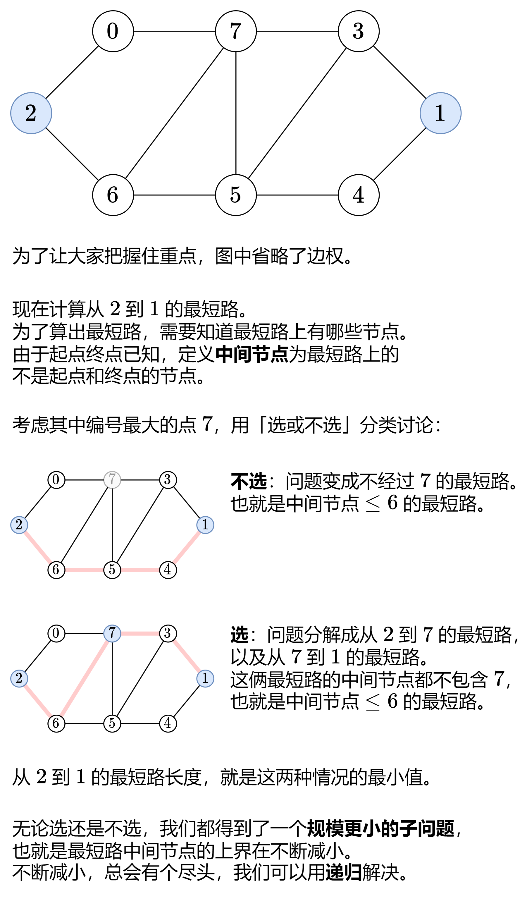

### [带你发明 Floyd 算法：从记忆化搜索到递推（Python/Java/C++/Go/JS/Rust）](https://leetcode.cn/problems/find-the-city-with-the-smallest-number-of-neighbors-at-a-threshold-distance/solutions/2525946/dai-ni-fa-ming-floyd-suan-fa-cong-ji-yi-m8s51/)

#### 题意解读

对于城市 $i$，求出 $i$ 到其余城市的最短路长度，统计有多少个最短路长度 $\le distanceThreshold$，把个数记作 $cnt_i$。

例如示例 $1$，$cnt_0=2,cnt_1=3,cnt_2=3,cnt_3=2$。

其中 $cnt_i$ 最小的 $i$ 就是答案。示例 $1$ 中的城市 $0$ 和城市 $3$ 对应的 $cnt_i$ 都是最小的，这种情况返回 $0$ 和 $3$ 的最大值，即 $3$。

为了解决本题，我们需要求出**任意两个城市之间的最短路长度**。

#### 前置知识

请看视频讲解 [动态规划入门：从记忆化搜索到递推](https://leetcode.cn/link/?target=https%3A%2F%2Fwww.bilibili.com%2Fvideo%2FBV1Xj411K7oF%2F)，制作不易，欢迎点赞！

#### 一、启发思考：寻找子问题



#### 二、递归怎么写：状态定义与状态转移方程

定义 $dfs(k,i,j)$ 表示从 $i$ 到 $j$ 的最短路长度，并且这条最短路的中间节点编号都 $\le k$。注意中间节点不包含 $i$ 和 $j$。

根据上面的讨论：

- 不选 $k$，那么中间节点的编号都 $\le k-1$，即 $dfs(k,i,j)=dfs(k-1,i,j)$。
- 选 $k$，问题分解成从 $i$ 到 $k$ 的最短路，以及从 $k$ 到 $j$ 的最短路。由于这两条最短路的中间节点都不包含 $k$，所以中间节点的编号都 $\le k-1$，故得到 $dfs(k,i,j)=dfs(k-1,i,k)+dfs(k-1,k,j)$。

这两种情况取最小值，就得到了 $dfs(k,i,j)$。写成式子就是

$$dfs(k,i,j)=min(dfs(k-1,i,j),dfs(k-1,i,k)+dfs(k-1,k,j))$$

递归边界：$dfs(-1,i,j)=w[i][j]$。$k=-1$ 表示 $i$ 和 $j$ 之间没有任何中间节点，此时最短路长度只能是连接 $i$ 和 $j$ 的边的边权，即 $w[i][j]$。如果没有连接 $i$ 和 $j$ 的边，则 $w[i][j]=\infty $。

递归入口：$dfs(n-1,i,j)$，表示从 $i$ 到 $j$ 的最短路长度。$k=n-1$ 是因为本题节点编号为 $0$ 到 $n-1$，任意最短路的中间节点编号都 $\le n-1$。

#### 答疑

**问**：为什么要强调「中间节点不包含 $i$ 和 $j$」？我看代码中没有判断这个呀？

**答**：只要最短路是简单路径（没有重复节点），中间节点就必然不会包含 $i$ 和 $j$。强调这个事实，便于大家理解后文空间优化写法的正确性。

```Python
# 会超时的递归代码
class Solution:
    def findTheCity(self, n: int, edges: List[List[int]], distanceThreshold: int) -> int:
        w = [[inf] * n for _ in range(n)]
        for x, y, wt in edges:
            w[x][y] = w[y][x] = wt

        def dfs(k: int, i: int, j: int) -> int:
            if k < 0:  # 递归边界
                return w[i][j]
            return min(dfs(k - 1, i, j), dfs(k - 1, i, k) + dfs(k - 1, k, j))

        ans = 0
        min_cnt = inf
        for i in range(n):
            cnt = 0
            for j in range(n):
                if j != i and dfs(n - 1, i, j) <= distanceThreshold:
                    cnt += 1
            if cnt <= min_cnt:  # 相等时取最大的 i
                min_cnt = cnt
                ans = i
        return ans
```

```Java
// 会超时的递归代码
class Solution {
    public int findTheCity(int n, int[][] edges, int distanceThreshold) {
        int[][] w = new int[n][n];
        for (int[] row : w) {
            Arrays.fill(row, Integer.MAX_VALUE / 2); // 防止加法溢出
        }
        for (int[] e : edges) {
            int x = e[0], y = e[1], wt = e[2];
            w[x][y] = w[y][x] = wt;
        }

        int ans = 0;
        int minCnt = n;
        for (int i = 0; i < n; i++) {
            int cnt = 0;
            for (int j = 0; j < n; j++) {
                if (j != i && dfs(n - 1, i, j, w) <= distanceThreshold) {
                    cnt++;
                }
            }
            if (cnt <= minCnt) { // 相等时取最大的 i
                minCnt = cnt;
                ans = i;
            }
        }
        return ans;
    }

    private int dfs(int k, int i, int j, int[][] w) {
        if (k < 0) { // 递归边界
            return w[i][j];
        }
        return Math.min(dfs(k - 1, i, j, w), dfs(k - 1, i, k, w) + dfs(k - 1, k, j, w));
    }
}
```

```C++
// 会超时的递归代码
class Solution {
public:
    int findTheCity(int n, vector<vector<int>>& edges, int distanceThreshold) {
        vector w(n, vector<int>(n, INT_MAX / 2)); // 防止加法溢出
        for (auto& e: edges) {
            int x = e[0], y = e[1], wt = e[2];
            w[x][y] = w[y][x] = wt;
        }

        auto dfs = [&](this auto&& dfs, int k, int i, int j) -> int {
            if (k < 0) { // 递归边界
                return w[i][j];
            }
            return min(dfs(k - 1, i, j), dfs(k - 1, i, k) + dfs(k - 1, k, j));
        };

        int ans = 0;
        int min_cnt = n;
        for (int i = 0; i < n; i++) {
            int cnt = 0;
            for (int j = 0; j < n; j++) {
                if (j != i && dfs(n - 1, i, j) <= distanceThreshold) {
                    cnt++;
                }
            }
            if (cnt <= min_cnt) { // 相等时取最大的 i
                min_cnt = cnt;
                ans = i;
            }
        }
        return ans;
    }
};
```

```Go
// 会超时的递归代码
func findTheCity(n int, edges [][]int, distanceThreshold int) (ans int) {
    w := make([][]int, n)
    for i := range w {
        w[i] = make([]int, n)
        for j := range w[i] {
            w[i][j] = math.MaxInt / 2 // 防止加法溢出
        }
    }
    for _, e := range edges {
        x, y, wt := e[0], e[1], e[2]
        w[x][y], w[y][x] = wt, wt
    }

    var dfs func(int, int, int) int
    dfs = func(k, i, j int) int {
        if k < 0 { // 递归边界
            return w[i][j]
        }
        return min(dfs(k-1, i, j), dfs(k-1, i, k)+dfs(k-1, k, j))
    }

    minCnt := n
    for i := range n {
        cnt := 0
        for j := range n {
            if j != i && dfs(n-1, i, j) <= distanceThreshold {
                cnt++
            }
        }
        if cnt <= minCnt { // 相等时取最大的 i
            minCnt = cnt
            ans = i
        }
    }
    return ans
}
```

```JavaScript
// 会超时的递归代码
var findTheCity = function(n, edges, distanceThreshold) {
    const w = Array(n).fill(null).map(() => Array(n).fill(Infinity));
    for (const [x, y, wt] of edges) {
        w[x][y] = w[y][x] = wt;
    }

    function dfs(k, i, j) {
        if (k < 0) { // 递归边界
            return w[i][j];
        }
        return Math.min(dfs(k - 1, i, j), dfs(k - 1, i, k) + dfs(k - 1, k, j));
    }

    let ans = 0;
    let minCnt = n;
    for (let i = 0; i < n; i++) {
        let cnt = 0;
        for (let j = 0; j < n; j++) {
            if (j !== i && dfs(n - 1, i, j) <= distanceThreshold) {
                cnt++;
            }
        }
        if (cnt <= minCnt) { // 相等时取最大的 i
            minCnt = cnt;
            ans = i;
        }
    }
    return ans;
};
```

```Rust
// 会超时的递归代码
impl Solution {
    pub fn find_the_city(n: i32, edges: Vec<Vec<i32>>, distance_threshold: i32) -> i32 {
        let n = n as usize;
        let mut w = vec![vec![i32::MAX / 2; n]; n]; // 除 2 防止加法溢出
        for e in edges {
            let x = e[0] as usize;
            let y = e[1] as usize;
            let wt = e[2];
            w[x][y] = wt;
            w[y][x] = wt;
        }

        fn dfs(k: i32, i: usize, j: usize, w: &Vec<Vec<i32>>) -> i32 {
            if k < 0 { // 递归边界
                return w[i][j];
            }
            return dfs(k - 1, i, j, w).min(dfs(k - 1, i, k as usize, w) + dfs(k - 1, k as usize, j, w));
        }

        let mut ans = 0;
        let mut min_cnt = n;
        for i in 0..n {
            let mut cnt = 0;
            for j in 0..n {
                if j != i && dfs(n as i32 - 1, i, j, &w) <= distance_threshold {
                    cnt += 1;
                }
            }
            if cnt <= min_cnt { // 相等时取最大的 i
                min_cnt = cnt;
                ans = i;
            }
        }
        ans as _
    }
}
```

#### 复杂度分析

- 时间复杂度：$O(n^23^n)$。外面调用 $O(n^2)$ 次 $dfs$，它的搜索树是一棵满三叉树（每个非叶节点都有三个子节点），树高为 $O(n)$，所以节点个数为 $O(3^n)$，遍历搜索树需要 $O(3^n)$ 的时间。
- 空间复杂度：$O(n)$。递归需要 $O(n)$ 的栈空间。

#### 三、递归 $+$ 记录返回值 $=$ 记忆化搜索

上面的做法太慢了，怎么优化呢？

比如，从 $2$ 到 $1$ 的最短路可以分解出从 $2$ 到 $7$ 的最短路（中间节点 $\le 6$），从 $2$ 到 $3$ 的最短路也可以分解出从 $2$ 到 $7$ 的最短路（中间节点 $\le 6$）。也就是说，都会递归到 $dfs(6,2,7)$。

一叶知秋，$dfs$ 中有大量重复递归调用（递归入参相同）。由于 $dfs$ 没有副作用，同样的入参无论计算多少次，算出来的结果都是一样的，因此可以用**记忆化搜索**来优化：

- 如果一个状态（递归入参）是第一次遇到，那么可以在返回前，把状态及其结果记到一个 $memo$ 数组中。
- 如果一个状态不是第一次遇到（$memo$ 中保存的结果不等于 $memo$ 的初始值），那么可以直接返回 $memo$ 中保存的结果。

注意：$memo$ 数组的初始值一定不能等于要记忆化的值。本题可以初始化成 $0$，因为边权都是正数。

> $Python$ 用户可以无视上面这段，直接用 `@cache` 装饰器。

```Python
class Solution:
    def findTheCity(self, n: int, edges: List[List[int]], distanceThreshold: int) -> int:
        w = [[inf] * n for _ in range(n)]
        for x, y, wt in edges:
            w[x][y] = w[y][x] = wt

        @cache  # 缓存装饰器，避免重复计算 dfs 的结果
        def dfs(k: int, i: int, j: int) -> int:
            if k < 0:  # 递归边界
                return w[i][j]
            return min(dfs(k - 1, i, j), dfs(k - 1, i, k) + dfs(k - 1, k, j))

        ans = 0
        min_cnt = inf
        for i in range(n):
            cnt = 0
            for j in range(n):
                if j != i and dfs(n - 1, i, j) <= distanceThreshold:
                    cnt += 1
            if cnt <= min_cnt:  # 相等时取最大的 i
                min_cnt = cnt
                ans = i
        return ans
```

```Java
class Solution {
    public int findTheCity(int n, int[][] edges, int distanceThreshold) {
        int[][] w = new int[n][n];
        for (int[] row : w) {
            Arrays.fill(row, Integer.MAX_VALUE / 2); // 防止加法溢出
        }
        for (int[] e : edges) {
            int x = e[0], y = e[1], wt = e[2];
            w[x][y] = w[y][x] = wt;
        }
        int[][][] memo = new int[n][n][n];

        int ans = 0;
        int minCnt = n;
        for (int i = 0; i < n; i++) {
            int cnt = 0;
            for (int j = 0; j < n; j++) {
                if (j != i && dfs(n - 1, i, j, memo, w) <= distanceThreshold) {
                    cnt++;
                }
            }
            if (cnt <= minCnt) { // 相等时取最大的 i
                minCnt = cnt;
                ans = i;
            }
        }
        return ans;
    }

    private int dfs(int k, int i, int j, int[][][] memo, int[][] w) {
        if (k < 0) { // 递归边界
            return w[i][j];
        }
        if (memo[k][i][j] != 0) { // 之前计算过
            return memo[k][i][j];
        }
        return memo[k][i][j] = Math.min(dfs(k - 1, i, j, memo, w),
                dfs(k - 1, i, k, memo, w) + dfs(k - 1, k, j, memo, w));
    }
}
```

```C++
class Solution {
public:
    int findTheCity(int n, vector<vector<int>>& edges, int distanceThreshold) {
        vector w(n, vector<int>(n, INT_MAX / 2)); // 防止加法溢出
        for (auto& e: edges) {
            int x = e[0], y = e[1], wt = e[2];
            w[x][y] = w[y][x] = wt;
        }

        vector memo(n, vector(n, vector<int>(n)));
        auto dfs = [&](this auto&& dfs, int k, int i, int j) -> int {
            if (k < 0) { // 递归边界
                return w[i][j];
            }
            auto& res = memo[k][i][j]; // 注意这里是引用
            if (res) { // 之前计算过
                return res;
            }
            return res = min(dfs(k - 1, i, j), dfs(k - 1, i, k) + dfs(k - 1, k, j));
        };

        int ans = 0;
        int min_cnt = n;
        for (int i = 0; i < n; i++) {
            int cnt = 0;
            for (int j = 0; j < n; j++) {
                if (j != i && dfs(n - 1, i, j) <= distanceThreshold) {
                    cnt++;
                }
            }
            if (cnt <= min_cnt) { // 相等时取最大的 i
                min_cnt = cnt;
                ans = i;
            }
        }
        return ans;
    }
};
```

```Go
func findTheCity(n int, edges [][]int, distanceThreshold int) (ans int) {
    w := make([][]int, n)
    for i := range w {
        w[i] = make([]int, n)
        for j := range w[i] {
            w[i][j] = math.MaxInt / 2 // 防止加法溢出
        }
    }
    for _, e := range edges {
        x, y, wt := e[0], e[1], e[2]
        w[x][y], w[y][x] = wt, wt
    }

    memo := make([][][]int, n)
    for i := range memo {
        memo[i] = make([][]int, n)
        for j := range memo[i] {
            memo[i][j] = make([]int, n)
        }
    }
    var dfs func(int, int, int) int
    dfs = func(k, i, j int) int {
        if k < 0 { // 递归边界
            return w[i][j]
        }
        p := &memo[i][j][k]
        if *p == 0 { // 没有计算过
            *p = min(dfs(k-1, i, j), dfs(k-1, i, k)+dfs(k-1, k, j))
        }
        return *p
    }

    minCnt := n
    for i := range n {
        cnt := 0
        for j := range n {
            if j != i && dfs(n-1, i, j) <= distanceThreshold {
                cnt++
            }
        }
        if cnt <= minCnt { // 相等时取最大的 i
            minCnt = cnt
            ans = i
        }
    }
    return ans
}
```

```JavaScript
var findTheCity = function(n, edges, distanceThreshold) {
    const w = Array(n).fill(null).map(() => Array(n).fill(Infinity));
    for (const [x, y, wt] of edges) {
        w[x][y] = w[y][x] = wt;
    }

    const memo = new Array(n).fill(null).map(() => new Array(n).fill(null).map(() => new Array(n).fill(0)));
    function dfs(k, i, j) {
        if (k < 0) { // 递归边界
            return w[i][j];
        }
        if (memo[k][i][j]) { // 之前计算过
            return memo[k][i][j];
        }
        return memo[k][i][j] = Math.min(dfs(k - 1, i, j), dfs(k - 1, i, k) + dfs(k - 1, k, j));
    }

    let ans = 0;
    let minCnt = n;
    for (let i = 0; i < n; i++) {
        let cnt = 0;
        for (let j = 0; j < n; j++) {
            if (j !== i && dfs(n - 1, i, j) <= distanceThreshold) {
                cnt++;
            }
        }
        if (cnt <= minCnt) { // 相等时取最大的 i
            minCnt = cnt;
            ans = i;
        }
    }
    return ans;
};
```

```Rust
impl Solution {
    pub fn find_the_city(n: i32, edges: Vec<Vec<i32>>, distance_threshold: i32) -> i32 {
        let n = n as usize;
        let mut w = vec![vec![i32::MAX / 2; n]; n]; // 除 2 防止加法溢出
        for e in edges {
            let x = e[0] as usize;
            let y = e[1] as usize;
            let wt = e[2];
            w[x][y] = wt;
            w[y][x] = wt;
        }

        let mut memo = vec![vec![vec![0; n]; n]; n];
        fn dfs(k: i32, i: usize, j: usize, w: &Vec<Vec<i32>>, memo: &mut Vec<Vec<Vec<i32>>>) -> i32 {
            if k < 0 { // 递归边界
                return w[i][j];
            }
            if memo[k as usize][i][j] != 0 { // 之前计算过
                return memo[k as usize][i][j];
            }
            let res = dfs(k - 1, i, j, w, memo).min(dfs(k - 1, i, k as usize, w, memo) + dfs(k - 1, k as usize, j, w, memo));
            memo[k as usize][i][j] = res; // 记忆化
            res
        }

        let mut ans = 0;
        let mut min_cnt = n;
        for i in 0..n {
            let mut cnt = 0;
            for j in 0..n {
                if j != i && dfs(n as i32 - 1, i, j, &w, &mut memo) <= distance_threshold {
                    cnt += 1;
                }
            }
            if cnt <= min_cnt { // 相等时取最大的 i
                min_cnt = cnt;
                ans = i;
            }
        }
        ans as _
    }
}
```

#### 复杂度分析

- 时间复杂度：$O(n^3)$。由于每个状态只会计算一次，动态规划的时间复杂度 $=$ 状态个数 $\times $ 单个状态的计算时间。本题中状态个数等于 $O(n^3)$，单个状态的计算时间为 $O(1)$，所以动态规划的时间复杂度为 $O(n^3)$。
- 空间复杂度：$O(n^3)$。有多少个状态，$memo$ 数组的大小就是多少。

#### 四、1:1 翻译成递推

我们可以去掉递归中的「递」，只保留「归」的部分，即自底向上计算。

做法：

- $dfs$ 改成 $f$ 数组；
- 递归改成循环（每个参数都对应一层循环）；
- 递归边界改成 $f$ 数组的初始值。

> 相当于之前是用递归去计算每个状态，现在是**枚举**并计算每个状态。

具体来说，$f[k][i][j]$ 的定义和 $dfs(k,i,j)$ 的定义是一样的，都表示从 $i$ 到 $j$ 的最短路长度，并且这条最短路的中间节点编号都 $\le k$。

相应的递推式（状态转移方程）也和 $dfs$ 是一样的：

$$f[k][i][j]=min(f[k-1][i][j],f[k-1][i][k]+f[k-1][k][j])$$

但是，这种定义方式**没有状态能表示递归边界**，即 $k=-1$ 的情况。

解决办法：把 $f$ 数组的长度加一（在前面插入一个二维数组），用 $f[0][i][j]$ 表示 $dfs(-1,i,j)=w[i][j]$。由于 $f[0]$ 被占用，$f$ 第一维度的下标需要全部向右偏移一位，也就是把 $f[k]$ 改为 $f[k+1]$，把 $f[k-1]$ 改为 $f[k]$。

修改后 $f[k+1][i][j]$ 表示从 $i$ 到 $j$ 的最短路长度，并且这条最短路的中间节点编号都 $\le k$。

修改后的递推式为

$$f[k+1][i][j]=min(f[k][i][j],f[k][i][k]+f[k][k][j])$$

初始值 $f[0][i][j]=w[i][j]$，翻译自 $dfs(-1,i,j)=w[i][j]$。

从 $i$ 到 $j$ 的最短路长度为 $f[n][i][j]$，翻译自 $dfs(n-1,i,j)$。

#### 答疑

**问**：为什么一定要在最外层枚举 $k$？

**答**：仔细看上面的状态转移方程，要正确地算出 $f[k+1][i][j]$，必须先把 f[k][i][j]、f[k][i][k] 和 $f[k][k][j]$ 算出来。由于我们不知道 $k$ 和 $i,j$ 的大小关系，只有把 $k$ 放在最外层枚举，才能保证先把 f[k][i][j]、f[k][i][k] 和 $f[k][k][j]$ 算出来。顺带一提，对于 $i$ 和 $j$ 来说，由于在计算 $f[k+1][i][j]$ 的时候，$f[k][\cdot ][\cdot ]$ 已经全部计算完毕，所以 $i$ 和 $j$ 按照正序/逆序枚举都可以。

```Python
class Solution:
    def findTheCity(self, n: int, edges: List[List[int]], distanceThreshold: int) -> int:
        w = [[inf] * n for _ in range(n)]
        for x, y, wt in edges:
            w[x][y] = w[y][x] = wt

        f = [[[0] * n for _ in range(n)] for _ in range(n + 1)]
        f[0] = w
        for k in range(n):
            for i in range(n):
                for j in range(n):
                    f[k + 1][i][j] = min(f[k][i][j], f[k][i][k] + f[k][k][j])

        ans = 0
        min_cnt = inf
        for i in range(n):
            cnt = 0
            for j in range(n):
                if j != i and f[n][i][j] <= distanceThreshold:
                    cnt += 1
            if cnt <= min_cnt:  # 相等时取最大的 i
                min_cnt = cnt
                ans = i
        return ans
```

```Java
class Solution {
    public int findTheCity(int n, int[][] edges, int distanceThreshold) {
        int[][] w = new int[n][n];
        for (int[] row : w) {
            Arrays.fill(row, Integer.MAX_VALUE / 2); // 防止加法溢出
        }
        for (int[] e : edges) {
            int x = e[0], y = e[1], wt = e[2];
            w[x][y] = w[y][x] = wt;
        }

        int[][][] f = new int[n + 1][n][n];
        f[0] = w;
        for (int k = 0; k < n; k++) {
            for (int i = 0; i < n; i++) {
                for (int j = 0; j < n; j++) {
                    f[k + 1][i][j] = Math.min(f[k][i][j], f[k][i][k] + f[k][k][j]);
                }
            }
        }

        int ans = 0;
        int minCnt = n;
        for (int i = 0; i < n; i++) {
            int cnt = 0;
            for (int j = 0; j < n; j++) {
                if (j != i && f[n][i][j] <= distanceThreshold) {
                    cnt++;
                }
            }
            if (cnt <= minCnt) { // 相等时取最大的 i
                minCnt = cnt;
                ans = i;
            }
        }
        return ans;
    }
}
```

```C++
class Solution {
public:
    int findTheCity(int n, vector<vector<int>>& edges, int distanceThreshold) {
        vector w(n, vector<int>(n, INT_MAX / 2)); // 防止加法溢出
        for (auto& e: edges) {
            int x = e[0], y = e[1], wt = e[2];
            w[x][y] = w[y][x] = wt;
        }

        vector f(n + 1, vector(n, vector<int>(n)));
        f[0] = w;
        for (int k = 0; k < n; k++) {
            for (int i = 0; i < n; i++) {
                for (int j = 0; j < n; j++) {
                    f[k + 1][i][j] = min(f[k][i][j], f[k][i][k] + f[k][k][j]);
                }
            }
        }

        int ans = 0;
        int min_cnt = n;
        for (int i = 0; i < n; i++) {
            int cnt = 0;
            for (int j = 0; j < n; j++) {
                if (j != i && f[n][i][j] <= distanceThreshold) {
                    cnt++;
                }
            }
            if (cnt <= min_cnt) { // 相等时取最大的 i
                min_cnt = cnt;
                ans = i;
            }
        }
        return ans;
    }
};
```

```Go
func findTheCity(n int, edges [][]int, distanceThreshold int) (ans int) {
    w := make([][]int, n)
    for i := range w {
        w[i] = make([]int, n)
        for j := range w[i] {
            w[i][j] = math.MaxInt / 2 // 防止加法溢出
        }
    }
    for _, e := range edges {
        x, y, wt := e[0], e[1], e[2]
        w[x][y], w[y][x] = wt, wt
    }

    f := make([][][]int, n+1)
    for k := range f {
        f[k] = make([][]int, n)
        for i := range f[k] {
            f[k][i] = make([]int, n)
        }
    }
    f[0] = w
    for k := range n {
        for i := range n {
            for j := range n {
                f[k+1][i][j] = min(f[k][i][j], f[k][i][k]+f[k][k][j])
            }
        }
    }

    minCnt := n
    for i, dis := range f[n] {
        cnt := 0
        for j, d := range dis {
            if j != i && d <= distanceThreshold {
                cnt++
            }
        }
        if cnt <= minCnt { // 相等时取最大的 i
            minCnt = cnt
            ans = i
        }
    }
    return ans
}
```

```JavaScript
var findTheCity = function(n, edges, distanceThreshold) {
    const w = Array(n).fill(null).map(() => Array(n).fill(Infinity));
    for (const [x, y, wt] of edges) {
        w[x][y] = w[y][x] = wt;
    }

    const f = Array(n + 1).fill(null).map(() => Array(n).fill(null).map(() => Array(n).fill(0)));
    f[0] = w;
    for (let k = 0; k < n; k++) {
        for (let i = 0; i < n; i++) {
            for (let j = 0; j < n; j++) {
                f[k + 1][i][j] = Math.min(f[k][i][j], f[k][i][k] + f[k][k][j]);
            }
        }
    }

    let ans = 0;
    let minCnt = n;
    for (let i = 0; i < n; i++) {
        let cnt = 0;
        for (let j = 0; j < n; j++) {
            if (j !== i && f[n][i][j] <= distanceThreshold) {
                cnt++;
            }
        }
        if (cnt <= minCnt) { // 相等时取最大的 i
            minCnt = cnt;
            ans = i;
        }
    }
    return ans;
};
```

```Rust
impl Solution {
    pub fn find_the_city(n: i32, edges: Vec<Vec<i32>>, distance_threshold: i32) -> i32 {
        let n = n as usize;
        let mut w = vec![vec![i32::MAX / 2; n]; n]; // 除 2 防止加法溢出
        for e in edges {
            let x = e[0] as usize;
            let y = e[1] as usize;
            let wt = e[2];
            w[x][y] = wt;
            w[y][x] = wt;
        }

        let mut f = vec![vec![vec![0; n]; n]; n + 1];
        f[0] = w;
        for k in 0..n {
            for i in 0..n {
                for j in 0..n {
                    f[k + 1][i][j] = f[k][i][j].min(f[k][i][k] + f[k][k][j]);
                }
            }
        }

        let mut ans = 0;
        let mut min_cnt = n;
        for i in 0..n {
            let mut cnt = 0;
            for j in 0..n {
                if j != i && f[n][i][j] <= distance_threshold {
                    cnt += 1;
                }
            }
            if cnt <= min_cnt { // 相等时取最大的 i
                min_cnt = cnt;
                ans = i;
            }
        }
        ans as _
    }
}
```

#### 复杂度分析

- 时间复杂度：$O(n^3)$。
- 空间复杂度：$O(n^3)$。

#### 五、空间优化

观察上面的状态转移方程，在计算 $f[k+1]$ 时，只会用到 $f[k]$，不会用到（第一个维度的）下标小于 $k$ 的状态。

能不能像 $0-1$ 背包那样，把第一个维度去掉呢？也就是

$$f[i][j]=min(f[i][j],f[i][k]+f[k][j])$$

不幸的是，我们无法确定 $k$ 和 $i,j$ 的大小关系，上式中的 $f[i][k]$ 的值可能是 $f[k][i][k]$，也有可能被覆盖成了 $f[k+1][i][k]$。同样的，$f[k][j]$ 的值也可能被覆盖成了 $f[k+1][k][j]$

但是！从状态的定义来看：

- $f[k+1][i][k]$ 表示从 $i$ 到 $k$ 的最短路长度，并且这条最短路的中间节点编号都 $\le k$。由于终点是 $k$，那么中间节点必然不包含 $k$，所以中间节点编号都 $\le k-1$，所以 f[k+1][i][k]=f[k][i][k]！
- 同理，$f[k+1][k][j]=f[k][k][j]$。

因为值没变，所以不用担心被覆盖，直接去掉第一个维度。

初始值 $f[i][j]=w[i][j]$。

三重循环结束后，$f[i][j]$ 就是从 $i$ 到 $j$ 的最短路了。

```Python
class Solution:
    def findTheCity(self, n: int, edges: List[List[int]], distanceThreshold: int) -> int:
        w = [[inf] * n for _ in range(n)]
        for x, y, wt in edges:
            w[x][y] = w[y][x] = wt

        f = w
        for k in range(n):
            for i in range(n):
                for j in range(n):
                    # f[i][j] = min(f[i][j], f[i][k] + f[k][j])
                    # 手动 if 比大小更快
                    s = f[i][k] + f[k][j]
                    if s < f[i][j]:
                        f[i][j] = s

        ans = 0
        min_cnt = inf
        for i in range(n):
            cnt = 0
            for j in range(n):
                if j != i and f[i][j] <= distanceThreshold:
                    cnt += 1
            if cnt <= min_cnt:  # 相等时取最大的 i
                min_cnt = cnt
                ans = i
        return ans
```

```Java
class Solution {
    public int findTheCity(int n, int[][] edges, int distanceThreshold) {
        int[][] w = new int[n][n];
        for (int[] row : w) {
            Arrays.fill(row, Integer.MAX_VALUE / 2); // 防止加法溢出
        }
        for (int[] e : edges) {
            int x = e[0], y = e[1], wt = e[2];
            w[x][y] = w[y][x] = wt;
        }

        int[][] f = w;
        for (int k = 0; k < n; k++) {
            for (int i = 0; i < n; i++) {
                for (int j = 0; j < n; j++) {
                    f[i][j] = Math.min(f[i][j], f[i][k] + f[k][j]);
                }
            }
        }

        int ans = 0;
        int minCnt = n;
        for (int i = 0; i < n; i++) {
            int cnt = 0;
            for (int j = 0; j < n; j++) {
                if (j != i && f[i][j] <= distanceThreshold) {
                    cnt++;
                }
            }
            if (cnt <= minCnt) { // 相等时取最大的 i
                minCnt = cnt;
                ans = i;
            }
        }
        return ans;
    }
}
```

```C++
class Solution {
public:
    int findTheCity(int n, vector<vector<int>>& edges, int distanceThreshold) {
        vector w(n, vector<int>(n, INT_MAX / 2)); // 防止加法溢出
        for (auto& e: edges) {
            int x = e[0], y = e[1], wt = e[2];
            w[x][y] = w[y][x] = wt;
        }

        auto f = move(w);
        for (int k = 0; k < n; k++) {
            for (int i = 0; i < n; i++) {
                for (int j = 0; j < n; j++) {
                    f[i][j] = min(f[i][j], f[i][k] + f[k][j]);
                }
            }
        }

        int ans = 0;
        int min_cnt = n;
        for (int i = 0; i < n; i++) {
            int cnt = 0;
            for (int j = 0; j < n; j++) {
                if (j != i && f[i][j] <= distanceThreshold) {
                    cnt++;
                }
            }
            if (cnt <= min_cnt) { // 相等时取最大的 i
                min_cnt = cnt;
                ans = i;
            }
        }
        return ans;
    }
};
```

```Go
func findTheCity(n int, edges [][]int, distanceThreshold int) (ans int) {
    w := make([][]int, n)
    for i := range w {
        w[i] = make([]int, n)
        for j := range w[i] {
            w[i][j] = math.MaxInt / 2 // 防止加法溢出
        }
    }
    for _, e := range edges {
        x, y, wt := e[0], e[1], e[2]
        w[x][y], w[y][x] = wt, wt
    }

    f := w
    for k := range n {
        for i := range n {
            for j := range n {
                f[i][j] = min(f[i][j], f[i][k]+f[k][j])
            }
        }
    }

    minCnt := n
    for i, dis := range f {
        cnt := 0
        for j, d := range dis {
            if j != i && d <= distanceThreshold {
                cnt++
            }
        }
        if cnt <= minCnt { // 相等时取最大的 i
            minCnt = cnt
            ans = i
        }
    }
    return ans
}
```

```JavaScript
var findTheCity = function(n, edges, distanceThreshold) {
    const w = Array(n).fill(null).map(() => Array(n).fill(Infinity));
    for (const [x, y, wt] of edges) {
        w[x][y] = w[y][x] = wt;
    }

    const f = w;
    for (let k = 0; k < n; k++) {
        for (let i = 0; i < n; i++) {
            for (let j = 0; j < n; j++) {
                f[i][j] = Math.min(f[i][j], f[i][k] + f[k][j]);
            }
        }
    }

    let ans = 0;
    let minCnt = n;
    for (let i = 0; i < n; i++) {
        let cnt = 0;
        for (let j = 0; j < n; j++) {
            if (j !== i && f[i][j] <= distanceThreshold) {
                cnt++;
            }
        }
        if (cnt <= minCnt) { // 相等时取最大的 i
            minCnt = cnt;
            ans = i;
        }
    }
    return ans;
};
```

```Rust
impl Solution {
    pub fn find_the_city(n: i32, edges: Vec<Vec<i32>>, distance_threshold: i32) -> i32 {
        let n = n as usize;
        let mut w = vec![vec![i32::MAX / 2; n]; n]; // 除 2 防止加法溢出
        for e in edges {
            let x = e[0] as usize;
            let y = e[1] as usize;
            let wt = e[2];
            w[x][y] = wt;
            w[y][x] = wt;
        }

        let mut f = w;
        for k in 0..n {
            for i in 0..n {
                for j in 0..n {
                    f[i][j] = f[i][j].min(f[i][k] + f[k][j]);
                }
            }
        }

        let mut ans = 0;
        let mut min_cnt = n;
        for i in 0..n {
            let mut cnt = 0;
            for j in 0..n {
                if j != i && f[i][j] <= distance_threshold {
                    cnt += 1;
                }
            }
            if cnt <= min_cnt { // 相等时取最大的 i
                min_cnt = cnt;
                ans = i;
            }
        }
        ans as _
    }
}
```

#### 复杂度分析

- 时间复杂度：$O(n^3)$。
- 空间复杂度：$O(n^2)$。

#### 思考题

向图中添加一条边，如何维护 $f$ 数组？

最暴力的做法是，每次添加一条边，就用 $O(n^3)$ 时间全部重算一遍。有没有更快的做法呢？

这题是 [2642\. 设计可以求最短路径的图类](https://leetcode.cn/problems/design-graph-with-shortest-path-calculator/)

#### 分类题单

[如何科学刷题？](https://leetcode.cn/circle/discuss/RvFUtj/)

1. [滑动窗口与双指针（定长/不定长/单序列/双序列/三指针/分组循环）](https://leetcode.cn/circle/discuss/0viNMK/)
2. [二分算法（二分答案/最小化最大值/最大化最小值/第K小）](https://leetcode.cn/circle/discuss/SqopEo/)
3. [单调栈（基础/矩形面积/贡献法/最小字典序）](https://leetcode.cn/circle/discuss/9oZFK9/)
4. [网格图（DFS/BFS/综合应用）](https://leetcode.cn/circle/discuss/YiXPXW/)
5. [位运算（基础/性质/拆位/试填/恒等式/思维）](https://leetcode.cn/circle/discuss/dHn9Vk/)
6. 【本题相关】[图论算法（DFS/BFS/拓扑排序/最短路/最小生成树/二分图/基环树/欧拉路径）](https://leetcode.cn/circle/discuss/01LUak/)
7. [动态规划（入门/背包/状态机/划分/区间/状压/数位/数据结构优化/树形/博弈/概率期望）](https://leetcode.cn/circle/discuss/tXLS3i/)
8. [常用数据结构（前缀和/差分/栈/队列/堆/字典树/并查集/树状数组/线段树）](https://leetcode.cn/circle/discuss/mOr1u6/)
9. [数学算法（数论/组合/概率期望/博弈/计算几何/随机算法）](https://leetcode.cn/circle/discuss/IYT3ss/)
10. [贪心与思维（基本贪心策略/反悔/区间/字典序/数学/思维/脑筋急转弯/构造）](https://leetcode.cn/circle/discuss/g6KTKL/)
11. [链表、二叉树与回溯（前后指针/快慢指针/DFS/BFS/直径/LCA/一般树）](https://leetcode.cn/circle/discuss/K0n2gO/)
12. [字符串（KMP/Z函数/Manacher/字符串哈希/AC自动机/后缀数组/子序列自动机）](https://leetcode.cn/circle/discuss/SJFwQI/)
