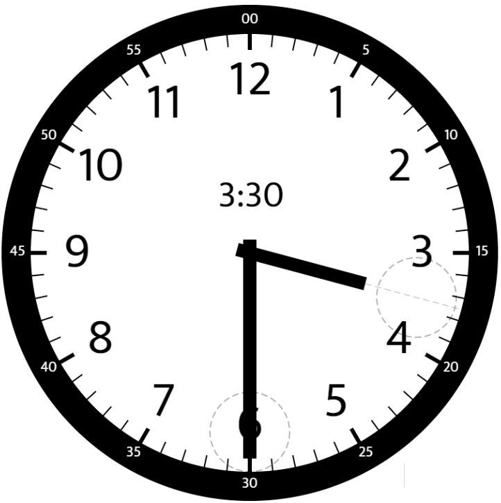

### [1344\. 时钟指针的夹角](https://leetcode.cn/problems/angle-between-hands-of-a-clock/)

难度：中等

给你两个数 `hour` 和 `minutes`。请你返回在时钟上，由给定时间的时针和分针组成的较小角的角度（60 单位制）。

**示例 1：**

> 
>
> **输入：** hour = 12, minutes = 30
> **输出：** 165

**示例 2：**

> 
>
> **输入：** hour = 3, minutes = 30
> **输出；** 75

**示例 3：**

> 
> **输入：** hour = 3, minutes = 15
> **输出：** 7.5

**示例 4：**

> **输入：** hour = 4, minutes = 50
> **输出：** 155

**示例 5：**

> **输入：** hour = 12, minutes = 0
> **输出：** 0

**提示：**

- `1 <= hour <= 12`
- `0 <= minutes <= 59`
- 与标准答案误差在 <code>10-5</code> 以内的结果都被视为正确结果。
