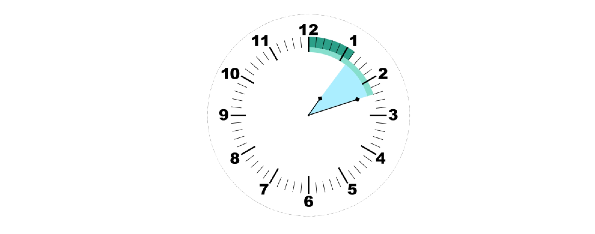
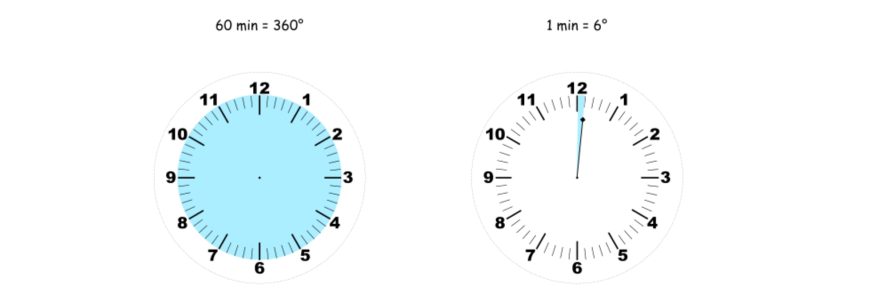
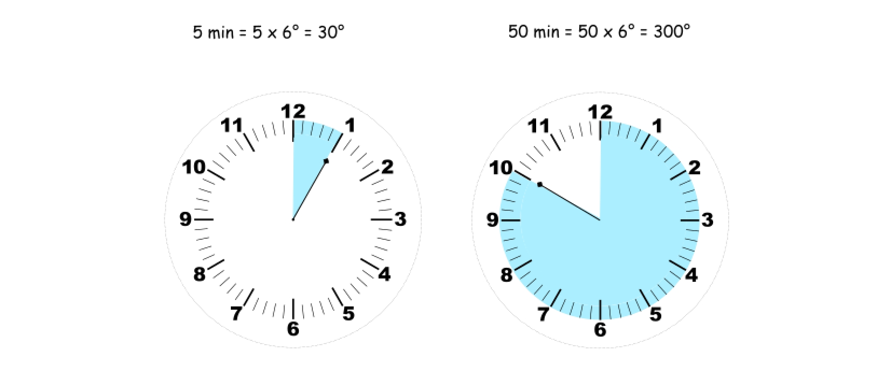
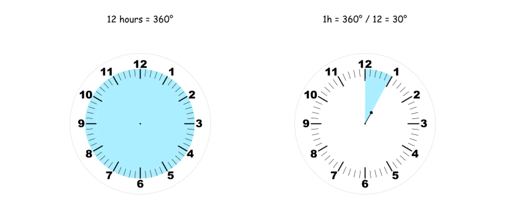
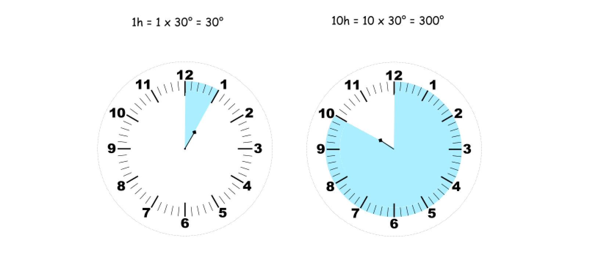
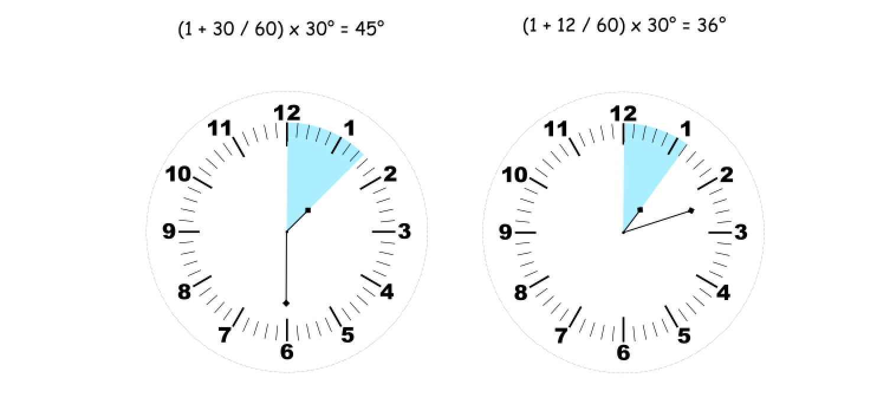

### [时钟指针的夹角](https://leetcode.cn/problems/angle-between-hands-of-a-clock/solutions/3979296/shi-zhong-zhi-zhen-de-jia-jiao-by-leetco-mlzr/)

#### 方法一：数学

其思想是分别计算 $0$ 点垂线与每个指针之间的角度。答案是这两个角度的差。



**分针的角度：**  
我们从分针开始，整个圆 $360^\circ$ 有 $60$ 分钟。分针指针移动一分钟的角度是 $1 min=\dfrac{360^\circ}{60}=6^\circ$。



现在可以很容易地找到 $0$ 点垂直线和分钟指针之间的角度：$minutes\_angle=minutes\times 6^\circ$。



**时针的角度：**  
与分针的角度相似，整个圆 $360^\circ$ 有 $12$ 个小时，因此每个小时 $1h=\dfrac{360^\circ}{12}=30^\circ$。



则时针的角度为：$hour\_angle=hour\times 30^\circ$。



由于 $12$ 点的角度实际为 $0$，则需要修改表达式为：$hour\_angle=(hour\bmod 12)\times 30^\circ$。

在分钟指针大于 $0$ 的情况下，必须考虑到时针指针额外的移动：它不在整数值之间跳跃，是跟着分针移动。

$$hour\_angle=\Big(hour\bmod 12+\dfrac{minutes}{60}\Big)\times 30^\circ$$



**算法：**

- 初始化常数：`one_min_angle = 6`，`one_hour_angle = 30`。
- 分针指针与 $0$ 点垂线的角度为：`minutes_angle = one_min_angle * minutes`。
- 时针指针与 $0$ 点垂线的角度为：`hour_angle = (hour % 12 + minutes / 60) * one_hour_angle`。
- 得到差：`diff = abs(hour_angle - minutes_angle)`。
- 返回最小的角度：`min(diff, 360 - diff)`。

```Python
class Solution:
    def angleClock(self, hour: int, minutes: int) -> float:
        one_min_angle = 6
        one_hour_angle = 30

        minutes_angle = one_min_angle * minutes
        hour_angle = (hour % 12 + minutes / 60) * one_hour_angle

        diff = abs(hour_angle - minutes_angle)
        return min(diff, 360 - diff)
```

```Java
class Solution {
  public double angleClock(int hour, int minutes) {
    int oneMinAngle = 6;
    int oneHourAngle = 30;

    double minutesAngle = oneMinAngle * minutes;
    double hourAngle = (hour % 12 + minutes / 60.0) * oneHourAngle;

    double diff = Math.abs(hourAngle - minutesAngle);
    return Math.min(diff, 360 - diff);
  }
}
```

```C++
class Solution {
  public:
  double angleClock(int hour, int minutes) {
    int oneMinAngle = 6;
    int oneHourAngle = 30;

    double minutesAngle = oneMinAngle * minutes;
    double hourAngle = (hour % 12 + minutes / 60.0) * oneHourAngle;

    double diff = abs(hourAngle - minutesAngle);
    return min(diff, 360 - diff);
  }
};
```

```Go
func angleClock(hour int, minutes int) float64 {
    var oneMinAngle, oneHourAngle, minutesAngle, hourAngle, diff float64;
    oneMinAngle = 6;
    oneHourAngle = 30;

    minutesAngle = oneMinAngle * float64(minutes);
    hourAngle = (float64(hour % 12) + float64(minutes) / 60.0) * oneHourAngle;

    diff = math.Abs(hourAngle - minutesAngle);
    return math.Min(diff, 360 - diff);
}
```

```CSharp
public class Solution {
    public double AngleClock(int hour, int minutes) {
        int oneMinAngle = 6;
        int oneHourAngle = 30;

        double minutesAngle = oneMinAngle * minutes;
        double hourAngle = (hour % 12 + minutes / 60.0) * oneHourAngle;

        double diff = Math.Abs(hourAngle - minutesAngle);
        return Math.Min(diff, 360 - diff);
    }
}
```

```C
double angleClock(int hour, int minutes) {
    int oneMinAngle = 6;
    int oneHourAngle = 30;

    double minutesAngle = oneMinAngle * minutes;
    double hourAngle = (hour % 12 + minutes / 60.0) * oneHourAngle;

    double diff = fabs(hourAngle - minutesAngle);
    return fmin(diff, 360 - diff);
}
```

```JavaScript
var angleClock = function(hour, minutes) {
    const oneMinAngle = 6;
    const oneHourAngle = 30;

    const minutesAngle = oneMinAngle * minutes;
    const hourAngle = (hour % 12 + minutes / 60.0) * oneHourAngle;

    const diff = Math.abs(hourAngle - minutesAngle);
    return Math.min(diff, 360 - diff);
};
```

```TypeScript
function angleClock(hour: number, minutes: number): number {
    const oneMinAngle: number = 6;
    const oneHourAngle: number = 30;

    const minutesAngle: number = oneMinAngle * minutes;
    const hourAngle: number = (hour % 12 + minutes / 60.0) * oneHourAngle;

    const diff: number = Math.abs(hourAngle - minutesAngle);
    return Math.min(diff, 360 - diff);
}
```

```Rust
impl Solution {
    pub fn angle_clock(hour: i32, minutes: i32) -> f64 {
        let one_min_angle = 6.0;
        let one_hour_angle = 30.0;

        let minutes_angle = one_min_angle * minutes as f64;
        let hour_angle = (hour % 12) as f64 + (minutes as f64 / 60.0);
        let hour_angle = hour_angle * one_hour_angle;

        let diff = (hour_angle - minutes_angle).abs();
        diff.min(360.0 - diff)
    }
}
```

**复杂度分析**

- 时间复杂度：$O(1)$。
- 空间复杂度：$O(1)$。
