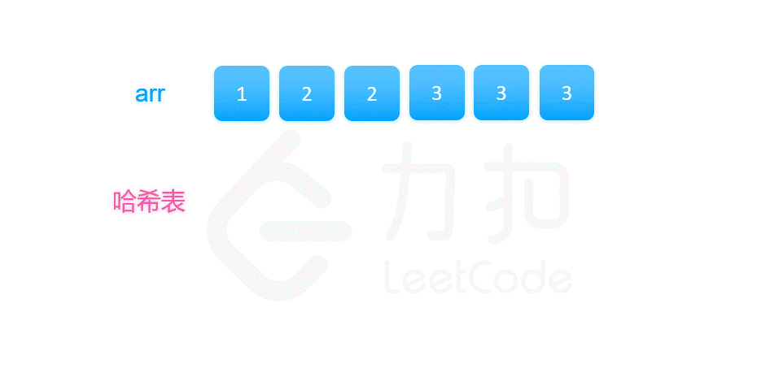

### [找出数组中的幸运数](https://leetcode.cn/problems/find-lucky-integer-in-an-array/solutions/186438/zhao-chu-shu-zu-zhong-de-xing-yun-shu-by-leetcode/)

#### 方法一：哈希映射

**思路**

我们可以使用哈希映射来解决这个问题，把数值作为键，把数值出现的次数作为值。具体地，我们先遍历原数组建立哈希表，然后遍历哈希表找到最大的键和值相等的元素作为答案，如果找不到就返回 $-1$。



**代码**

```C++
class Solution {
public:
    unordered_map <int, int> m;
    int findLucky(vector<int>& arr) {
        for (auto x: arr) {
            ++m[x];
        }
        int ans = -1;
        for (auto [key, value]: m) {
            if (key == value) {
                ans = max(ans, key);
            }
        }
        return ans;
    }
};
```

```Python
class Solution:
    def findLucky(self, arr: List[int]) -> int:
        m = dict()
        for x in arr:
            m[x] = m.get(x, 0) + 1
        ans = -1
        for (key, value) in m.items():
            if key == value:
                ans = max(ans, key)
        return ans
```

```Java
class Solution {
    public int findLucky(int[] arr) {
        Map<Integer, Integer> m = new HashMap<Integer, Integer>();
        for (int x : arr) {
            m.put(x, m.getOrDefault(x, 0) + 1);
        }
        int ans = -1;
        for (Map.Entry<Integer, Integer> entry : m.entrySet()) {
            int key = entry.getKey(), value = entry.getValue();
            if (key == value) {
                ans = Math.max(ans, key);
            }
        }
        return ans;
    }
}
```

```CSharp
public class Solution {
    public int FindLucky(int[] arr) {
        Dictionary<int, int> m = new Dictionary<int, int>();
        foreach (int x in arr) {
            if (m.ContainsKey(x)) {
                m[x]++;
            } else {
                m[x] = 1;
            }
        }
        int ans = -1;
        foreach (var kvp in m) {
            if (kvp.Key == kvp.Value) {
                ans = Math.Max(ans, kvp.Key);
            }
        }
        return ans;
    }
}
```

```Go
func findLucky(arr []int) int {
    m := make(map[int]int)
    for _, x := range arr {
        m[x]++
    }
    ans := -1
    for key, value := range m {
        if key == value {
            ans = max(ans, key)
        }
    }
    return ans
}
```

```C
typedef struct {
    int key;
    int val;
    UT_hash_handle hh;
} HashItem; 

HashItem *hashFindItem(HashItem **obj, int key) {
    HashItem *pEntry = NULL;
    HASH_FIND_INT(*obj, &key, pEntry);
    return pEntry;
}

bool hashAddItem(HashItem **obj, int key, int val) {
    if (hashFindItem(obj, key)) {
        return false;
    }
    HashItem *pEntry = (HashItem *)malloc(sizeof(HashItem));
    pEntry->key = key;
    pEntry->val = val;
    HASH_ADD_INT(*obj, key, pEntry);
    return true;
}

bool hashSetItem(HashItem **obj, int key, int val) {
    HashItem *pEntry = hashFindItem(obj, key);
    if (!pEntry) {
        hashAddItem(obj, key, val);
    } else {
        pEntry->val = val;
    }
    return true;
}

int hashGetItem(HashItem **obj, int key, int defaultVal) {
    HashItem *pEntry = hashFindItem(obj, key);
    if (!pEntry) {
        return defaultVal;
    }
    return pEntry->val;
}

void hashFree(HashItem **obj) {
    HashItem *curr = NULL, *tmp = NULL;
    HASH_ITER(hh, *obj, curr, tmp) {
        HASH_DEL(*obj, curr);  
        free(curr);
    }
}

int findLucky(int* arr, int arrSize) {
    HashItem *m = NULL;
    for (int i = 0; i < arrSize; i++) {
        hashSetItem(&m, arr[i], hashGetItem(&m, arr[i], 0) + 1);
    }
    int ans = -1;
    for (HashItem *pEntry = m; pEntry; pEntry = pEntry->hh.next) {
        if (pEntry->key == pEntry->val) {
            ans = fmax(ans, pEntry->key);
        }
    }
    hashFree(&m);
    return ans;
}
```

```JavaScript
var findLucky = function(arr) {
    let m = {}
    arr.forEach((x) => {
        m[x] = (x in m ? m[x] + 1 : 1)
    })
    let ans = -1
    Object.keys(m).forEach((key) => {
        ans = (key == m[key] ? Math.max(key, ans) : ans)
    })
    return ans
};
```

```TypeScript
function findLucky(arr: number[]): number {
    const m = new Map<number, number>();
    for (const x of arr) {
        m.set(x, (m.get(x) || 0) + 1);
    }
    let ans = -1;
    for (const [key, value] of m) {
        if (key === value) {
            ans = Math.max(ans, key);
        }
    }
    return ans;
};
```

```Rust
use std::collections::HashMap;

impl Solution {
    pub fn find_lucky(arr: Vec<i32>) -> i32 {
        let mut m = HashMap::new();
        for x in arr {
            *m.entry(x).or_insert(0) += 1;
        }
        let mut ans = -1;
        for (&key, &value) in m.iter() {
            if key == value {
                ans = ans.max(key);
            }
        }
        ans
    }
}
```

**复杂度分析**

记数组中的的元素个数为 $n$，则哈希表中最多有 $n$ 个键值对。

- 时间复杂度：遍历数组的时间代价是 $O(n)$，遍历哈希表的时间代价也是 $O(n)$，故渐进时间复杂度 $O(n)$。
- 空间复杂度：哈希表中最多有 $n$ 个键值对，故渐进空间复杂度 $O(n)$。
