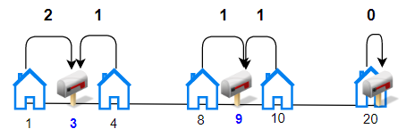
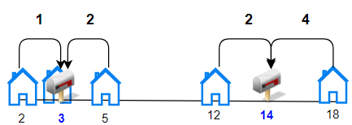

### [1478\. 安排邮筒](https://leetcode.cn/problems/allocate-mailboxes/)

难度：困难

给你一个房屋数组`houses` 和一个整数 `k`，其中 `houses[i]` 是第 `i` 栋房子在一条街上的位置，现需要在这条街上安排 `k` 个邮筒。

请你返回每栋房子与离它最近的邮筒之间的距离的 **最小** 总和。

答案保证在 32 位有符号整数范围以内。

**示例 1：**

> 
> **输入：** houses = [1,4,8,10,20], k = 3
> **输出：** 5
> **解释：** 将邮筒分别安放在位置 3，9 和 20 处。
> 每个房子到最近邮筒的距离和为 |3-1| + |4-3| + |9-8| + |10-9| + |20-20| = 5。

**示例 2：**

> 
> **输入：** houses = [2,3,5,12,18], k = 2
> **输出：** 9
> **解释：** 将邮筒分别安放在位置 3 和 14 处。
> 每个房子到最近邮筒距离和为 |2-3| + |3-3| + |5-3| + |12-14| + |18-14| = 9。

**示例 3：**

> **输入：** houses = [7,4,6,1], k = 1
> **输出：** 8

**示例 4：**

> **输入：** houses = [3,6,14,10], k = 4
> **输出：** 0

**提示：**

- `n == houses.length`
- `1 <= n <= 100`
- <code>1 <= houses[i] <= 104</code>
- `1 <= k <= n`
- 数组 `houses` 中的整数互不相同。
