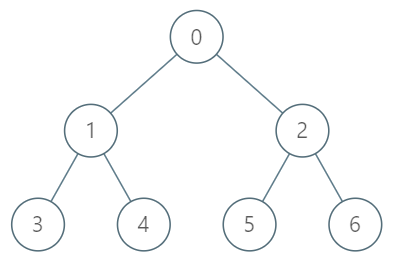

### [dfs+层次遍历+二分查找 倍增什么的就是不想学（x）](https://leetcode.cn/problems/kth-ancestor-of-a-tree-node/solutions/288228/dfsceng-ci-bian-li-er-fen-cha-zhao-bei-zeng-shi-ya/)

#### 预备知识

1. 一个节点的所有祖先节点(从根节点到该节点的路径上经过的所有点)的dfs序(从根节点已dfs访问的顺序)都在该节点前。 例如：
    
    dfs序为 0, 1, 3, 4, 2, 5, 6。每个节点的祖先节点都在它前面。
2. 可以通过BFS对树进行层次遍历，确定每层有哪些节点。

#### 分析

有了上面两个预备知识，我们可以想到： 假设要找节点A的第k个父节点，节点A在第L层，即只需找到第L-k层的所有节点中A的祖先节点。 又由于A的祖先节点在每一层只有一个，且dfs序必然在节点A前，所以可以通过二分查找在第L-k层中找比A小且距离A最近的元素即为答案。

#### 时间复杂度

1. DFS和BFS预处理 O(n)
2. 二分查找搜索 O(logn)/次

#### Code

```java
class TreeAncestor {
    
    // 构建dfs序并存map
    int[] map;
    int[] mapr;
    int order = 0;
    public void dfs(int index, List<Integer>[] edges) {
        map[index] = order;
        mapr[order] = index;
        order++;
        for(int son : edges[index]) {
            dfs(son, edges);
        }
    }
    
    // 存下每一层的所有节点(bfs序号)及每个节点对应的层号
    List<List<Integer>> layer;
    int[] mapl;
    public TreeAncestor(int n, int[] parent) {
        map = new int[n];
        mapr = new int[n];
        mapl = new int[n];
        layer = new ArrayList<>();
        
        List<Integer>[] edges = new List[n];
        for(int i = 0; i < n; i++) edges[i] = new ArrayList<>();
        for(int i = 1; i < n; i++) {
            edges[parent[i]].add(i);
        }
        dfs(0, edges);
        
        List<Integer> nl = new ArrayList<>();
        nl.add(map[0]);
    
        int ct = 0;
        while(nl.size() != 0) {
            layer.add(nl);
            List<Integer> nextl = new ArrayList<>();
            for(int node : nl) {
                mapl[node] = ct;
                for(int next : edges[mapr[node]]) {
                    nextl.add(map[next]);
                }
            }
            nl = nextl;
            ct++;
        }
        
    }
    
    public int getKthAncestor(int node, int k) {
        // 先找到要去的层级
        int mnode = map[node];
        int L = mapl[mnode];
        int tl = L - k;
        if(tl < 0) return -1;
        
        List<Integer> flayer = layer.get(tl);
        
        // 二分查找到祖先节点
        int l = 0, r = flayer.size() - 1;
        while(l < r) {
            int mid = (l + r + 1) >> 1;
            if(flayer.get(mid) < mnode) l = mid;
            else r = mid - 1;
        }

        return mapr[flayer.get(l)];
    }
}

/**
 * Your TreeAncestor object will be instantiated and called as such:
 * TreeAncestor obj = new TreeAncestor(n, parent);
 * int param_1 = obj.getKthAncestor(node,k);
 */
```
