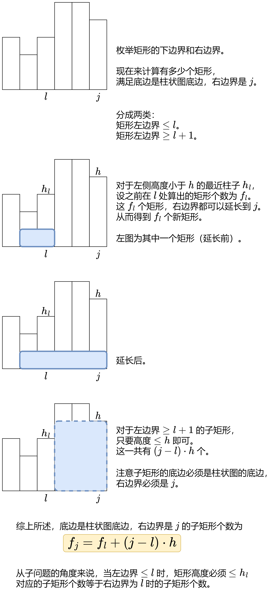

### [【图解】两种方法：枚举上下边界 $/$ 单调栈（Python/Java/C++/Go）](https://leetcode.cn/problems/count-submatrices-with-all-ones/solutions/3704971/omn-dan-diao-zhan-pythonjavacgo-by-endle-jf8l/)

#### 方法一：枚举子矩形的上下边界

枚举子矩形的上下边界，统计每一列的 $1$ 的个数，把原问题「压缩」为一维数组上的问题。


在示例 $2$ 中，假设现在枚举到子矩形的上边界为 $0$ 行，下边界为 $1$ 行，即 $mat$ 的前两行。子矩形的高 $h=2$。

统计每一列的 $1$ 的个数，得到一个一维数组 $a=[0,2,2,1]$。我们要找的子矩形，就是 $a$ 的子数组。由于全 $1$ 子矩形的每一列都是 $1$，所以子数组的每一项都得是子矩形的高 $h=2$。问题变成：

- 统计 $a$ 的全 $h$ 子数组的数目。

做法同 [2348\. 全 0 子数组的数目](https://leetcode.cn/problems/number-of-zero-filled-subarrays/)。

代码实现时，外层循环枚举上边界，内层循环枚举下边界。当下边界 $bottom$ 加一时，只需把每个 $a[j]$ 都增加相应的 $mat[bottom][j]$，无需整个重新统计。

```Python
class Solution:
    def numSubmat(self, mat: List[List[int]]) -> int:
        m, n = len(mat), len(mat[0])
        ans = 0
        for top in range(m):  # 枚举上边界
            a = [0] * n
            for bottom in range(top, m):  # 枚举下边界
                h = bottom - top + 1  # 高
                # 2348. 全 h 子数组的数目
                last = -1
                for j in range(n):
                    a[j] += mat[bottom][j]  # 把 bottom 这一行的值加到 a 中
                    if a[j] != h:
                        last = j  # 记录上一个非 h 元素的位置
                    else:
                        ans += j - last
        return ans
```

```Java
class Solution {
    public int numSubmat(int[][] mat) {
        int m = mat.length;
        int n = mat[0].length;
        int ans = 0;
        for (int top = 0; top < m; top++) { // 枚举上边界
            int[] a = new int[n];
            for (int bottom = top; bottom < m; bottom++) { // 枚举下边界
                int h = bottom - top + 1; // 高
                // 2348. 全 h 子数组的数目
                int last = -1;
                for (int j = 0; j < n; j++) {
                    a[j] += mat[bottom][j]; // 把 bottom 这一行的值加到 a 中
                    if (a[j] != h) {
                        last = j; // 记录上一个非 h 元素的位置
                    } else {
                        ans += j - last;
                    }
                }
            }
        }
        return ans;
    }
}
```

```C++
class Solution {
public:
    int numSubmat(vector<vector<int>>& mat) {
        int m = mat.size(), n = mat[0].size();
        int ans = 0;
        for (int top = 0; top < m; top++) { // 枚举上边界
            vector<int> a(n);
            for (int bottom = top; bottom < m; bottom++) { // 枚举下边界
                int h = bottom - top + 1; // 高
                // 2348. 全 h 子数组的数目
                int last = -1;
                for (int j = 0; j < n; j++) {
                    a[j] += mat[bottom][j]; // 把 bottom 这一行的值加到 a 中
                    if (a[j] != h) {
                        last = j; // 记录上一个非 h 元素的位置
                    } else {
                        ans += j - last;
                    }
                }
            }
        }
        return ans;
    }
};
```

```Go
func numSubmat(mat [][]int) (ans int) {
    m, n := len(mat), len(mat[0])
    for top := range m { // 枚举上边界
        a := make([]int, n)
        for bottom := top; bottom < m; bottom++ { // 枚举下边界
            h := bottom - top + 1 // 高
            // 2348. 全 h 子数组的数目
            last := -1
            for j := range n {
                a[j] += mat[bottom][j] // 把 bottom 这一行的值加到 a 中
                if a[j] != h {
                    last = j // 记录上一个非 h 元素的位置
                } else {
                    ans += j - last
                }
            }
        }
    }
    return
}
```

#### 复杂度分析

- 时间复杂度：$O(m^2n)$，其中 $m$ 和 $n$ 分别为 $mat$ 的行数和列数。
- 空间复杂度：$O(n)$。

#### 方法二：单调栈

**前置题目**：[85\. 最大矩形](https://leetcode.cn/problems/maximal-rectangle/)，接着 [我的题解](https://leetcode.cn/problems/maximal-rectangle/solutions/3704011/zhi-jie-diao-yong-84-ti-dai-ma-jie-jue-p-49at/) 继续讲。

枚举子矩形的**右下角**（枚举底边，枚举右边界），有多少个对应的子矩形？



举个例子。


在示例 $2$ 中，当我们枚举到最后一行时，柱子高度为 $heights=[1,3,3,0]$。然后枚举子矩形的右边界：

- 右边界为 $j=0$，子矩形只有 $1$ 个。
- 右边界为 $j=1$，子矩形分成两类：
  - 左边界 $<1$。在右边界为 $j=0$ 时我们算出这有 $1$ 个，现在将其右边界扩展到 $j=1$，得到 $1$ 个新的子矩形。
  - 左边界 $\ge 1$。左边界只能是 $1$，矩形高度有 $1,2,3$ 共 $3$ 种，有 $1\times 3=3$ 个子矩形。
- 右边界为 $j=2$，子矩形分成两类：
  - 左边界 $<1$。在右边界为 $j=0$ 时我们算出这有 $1$ 个，现在将其右边界扩展到 $j=2$，得到 $1$ 个新的子矩形。
  - 左边界 $\ge 1$。左边界可以是 $1,2$ 共 $2$ 种，矩形高度有 $1,2,3$ 共 $3$ 种，有 $2\times 3=6$ 个子矩形。
- 右边界为 $j=3$，高度为 $0$，没有子矩形。

一般地，用 [单调栈](https://leetcode.cn/link/?target=https%3A%2F%2Fwww.bilibili.com%2Fvideo%2FBV1VN411J7S7%2F) 计算小于 $heights[j]$ 的左边最近柱子的位置 $left$，把子矩形分成两类：

- 左边界 $\le left$。假设在右边界为 $j=left$ 时我们算出这有 $f$ 个，现在将其右边界扩展到 $j$，得到 $f$ 个新的子矩形。
- 左边界 $>left$。矩形左边界可以是 $left+1,left+2,\dots ,j$，共 $j-left$ 种；矩形高度可以是 $1,2,\dots ,heights[j]$，共 $heights[j]$ 种。所以有 (j-left)⋅heights[j] 个子矩形。
- 二者相加，就是右边界在 $j$ 的子矩形个数。加到答案中。

```Python
class Solution:
    def numSubmat(self, mat: List[List[int]]) -> int:
        heights = [0] * len(mat[0])
        ans = 0
        for row in mat:
            for j, x in enumerate(row):
                if x == 0:
                    heights[j] = 0
                else:
                    heights[j] += 1

            # (j, f, heights[j])
            st = [(-1, 0, -1)]  # 哨兵，方便处理 left=-1 的情况
            for j, h in enumerate(heights):
                while st[-1][2] >= h:
                    st.pop()
                left, f, _ = st[-1]
                # 计算底边为 row，右边界为 j 的子矩形个数
                # 左边界 <= left 的矩形，每个矩形的右边界都可以扩展到 j，一共有 f 个
                # 左边界 >  left 的矩形，左边界有 j-left 种，高度有 h 种，一共有 (j-left)*h 个
                f += (j - left) * h
                ans += f
                st.append((j, f, h))
        return ans
```

```Java
class Solution {
    public int numSubmat(int[][] mat) {
        int n = mat[0].length;
        int[] heights = new int[n];
        int ans = 0;

        int[][] st = new int[n + 1][3]; // (j, f, heights[j])
        for (int[] row : mat) {
            for (int j = 0; j < n; j++) {
                if (row[j] == 0) {
                    heights[j] = 0;
                } else {
                    heights[j]++;
                }
            }

            st[0][0] = st[0][2] = -1; // 哨兵，方便处理 left=-1 的情况
            int top = 0;
            for (int j = 0; j < n; j++) {
                int h = heights[j];
                while (st[top][2] >= h) {
                    top--; // 出栈
                }
                int left = st[top][0];
                int f = st[top][1];
                // 计算底边为 row，右边界为 j 的子矩形个数
                // 左边界 <= left 的矩形，每个矩形的右边界都可以扩展到 j，一共有 f 个
                // 左边界 >  left 的矩形，左边界有 j-left 种，高度有 h 种，一共有 (j-left)*h 个
                f += (j - left) * h;
                ans += f;
                top++;
                st[top][0] = j; // 入栈
                st[top][1] = f;
                st[top][2] = h;
            }
        }

        return ans;
    }
}
```

```C++
class Solution {
public:
    int numSubmat(vector<vector<int>>& mat) {
        int n = mat[0].size();
        vector<int> heights(n);
        int ans = 0;

        for (auto& row : mat) {
            for (int j = 0; j < n; j++) {
                if (row[j] == 0) {
                    heights[j] = 0;
                } else {
                    heights[j]++;
                }
            }

            stack<tuple<int, int, int>> st; // (j, f, heights[j])
            st.emplace(-1, 0, -1); // 哨兵，方便处理 left=-1 的情况
            for (int j = 0; j < n; j++) {
                int h = heights[j];
                while (get<2>(st.top()) >= h) {
                    st.pop();
                }
                auto [left, f, _] = st.top();
                // 计算底边为 row，右边界为 j 的子矩形个数
                // 左边界 <= left 的矩形，每个矩形的右边界都可以扩展到 j，一共有 f 个
                // 左边界 >  left 的矩形，左边界有 j-left 种，高度有 h 种，一共有 (j-left)*h 个
                f += (j - left) * h;
                ans += f;
                st.emplace(j, f, h);
            }
        }

        return ans;
    }
};
```

```Go
func numSubmat(mat [][]int) (ans int) {
    heights := make([]int, len(mat[0]))
    for _, row := range mat {
        for j, x := range row {
            if x == 0 {
                heights[j] = 0
            } else {
                heights[j]++
            }
        }

        type tuple struct{ j, f, h int }
        st := []tuple{{-1, 0, -1}} // 哨兵，方便处理 left=-1 的情况
        for j, h := range heights {
            for st[len(st)-1].h >= h {
                st = st[:len(st)-1]
            }
            p := st[len(st)-1]
            left, f := p.j, p.f
            // 计算底边为 row，右边界为 j 的子矩形个数
            // 左边界 <= left 的矩形，每个矩形的右边界都可以扩展到 j，一共有 f 个
            // 左边界 >  left 的矩形，左边界有 j-left 种，高度有 h 种，一共有 (j-left)*h 个
            f += (j - left) * h
            ans += f
            st = append(st, tuple{j, f, h})
        }
    }
    return
}
```

#### 复杂度分析

- 时间复杂度：$O(mn)$，其中 $m$ 和 $n$ 分别为 $mat$ 的行数和列数。
- 空间复杂度：$O(n)$。

#### 相似题目

见下面单调栈题单的「**二、矩形**」。

#### 分类题单

[如何科学刷题？](https://leetcode.cn/circle/discuss/RvFUtj/)

1. [滑动窗口与双指针（定长/不定长/单序列/双序列/三指针/分组循环）$](https://leetcode.cn/circle/discuss/0viNMK/)$
2. [二分算法（二分答案/最小化最大值/最大化最小值/第K小）$](https://leetcode.cn/circle/discuss/SqopEo/)$
3. [单调栈（基础/矩形面积/贡献法/最小字典序）$](https://leetcode.cn/circle/discuss/9oZFK9/)$
4. [网格图（DFS/BFS/综合应用）$](https://leetcode.cn/circle/discuss/YiXPXW/)$
5. [位运算（基础/性质/拆位/试填/恒等式/思维）$](https://leetcode.cn/circle/discuss/dHn9Vk/)$
6. [图论算法（DFS/BFS/拓扑排序/基环树/最短路/最小生成树/网络流）$](https://leetcode.cn/circle/discuss/01LUak/)$
7. [动态规划（入门/背包/划分/状态机/区间/状压/数位/数据结构优化/树形/博弈/概率期望）$](https://leetcode.cn/circle/discuss/tXLS3i/)$
8. [常用数据结构（前缀和/差分/栈/队列/堆/字典树/并查集/树状数组/线段树）$](https://leetcode.cn/circle/discuss/mOr1u6/)$
9. [数学算法（数论/组合/概率期望/博弈/计算几何/随机算法）$](https://leetcode.cn/circle/discuss/IYT3ss/)$
10. [贪心与思维（基本贪心策略/反悔/区间/字典序/数学/思维/脑筋急转弯/构造）$](https://leetcode.cn/circle/discuss/g6KTKL/)$
11. [链表、二叉树与回溯（前后指针/快慢指针/DFS/BFS/直径/LCA/一般树）$](https://leetcode.cn/circle/discuss/K0n2gO/)$
12. [字符串（KMP/Z函数/Manacher/字符串哈希/AC自动机/后缀数组/子序列自动机）$](https://leetcode.cn/circle/discuss/SJFwQI/)$
