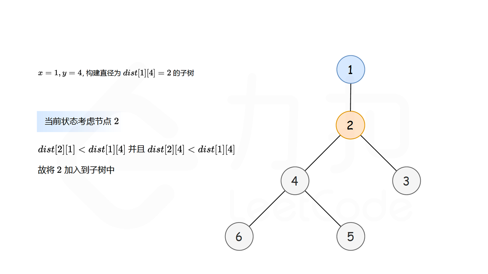
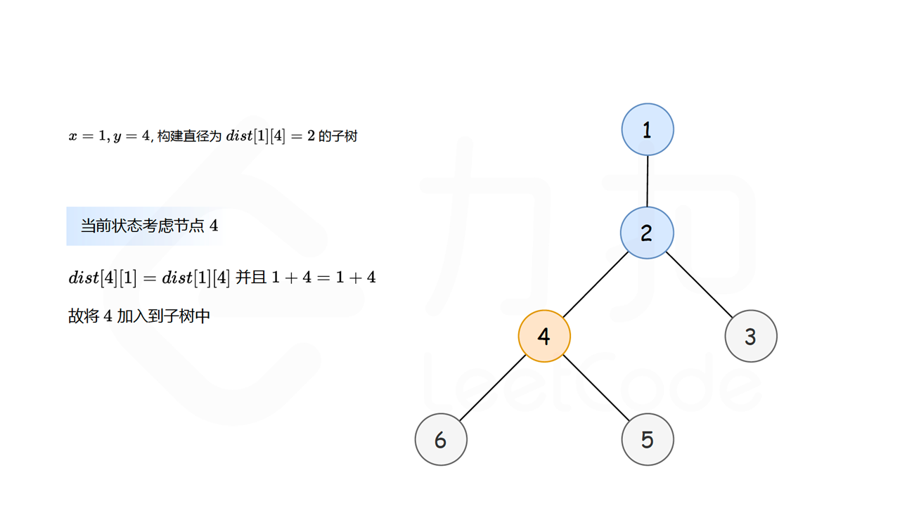
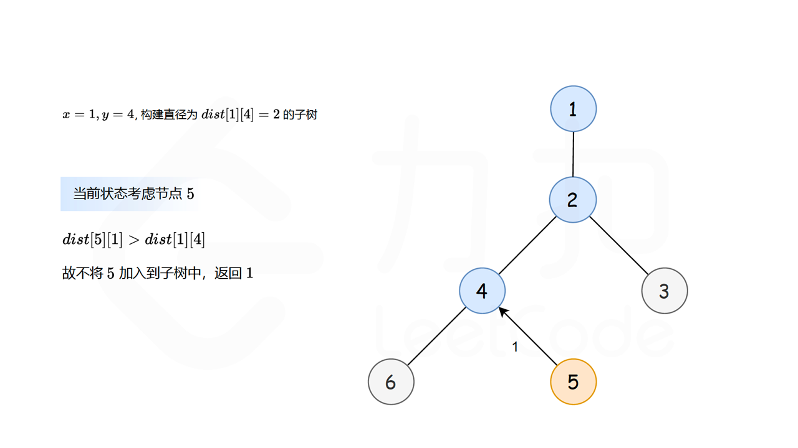
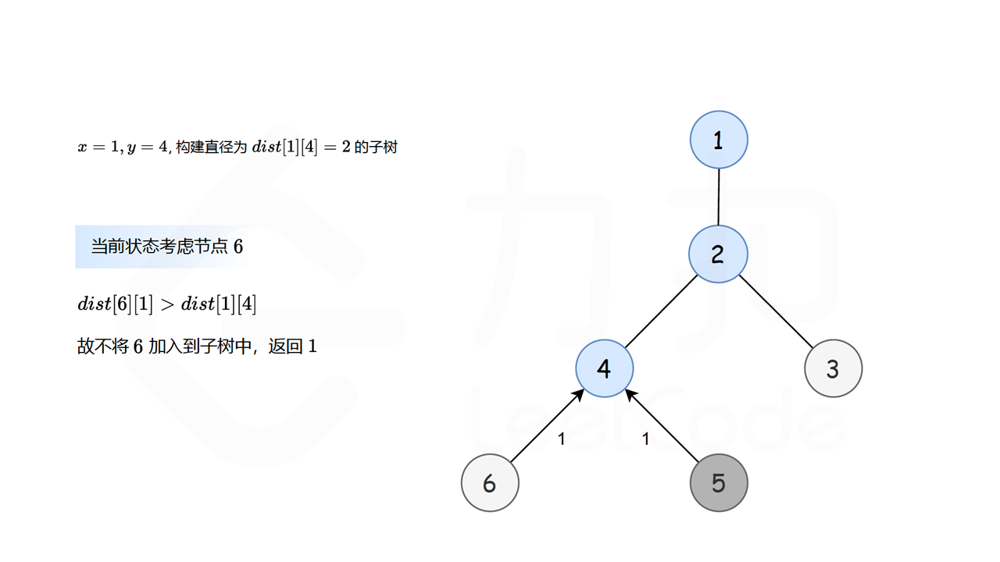
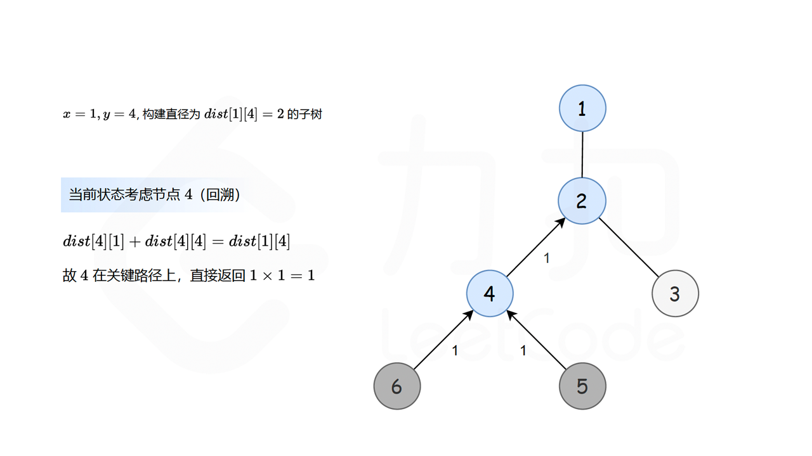
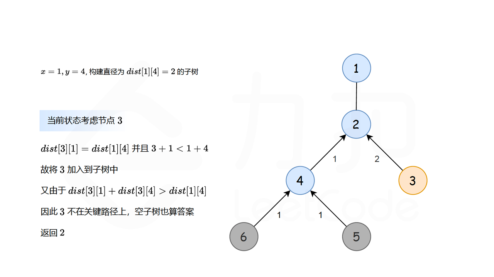
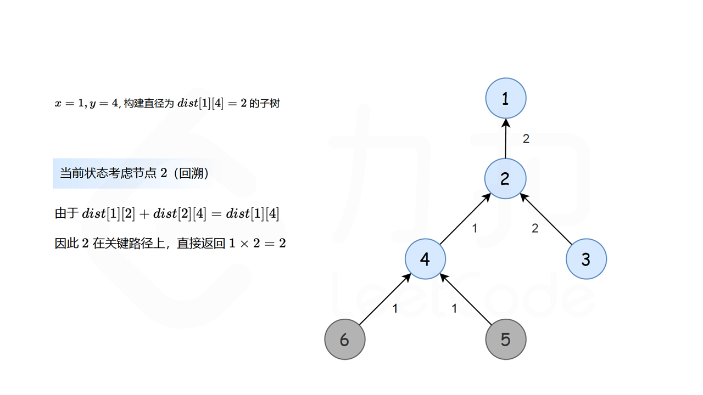
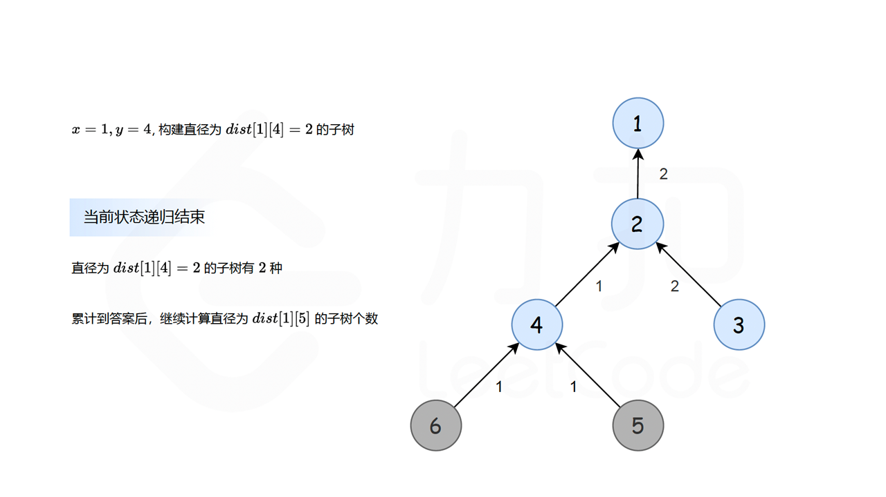

#### [方法三：枚举任意两点直径](https://leetcode.cn/problems/count-subtrees-with-max-distance-between-cities/solutions/2161714/tong-ji-zi-shu-zhong-cheng-shi-zhi-jian-duoq1/)

**思路与算法**

设城市中的任意两个节点为 $x,y$，它们之间的距离为 $dist[x][y]$，如果我们可以求出以 $dist[x][y]$ 为直径且包含 $x,y$ 的子树数目，就可以求出所有直径的子树数目。该算法的难点在于如何求出以 $dist[x][y]$ 为直径且包含 $x,y$ 的子树，假设当前已知符合上述要求子树的数目为 $c(x,y)$，如果子树可以扩展到当前节点 $u$，则节点 $u$ 是否可以加入到子树中？节点 $u$ 可以加入到子树直径为 $dist[x][y]$ 的子树中，需要满足以下条件：

-   节点 $u$ 到节点 $x$ 与 $y$ 的距离均应小于 $dist[x][y]$，即 $dist[u][x] \le dist[x][y],dist[u][y] \le dist[x][y]$；
-   如果 $dist[x][y]$ 为包含节点 $x,y$ 的子树的直径，则 $x,y$ 在该子树中一定为叶子节点，且子树中所有直径的两个起始端点均为叶子节点，可以通过反证明法来证明；

设两个节点 $x,y$ 且满足 $x < y$，则此时我们以 $x$ 为根节点开始构造直径为 $dist[x][y]$ 的子树：

-   如果以当前相邻的节点 $u$ 满足 $dist[u][x]<dist[x][y],dist[u][y]<dist[x][y]$，此时节点 $u$ 一定可以加入到子树中，此时的直径即为 $dist[x][y]$，此时我们继续向外延伸到 $u$ 的孩子节点；
-   如果以当前相邻的节点 $u$ 满足 $dist[u][x] = dist[x][y]$ 或者 $dist[u][y] = dist[x][y]$ 时，此时 $u$ 也一定可以加入到子树中，但可能存在重复计算的问题，为了防止重复计算，对于每对 $(x,y)$ 且 $x < y$，如果加入新的节点 $u$ 后，存在相等的直径 $dist[u][x]$ 或者 $dist[u][y]$，此时我们要求直径的两个端点之和一定要大于等于 $x + y$：
    -   如果 $dist[x][u] = dist[x][y]$，即 $u$ 到较小的节点 $x$ 的距离等于当前的直径，则此时要求 $(u + x) \ge (x + y)$，即此时需要满足 $u \ge y$;
    -   如果 $dist[y][u] = dist[x][y]$，即 $u$ 到较大的节点 $y$ 的距离等于当前的直径，则此时要求 $(u + y) \ge (x + y)$，即此时需要满足 $u \ge x$;
-   如果当前节点 $u$ 可以加入时，如果节点 $u$ 不在 $x$ 到 $y$ 的关键路径上时，此时节点 $u$ 可以不在目标子树中，以节点 $u$ 为根节点的子树为空，即空子树也计数为一种子树。










我们每次计算以 $u$ 为根节点构成满足要求的子树的数目 $count(u)$，此时它们之间的关系为相乘。即假设根节点 $x$ 含有 $m$ 个孩子节点分别为 $c_0,c_1,\cdots,c_{m-1}$，每个孩子节点可以构成的子树的数目为 $count(c_0),count(c_1),\cdots,count(c_{m-1})$，则此时构成的子树的总数目为 $\prod\limits_{i=0}^{m-1}count(c_i)$。枚举所有的节点对 $(x,y)$ 且满足 $x < y$，并计算以 $dist[x][y]$ 为直径的子树数目，即可计算出所有符合要求的子树的数目。

**代码**

```cpp
class Solution {
public:      
    vector<int> countSubgraphsForEachDiameter(int n, vector<vector<int>>& edges) {
        vector<vector<int>> adj(n);        
        vector<vector<int>> dist(n, vector<int>(n, INT_MAX));
        for (auto &edge : edges) {
            int x = edge[0] - 1;
            int y = edge[1] - 1;
            adj[x].emplace_back(y);
            adj[y].emplace_back(x);
            dist[x][y] = dist[y][x] = 1;
        }
        for (int i = 0; i < n; i++) {
            dist[i][i] = 0;
        }
        for (int i = 0; i < n; i++) {
            for (int j = 0; j < n; j++) {
                for (int k = 0; k < n; k++) {
                    if (dist[j][i] != INT_MAX && dist[i][k] != INT_MAX) {
                        dist[j][k] = min(dist[j][k], dist[j][i] + dist[i][k]);
                    }
                }
            }
        }
        function<int(int, int, int, int)> dfs = [&](int u, int parent, int x, int y) -> int {
            if (dist[u][x] > dist[x][y] || dist[u][y] > dist[x][y]) {
                return 1;
            }
            if ((dist[u][y] == dist[x][y] && u < x) || (dist[u][x] == dist[x][y] && u < y)) {
                return 1;
            }
            int ret = 1;
            for (int v : adj[u]) {
                if (v != parent) {
                    ret *= dfs(v, u, x, y);
                }
            }
            if (dist[u][x] + dist[u][y] > dist[x][y]) {
                ret++;
            }
            return ret;
        };
        vector<int> ans(n - 1);
        for (int i = 0; i < n - 1; i++) {
            for (int j = i + 1; j < n; j++) {
                ans[dist[i][j] - 1] += dfs(i, -1, i, j);
            }
        }
        return ans;
    }
};
```

```java
class Solution {
    public int[] countSubgraphsForEachDiameter(int n, int[][] edges) {
        List<Integer>[] adj = new List[n];
        int[][] dist = new int[n][n];
        for (int i = 0; i < n; i++) {
            Arrays.fill(dist[i], Integer.MAX_VALUE);
            dist[i][i] = 0;
        }
        for (int i = 0; i < n; i++) {
            adj[i] = new ArrayList<Integer>();
        }
        for (int[] edge : edges) {
            int x = edge[0] - 1;
            int y = edge[1] - 1;
            adj[x].add(y);
            adj[y].add(x);
            dist[x][y] = dist[y][x] = 1;
        }
        for (int i = 0; i < n; i++) {
            for (int j = 0; j < n; j++) {
                for (int k = 0; k < n; k++) {
                    if (dist[j][i] != Integer.MAX_VALUE && dist[i][k] != Integer.MAX_VALUE) {
                        dist[j][k] = Math.min(dist[j][k], dist[j][i] + dist[i][k]);
                    }
                }
            }
        }
        int[] ans = new int[n - 1];
        for (int i = 0; i < n - 1; i++) {
            for (int j = i + 1; j < n; j++) {
                ans[dist[i][j] - 1] += dfs(adj, dist, i, -1, i, j);
            }
        }
        return ans;
    }

    public int dfs(List<Integer>[] adj, int[][] dist, int u, int parent, int x, int y) {
        if (dist[u][x] > dist[x][y] || dist[u][y] > dist[x][y]) {
            return 1;
        }
        if ((dist[u][y] == dist[x][y] && u < x) || (dist[u][x] == dist[x][y] && u < y)) {
            return 1;
        }
        int ret = 1;
        for (int v : adj[u]) {
            if (v != parent) {
                ret *= dfs(adj, dist, v, u, x, y);
            }
        }
        if (dist[u][x] + dist[u][y] > dist[x][y]) {
            ret++;
        }
        return ret;
    }
}
```

```csharp
public class Solution {
    public int[] CountSubgraphsForEachDiameter(int n, int[][] edges) {
        IList<int>[] adj = new IList<int>[n];
        int[][] dist = new int[n][];
        for (int i = 0; i < n; i++) {
            dist[i] = new int[n];
            Array.Fill(dist[i], int.MaxValue);
            dist[i][i] = 0;
        }
        for (int i = 0; i < n; i++) {
            adj[i] = new List<int>();
        }
        foreach (int[] edge in edges) {
            int x = edge[0] - 1;
            int y = edge[1] - 1;
            adj[x].Add(y);
            adj[y].Add(x);
            dist[x][y] = dist[y][x] = 1;
        }
        for (int i = 0; i < n; i++) {
            for (int j = 0; j < n; j++) {
                for (int k = 0; k < n; k++) {
                    if (dist[j][i] != int.MaxValue && dist[i][k] != int.MaxValue) {
                        dist[j][k] = Math.Min(dist[j][k], dist[j][i] + dist[i][k]);
                    }
                }
            }
        }
        int[] ans = new int[n - 1];
        for (int i = 0; i < n - 1; i++) {
            for (int j = i + 1; j < n; j++) {
                ans[dist[i][j] - 1] += DFS(adj, dist, i, -1, i, j);
            }
        }
        return ans;
    }

    public int DFS(IList<int>[] adj, int[][] dist, int u, int parent, int x, int y) {
        if (dist[u][x] > dist[x][y] || dist[u][y] > dist[x][y]) {
            return 1;
        }
        if ((dist[u][y] == dist[x][y] && u < x) || (dist[u][x] == dist[x][y] && u < y)) {
            return 1;
        }
        int ret = 1;
        foreach (int v in adj[u]) {
            if (v != parent) {
                ret *= DFS(adj, dist, v, u, x, y);
            }
        }
        if (dist[u][x] + dist[u][y] > dist[x][y]) {
            ret++;
        }
        return ret;
    }
}
```

```c
const int INFI = 0x3f3f3f3f;

static inline int min(int a, int b) {
    return a < b ? a : b;
}

int dfs(int u, int parent, int x, int y, int **dist, int **adj, int *adjColSize) {
    if (dist[u][x] > dist[x][y] || dist[u][y] > dist[x][y]) {
        return 1;
    }
    if ((dist[u][y] == dist[x][y] && u < x) || (dist[u][x] == dist[x][y] && u < y)) {
        return 1;
    }
    int ret = 1;
    for (int i = 0; i < adjColSize[u]; i++) {
        int v = adj[u][i];
        if (v != parent) {
            ret *= dfs(v, u, x, y, dist, adj, adjColSize);
        }
    }
    if (dist[u][x] + dist[u][y] > dist[x][y]) {
        ret++;
    }
    return ret;
};

int* countSubgraphsForEachDiameter(int n, int** edges, int edgesSize, int* edgesColSize, int* returnSize) {
    int *adj[n], *dist[n];
    int adjColSize[n];
    for (int i = 0; i < n; i++) {
        adj[i] = (int *)calloc(n, sizeof(int));
        dist[i] = (int *)calloc(n, sizeof(int));
        memset(dist[i], 0x3f, sizeof(int) * n);
        dist[i][i] = 0;
    }
    memset(adjColSize, 0, sizeof(adjColSize));
    for (int i = 0; i < edgesSize; i++) {
        int x = edges[i][0] - 1;
        int y = edges[i][1] - 1;
        adj[x][adjColSize[x]++] = y;
        adj[y][adjColSize[y]++] = x;
        dist[x][y] = dist[y][x] = 1;
    }
    for (int i = 0; i < n; i++) {
        for (int j = 0; j < n; j++) {
            for (int k = 0; k < n; k++) {
                if (dist[j][i] != INFI && dist[i][k] != INFI) {
                    dist[j][k] = min(dist[j][k], dist[j][i] + dist[i][k]);
                }
            }
        }
    }

    int *ans = (int *)calloc(n - 1, sizeof(int));
    for (int i = 0; i < n - 1; i++) {
        for (int j = i + 1; j < n; j++) {
            ans[dist[i][j] - 1] += dfs(i, -1, i, j, dist, adj, adjColSize);
        }
    }
    for (int i = 0; i < n; i++) {
        free(adj[i]);
        free(dist[i]);
    }
    *returnSize = n - 1;
    return ans;
}
```

```javascript
var countSubgraphsForEachDiameter = function(n, edges) {
    const adj = new Array(n).fill(0);
    const dist = new Array(n).fill(0).map(() => new Array(n).fill(Number.MAX_SAFE_INTEGER));
    for (let i = 0; i < n; i++) {
        dist[i][i] = 0;
    }
    for (let i = 0; i < n; i++) {
        adj[i] = [];
    }
    for (const edge of edges) {
        const x = edge[0] - 1;
        const y = edge[1] - 1;
        adj[x].push(y);
        adj[y].push(x);
        dist[x][y] = dist[y][x] = 1;
    }
    for (let i = 0; i < n; i++) {
        for (let j = 0; j < n; j++) {
            for (let k = 0; k < n; k++) {
                if (dist[j][i] !== Number.MAX_VALUE && dist[i][k] !== Number.MAX_VALUE) {
                    dist[j][k] = Math.min(dist[j][k], dist[j][i] + dist[i][k]);
                }
            }
        }
    }
    const ans = new Array(n - 1).fill(0);
    for (let i = 0; i < n - 1; i++) {
        for (let j = i + 1; j < n; j++) {
            ans[dist[i][j] - 1] += dfs(adj, dist, i, -1, i, j);
        }
    }
    return ans;
}

const dfs = (adj, dist, u, parent, x, y) => {
    if (dist[u][x] > dist[x][y] || dist[u][y] > dist[x][y]) {
        return 1;
    }
    if ((dist[u][y] === dist[x][y] && u < x) || (dist[u][x] === dist[x][y] && u < y)) {
        return 1;
    }
    let ret = 1;
    for (const v of adj[u]) {
        if (v !== parent) {
            ret *= dfs(adj, dist, v, u, x, y);
        }
    }
    if (dist[u][x] + dist[u][y] > dist[x][y]) {
        ret++;
    }
    return ret;
}
const numberOfLeadingZeros = (i) => {
    if (i === 0)
        return 32;
    let n = 1;
    if (i >>> 16 === 0) { n += 16; i <<= 16; }
    if (i >>> 24 === 0) { n +=  8; i <<=  8; }
    if (i >>> 28 === 0) { n +=  4; i <<=  4; }
    if (i >>> 30 === 0) { n +=  2; i <<=  2; }
    n -= i >>> 31;
    return n;
}
```

**复杂度分析**

-   时间复杂度：$O(n^3)$，其中 $n$ 表示给定的城市的数目。我们利用 $Floyd$ 算法求图中任意两个节点的最短距离需要的时间为 $O(n^3)$，枚举任意两点为直径，一共最多可以有 $n^2$ 种枚举，每次生成给定直径长度的子树需要的时间为 $O(n)$，因此枚举任意两点为直径的子树需要的时间为 $O(n^3)$，总的时间复杂度为 $O(n^3)$。
-   空间复杂度：$O(n^2)$，其中 $n$ 表示给定的城市的数目。我们需要存储图的邻接关系，由于图中只有 $n-1$ 条边，存储图的邻接关系需要的空间为 $O(n)$，存储任意两点的最大距离需要的空间为 $O(n^2)$，因此总的空间复杂度为 $O(n^2)$。
