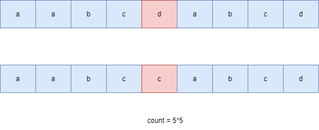

#### [方法二：动态规划](https://leetcode.cn/problems/count-substrings-that-differ-by-one-character/solutions/2192088/tong-ji-zhi-chai-yi-ge-zi-fu-de-zi-chuan-z8xi/)

**思路与算法**

题目要求求出字符串 $s$ 与字符串 $t$ 的连续子串中只差一个字符的子串对的数目，此时我们可以枚举 $s$ 与 $t$ 中不相等的字符对 $(s[i],t[j])$，并计算以 $(s[i],t[j])$ 构造的符合题意的子串数目即可。在实际计算时，设以字符 $s[i]$ 与字符 $t[j]$ 为终点且左侧连续相等的最大长度为 $dpl[i][j]$，设以字符 $s[i]$ 与字符 $t[j]$ 为终点且右侧连续相等的最大长度为 $dpr[i][j]$，此时以 $(s[i],t[j])$ 为字符对且构成只差一个字符的子串对数目为 $(dpl[i][j] + 1) \times (dpr[i][j] + 1)$，此时通过枚举所有符合要求的不同的字符对 $(s[i],t[j])$ 即可计算出所有符合要求的字符串对的数目。



如何计算以 $(s[i],t[j])$ 为终点左侧和右侧连续相等的最大长度？此时可以参考经典的问题：「[最长公共子序列](https://leetcode.cn/problems/longest-common-subsequence/solutions/696763/zui-chang-gong-gong-zi-xu-lie-by-leetcod-y7u0/)」，通过动态规划实现即可，动态规划递推公式如下:

$$dpl[i][j] = \begin{cases} dpl[i-1][j-1]+1, & s[i]=t[j] \\ 0, & s[i]\neq t[j] \\ \end{cases} \\ dpr[i][j] = \begin{cases} dpr[i+1][j+1]+1, & s[i]=t[j] \\ 0, & s[i]\neq t[j] \\ \end{cases} \\$$

我们通过枚举所有不同的字符对，并分别计算出以该字符对构成的符合题目要求的字符串数目即可。

**代码**

```cpp
class Solution {
public:
    int countSubstrings(string s, string t) {
        int m = s.size(), n = t.size();
        vector<vector<int>> dpl(m + 1, vector<int>(n + 1));
        vector<vector<int>> dpr(m + 1, vector<int>(n + 1));
        for (int i = 0; i < m; i++) {
            for (int j = 0; j < n; j++) {
                dpl[i + 1][j + 1] = s[i] == t[j] ? (dpl[i][j] + 1) : 0;
            }
        }
        for (int i = m - 1; i >= 0; i--) {
            for (int j = n - 1; j >= 0; j--) {
                dpr[i][j] = s[i] == t[j] ? (dpr[i + 1][j + 1] + 1) : 0;
            }
        }
        int ans = 0;
        for (int i = 0; i < m; i++) {
            for (int j = 0; j < n; j++) {
                if (s[i] != t[j]) {
                    ans += (dpl[i][j] + 1) * (dpr[i + 1][j + 1] + 1);
                }
            }
        }
        return ans;
    }
};
```

```java
class Solution {
    public int countSubstrings(String s, String t) {
        int m = s.length(), n = t.length();
        int[][] dpl = new int[m + 1][n + 1];
        int[][] dpr = new int[m + 1][n + 1];
        for (int i = 0; i < m; i++) {
            for (int j = 0; j < n; j++) {
                dpl[i + 1][j + 1] = s.charAt(i) == t.charAt(j) ? (dpl[i][j] + 1) : 0;
            }
        }
        for (int i = m - 1; i >= 0; i--) {
            for (int j = n - 1; j >= 0; j--) {
                dpr[i][j] = s.charAt(i) == t.charAt(j) ? (dpr[i + 1][j + 1] + 1) : 0;
            }
        }
        int ans = 0;
        for (int i = 0; i < m; i++) {
            for (int j = 0; j < n; j++) {
                if (s.charAt(i) != t.charAt(j)) {
                    ans += (dpl[i][j] + 1) * (dpr[i + 1][j + 1] + 1);
                }
            }
        }
        return ans;
    }
}
```

```csharp
public class Solution {
    public int CountSubstrings(string s, string t) {
        int m = s.Length, n = t.Length;
        int[][] dpl = new int[m + 1][];
        int[][] dpr = new int[m + 1][];
        for (int i = 0; i <= m; i++) {
            dpl[i] = new int[n + 1];
            dpr[i] = new int[n + 1];
        }
        for (int i = 0; i < m; i++) {
            for (int j = 0; j < n; j++) {
                dpl[i + 1][j + 1] = s[i] == t[j] ? (dpl[i][j] + 1) : 0;
            }
        }
        for (int i = m - 1; i >= 0; i--) {
            for (int j = n - 1; j >= 0; j--) {
                dpr[i][j] = s[i] == t[j] ? (dpr[i + 1][j + 1] + 1) : 0;
            }
        }
        int ans = 0;
        for (int i = 0; i < m; i++) {
            for (int j = 0; j < n; j++) {
                if (s[i] != t[j]) {
                    ans += (dpl[i][j] + 1) * (dpr[i + 1][j + 1] + 1);
                }
            }
        }
        return ans;
    }
}
```

```c
int countSubstrings(char * s, char * t) {
    int m = strlen(s), n = strlen(t);
    int dpl[m + 1][n + 1], dpr[m + 1][n + 1];
    memset(dpl, 0, sizeof(dpl));
    memset(dpr, 0, sizeof(dpr));
    for (int i = 0; i < m; i++) {
        for (int j = 0; j < n; j++) {
            dpl[i + 1][j + 1] = s[i] == t[j] ? (dpl[i][j] + 1) : 0;
        }
    }
    for (int i = m - 1; i >= 0; i--) {
        for (int j = n - 1; j >= 0; j--) {
            dpr[i][j] = s[i] == t[j] ? (dpr[i + 1][j + 1] + 1) : 0;
        }
    }
    int ans = 0;
    for (int i = 0; i < m; i++) {
        for (int j = 0; j < n; j++) {
            if (s[i] != t[j]) {
                ans += (dpl[i][j] + 1) * (dpr[i + 1][j + 1] + 1);
            }
        }
    }
    return ans;
}
```

```javascript
var countSubstrings = function(s, t) {
    const m = s.length, n = t.length;
    const dpl = new Array(m + 1).fill(0).map(() => new Array(n + 1).fill(0));
    const dpr = new Array(m + 1).fill(0).map(() => new Array(n + 1).fill(0));
    for (let i = 0; i < m; i++) {
        for (let j = 0; j < n; j++) {
            dpl[i + 1][j + 1] = s[i] === t[j] ? (dpl[i][j] + 1) : 0;
        }
    }
    for (let i = m - 1; i >= 0; i--) {
        for (let j = n - 1; j >= 0; j--) {
            dpr[i][j] = s[i] === t[j] ? (dpr[i + 1][j + 1] + 1) : 0;
        }
    }
    let ans = 0;
    for (let i = 0; i < m; i++) {
        for (let j = 0; j < n; j++) {
            if (s[i] !== t[j]) {
                ans += (dpl[i][j] + 1) * (dpr[i + 1][j + 1] + 1);
            }
        }
    }
    return ans;
};
```

**复杂度分析**

-   时间复杂度：$O(m \times n)$，其中 $m,n$ 分别为字符串 $s$ 与 $t$ 的长度。我们计算以两个字符串中的索引 $(i,j)$ 为左终点与右终点最长连续子串长度需要的时间为 $O(m \times n)$，枚举两个字符串中不同的字符对，最多有 $O(m \times n)$ 个不同的字符对，并计算以该字符对构成的差一个字符的子串数目，每次计算的时间为 $O(1)$，因此总的时间复杂度为 $O(m \times n)$。
-   空间复杂度：$O(m \times n)$。需要存储两个字符串中的任意索引 $(i,j)$ 为左终点与右终点最长连续子串长度，需要的空间为 $O(m \times n)$。
