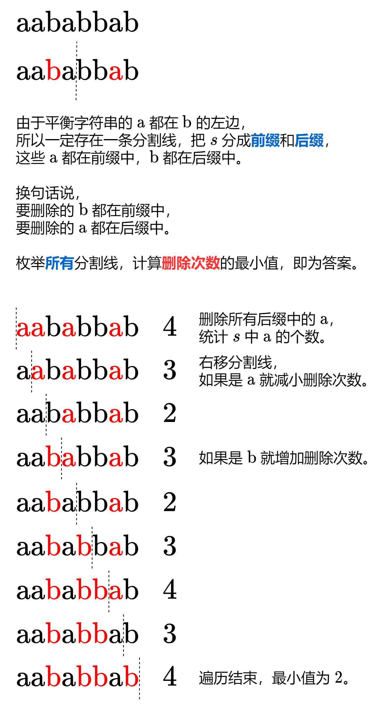

#### [方法一：前后缀分解（两次遍历）](https://leetcode.cn/problems/minimum-deletions-to-make-string-balanced/solutions/2149746/qian-hou-zhui-fen-jie-yi-zhang-tu-miao-d-dor2/)



#### 答疑

**问**：为什么把 `if-else` 写成 `(c - 'a') * 2 - 1` 就会快很多？

**答**：CPU 在遇到分支（条件跳转指令）时会预测代码要执行哪个分支，如果预测正确，CPU 就会继续按照预测的路径执行程序。但如果预测失败，CPU 就需要回滚之前的指令并加载正确的指令，以确保程序执行的正确性。

对于本题的数据，字符 $"a"$ 和 $"b"$ 可以认为是随机出现的，在这种情况下分支预测就会有 $50\%$ 的概率失败。失败导致的回滚和加载操作需要消耗额外的 CPU 周期，如果能用较小的代价去掉分支，对于本题的情况必然可以带来效率上的提升。

注意：这种优化方法往往会降低可读性，最好不要在业务代码中使用。

```python
class Solution:
    def minimumDeletions(self, s: str) -> int:
        ans = delete = s.count('a')
        for c in s:
            delete -= 1 if c == 'a' else -1
            if delete < ans:  # 手动 min 会快很多
                ans = delete
        return ans
```

```java
class Solution {
    public int minimumDeletions(String S) {
        var s = S.toCharArray();
        int del = 0;
        for (var c : s)
            del += 'b' - c; // 统计 'a' 的个数
        int ans = del;
        for (var c : s) {
            // 'a' -> -1    'b' -> 1
            del += (c - 'a') * 2 - 1;
            ans = Math.min(ans, del);
        }
        return ans;
    }
}
```

```cpp
class Solution {
public:
    int minimumDeletions(string s) {
        int del = 0;
        for (char c : s)
            del += 'b' - c; // 统计 'a' 的个数
        int ans = del;
        for (char c : s) {
            // 'a' -> -1    'b' -> 1
            del += (c - 'a') * 2 - 1;
            ans = min(ans, del);
        }
        return ans;
    }
};
```

```go
func minimumDeletions(s string) int {
    del := strings.Count(s, "a")
    ans := del
    for _, c := range s {
        // 'a' -> -1    'b' -> 1
        del += int((c-'a')*2 - 1)
        if del < ans {
            ans = del
        }
    }
    return ans
}
```

#### 复杂度分析

-   时间复杂度：$O(n)$，其中 $n$ 为 $s$ 的长度。
-   空间复杂度：$O(1)$，仅用到若干额外变量。

#### [方法二：动态规划（一次遍历）](https://leetcode.cn/problems/minimum-deletions-to-make-string-balanced/solutions/2149746/qian-hou-zhui-fen-jie-yi-zhang-tu-miao-d-dor2/)

如果你还不熟悉动态规划（包括空间优化），可以先看看 [动态规划入门](https://leetcode.cn/link/?target=https%3A%2F%2Fwww.bilibili.com%2Fvideo%2FBV1Xj411K7oF%2F)。

考虑 $s$ 的最后一个字母：

-   如果它是 $"b"$，则无需删除，问题规模缩小，变成「使 $s$ 的前 $n-1$ 个字母平衡的最少删除次数」。
-   如果它是 $"a"$：
    -   删除它，则答案为「使 $s$ 的前 $n-1$ 个字母平衡的最少删除次数」加上 $1$。
    -   保留它，那么前面的所有 $"b"$ 都要删除；

设 $cntB$ 为前 $i$ 个字母中 $"b"$ 的个数。定义 $f[i]$ 表示使 $s$ 的前 $i$ 个字母平衡的最少删除次数：

-   如果第 $i$ 个字母是 $"b"$，则 $f[i] = f[i-1]$；
-   如果第 $i$ 个字母是 $"a"$，则 $f[i] = \min(f[i-1]+1, cntB)$。

代码实现时，可以只用一个变量表示 $f$。

#### 答疑

**问**：这一次遍历怎么没两次遍历快啊？

**答**：方法一解释了。通过这两种方法的对比，相信你能感受到随机数据对分支预测的影响。

```python
class Solution:
    def minimumDeletions(self, s: str) -> int:
        f = cnt_b = 0
        for c in s:
            if c == 'b': cnt_b += 1  # f 值不变
            else: f = min(f + 1, cnt_b)
        return f
```

```java
class Solution {
    public int minimumDeletions(String s) {
        int f = 0, cntB = 0;
        for (char c : s.toCharArray())
            if (c == 'b') ++cntB; // f 值不变
            else f = Math.min(f + 1, cntB);
        return f;
    }
}
```

```cpp
class Solution {
public:
    int minimumDeletions(string s) {
        int f = 0, cnt_b = 0;
        for (char c : s)
            if (c == 'b') ++cnt_b; // f 值不变
            else f = min(f + 1, cnt_b);
        return f;
    }
};
```

```go
func minimumDeletions(s string) int {
    f, cntB := 0, 0
    for _, c := range s {
        if c == 'b' { // f 值不变
            cntB++
        } else {
            f = min(f+1, cntB)
        }
    }
    return f
}

func min(a, b int) int { if b < a { return b }; return a }
```

### 复杂度分析

-   时间复杂度：$O(n)$，其中 $n$ 为 $s$ 的长度。
-   空间复杂度：$O(1)$，仅用到若干额外变量。
