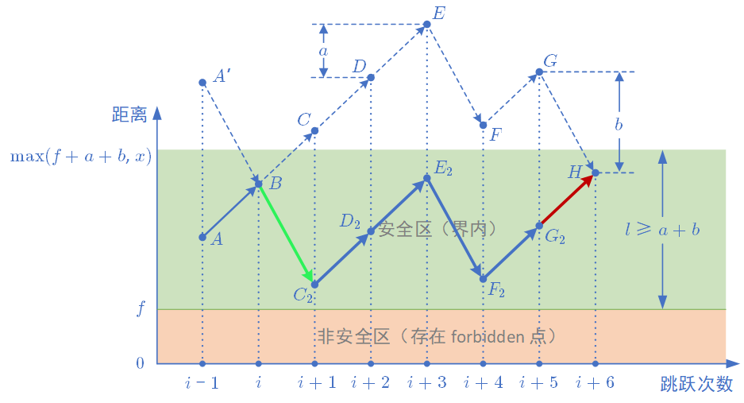

### [到家的最少跳跃次数（最短路+证明）](https://leetcode.cn/problems/minimum-jumps-to-reach-home/solutions/485685/dao-jia-de-zui-shao-tiao-yue-ci-shu-zui-duan-lu-zh/)

由于我们可以超出家的位置，最短路算法可能超时，故我们需要减小搜索范围。 可以证明，**一定可以在 $[0,\max(f + a + b, x + b)]$ 的下标范围内找到最优解，其中 $f$ 是最远的禁止点的坐标**。因为 $f,a,b,x \leq 2000$，故搜索范围不会超过 **6000**。

___

后续证明需要考虑一些细节问题，但意会后是很简单的：如果最优路径是出界的，可以调整前后跳的顺序让其不出界。（想象一条长绳子，起点和终点固定，嫌它太长所以把它折起来放）

**详细证明：**

___

**如果 $a \geq b$，** 那么当跳蚤跳到大于 $x + b$ 的位置时，最多只能后跳一次，但是无法到达 $x$，而在之后的跳跃中，最 “保守” 的跳法也是前跳一次，后跳一次，无法更加接近 $x$。故此时的最大搜索下标是 $x + b$。

___

**证明 $a< b$ 的情况：** 可以证明当 $a < b$ 时搜索的右边界为 $\max(f + a + b, x)$。

下面的 **证明1** 和 **证明2** 是等价的，可以自行选择能够理解的阅读。

___

**证明1**：

首先把整个数轴分为 $3$ 段：

-   **非安全区**：$[0,f]$。“非安全区” 指区域内会有禁止（forbidden）点。
-   **安全区（界内）**：$(f,\max(f+a+b, x)]$。注意家的位置也包含在界内。
-   **出界区**：$(\max(f+a+b, x),+\infty)$。

假设某个 **跳跃次数最少** 的路径中，$C$ 点是 **第一个** 出界的点，$H$ 点是 **第一个** 返回界内的点（注意我们把跳蚤的家的位置 $x$ 也划入了界内，因此跳蚤为了回家必须返回界内），如下图所示。图中，横坐标是跳跃次数，纵坐标是跳蚤与原点的距离。


为了让 $C$ 点不再出界，我们只需交换线段 $BC$ 和 线段 $GH$（也就是说，将第 $i + 1$ 次跳跃变为后跳，而将第 $i + 6$ 次跳跃变为前跳）即可，如下图所示：



下面从 $3$ 个方面论证这次交换的可行性：

1.  交换之前，$C,D,E,F,G$ 点都出界，与原点的距离 $l \gt f + a + b$；交换之后它们与原点的距离变为 $l - (a + b) \gt f$。也就是说，交换后，这些点没有踩到 forbidden 点的风险；
2.  交换没有增加跳跃的次数，跳跃次数仍为最优；
3.  交换不会造成两次后跳。这是因为跳蚤一定是通过 **前跳** 到达的 $B$ 点。反证：如果跳蚤是通过后跳跳到 $B$ 点的，那么 $B$ 点的前一个点 $A'$ 一定位于出界区（因为 $b > a$），与假设（$C$ 点是 **第一个** 出界的点）矛盾。

因此，我们可以不断寻找 **第一次出界** 的点，然后按上面的模式进行交换，使其不再出界，最终让所有的点不再出界，位于 $[0, \max(f + a + b, x)]$ 的范围内。

___

**证明2**：

在数轴上划分一个范围 $A$，坐标范围是 $[L, R]$，$R = \max(f + a + b, x),\ L = R - (a + b) + 1$，共包含 $a + b$ 个整数点。 设最优路径中，$M$ 是第一个进入范围 $A$ 的点，$N$ 是最后一个位于范围 $A$ 的点（出界的路径必然包含在 $M$ 和 $N$ 之间），从 $M$ 到 $N$ 的路径坐标依次为 $x_1 = L + d_1, x_2 = L + d_2, \dots, x_n = L + d_n$，那么我们只需将这些坐标 **映射** 为 $\begin{aligned} x_1' &= L + d_1\ \% \ (a + b), \\ x_2' &= L + d_2\ \% \ (a + b), \\ &\dots, \\ x_n' &= L + d_n\ \% \ (a + b) \end{aligned}$ 即可将路径上的所有点都映射到范围 $A$ 当中。下面论证这个映射的可行性：

-   可以证明，一个前跳，在映射后，要么是一个合法的前跳，要么是一个合法的后跳 （可以结合证明 1 里面的图理解）。因为如果映射前， $x_{i+1} = x_i + a$（是一个前跳），那么映射后， $\begin{aligned} x_{i+1}' &= L + d_{i+1} \ \% \ (a + b) \\&= L + (d_i + a) \ \% \ (a + b) \\&= L + (d_i\ \% \ (a + b) + a) \ \% \ (a + b) \\ \\&=\left\{ \begin{array}{ll} L + d_i \ \% \ (a + b) + a &= x_{i}' + a\ (当\ d_i\ \% \ (a + b) + a < a + b\ 时) \\ L + d_i\ \% \ (a + b) + a - (a + b) &= x_i' - b\ (当\ d_i\ \% \ (a + b) + a \ge a + b\ 时)\end{array}\right.\end{aligned}$
-   同理可证，一个后跳，在映射后，也必定是一个合法的前跳 or 后跳。
-   映射后，不会出现两次后跳的情况，因为如果有两次后跳，那么跳跃的距离 $= 2b > a + b$，一定跳出了范围 $A$，与前面相矛盾。

也就是说，**任何出界的路径，都相当于在范围 $A$ 内打转，因此没有出界的必要**。

___

综合 $a \ge b$ 和 $a < b$ 的情况，我们可以得出搜索的上界 $= \max(f + a + b, x + b)$。

___

有了上面的结论，我们可以随便用一种最短路解法来求解该问题。下面的 BFS 代码供参考；也可参考其它题解的方法。注意为了避免两次后跳，我们需要在 BFS 中保存上一次是前跳还是后跳。

```cpp
class Solution {
public:
    int minimumJumps(vector<int>& forbidden, int a, int b, int x) {
        // 最远距离 bound = max(F + a + b, x + b)
        int F = *max_element(forbidden.begin(), forbidden.end()), bound = max(F + a + b, x + b);

        int ban[bound + 1];
        memset(ban, 0, sizeof(ban));
        for(int f : forbidden) {
            ban[f] = 1;
        }

        int dist[bound + 1][2]; // dist[i][0] - 上一次前跳, dist[i][1] - 上一次后跳
        memset(dist, 0x3f, sizeof(dist));
        dist[0][0] = 0;
        queue<pair<int,int>> q({{0, 0}});
        while(q.size()) {
            auto [i, pre] = q.front(); q.pop();
            if(i == x) {
                return dist[i][pre];
            }
            if(pre == 0 && i-b >= 0 && !ban[i-b] && dist[i][pre] + 1 < dist[i-b][1]) {
                dist[i-b][1] = dist[i][pre] + 1;
                q.emplace(i-b, 1);
            }
            if(i+a <= bound && !ban[i+a] && dist[i][pre] + 1 < dist[i+a][0]) {
                dist[i+a][0] = dist[i][pre] + 1;
                q.emplace(i+a, 0);
            }
        }

        return -1;
    }
};
```
