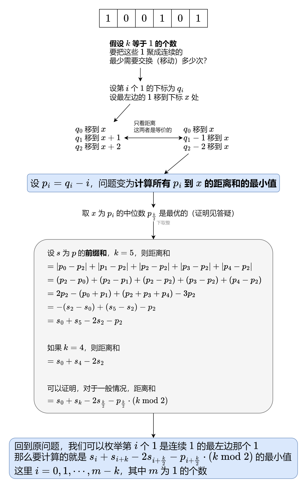

#### [转换成中位数贪心+空间优化（Python/Java/C++/Go）](https://leetcode.cn/problems/minimum-adjacent-swaps-for-k-consecutive-ones/solutions/2024387/tu-jie-zhuan-huan-cheng-zhong-wei-shu-ta-iz4v/)



#### 算法小课堂：前缀和

定义前缀和 $s[0]=0$，$s[i+1] = \sum\limits_{j=0}^{i}p[j]$。

例如 $p=[2,3,3,5]$，对应的前缀和数组为 $s=[0, 2, 5, 8, 13]$。

通过前缀和，我们可以把**子数组的和转换成两个前缀和的差**，即

$\sum\limits_{j=left}^{right}p[j] = \sum\limits_{j=0}^{right}p[j] - \sum\limits_{j=0}^{left-1}p[j] = s[right+1] - s[left]$

例如 $p$ 的子数组 $[3,3,5]$ 的和就可以用 $s[4]-s[1]=13-2=11$ 算出来。

> 注：为方便计算，常用左闭右开区间 $[left,right)$ 来表示子数组，此时子数组的和为 $s[right]−s[left]$。

#### 答疑

**问**：为什么图中的 $x$ 取在中位数上是最优的？

**答**：首先，如果 $x$ 取在区间 $[p[0],p[k-1]]$ 之外，那么 $x$ 向区间方向移动可以使距离和变小；同时，如果 $x$ 取在区间 $[p[0],p[k-1]]$ 之内，无论如何移动 $x$，它到 $p[0]$ 和 $p[k-1]$ 的距离和都是一个定值 $p[k-1]-p[0]$，那么去掉 $p[0]$ 和 $p[k-1]$ 这两个最左最右的数，问题规模缩小。不断缩小问题规模，如果最后剩下 $1$ 个数，那么 $x$ 就取它；如果最后剩下 $2$ 个数，那么 $x$ 取这两个数之间的任意值都可以（包括这两个数）。因此中位数可以取 $p[k/2]$。

```python
class Solution:
    def minMoves(self, nums: List[int], k: int) -> int:
        p = [q - i for i, q in enumerate(i for i, x in enumerate(nums) if x)]
        s = list(accumulate(p, initial=0))  # p 的前缀和
        return min(s[i] + s[i + k] - s[i + k // 2] * 2 - p[i + k // 2] * (k % 2)
                   for i in range(len(p) - k + 1))  # p[i:i+k] 中所有数到 p[i+k//2] 的距离之和，取最小值
```

```java
class Solution {
    public int minMoves(int[] nums, int k) {
        var p = new ArrayList<Integer>();
        for (int i = 0; i < nums.length; ++i)
            if (nums[i] != 0) p.add(i - p.size());
        int m = p.size();
        int[] s = new int[m + 1]; // p 的前缀和
        for (int i = 0; i < m; i++)
            s[i + 1] = s[i] + p.get(i);
        int ans = Integer.MAX_VALUE;
        for (int i = 0; i <= m - k; ++i) // p[i] 到 p[i+k-1] 中所有数到 p[i+k/2] 的距离之和，取最小值
            ans = Math.min(ans, s[i] + s[i + k] - s[i + k / 2] * 2 - p.get(i + k / 2) * (k % 2));
        return ans;
    }
}
```

```cpp
class Solution {
public:
    int minMoves(vector<int> &nums, int k) {
        vector<int> p;
        for (int i = 0; i < nums.size(); ++i)
            if (nums[i]) p.push_back(i - p.size());
        int m = p.size(), s[m + 1];
        s[0] = 0;
        partial_sum(p.begin(), p.end(), s + 1); // p 的前缀和
        int ans = INT_MAX;
        for (int i = 0; i <= m - k; ++i) // p[i] 到 p[i+k-1] 中所有数到 p[i+k/2] 的距离之和，取最小值
            ans = min(ans, s[i] + s[i + k] - s[i + k / 2] * 2 - p[i + k / 2] * (k % 2));
        return ans;
    }
};
```

```go
func minMoves(nums []int, k int) int {
    p := []int{}
    for i, v := range nums {
        if v != 0 {
            p = append(p, i-len(p))
        }
    }
    m := len(p)
    s := make([]int, m+1) // p 的前缀和
    for i, v := range p {
        s[i+1] = s[i] + v
    }
    ans := math.MaxInt
    for i, v := range s[:m-k+1] { // p[i] 到 p[i+k-1] 中所有数到 p[i+k/2] 的距离之和，取最小值
        ans = min(ans, v+s[i+k]-s[i+k/2]*2-p[i+k/2]*(k%2))
    }
    return ans
}

func min(a, b int) int { if b < a { return b }; return a }
```

#### 优化

在遍历 $nums$ 的同时，把 $p$ 直接存到 $nums$ 中，并累加计算 $s[i],s[i+k/2],s[i+k]$，这样可以做到 $O(1)$ 额外空间。

> 注：还可以用三指针在不修改 $nums$ 的情况下做到 $O(1)$ 额外空间，感兴趣的读者可以试试。

```python
class Solution:
    def minMoves(self, nums: List[int], k: int) -> int:
        m = 0
        for i, p in enumerate(i for i, x in enumerate(nums) if x):
            nums[i] = p - i
            m += 1
        if m == len(nums): return 0  # 全部都是 1
        ans, p = inf, nums
        sl, sm, sr = 0, sum(p[:k // 2]), sum(p[:k])  # s[i] s[i+k//2] s[i+k] 忽略切片开销
        for i in range(m - k + 1):
            ans = min(ans, sl + sr - sm * 2 - p[i + k // 2] * (k % 2))
            sl += p[i]
            sm += p[i + k // 2]
            sr += p[i + k]
        return ans
```

```java
class Solution {
    public int minMoves(int[] nums, int k) {
        int n = nums.length, m = 0;
        for (int i = 0; i < n; ++i)
            if (nums[i] != 0) {
                nums[m] = i - m;
                ++m;
            }
        if (m == n) return 0; // 全部都是 1
        int[] p = nums;
        int sl = 0, sm = 0, sr = 0; // s[i] s[i+k/2] s[i+k]
        for (int i = 0; i < k; ++i) {
            if (i < k / 2) sm += p[i];
            sr += p[i];
        }
        int ans = Integer.MAX_VALUE;
        for (int i = 0; i <= m - k; ++i) {
            ans = Math.min(ans, sl + sr - sm * 2 - p[i + k / 2] * (k % 2));
            sl += p[i];
            sm += p[i + k / 2];
            sr += p[i + k];
        }
        return ans;
    }
}
```

```cpp
class Solution {
public:
    int minMoves(vector<int> &nums, int k) {
        int n = nums.size(), m = 0;
        for (int i = 0; i < n; ++i)
            if (nums[i]) {
                nums[m] = i - m;
                ++m;
            }
        if (m == n) return 0; // 全部都是 1
        auto &p = nums;
        int sl = 0; // s[i]
        int sm = accumulate(p.begin(), p.begin() + k / 2, 0); // s[i+k/2]
        int sr = accumulate(p.begin(), p.begin() + k, 0); // s[i+k]
        int ans = INT_MAX;
        for (int i = 0; i <= m - k; ++i) {
            ans = min(ans, sl + sr - sm * 2 - p[i + k / 2] * (k % 2));
            sl += p[i];
            sm += p[i + k / 2];
            sr += p[i + k];
        }
        return ans;
    }
};
```

```go
func minMoves(nums []int, k int) int {
    n, m := len(nums), 0
    for i, p := range nums {
        if p != 0 {
            nums[m] = i - m
            m++
        }
    }
    if m == n { // 全部都是 1
        return 0
    }
    p := nums
    var sl, sm, sr int // s[i] s[i+k/2] s[i+k]
    for i, v := range p[:k] {
        if i < k/2 {
            sm += v
        }
        sr += v
    }
    ans := math.MaxInt
    for i, v := range p[:m-k+1] {
        ans = min(ans, sl+sr-sm*2-p[i+k/2]*(k%2))
        sl += v
        sm += p[i+k/2]
        sr += p[i+k]
    }
    return ans
}

func min(a, b int) int { if b < a { return b }; return a }
```

#### 复杂度分析

-   时间复杂度：$O(n)$，其中 $n$ 为 $nums$ 的长度。
-   空间复杂度：$O(1)$，仅用到若干额外变量。
