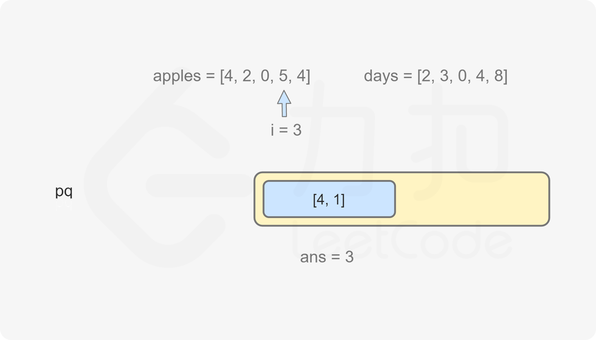

### [吃苹果的最大数目](https://leetcode.cn/problems/maximum-number-of-eaten-apples/solutions/1172766/chi-ping-guo-de-zui-da-shu-mu-by-leetcod-93ka/)

#### 方法一：贪心 + 优先队列

为了将吃苹果的数目最大化，应该使用贪心策略，在尚未腐烂的苹果中优先选择腐烂日期最早的苹果。

为了得到腐烂日期最早的苹果，可以使用优先队列存储每个苹果的腐烂日期，优先队列中最小的元素（即最早的腐烂日期）会最先被取出。由于数组 $apples$ 和 $days$ 的长度 $n$ 最大为 $2 \times 10^4$，两个数组中的每个元素最大为 $2 \times 10^4$，因此苹果的总数最大可达 $(2 \times 10^4) \times (2 \times 10^4) = 4 \times 10^8$。如果直接使用优先队列存储每个苹果的腐烂日期，则会导致优先队列中的元素个数过多，时间复杂度和空间复杂度过高，因此需要使用优化的表示法。可以在优先队列中存储二元组，每个二元组表示苹果的腐烂日期和在该日期腐烂的苹果个数，则优先队列中的元素个数最多为 $n$ 个（即数组长度），可以显著降低时间复杂度和空间复杂度。

计算吃苹果的最大数目分成两个阶段，第一阶段是第 $0$ 天到第 $n-1$ 天，即天数在数组下标范围内，第二阶段是第 $n$ 天及以后，即天数在数组下标范围外。

在第一阶段，由于每天树上都可能长出苹果，因此需要对每一天分别计算是否能吃到苹果，并更新优先队列。具体做法如下：

1. 将优先队列中的所有腐烂日期小于等于当前日期的元素取出，这些元素表示已经腐烂的苹果，无法食用；
2. 根据 $days$ 和 $apples$ 的当前元素计算当天长出的苹果的腐烂日期和数量，如果数量大于 $0$，则将腐烂日期和数量加入优先队列；
3. 如果优先队列不为空，则当天可以吃 $1$ 个苹果，将优先队列的队首元素的数量减 $1$，如果队首元素的数量变成 $0$ 则将队首元素取出。

在第二阶段，由于树上不会再长出苹果，因此只需要考虑能吃到的苹果数量。由于优先队列中的每个元素的数量可能很大，因此需要根据当前日期和优先队列的队首元素的腐烂日期和数量计算能吃到的苹果数量。

假设当前日期是第 $i$ 天，首先将优先队列中的所有腐烂日期小于等于 $i$ 的元素取出，如果优先队列不为空，则根据优先队列的队首元素计算能吃到的苹果数量。假设优先队列的队首元素的腐烂日期是 $x$，数量是 $y$，其中 $x > i$，则有 $y$ 个苹果，距离腐烂还有 $x-i$ 天，因此能吃到的苹果数量是 $curr = min(x-i,y)$。将优先队列的队首元素 $(x,y)$ 取出并将日期增加 $curr$，重复上述操作直到优先队列为空，即可得到吃苹果的最大数目。





```Java
class Solution {
    public int eatenApples(int[] apples, int[] days) {
        int ans = 0;
        PriorityQueue<int[]> pq = new PriorityQueue<int[]>((a, b) -> a[0] - b[0]);
        int n = apples.length;
        int i = 0;
        while (i < n) {
            while (!pq.isEmpty() && pq.peek()[0] <= i) {
                pq.poll();
            }
            int rottenDay = i + days[i];
            int count = apples[i];
            if (count > 0) {
                pq.offer(new int[]{rottenDay, count});
            }
            if (!pq.isEmpty()) {
                int[] arr = pq.peek();
                arr[1]--;
                if (arr[1] == 0) {
                    pq.poll();
                }
                ans++;
            }
            i++;
        }
        while (!pq.isEmpty()) {
            while (!pq.isEmpty() && pq.peek()[0] <= i) {
                pq.poll();
            }
            if (pq.isEmpty()) {
                break;
            }
            int[] arr = pq.poll();
            int curr = Math.min(arr[0] - i, arr[1]);
            ans += curr;
            i += curr;
        }
        return ans;
    }
}
```

```C++
typedef pair<int,int> pii;

class Solution {
public:
    int eatenApples(vector<int>& apples, vector<int>& days) {
        int ans = 0;
        priority_queue<pii, vector<pii>, greater<pii>> pq;
        int n = apples.size();
        int i = 0;
        while (i < n) {
            while (!pq.empty() && pq.top().first <= i) {
                pq.pop();
            }
            int rottenDay = i + days[i];
            int count = apples[i];
            if (count > 0) {
                pq.emplace(rottenDay, count);
            }
            if (!pq.empty()) {
                pii curr = pq.top();
                pq.pop();
                curr.second--;
                if (curr.second != 0) {                  
                    pq.emplace(curr.first, curr.second);
                }
                ans++;
            }
            i++;
        }
        while (!pq.empty()) {
            while (!pq.empty() && pq.top().first <= i) {
                pq.pop();
            }
            if (pq.empty()) {
                break;
            }
            pii curr = pq.top();
            pq.pop();
            int num = min(curr.first - i, curr.second);
            ans += num;
            i += num;
        }
        return ans;
    }
};
```

```Python
class Solution:
    def eatenApples(self, apples: List[int], days: List[int]) -> int:
        ans = 0
        pq = []
        i = 0
        while i < len(apples):
            while pq and pq[0][0] <= i:
                heappop(pq)
            if apples[i]:
                heappush(pq, [i + days[i], apples[i]])
            if pq:
                pq[0][1] -= 1
                if pq[0][1] == 0:
                    heappop(pq)
                ans += 1
            i += 1
        while pq:
            while pq and pq[0][0] <= i:
                heappop(pq)
            if len(pq) == 0:
                break
            p = heappop(pq)
            num = min(p[0] - i, p[1])
            ans += num
            i += num
        return ans
```

```Go
func eatenApples(apples, days []int) (ans int) {
    h := hp{}
    i := 0
    for ; i < len(apples); i++ {
        for len(h) > 0 && h[0].end <= i {
            heap.Pop(&h)
        }
        if apples[i] > 0 {
            heap.Push(&h, pair{i + days[i], apples[i]})
        }
        if len(h) > 0 {
            h[0].left--
            if h[0].left == 0 {
                heap.Pop(&h)
            }
            ans++
        }
    }
    for len(h) > 0 {
        for len(h) > 0 && h[0].end <= i {
            heap.Pop(&h)
        }
        if len(h) == 0 {
            break
        }
        p := heap.Pop(&h).(pair)
        num := min(p.end-i, p.left)
        ans += num
        i += num
    }
    return
}

type pair struct{ end, left int }
type hp []pair

func (h hp) Len() int            { return len(h) }
func (h hp) Less(i, j int) bool  { return h[i].end < h[j].end }
func (h hp) Swap(i, j int)       { h[i], h[j] = h[j], h[i] }
func (h *hp) Push(v interface{}) { *h = append(*h, v.(pair)) }
func (h *hp) Pop() interface{}   { a := *h; v := a[len(a)-1]; *h = a[:len(a)-1]; return v }

func min(a, b int) int {
    if a > b {
        return b
    }
    return a
}
```

```CSharp
public class Solution {
    public int EatenApples(int[] apples, int[] days) {
        int ans = 0;
        PriorityQueue<int[], int> pq = new PriorityQueue<int[], int>();
        int n = apples.Length;
        int i = 0;
        while (i < n) {
            while (pq.Count > 0 && pq.Peek()[0] <= i) {
                pq.Dequeue();
            }
            int rottenDay = i + days[i];
            int count = apples[i];
            if (count > 0) {
                pq.Enqueue(new int[]{rottenDay, count}, rottenDay);
            }
            if (pq.Count > 0) {
                rottenDay = pq.Peek()[0];
                count = pq.Peek()[1];
                pq.Dequeue();
                count--;
                if (count != 0) { 
                    pq.Enqueue(new int[]{rottenDay, count}, rottenDay);               
                }
                ans++;
            }
            i++;
        }

        while (pq.Count > 0) {
            while (pq.Count > 0 && pq.Peek()[0] <= i) {
                pq.Dequeue();
            }
            if (pq.Count == 0) {
                break;
            }
            int rottenDay = pq.Peek()[0];
            int count = pq.Peek()[1];
            pq.Dequeue();
            int num = Math.Min(rottenDay - i, count);
            ans += num;
            i += num;
        }

        return ans;
    }
}
```

```C
#define MIN_QUEUE_SIZE 64

typedef struct Element {
    int data[2];
} Element;

typedef bool (*compare)(const void *, const void *);

typedef struct PriorityQueue {
    Element *arr;
    int capacity;
    int queueSize;
    compare lessFunc;
} PriorityQueue;

Element *createElement(int x, int y) {
    Element *obj = (Element *)malloc(sizeof(Element));
    obj->data[0] = x;
    obj->data[1] = y;
    return obj;
}

static bool less(const void *a, const void *b) {
    Element *e1 = (Element *)a;
    Element *e2 = (Element *)b;
    return e1->data[0] > e2->data[0] || \
           (e1->data[0] == e2->data[0] && \
           e1->data[1] > e2->data[1]);
}

static bool greater(const void *a, const void *b) {
    Element *e1 = (Element *)a;
    Element *e2 = (Element *)b;
    return e1->data[0] < e2->data[0];
}

static void memswap(void *m1, void *m2, size_t size){
    unsigned char *a = (unsigned char*)m1;
    unsigned char *b = (unsigned char*)m2;
    while (size--) {
        *b ^= *a ^= *b ^= *a;
        a++;
        b++;
    }
}

static void swap(Element *arr, int i, int j) {
    memswap(&arr[i], &arr[j], sizeof(Element));
}

static void down(Element *arr, int size, int i, compare cmpFunc) {
    for (int k = 2 * i + 1; k < size; k = 2 * k + 1) {
        if (k + 1 < size && cmpFunc(&arr[k], &arr[k + 1])) {
            k++;
        }
        if (cmpFunc(&arr[k], &arr[(k - 1) / 2])) {
            break;
        }
        swap(arr, k, (k - 1) / 2);
    }
}

PriorityQueue *createPriorityQueue(compare cmpFunc) {
    PriorityQueue *obj = (PriorityQueue *)malloc(sizeof(PriorityQueue));
    obj->capacity = MIN_QUEUE_SIZE;
    obj->arr = (Element *)malloc(sizeof(Element) * obj->capacity);
    obj->queueSize = 0;
    obj->lessFunc = cmpFunc;
    return obj;
}

void heapfiy(PriorityQueue *obj) {
    for (int i = obj->queueSize / 2 - 1; i >= 0; i--) {
        down(obj->arr, obj->queueSize, i, obj->lessFunc);
    }
}

void enQueue(PriorityQueue *obj, Element *e) {
    if (obj->queueSize == obj->capacity) {
        obj->capacity *= 2;
        obj->arr = realloc(obj->arr, sizeof(Element) * obj->capacity);
    }
    memcpy(&obj->arr[obj->queueSize], e, sizeof(Element));
    for (int i = obj->queueSize; i > 0 && obj->lessFunc(&obj->arr[(i - 1) / 2], &obj->arr[i]); i = (i - 1) / 2) {
        swap(obj->arr, i, (i - 1) / 2);
    }
    obj->queueSize++;
}

Element* deQueue(PriorityQueue *obj) {
    swap(obj->arr, 0, obj->queueSize - 1);
    down(obj->arr, obj->queueSize - 1, 0, obj->lessFunc);
    Element *e =  &obj->arr[obj->queueSize - 1];
    obj->queueSize--;
    return e;
}

bool isEmpty(const PriorityQueue *obj) {
    return obj->queueSize == 0;
}

Element* front(const PriorityQueue *obj) {
    if (obj->queueSize == 0) {
        return NULL;
    } else {
        return &obj->arr[0];
    }
}

void clear(PriorityQueue *obj) {
    obj->queueSize = 0;
}

int size(const PriorityQueue *obj) {
    return obj->queueSize;
}

void freeQueue(PriorityQueue *obj) {
    free(obj->arr);
    free(obj);
}

int eatenApples(int* apples, int applesSize, int* days, int daysSize) {
    int ans = 0;
    PriorityQueue *pq = createPriorityQueue(less);
    int n = applesSize;
    int i = 0;
    struct Element node;

    while (i < n) {
        while (!isEmpty(pq) && front(pq)->data[0] <= i) {
            deQueue(pq);
        }
        int rottenDay = i + days[i];
        int count = apples[i];
        if (count > 0) {
            node.data[0] = rottenDay;
            node.data[1] = count;
            enQueue(pq, &node);
        }
        if (!isEmpty(pq)) {
            rottenDay = front(pq)->data[0];
            count = front(pq)->data[1];
            deQueue(pq);
            count--;
            if (count != 0) {          
                node.data[0] = rottenDay;
                node.data[1] = count;
                enQueue(pq, &node);        
            }
            ans++;
        }
        i++;
    }

    while (!isEmpty(pq)) {
        while (!isEmpty(pq) && front(pq)->data[0] <= i) {
            deQueue(pq);
        }
        if (isEmpty(pq)) {
            break;
        }
        int rottenDay = front(pq)->data[0];
        int count = front(pq)->data[1];
        deQueue(pq);
        int num = fmin(rottenDay - i, count);
        ans += num;
        i += num;
    }
    freeQueue(pq);
    return ans;
}
```

```JavaScript
var eatenApples = function(apples, days) {
    let ans = 0;
    let pq = new MinPriorityQueue();
    const n = apples.length;
    let i = 0;
    while (i < n) {
        while (!pq.isEmpty() && pq.front().element[0] <= i) {
            pq.dequeue();
        }
        let rottenDay = i + days[i];
        let count = apples[i];
        if (count > 0) {
            pq.enqueue([rottenDay, count], rottenDay);
        }
        if (!pq.isEmpty()) {
            [rottenDay, count] = pq.dequeue().element;
            count--;
            if (count != 0) {   
                pq.enqueue([rottenDay, count], rottenDay);               
            }
            ans++;
        }
        i++;
    }

    while (!pq.isEmpty()) {
        while (!pq.isEmpty() && pq.front().element[0] <= i) {
            pq.dequeue();
        }
        if (pq.isEmpty()) {
            break;
        }
        [rottenDay, count] = pq.dequeue().element;
        const num = Math.min(rottenDay - i, count);
        ans += num;
        i += num;
    }

    return ans;
};
```

```TypeScript
function eatenApples(apples: number[], days: number[]): number {
    let ans = 0;
    let pq = new MinPriorityQueue();
    const n = apples.length;
    let i = 0;
    while (i < n) {
        while (!pq.isEmpty() && pq.front().element[0] <= i) {
            pq.dequeue();
        }
        let rottenDay = i + days[i];
        let count = apples[i];
        if (count > 0) {
            pq.enqueue([rottenDay, count], rottenDay);
        }
        if (!pq.isEmpty()) {
            [rottenDay, count] = pq.dequeue().element;
            count--;
            if (count != 0) {   
                pq.enqueue([rottenDay, count], rottenDay);               
            }
            ans++;
        }
        i++;
    }

    while (!pq.isEmpty()) {
        while (!pq.isEmpty() && pq.front().element[0] <= i) {
            pq.dequeue();
        }
        if (pq.isEmpty()) {
            break;
        }
        let [rottenDay, count] = pq.dequeue().element;
        const num = Math.min(rottenDay - i, count);
        ans += num;
        i += num;
    }

    return ans;
};
```

```Rust
use std::collections::BinaryHeap;
use std::cmp::Reverse;

impl Solution {
    pub fn eaten_apples(apples: Vec<i32>, days: Vec<i32>) -> i32 {
        let mut ans = 0;
        let mut pq = BinaryHeap::new();
        let n = apples.len();
        let mut i = 0;
        
        while i < n {
            while let Some(Reverse((rotten_day, count))) = pq.peek() {
                if *rotten_day <= i as i32 {
                    pq.pop();
                } else {
                    break;
                }
            }
            let rotten_day = i as i32 + days[i];
            let count = apples[i];
            if count > 0 {
                pq.push(Reverse((rotten_day, count)));
            }
            if let Some(Reverse((rotten_day, mut count))) = pq.pop() {
                count -= 1;
                if count > 0 {
                    pq.push(Reverse((rotten_day, count)));
                }
                ans += 1;
            }
            i += 1;
        }

        while let Some(Reverse((rotten_day, mut count))) = pq.pop() {
            if rotten_day <= i as i32 {
                continue;
            }
            let num = std::cmp::min(rotten_day - i as i32, count);
            ans += num;
            i += num as usize;
        }
        ans
    }
}
```

**复杂度分析**

- 时间复杂度：$O(nlogn)$，其中 $n$ 是数组 $apples$ 和 $days$ 的长度。优先队列中最多有 $n$ 个元素，每个元素加入优先队列和从优先队列中取出各一次，每次操作的时间复杂度是 $O(logn)$，因此总时间复杂度是 $O(nlogn)$。
- 空间复杂度：$O(n)$，其中 $n$ 是数组 $apples$ 和 $days$ 的长度。空间复杂度主要取决于优先队列，优先队列中的元素个数不会超过 $n$。
