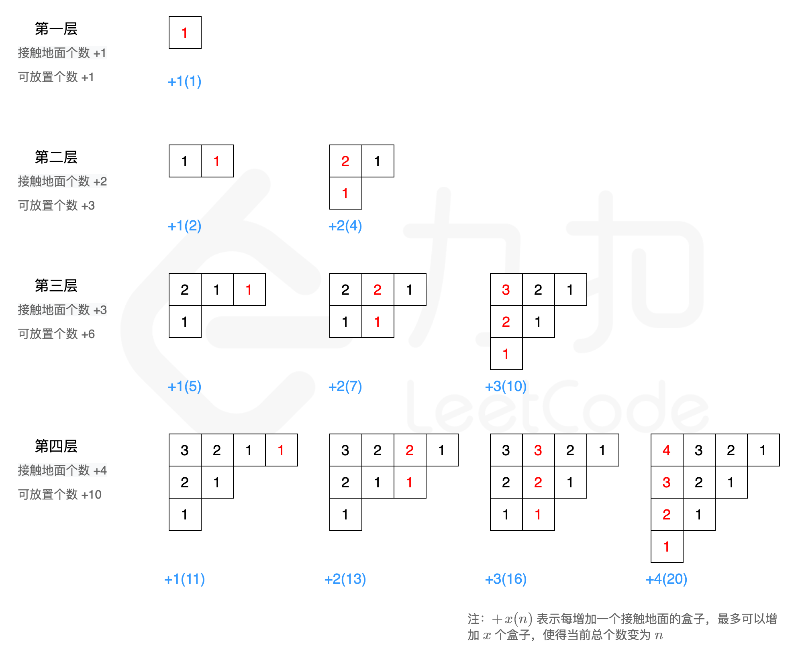

#### [方法一：找规律](https://leetcode.cn/problems/building-boxes/solutions/2030450/fang-zhi-he-zi-by-leetcode-solution-7ah2/)

**思路与算法**

为了方便画图找规律，我们将立体图转换为平面图来表示：


根据贪心思想，接触地面的盒子构成的总体形状应该是一个左上三角，这样才可以使得内部的盒子垒起来的高度更高，以保证接触地面盒子数量最小的情况下容纳更多的盒子。我们画出前四层的盒子增长情况，来试探一下有什么规律存在：



由上图可知，第 $i$ 层最多可以增加 $i$ 个接触地面的盒子，所带来的收益（即增加的盒子放置数）是 $(1 + 2 + \cdots + i) = \dfrac{i \times (i + 1)}{2}$。随着 $i$ 的增加，成平方级增长。

要放置 $n$ 个盒子，我们需要完整的放满 $i - 1$ 层，然后剩余的盒子用第 $i$ 层的 $j$ 个（接触地面的盒子）来填充。即找到最小的 $i$ 和 $j$ 满足：

$\begin{aligned} n & \le (1) + (1 + 2) + (1 + 2 + 3) + \cdots + (1 + 2 + \cdots + i - 1) + (1 + 2 + \cdots + j) \\ & = \frac{1 \times 2}{2} + \frac{2 \times 3}{2} + \frac{3 \times 4}{2} + \cdots + \frac{(i - 1) \times i}{2} + \frac{j \times (j + 1)}{2} \end{aligned}$

代码中，我们维护一个 $cur$ 表示第 $i$ 层最多可以增加多少个可放置的盒子，如果当前 $n \gt cur$，将 $n$ 减去它，然后递增 $i$，否则当前的 $i$ 就是我们最终要找的 $i$。每次 $i$ 递增时，首先令 $i = i + 1$，然后更新 $cur = cur + i$。

然后我们找 $j$，维护变量 $cur$ 表示在第 $i$ 层中再添加一个接触地面的盒子时可以增加多少个可放置的盒子，如果当前 $n \gt cur$，则将 $n$ 减去它，然后递增 $j$，否则当前的 $j$ 就是我们最终要找的 $j$。每次递增 $j$ 时，首先令 $j = j + 1$, 然后更新 $cur = cur+ 1$。

最终我们完整的放满了前 $i - 1$ 层，并且在第 $i$ 层放置了 $j$ 个接触地面的盒子，因此答案应该为 $1 + 2 + \cdots + (i - 1) + j = \dfrac{(i - 1) \times i}{2} + j$。

**代码**

```python
class Solution:
    def minimumBoxes(self, n: int) -> int:
        cur = i = j = 1
        while n > cur:
            n -= cur
            i += 1
            cur += i
        cur = 1
        while n > cur:
            n -= cur
            j += 1
            cur += 1
        return (i - 1) * i // 2 + j
```

```cpp
class Solution {
public:
    int minimumBoxes(int n) {
        int cur = 1, i = 1, j = 1;
        while (n > cur) {
            n -= cur;
            i++;
            cur += i;
        }
        cur = 1;
        while (n > cur) {
            n -= cur;
            j++;
            cur++;
        }
        return (i - 1) * i / 2 + j;
    }
};
```

```java
class Solution {
    public int minimumBoxes(int n) {
        int cur = 1, i = 1, j = 1;
        while (n > cur) {
            n -= cur;
            i++;
            cur += i;
        }
        cur = 1;
        while (n > cur) {
            n -= cur;
            j++;
            cur++;
        }
        return (i - 1) * i / 2 + j;
    }
}
```

```c#
public class Solution {
    public int MinimumBoxes(int n) {
        int cur = 1, i = 1, j = 1;
        while (n > cur) {
            n -= cur;
            i++;
            cur += i;
        }
        cur = 1;
        while (n > cur) {
            n -= cur;
            j++;
            cur++;
        }
        return (i - 1) * i / 2 + j;
    }
}
```

```go
func minimumBoxes(n int) int {
    cur, i, j := 1, 1, 1
    for n > cur {
        n -= cur
        i++
        cur += i
    }
    cur = 1
    for n > cur {
        n -= cur
        j++
        cur++
    }
    return (i-1)*i/2 + j
}
```

```javascript
var minimumBoxes = function(n) {
    let cur = 1, i = 1, j = 1;
    while (n > cur) {
        n -= cur;
        i++;
        cur += i;
    }
    cur = 1;
    while (n > cur) {
        n -= cur;
        j++;
        cur++;
    }
    return (i - 1) * i / 2 + j;
};
```

```c
int minimumBoxes(int n) {
    int cur = 1, i = 1, j = 1;
    while (n > cur) {
        n -= cur;
        i++;
        cur += i;
    }
    cur = 1;
    while (n > cur) {
        n -= cur;
        j++;
        cur++;
    }
    return (i - 1) * i / 2 + j;
}
```

**复杂度分析**

-   时间复杂度：$O(\sqrt[3]{n})$，其中 $n$ 是盒子数。需要遍历每一层计算盒子数，层数 $i$ 与 $n$ 的关系是 $i = O(\sqrt[3]{n})$。
-   空间复杂度：$O(1)$。
