#### [方法一：贪心算法](https://leetcode.cn/problems/largest-merge-of-two-strings/solutions/2030226/gou-zao-zi-dian-xu-zui-da-de-he-bing-zi-g6az1/?orderBy=most_votes)

**思路与算法**

题目要求合并两个字符串 $word_1$ 与 $word_2$，且要求合并后的字符串字典序最大。首先需要观察一下合并的选择规律，假设当前需要从 $word_1$ 的第 $i$ 个字符和 $word_2$ 的第 $j$ 个字符选择一个字符加入到新字符串 $merge$ 中，需要进行分类讨论:
-   如果 $word_1[i] > word_2[j]$，此时我们的最优选择是移除 $word_1[i]$ 加入到 $merge$ 中，从而保证 $merge$ 的字典序最大；
-   如果 $word_1[i] < word_2[j]$，此时我们的最优选择是移除 $word_2[j]$ 加入到 $merge$，从而保证 $merge$ 的字典序最大；
-   如果 $word_1[i] = word_2[j]$，此时则需要进一步讨论，结论如下：
    -   如果 $word_1$ 从 $i$ 开始的后缀字典序大于 $word_2$ 从 $j$ 开始的后缀，则此时优先选择移除 $word_1[i]$ 加入到 $merge$ 中；
    -   如果 $word_1$ 从 $i$ 开始的后缀字典序小于 $word_2$ 从 $j$ 开始的后缀，则此时优先选择移除 $word_2[j]$ 加入到 $merge$ 中；
    -   如果 $word_1$ 从 $i$ 开始的后缀字典序等于 $word_2$ 从 $j$ 开始的后缀，则此时任选一个均可；

当两个字符相等时，则我们最优选择为后缀较大的字符串，分类讨论如下： 假设 $word_1[i] = word_2[j]$，此时两个字符串分别从 $i,j$ 开始还有 $l$ 个字符相等，则此时 $word_1[i+k] = word_2[j+k], k \in [0,l-1]$，第 $l+1$ 个字符时二者不相等，即满足 $word_1[i + l] \neq word_2[j + l]$，我们可以假设 $word_1[i + l] < word_2[j + l]$。

例如 $word_1 = "bcadea"$ 与 $word_2 = "\_bcadf"$，此时 $i = 0, j = 1, l = 4$。

-   假设我们每次都选择从当前位置后缀较大的字符串，由于两个字符串分别从 $i,j$ 开始连续 $l$ 个字符相等，此时可以知道 $word_2$ 向右移动了 $l$ 个位置到达了 $j + l$，此时 $word_1$ 向右移动了 $t$ 个位置到达了 $i + t$，此时一定满足 $t \le l$，$word_2$ 优先向右移动到达字符 $word_2[j + l]$ 处，此时字典序较大的字符 $word_2[j + l]$ 优先进行合并。如果 $word_2$ 移动 $k$ 个字符时，$word_1$ 最多也移动 $k$ 个字符，由于两个字符串同时移动 $k$ 个位置会遇到相同字符时总是选择字典序较大的后缀，因此 $word_2$ 一定先移动 $l$ 个位置，可以参考如下图所示：
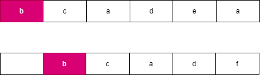
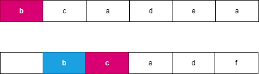
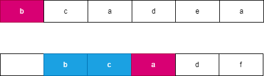
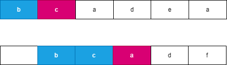
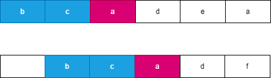
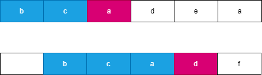
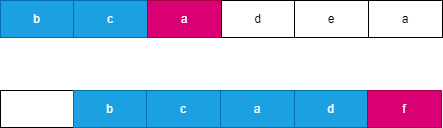

-   假设我们每次都选择从当前位置后缀较小的字符串，由于两个字符串分别从 $i,j$ 开始连续 $l$ 个字符相等，此时可以知道 $word_1$ 向右移动了 $l$ 个位置到达了 $i + l$，此时 $word_2$ 向右移动了 $t$ 个位置到达了 $j + t$，此时一定满足 $t \le l$，$word_1$ 优先向右移动到达字符 $word_1[i + l]$ 处，此时字典序较小的字符 $word_1[i + k]$ 优先进行合并。如果 $word_1$ 移动 $k$ 个字符时，$word_2$ 最多也移动 $k$ 个字符，而每次同时移动 $k$ 个位置遇到相同字符时总是选择字典序较小的后缀，因此 $word_1$ 一定先移动 $l$ 个位置，可以参考如下图所示：

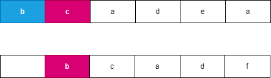
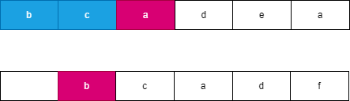
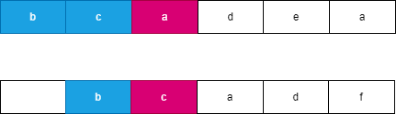

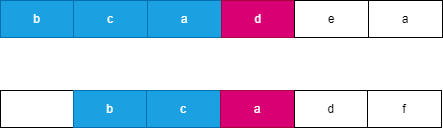
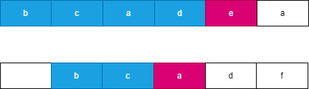

-   我们观察到不论以何种方式进行合并，两个字符串一共移动了 $l + t$ 个位置，此时字符串 $merge$ 也合并了长度为 $l + t$ 的字符串 $s$，不论以何种方式进行合并的字符串 $s$ 总是相同的，而此时下一个字符优先选择字典序较大的字符进行合并这样保证合并后的字典序最大。我们可以观察到上述示例中的 $s="bcbcad"$。

其余的特殊情况跟上述思路一样，综上我们可以得到结论每次选择字典序较大的后缀进行移除一定可以保证得到最优的结果，其余的选择方法不一定能够保证得到最优结果。

**代码**

```python
class Solution:
    def largestMerge(self, word1: str, word2: str) -> str:
        merge = []
        i, j, n, m = 0, 0, len(word1), len(word2)
        while i < n or j < m:
            if i < n and word1[i:] > word2[j:]:
                merge.append(word1[i])
                i += 1
            else:
                merge.append(word2[j])
                j += 1
        return ''.join(merge)
```

```cpp
class Solution {
public:
    string largestMerge(string word1, string word2) {
        string merge;
        int i = 0, j = 0;
        while (i < word1.size() || j < word2.size()) {
            if (i < word1.size() && word1.substr(i) > word2.substr(j)) {
                merge.push_back(word1[i++]);
            } else {
                merge.push_back(word2[j++]);
            }
        }
        return merge;
    }
};
```

```java
class Solution {
    public String largestMerge(String word1, String word2) {
        StringBuilder merge = new StringBuilder();
        int i = 0, j = 0;
        while (i < word1.length() || j < word2.length()) {
            if (i < word1.length() && word1.substring(i).compareTo(word2.substring(j)) > 0) {
                merge.append(word1.charAt(i));
                i++;
            } else {
                merge.append(word2.charAt(j));
                j++;
            }
        }
        return merge.toString();
    }
}
```

```c#
public class Solution {
    public string LargestMerge(string word1, string word2) {
        StringBuilder merge = new StringBuilder();
        int i = 0, j = 0;
        while (i < word1.Length || j < word2.Length) {
            if (i < word1.Length && word1.Substring(i).CompareTo(word2.Substring(j)) > 0) {
                merge.Append(word1[i]);
                i++;
            } else {
                merge.Append(word2[j]);
                j++;
            }
        }
        return merge.ToString();
    }
}
```

```c
char * largestMerge(char * word1, char * word2) {
    int m = strlen(word1), n = strlen(word2);
    char *merge = (char *)malloc(sizeof(char) * (m + n + 1));
    int i = 0, j = 0, pos = 0;
    while (i < m || j < n) {
        if (i < m && strcmp(word1 + i, word2 + j) > 0) {
            merge[pos] = word1[i];
            pos++, i++;
        } else {
            merge[pos] = word2[j];
            pos++, j++;
        }
    }
    merge[pos] = '\0';
    return merge;
}
```

```javascript
var largestMerge = function(word1, word2) {
    let merge = '';
    let i = 0, j = 0;
    while (i < word1.length || j < word2.length) {
        if (i < word1.length && word1.slice(i) > word2.slice(j)) {
            merge += word1[i];
            i++;
        } else {
            merge += word2[j];
            j++;
        }
    }
    return merge;
};
```

```go
func largestMerge(word1, word2 string) string {
    merge := []byte{}
    i, j, n, m := 0, 0, len(word1), len(word2)
    for i < n || j < m {
        if i < n && word1[i:] > word2[j:] {
            merge = append(merge, word1[i])
            i += 1
        } else {
            merge = append(merge, word2[j])
            j += 1
        }
    }
    return string(merge)
}
```

**复杂度分析**

-   时间复杂度：$O((m + n) \times \max(m, n))$，其中 $m,n$ 分别表示两个字符串的长度。每次压入字符时需要进行后缀比较，每次两个字符串后缀比较的时间复杂度为 $O(\max(m, n))$，一共最多需要比较 $m + n$ 次，因此总的时间复杂度为 $O((m + n) \times \max(m, n))$。
-   空间复杂度：$O(m + n)$，其中 $m,n$ 分别表示两个字符串的长度。每次比较时都会生成两个字符串的后缀，所需要的空间为 $O(m + n)$。
