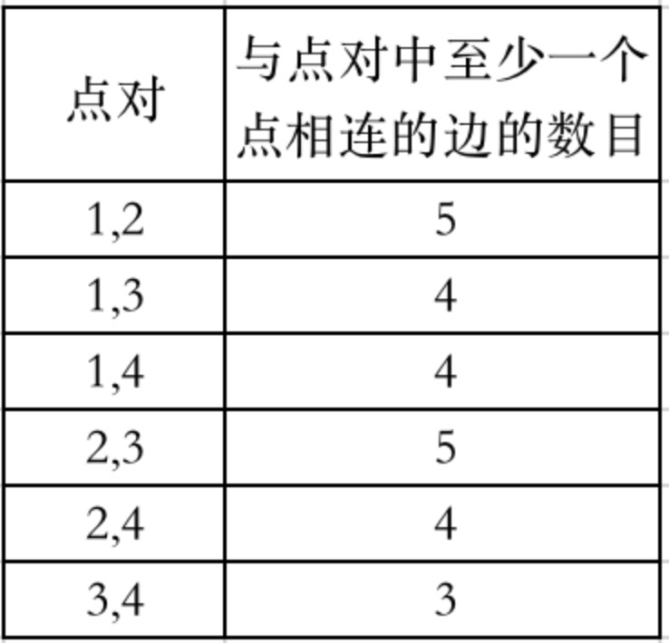

### [1782\. 统计点对的数目](https://leetcode.cn/problems/count-pairs-of-nodes/)

难度：困难

给你一个无向图，无向图由整数 `n`  ，表示图中节点的数目，和 `edges` 组成，其中 `edges[i] = [u_i, v_i]` 表示 `u_i` 和 `v_i` 之间有一条无向边。同时给你一个代表查询的整数数组 `queries` 。

第 `j` 个查询的答案是满足如下条件的点对 `(a, b)` 的数目：

-   `a < b`
-   `cnt` 是与 `a` **或者** `b` 相连的边的数目，且 `cnt` **严格大于** `queries[j]` 。

请你返回一个数组 `answers` ，其中 `answers.length == queries.length` 且 `answers[j]` 是第 `j` 个查询的答案。

请注意，图中可能会有 **重复边** 。

**示例 1：**



```
输入：n = 4, edges = [[1,2],[2,4],[1,3],[2,3],[2,1]], queries = [2,3]
输出：[6,5]
解释：每个点对中，与至少一个点相连的边的数目如上图所示。
```

**示例 2：**

```
输入：n = 5, edges = [[1,5],[1,5],[3,4],[2,5],[1,3],[5,1],[2,3],[2,5]], queries = [1,2,3,4,5]
输出：[10,10,9,8,6]
```

**提示：**

-   `2 <= n <= 2 * 10^4`
-   `1 <= edges.length <= 10^5`
-   `1 <= u_i, v_i <= n`
-   `u_i  != v_i`
-   `1 <= queries.length <= 20`
-   `0 <= queries[j] < edges.length`
