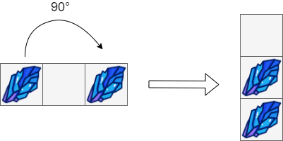
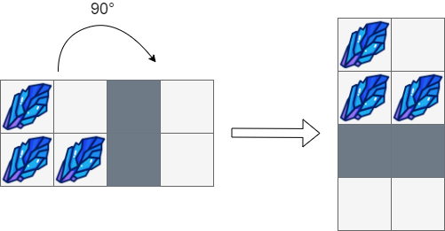
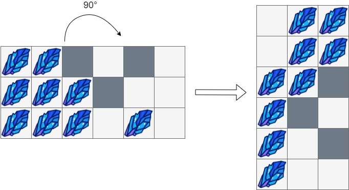

### [1861\. 旋转盒子](https://leetcode.cn/problems/rotating-the-box/)

难度：中等

给你一个 <code>m &times; n</code> 的字符矩阵 `boxGrid`，它表示一个箱子的侧视图。箱子的每一个格子可能为：

- `'#'` 表示石头
- `'*'` 表示固定的障碍物
- `'.'` 表示空位置

这个箱子被 **顺时针旋转 90 度**，由于重力原因，部分石头的位置会发生改变。每个石头会垂直掉落，直到它遇到障碍物，另一个石头或者箱子的底部。重力 **不会** 影响障碍物的位置，同时箱子旋转不会产生**惯性**，也就是说石头的水平位置不会发生改变。

题目保证初始时 `boxGrid` 中的石头要么在一个障碍物上，要么在另一个石头上，要么在箱子的底部。

请你返回一个 <code>n &times; m</code> 的矩阵，表示按照上述旋转后，箱子内的结果。

**示例 1：**

> 
>
> **输入：** `box = [["#",".","#"]]`
> **输出：**
>
> ```c
>      [["."],
>      ["#"],
>      ["#"]]
> ```

**示例 2：**

> 
>
> **输入：**
>
> ```c
> box = [["#",".","*","."],
>        ["#","#","*","."]]
> ```
>
> **输出：**
>
> ```c
>      [["#","."],
>       ["#","#"],
>       ["*","*"],
>       [".","."]]
> ```

**示例 3：**

> 
>
> **输入：**
>
> ```c
> box = [["#","#","*",".","*","."],
>        ["#","#","#","*",".","."],
>        ["#","#","#",".","#","."]]
> ```
>
> **输出：**
>
> ```c
>      [[".","#","#"],
>       [".","#","#"],
>       ["#","#","*"],
>       ["#","*","."],
>       ["#",".","*"],
>       ["#",".","."]]
> ```

**提示：**

- `m == boxGrid.length`
- `n == boxGrid[i].length`
- `1 <= m, n <= 500`
- `boxGrid[i][j]` 只可能是 `'#'`，`'*'` 或者 `'.'`。
