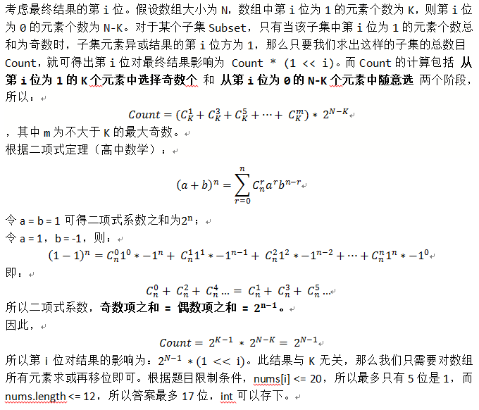

### [O(n)算法简明讲解](https://leetcode.cn/problems/sum-of-all-subset-xor-totals/solutions/779901/onsuan-fa-jian-ming-jiang-jie-by-yuyinsl-9sod/)



```cpp
//AC代码
int subsetXORSum(int* nums, int numsSize) {
    int ans = 0;
    for(int i=0; i<numsSize; i++)
    {
        ans |= nums[i];
    }
    return ans << (numsSize - 1);
}
```
