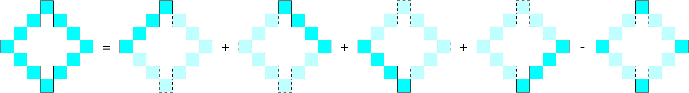

### [矩阵中最大的三个菱形和](https://leetcode.cn/problems/get-biggest-three-rhombus-sums-in-a-grid/solutions/802346/ju-zhen-zhong-zui-da-de-san-ge-ling-xing-hpko/)

#### 方法一：枚举所有的菱形

**提示 1**

一个菱形的自由度是多少（即如果我们至少需要多少个变量，才能**唯一**表示一个菱形）？

**提示 $1$ 解释**

一个菱形的自由度是 $3$，例如：

> $2$ 个变量表示菱形上顶点的坐标，$1$ 个变量表示菱形在水平或者竖直方向上的宽度。

**提示 2**



**提示 3**

要想快速计算提示 $2$ 中的每一部分，我们可以使用前缀和。

- 记 $sum_1[x][y]$ 表示从位置 $(x-1,y-1)$ 开始往**左上方**走，走到边界为止的所有格子的元素和。
- 记 $sum_2[x][y]$ 表示从位置 $(x-1,y-1)$ 开始往**右上方**走，走到边界为止的所有格子的元素和。

**思路与算法**

我们首先可以使用二重循环预处理出所有的 $sum_1[i][j]$ 以及 $sum_2[i][j]$。具体地，有递推式：

$$sum_1[i][j]=sum_1[i-1][j-1]+grid[i-1][j-1]$$

以及：

$$sum_2[i][j]=sum_2[i-1][j+1]+grid[i-1][j-1]$$

其中 $i$ 和 $j$ 的范围分别为 $[1,m]$ 以及 $[1,n]$。

接下来，我们使用三重循环分别枚举菱形上顶点的位置以及其在水平方向上的宽度，就可以计算出菱形四个顶点的位置，上下左右顶点的位置依次记为 $(u_x,u_y)$，(d_x,d_y)，$(l_x,l_y)$ 以及 $(r_x,r_y)$。这样一来，我们就可以使用前缀和在 $O(1)$ 的时间计算该菱形的菱形和，即提示 $2$ 中的五个部分的和分别为：

$$\begin{cases}
    sum_2[l_x+1][l_y+1]-sum_2[u_x][u_y+2] \\
    sum_1[r_x+1][r_y+1]-sum_1[u_x][u_y]   \\
    sum_1[d_x+1][d_y+1]-sum_1[l_x][l_y]   \\
    sum_2[d_x+1][d_y+1]-sum_2[r_x][r_y+2] \\
    grid[u_x][u_y]+grid[d_x][d_y]+grid[l_x][l_y]+grid[r_x][r_y]
\end{cases}$$

除此之外，我们可以设计一个简单的数据结构，它使得我们在得到了菱形和后，可以实时维护最大的 $3$ 个互不相同的菱形和，具体的实现可以参考下面的代码。

**细节**

需要注意单独的一个格子也是菱形。

**代码**

```C++
struct Answer {
    array<int, 3> ans{};

    void put(int x) {
        if (x > ans[0]) {
            tie(ans[0], ans[1], ans[2]) = tuple{x, ans[0], ans[1]};
        }
        else if (x != ans[0] && x > ans[1]) {
            tie(ans[1], ans[2]) = tuple{x, ans[1]};
        }
        else if (x != ans[0] && x != ans[1] && x > ans[2]) {
            ans[2] = x;
        }
    }

    vector<int> get() const {
        vector<int> ret;
        for (int num: ans) {
            if (num) {
                ret.push_back(num);
            }
        }
        return ret;
    }
};

class Solution {
public:
    vector<int> getBiggestThree(vector<vector<int>>& grid) {
        int m = grid.size(), n = grid[0].size();
        vector<vector<int>> sum1(m + 1, vector<int>(n + 2));
        vector<vector<int>> sum2(m + 1, vector<int>(n + 2));
        for (int i = 1; i <= m; ++i) {
            for (int j = 1; j <= n; ++j) {
                sum1[i][j] = sum1[i - 1][j - 1] + grid[i - 1][j - 1];
                sum2[i][j] = sum2[i - 1][j + 1] + grid[i - 1][j - 1];
            }
        }
        Answer ans;
        for (int i = 0; i < m; ++i) {
            for (int j = 0; j < n; ++j) {
                // 单独的一个格子也是菱形
                ans.put(grid[i][j]);
                for (int k = i + 2; k < m; k += 2) {
                    int ux = i, uy = j;
                    int dx = k, dy = j;
                    int lx = (i + k) / 2, ly = j - (k - i) / 2;
                    int rx = (i + k) / 2, ry = j + (k - i) / 2;
                    if (ly < 0 || ry >= n) {
                        break;
                    }
                    ans.put(
                        (sum2[lx + 1][ly + 1] - sum2[ux][uy + 2]) +
                        (sum1[rx + 1][ry + 1] - sum1[ux][uy]) +
                        (sum1[dx + 1][dy + 1] - sum1[lx][ly]) +
                        (sum2[dx + 1][dy + 1] - sum2[rx][ry + 2]) -
                        (grid[ux][uy] + grid[dx][dy] + grid[lx][ly] + grid[rx][ry])
                    );
                }
            }
        }
        return ans.get();
    }
};
```

```Python
class Answer:
    def __init__(self):
        self.ans = [0, 0, 0]

    def put(self, x: int):
        _ans = self.ans

        if x > _ans[0]:
            _ans[0], _ans[1], _ans[2] = x, _ans[0], _ans[1]
        elif x != _ans[0] and x > _ans[1]:
            _ans[1], _ans[2] = x, _ans[1]
        elif x != _ans[0] and x != _ans[1] and x > _ans[2]:
            _ans[2] = x

    def get(self) -> List[int]:
        _ans = self.ans

        return [num for num in _ans if num != 0]


class Solution:
    def getBiggestThree(self, grid: List[List[int]]) -> List[int]:
        m, n = len(grid), len(grid[0])
        sum1 = [[0] * (n + 2) for _ in range(m + 1)]
        sum2 = [[0] * (n + 2) for _ in range(m + 1)]

        for i in range(1, m + 1):
            for j in range(1, n + 1):
                sum1[i][j] = sum1[i - 1][j - 1] + grid[i - 1][j - 1]
                sum2[i][j] = sum2[i - 1][j + 1] + grid[i - 1][j - 1]

        ans = Answer()
        for i in range(m):
            for j in range(n):
                # 单独的一个格子也是菱形
                ans.put(grid[i][j])
                for k in range(i + 2, m, 2):
                    ux, uy = i, j
                    dx, dy = k, j
                    lx, ly = (i + k) // 2, j - (k - i) // 2
                    rx, ry = (i + k) // 2, j + (k - i) // 2

                    if ly < 0 or ry >= n:
                        break

                    ans.put(
                        (sum2[lx + 1][ly + 1] - sum2[ux][uy + 2]) +
                        (sum1[rx + 1][ry + 1] - sum1[ux][uy]) +
                        (sum1[dx + 1][dy + 1] - sum1[lx][ly]) +
                        (sum2[dx + 1][dy + 1] - sum2[rx][ry + 2]) -
                        (grid[ux][uy] + grid[dx][dy] + grid[lx][ly] + grid[rx][ry])
                    )

        return ans.get()
```

```Java
class Answer {
    int[] ans;

    public Answer() {
        ans = new int[3];
    }

    void put(int x) {
        if (x > ans[0]) {
            ans[2] = ans[1];
            ans[1] = ans[0];
            ans[0] = x;
        }
        else if (x != ans[0] && x > ans[1]) {
            ans[2] = ans[1];
            ans[1] = x;
        }
        else if (x != ans[0] && x != ans[1] && x > ans[2]) {
            ans[2] = x;
        }
    }

    List<Integer> get() {
        List<Integer> ret = new ArrayList<>();
        for (int num : ans) {
            if (num != 0) {
                ret.add(num);
            }
        }
        return ret;
    }
}

class Solution {
    public int[] getBiggestThree(int[][] grid) {
        int m = grid.length, n = grid[0].length;
        int[][] sum1 = new int[m + 1][n + 2];
        int[][] sum2 = new int[m + 1][n + 2];

        for (int i = 1; i <= m; ++i) {
            for (int j = 1; j <= n; ++j) {
                sum1[i][j] = sum1[i - 1][j - 1] + grid[i - 1][j - 1];
                sum2[i][j] = sum2[i - 1][j + 1] + grid[i - 1][j - 1];
            }
        }

        Answer ans = new Answer();
        for (int i = 0; i < m; ++i) {
            for (int j = 0; j < n; ++j) {
                // 单独的一个格子也是菱形
                ans.put(grid[i][j]);
                for (int k = i + 2; k < m; k += 2) {
                    int ux = i, uy = j;
                    int dx = k, dy = j;
                    int lx = (i + k) / 2, ly = j - (k - i) / 2;
                    int rx = (i + k) / 2, ry = j + (k - i) / 2;
                    if (ly < 0 || ry >= n) {
                        break;
                    }
                    int sum = (sum2[lx + 1][ly + 1] - sum2[ux][uy + 2]) +
                              (sum1[rx + 1][ry + 1] - sum1[ux][uy]) +
                              (sum1[dx + 1][dy + 1] - sum1[lx][ly]) +
                              (sum2[dx + 1][dy + 1] - sum2[rx][ry + 2]) -
                              (grid[ux][uy] + grid[dx][dy] + grid[lx][ly] + grid[rx][ry]);
                    ans.put(sum);
                }
            }
        }

        List<Integer> resultList = ans.get();
        int[] result = new int[resultList.size()];
        for (int i = 0; i < resultList.size(); i++) {
            result[i] = resultList.get(i);
        }
        return result;
    }
}
```

```CSharp
public class Answer {
    private int[] ans;

    public Answer() {
        ans = new int[3];
    }

    public void Put(int x) {
        if (x > ans[0]) {
            ans[2] = ans[1];
            ans[1] = ans[0];
            ans[0] = x;
        }
        else if (x != ans[0] && x > ans[1]) {
            ans[2] = ans[1];
            ans[1] = x;
        }
        else if (x != ans[0] && x != ans[1] && x > ans[2]) {
            ans[2] = x;
        }
    }

    public List<int> Get() {
        List<int> ret = new List<int>();
        foreach (int num in ans) {
            if (num != 0) {
                ret.Add(num);
            }
        }
        return ret;
    }
}

public class Solution {
    public int[] GetBiggestThree(int[][] grid) {
        int m = grid.Length, n = grid[0].Length;
        int[,] sum1 = new int[m + 1, n + 2];
        int[,] sum2 = new int[m + 1, n + 2];

        for (int i = 1; i <= m; ++i) {
            for (int j = 1; j <= n; ++j) {
                sum1[i, j] = sum1[i - 1, j - 1] + grid[i - 1][j - 1];
                sum2[i, j] = sum2[i - 1, j + 1] + grid[i - 1][j - 1];
            }
        }

        Answer ans = new Answer();
        for (int i = 0; i < m; ++i) {
            for (int j = 0; j < n; ++j) {
                // 单独的一个格子也是菱形
                ans.Put(grid[i][j]);
                for (int k = i + 2; k < m; k += 2) {
                    int ux = i, uy = j;
                    int dx = k, dy = j;
                    int lx = (i + k) / 2, ly = j - (k - i) / 2;
                    int rx = (i + k) / 2, ry = j + (k - i) / 2;
                    if (ly < 0 || ry >= n) {
                        break;
                    }
                    int sum = (sum2[lx + 1, ly + 1] - sum2[ux, uy + 2]) +
                              (sum1[rx + 1, ry + 1] - sum1[ux, uy]) +
                              (sum1[dx + 1, dy + 1] - sum1[lx, ly]) +
                              (sum2[dx + 1, dy + 1] - sum2[rx, ry + 2]) -
                              (grid[ux][uy] + grid[dx][dy] + grid[lx][ly] + grid[rx][ry]);
                    ans.Put(sum);
                }
            }
        }

        List<int> resultList = ans.Get();
        return resultList.ToArray();
    }
}
```

```Go
type Answer struct {
    ans [3]int
}

func (this *Answer) put(x int) {
    if x > this.ans[0] {
        this.ans[2] = this.ans[1]
        this.ans[1] = this.ans[0]
        this.ans[0] = x
    } else if x != this.ans[0] && x > this.ans[1] {
        this.ans[2] = this.ans[1]
        this.ans[1] = x
    } else if x != this.ans[0] && x != this.ans[1] && x > this.ans[2] {
        this.ans[2] = x
    }
}

func (this *Answer) get() []int {
    var ret []int
    for _, num := range this.ans {
        if num != 0 {
            ret = append(ret, num)
        }
    }
    return ret
}

func getBiggestThree(grid [][]int) []int {
    m, n := len(grid), len(grid[0])
    sum1 := make([][]int, m + 1)
    sum2 := make([][]int, m + 1)
    for i := 0; i <= m; i++ {
        sum1[i] = make([]int, n + 2)
        sum2[i] = make([]int, n + 2)
    }

    for i := 1; i <= m; i++ {
        for j := 1; j <= n; j++ {
            sum1[i][j] = sum1[i-1][j-1] + grid[i-1][j-1]
            sum2[i][j] = sum2[i-1][j+1] + grid[i-1][j-1]
        }
    }

    ans := Answer{}
    for i := 0; i < m; i++ {
        for j := 0; j < n; j++ {
            // 单独的一个格子也是菱形
            ans.put(grid[i][j])
            for k := i + 2; k < m; k += 2 {
                ux, uy := i, j
                dx, dy := k, j
                lx, ly := (i + k) / 2, j - (k - i) / 2
                rx, ry := (i + k) / 2, j + (k - i) / 2
                if ly < 0 || ry >= n {
                    break
                }
                sum := (sum2[lx + 1][ly + 1] - sum2[ux][uy + 2]) +
                       (sum1[rx + 1][ry + 1] - sum1[ux][uy]) +
                       (sum1[dx + 1][dy + 1] - sum1[lx][ly]) +
                       (sum2[dx + 1][dy + 1] - sum2[rx][ry + 2]) -
                       (grid[ux][uy] + grid[dx][dy] + grid[lx][ly] + grid[rx][ry])

                ans.put(sum)
            }
        }
    }

    return ans.get()
}
```

```C
typedef struct {
    int ans[3];
} Answer;

void answerPut(Answer* a, int x) {
    if (x > a->ans[0]) {
        a->ans[2] = a->ans[1];
        a->ans[1] = a->ans[0];
        a->ans[0] = x;
    }
    else if (x != a->ans[0] && x > a->ans[1]) {
        a->ans[2] = a->ans[1];
        a->ans[1] = x;
    }
    else if (x != a->ans[0] && x != a->ans[1] && x > a->ans[2]) {
        a->ans[2] = x;
    }
}

int* answerGet(Answer* a, int* returnSize) {
    int count = 0;
    for (int i = 0; i < 3; i++) {
        if (a->ans[i] != 0) {
            count++;
        }
    }

    int* ret = (int*)malloc(count * sizeof(int));
    *returnSize = count;
    int idx = 0;
    for (int i = 0; i < 3; i++) {
        if (a->ans[i] != 0) {
            ret[idx++] = a->ans[i];
        }
    }

    return ret;
}

int* getBiggestThree(int** grid, int gridSize, int* gridColSize, int* returnSize) {
    int m = gridSize, n = gridColSize[0];
    int** sum1 = (int**)malloc((m + 1) * sizeof(int*));
    int** sum2 = (int**)malloc((m + 1) * sizeof(int*));
    for (int i = 0; i <= m; i++) {
        sum1[i] = (int*)calloc(n + 2, sizeof(int));
        sum2[i] = (int*)calloc(n + 2, sizeof(int));
    }
    for (int i = 1; i <= m; i++) {
        for (int j = 1; j <= n; j++) {
            sum1[i][j] = sum1[i - 1][j - 1] + grid[i - 1][j - 1];
            sum2[i][j] = sum2[i - 1][j + 1] + grid[i - 1][j - 1];
        }
    }

    Answer ans = {{0}};
    for (int i = 0; i < m; i++) {
        for (int j = 0; j < n; j++) {
            // 单独的一个格子也是菱形
            answerPut(&ans, grid[i][j]);
            for (int k = i + 2; k < m; k += 2) {
                int ux = i, uy = j;
                int dx = k, dy = j;
                int lx = (i + k) / 2, ly = j - (k - i) / 2;
                int rx = (i + k) / 2, ry = j + (k - i) / 2;
                if (ly < 0 || ry >= n) {
                    break;
                }
                int sum = (sum2[lx + 1][ly + 1] - sum2[ux][uy + 2]) +
                          (sum1[rx + 1][ry + 1] - sum1[ux][uy]) +
                          (sum1[dx + 1][dy + 1] - sum1[lx][ly]) +
                          (sum2[dx + 1][dy + 1] - sum2[rx][ry + 2]) -
                          (grid[ux][uy] + grid[dx][dy] + grid[lx][ly] + grid[rx][ry]);
                answerPut(&ans, sum);
            }
        }
    }

    for (int i = 0; i <= m; i++) {
        free(sum1[i]);
        free(sum2[i]);
    }
    free(sum1);
    free(sum2);

    return answerGet(&ans, returnSize);
}
```

```JavaScript
class Answer {
    constructor() {
        this.ans = [0, 0, 0];
    }

    put(x) {
        if (x > this.ans[0]) {
            this.ans[2] = this.ans[1];
            this.ans[1] = this.ans[0];
            this.ans[0] = x;
        }
        else if (x !== this.ans[0] && x > this.ans[1]) {
            this.ans[2] = this.ans[1];
            this.ans[1] = x;
        }
        else if (x !== this.ans[0] && x !== this.ans[1] && x > this.ans[2]) {
            this.ans[2] = x;
        }
    }

    get() {
        const ret = [];
        for (const num of this.ans) {
            if (num !== 0) {
                ret.push(num);
            }
        }
        return ret;
    }
}

var getBiggestThree = function(grid) {
    const m = grid.length, n = grid[0].length;
    const sum1 = Array.from({length: m + 1}, () => new Array(n + 2).fill(0));
    const sum2 = Array.from({length: m + 1}, () => new Array(n + 2).fill(0));

    for (let i = 1; i <= m; ++i) {
        for (let j = 1; j <= n; ++j) {
            sum1[i][j] = sum1[i - 1][j - 1] + grid[i - 1][j - 1];
            sum2[i][j] = sum2[i - 1][j + 1] + grid[i - 1][j - 1];
        }
    }

    const ans = new Answer();
    for (let i = 0; i < m; ++i) {
        for (let j = 0; j < n; ++j) {
            // 单独的一个格子也是菱形
            ans.put(grid[i][j]);
            for (let k = i + 2; k < m; k += 2) {
                const ux = i, uy = j;
                const dx = k, dy = j;
                const lx = Math.floor((i + k) / 2), ly = j - Math.floor((k - i) / 2);
                const rx = Math.floor((i + k) / 2), ry = j + Math.floor((k - i) / 2);
                if (ly < 0 || ry >= n) {
                    break;
                }
                const sum = (sum2[lx + 1][ly + 1] - sum2[ux][uy + 2]) +
                          (sum1[rx + 1][ry + 1] - sum1[ux][uy]) +
                          (sum1[dx + 1][dy + 1] - sum1[lx][ly]) +
                          (sum2[dx + 1][dy + 1] - sum2[rx][ry + 2]) -
                          (grid[ux][uy] + grid[dx][dy] + grid[lx][ly] + grid[rx][ry]);
                ans.put(sum);
            }
        }
    }

    return ans.get();
};
```

```TypeScript
class Answer {
    private ans: number[];

    constructor() {
        this.ans = [0, 0, 0];
    }

    put(x: number): void {
        if (x > this.ans[0]) {
            this.ans[2] = this.ans[1];
            this.ans[1] = this.ans[0];
            this.ans[0] = x;
        }
        else if (x !== this.ans[0] && x > this.ans[1]) {
            this.ans[2] = this.ans[1];
            this.ans[1] = x;
        }
        else if (x !== this.ans[0] && x !== this.ans[1] && x > this.ans[2]) {
            this.ans[2] = x;
        }
    }

    get(): number[] {
        const ret: number[] = [];
        for (const num of this.ans) {
            if (num !== 0) {
                ret.push(num);
            }
        }
        return ret;
    }
}

function getBiggestThree(grid: number[][]): number[] {
    const m = grid.length, n = grid[0].length;
    const sum1: number[][] = Array.from({length: m + 1}, () => new Array(n + 2).fill(0));
    const sum2: number[][] = Array.from({length: m + 1}, () => new Array(n + 2).fill(0));

    for (let i = 1; i <= m; ++i) {
        for (let j = 1; j <= n; ++j) {
            sum1[i][j] = sum1[i - 1][j - 1] + grid[i - 1][j - 1];
            sum2[i][j] = sum2[i - 1][j + 1] + grid[i - 1][j - 1];
        }
    }

    const ans = new Answer();
    for (let i = 0; i < m; ++i) {
        for (let j = 0; j < n; ++j) {
            // 单独的一个格子也是菱形
            ans.put(grid[i][j]);
            for (let k = i + 2; k < m; k += 2) {
                const ux = i, uy = j;
                const dx = k, dy = j;
                const lx = Math.floor((i + k) / 2), ly = j - Math.floor((k - i) / 2);
                const rx = Math.floor((i + k) / 2), ry = j + Math.floor((k - i) / 2);
                if (ly < 0 || ry >= n) {
                    break;
                }
                const sum = (sum2[lx + 1][ly + 1] - sum2[ux][uy + 2]) +
                          (sum1[rx + 1][ry + 1] - sum1[ux][uy]) +
                          (sum1[dx + 1][dy + 1] - sum1[lx][ly]) +
                          (sum2[dx + 1][dy + 1] - sum2[rx][ry + 2]) -
                          (grid[ux][uy] + grid[dx][dy] + grid[lx][ly] + grid[rx][ry]);

                ans.put(sum);
            }
        }
    }

    return ans.get();
}
```

```Rust
struct Answer {
    ans: [i32; 3],
}

impl Answer {
    fn new() -> Self {
        Answer { ans: [0, 0, 0] }
    }

    fn put(&mut self, x: i32) {
        if x > self.ans[0] {
            self.ans[2] = self.ans[1];
            self.ans[1] = self.ans[0];
            self.ans[0] = x;
        } else if x != self.ans[0] && x > self.ans[1] {
            self.ans[2] = self.ans[1];
            self.ans[1] = x;
        } else if x != self.ans[0] && x != self.ans[1] && x > self.ans[2] {
            self.ans[2] = x;
        }
    }

    fn get(&self) -> Vec<i32> {
        let mut ret = Vec::new();
        for &num in &self.ans {
            if num != 0 {
                ret.push(num);
            }
        }
        ret
    }
}

impl Solution {
    pub fn get_biggest_three(grid: Vec<Vec<i32>>) -> Vec<i32> {
        let m = grid.len();
        let n = grid[0].len();
        let mut sum1 = vec![vec![0; n + 2]; m + 1];
        let mut sum2 = vec![vec![0; n + 2]; m + 1];

        for i in 1..=m {
            for j in 1..=n {
                sum1[i][j] = sum1[i - 1][j - 1] + grid[i - 1][j - 1];
                sum2[i][j] = sum2[i - 1][j + 1] + grid[i - 1][j - 1];
            }
        }

        let mut ans = Answer::new();
        for i in 0..m {
            for j in 0..n {
                // 单独的一个格子也是菱形
                ans.put(grid[i][j]);
                let mut k = i + 2;
                while k < m {
                    let ux = i;
                    let uy = j;
                    let dx = k;
                    let dy = j;
                    let lx = (i + k) / 2;
                    let ly = j as i32 - ((k - i) / 2) as i32;
                    let rx = (i + k) / 2;
                    let ry = j + (k - i) / 2;

                    if ly < 0 || ry >= n {
                        break;
                    }

                    let sum = (sum2[lx + 1][(ly + 1) as usize] - sum2[ux][uy + 2]) +
                              (sum1[rx + 1][ry + 1] - sum1[ux][uy]) +
                              (sum1[dx + 1][dy + 1] - sum1[lx][ly as usize]) +
                              (sum2[dx + 1][dy + 1] - sum2[rx][ry + 2]) -
                              (grid[ux][uy] + grid[dx][dy] + grid[lx][ly as usize] + grid[rx][ry]);

                    ans.put(sum);
                    k += 2;
                }
            }
        }

        ans.get()
    }
}
```

**复杂度分析**

- 时间复杂度：$O(mnmin(m,n))$。预处理前缀和的时间复杂度为 $O(mn)$，枚举菱形并计算菱形和的时间复杂度为 $O(mnmin(m,n))$，因此总时间复杂度为 $O(mnmin(m,n))$。
- 空间复杂度：$O(mn)$，记为前缀和数组需要使用的空间。
