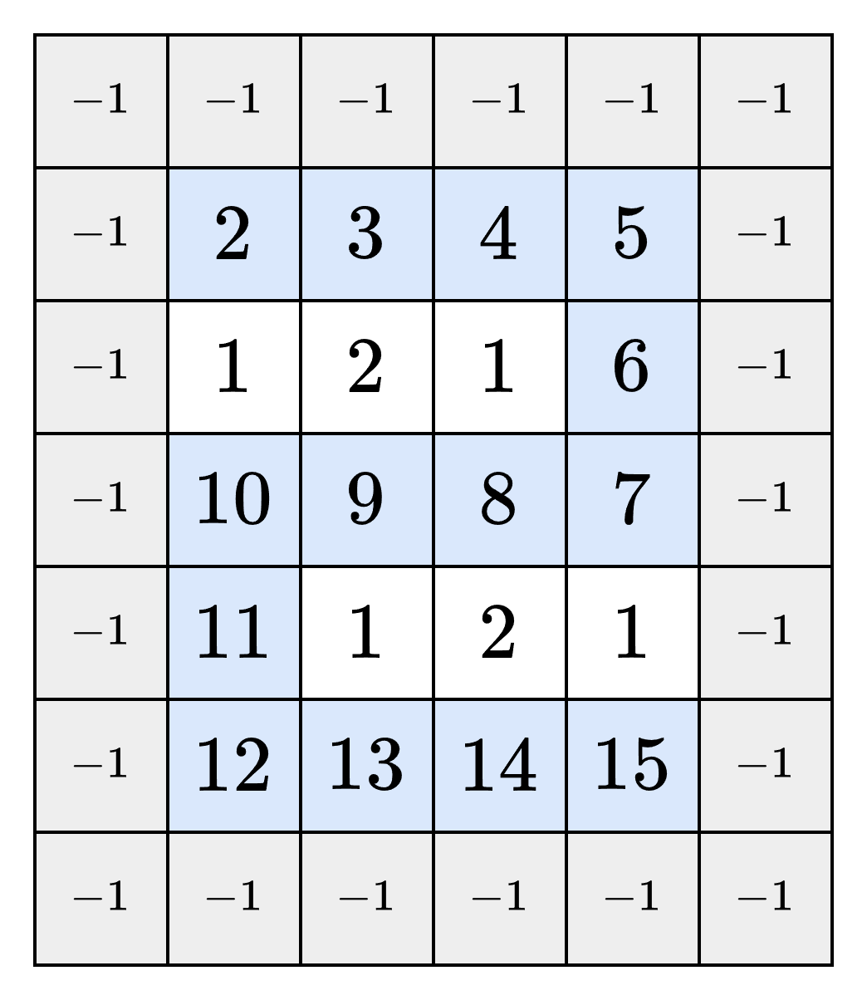
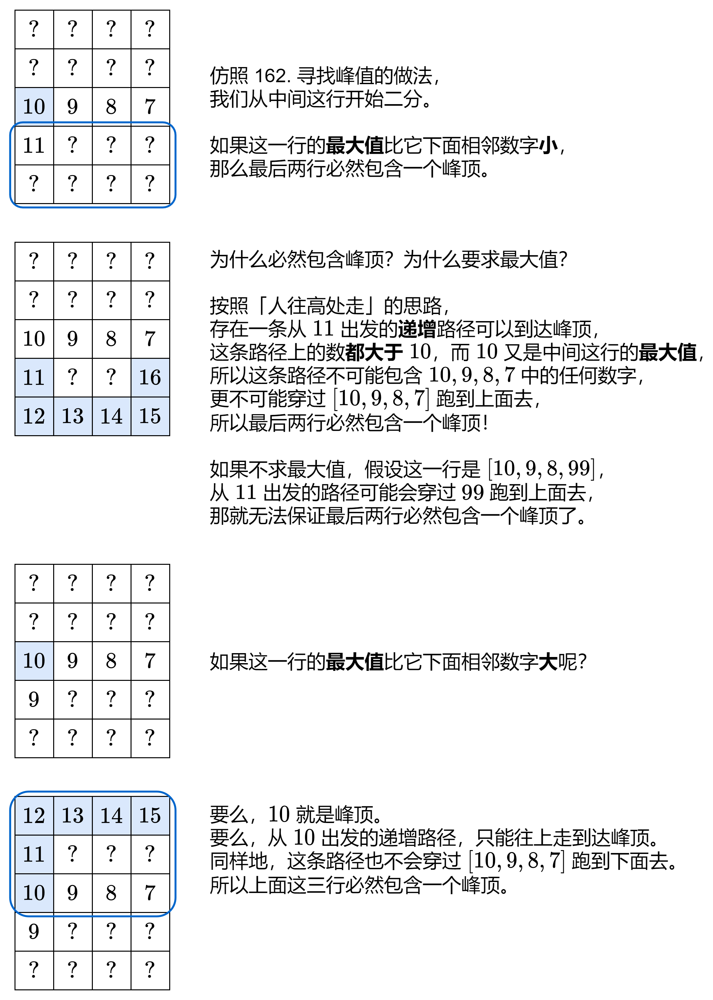

### [【图解】利用行最大值判断峰顶位置，附二分题单（Python/Java/C++/Go/JS/Rust）](https://leetcode.cn/problems/find-a-peak-element-ii/solutions/2571587/tu-jie-li-yong-xing-zui-da-zhi-pan-duan-r4e0n/)

先来看一个暴力点的做法。

**人往高处走：** 从左上角出发，每次往四周比当前位置大的数字走，直到走到一个峰顶。

> 注意题目保证相邻数字不同，对于每个数字，要么它小于四周的某个数字，要么它大于四周的所有数字，不存在相等的情况。

这样做虽然可以找到峰顶，但在最坏情况下的时间复杂度是 $\mathcal{O}(mn)$，不满足题目要求。如下图，我们可能会走出一条蛇形路径。



能否像 [162. 寻找峰值](https://leetcode.cn/problems/find-peak-element/) 那样二分呢？请看下图。



综上所述，我们可以二分包含峰顶的**行号** $i$：

- 如果 $mat[i]$ 的最大值比它下面的相邻数字**小**，则存在一个峰顶，其行号大于 $i$。缩小二分范围，更新二分区间左端点 $left$。
- 如果 $mat[i]$ 的最大值比它下面的相邻数字**大**，则存在一个峰顶，其行号小于或等于 $i$。缩小二分范围，更新二分区间右端点 $right$。

#### 实现细节

关于二分算法的原理，请看视频：[二分查找 红蓝染色法【基础算法精讲 04】](https://leetcode.cn/link/?target=https%3A%2F%2Fwww.bilibili.com%2Fvideo%2FBV1AP41137w7%2F)

对于本题，如果每次二分，都是 $mat[i]$ 的最大值比它下面的相邻数字小，那么最后会判断出峰顶行号大于 $m-2$，此时可以直接确定**最后一行必然包含峰顶**。

这意味着 $m-1$ **不需要在初始二分范围内**，初始二分范围为 $[0,m-2]$。在这个范围中二分，如果每次都更新的是区间左端点 $left$，那么最后得到的二分结果必然是 $m-1$。

如果在 $[0,m-1]$ 中二分，还需要额外判断 $i+1$ 是否越界。在 $[0,m-2]$ 中二分可以避免越界判断。

这一技巧同样可以用在 [162. 寻找峰值](https://leetcode.cn/problems/find-peak-element/)，只需要在闭区间 $[0,n-2]$ 中二分，即开区间 $(-1,n-1)$，[代码见此](https://leetcode.cn/problems/find-peak-element/solution/by-endlesscheng-9ass/)。

#### 写法一：闭区间

```python
class Solution:
    def findPeakGrid(self, mat: List[List[int]]) -> List[int]:
        left, right = 0, len(mat) - 2
        while left <= right:
            i = (left + right) // 2
            mx = max(mat[i])
            if mx > mat[i + 1][mat[i].index(mx)]:
                right = i - 1  # 峰顶行号 <= i
            else:
                left = i + 1  # 峰顶行号 > i
        i = left
        return [i, mat[i].index(max(mat[i]))]
```

```java
class Solution {
    public int[] findPeakGrid(int[][] mat) {
        int left = 0, right = mat.length - 2;
        while (left <= right) {
            int i = (left + right) >>> 1;
            int j = indexOfMax(mat[i]);
            if (mat[i][j] > mat[i + 1][j]) {
                right = i - 1; // 峰顶行号 <= i
            } else {
                left = i + 1; // 峰顶行号 > i
            }
        }
        return new int[]{left, indexOfMax(mat[left])};
    }

    private int indexOfMax(int[] a) {
        int idx = 0;
        for (int i = 0; i < a.length; i++) {
            if (a[i] > a[idx]) {
                idx = i;
            }
        }
        return idx;
    }
}
```

```c++
class Solution {
    int indexOfMax(vector<int> &a) {
        return max_element(a.begin(), a.end()) - a.begin();
    }

public:
    vector<int> findPeakGrid(vector<vector<int>> &mat) {
        int left = 0, right = mat.size() - 2;
        while (left <= right) {
            int i = left + (right - left) / 2;
            int j = indexOfMax(mat[i]);
            if (mat[i][j] > mat[i + 1][j]) {
                right = i - 1; // 峰顶行号 <= i
            } else {
                left = i + 1; // 峰顶行号 > i
            }
        }
        return {left, indexOfMax(mat[left])};
    }
};
```

```go
func findPeakGrid(mat [][]int) []int {
    left, right := 0, len(mat)-2
    for left <= right {
        i := left + (right-left)/2
        j := indexOfMax(mat[i])
        if mat[i][j] > mat[i+1][j] {
            right = i - 1 // 峰顶行号 <= i
        } else {
            left = i + 1 // 峰顶行号 > i
        }
    }
    return []int{left, indexOfMax(mat[left])}
}

func indexOfMax(a []int) (idx int) {
    for i, x := range a {
        if x > a[idx] {
            idx = i
        }
    }
    return
}
```

```javascript
function indexOfMax(a) {
    let idx = 0;
    for (let i = 0; i < a.length; i++) {
        if (a[i] > a[idx]) {
            idx = i;
        }
    }
    return idx;
}

function findPeakGrid(mat) {
    let left = 0, right = mat.length - 2;
    while (left <= right) {
        const i = Math.floor((left + right) / 2);
        const j = indexOfMax(mat[i]);
        if (mat[i][j] > mat[i + 1][j]) {
            right = i - 1; // 峰顶行号 <= i
        } else {
            left = i + 1; // 峰顶行号 > i
        }
    }
    return [left, indexOfMax(mat[left])];
}
```

#### 写法二：左闭右开区间

```python
class Solution:
    def findPeakGrid(self, mat: List[List[int]]) -> List[int]:
        left, right = 0, len(mat) - 1
        while left < right:
            i = (left + right) // 2
            mx = max(mat[i])
            if mx > mat[i + 1][mat[i].index(mx)]:
                right = i  # 峰顶行号 <= i
            else:
                left = i + 1  # 峰顶行号 > i
        i = left
        return [i, mat[i].index(max(mat[i]))]
```

```java
class Solution {
    public int[] findPeakGrid(int[][] mat) {
        int left = 0, right = mat.length - 1;
        while (left < right) {
            int i = (left + right) >>> 1;
            int j = indexOfMax(mat[i]);
            if (mat[i][j] > mat[i + 1][j]) {
                right = i; // 峰顶行号 <= i
            } else {
                left = i + 1; // 峰顶行号 > i
            }
        }
        return new int[]{left, indexOfMax(mat[left])};
    }

    private int indexOfMax(int[] a) {
        int idx = 0;
        for (int i = 0; i < a.length; i++) {
            if (a[i] > a[idx]) {
                idx = i;
            }
        }
        return idx;
    }
}
```

```c++
class Solution {
    int indexOfMax(vector<int> &a) {
        return max_element(a.begin(), a.end()) - a.begin();
    }

public:
    vector<int> findPeakGrid(vector<vector<int>> &mat) {
        int left = 0, right = mat.size() - 1;
        while (left < right) {
            int i = left + (right - left) / 2;
            int j = indexOfMax(mat[i]);
            if (mat[i][j] > mat[i + 1][j]) {
                right = i; // 峰顶行号 <= i
            } else {
                left = i + 1; // 峰顶行号 > i
            }
        }
        return {left, indexOfMax(mat[left])};
    }
};
```

```go
func findPeakGrid(mat [][]int) []int {
    left, right := 0, len(mat)-1
    for left < right {
        i := left + (right-left)/2
        j := indexOfMax(mat[i])
        if mat[i][j] > mat[i+1][j] {
            right = i // 峰顶行号 <= i
        } else {
            left = i + 1 // 峰顶行号 > i
        }
    }
    return []int{left, indexOfMax(mat[left])}
}

func indexOfMax(a []int) (idx int) {
    for i, x := range a {
        if x > a[idx] {
            idx = i
        }
    }
    return
}
```

```javascript
function indexOfMax(a) {
    let idx = 0;
    for (let i = 0; i < a.length; i++) {
        if (a[i] > a[idx]) {
            idx = i;
        }
    }
    return idx;
}

function findPeakGrid(mat) {
    let left = 0, right = mat.length - 1;
    while (left < right) {
        const i = Math.floor((left + right) / 2);
        const j = indexOfMax(mat[i]);
        if (mat[i][j] > mat[i + 1][j]) {
            right = i; // 峰顶行号 <= i
        } else {
            left = i + 1; // 峰顶行号 > i
        }
    }
    return [left, indexOfMax(mat[left])];
}
```

```rust
impl Solution {
    fn index_of_max(a: &Vec<i32>) -> usize {
        (0..a.len()).max_by_key(|&i| a[i]).unwrap()
    }

    pub fn find_peak_grid(mat: Vec<Vec<i32>>) -> Vec<i32> {
        let mut left = 0;
        let mut right = mat.len() - 1;
        while left < right {
            let i = left + (right - left) / 2;
            let j = Self::index_of_max(&mat[i]);
            if mat[i][j] > mat[i + 1][j] {
                right = i; // 峰顶行号 <= i
            } else {
                left = i + 1; // 峰顶行号 > i
            }
        }
        vec![left as i32, Self::index_of_max(&mat[left]) as i32]
    }
}
```

#### 写法三：开区间

```python
class Solution:
    def findPeakGrid(self, mat: List[List[int]]) -> List[int]:
        left, right = -1, len(mat) - 1
        while left + 1 < right:
            i = (left + right) // 2
            mx = max(mat[i])
            if mx > mat[i + 1][mat[i].index(mx)]:
                right = i  # 峰顶行号 <= i
            else:
                left = i  # 峰顶行号 > i
        i = right
        return [i, mat[i].index(max(mat[i]))]
```

```java
class Solution {
    public int[] findPeakGrid(int[][] mat) {
        int left = -1, right = mat.length - 1;
        while (left + 1 < right) {
            int i = (left + right) >>> 1;
            int j = indexOfMax(mat[i]);
            if (mat[i][j] > mat[i + 1][j]) {
                right = i; // 峰顶行号 <= i
            } else {
                left = i; // 峰顶行号 > i
            }
        }
        return new int[]{right, indexOfMax(mat[right])};
    }

    private int indexOfMax(int[] a) {
        int idx = 0;
        for (int i = 0; i < a.length; i++) {
            if (a[i] > a[idx]) {
                idx = i;
            }
        }
        return idx;
    }
}
```

```c++
class Solution {
    int indexOfMax(vector<int> &a) {
        return max_element(a.begin(), a.end()) - a.begin();
    }

public:
    vector<int> findPeakGrid(vector<vector<int>> &mat) {
        int left = -1, right = mat.size() - 1;
        while (left + 1 < right) {
            int i = left + (right - left) / 2;
            int j = indexOfMax(mat[i]);
            (mat[i][j] > mat[i + 1][j] ? right : left) = i;
        }
        return {right, indexOfMax(mat[right])};
    }
};
```

```go
func findPeakGrid(mat [][]int) []int {
    left, right := -1, len(mat)-1
    for left+1 < right {
        i := left + (right-left)/2
        j := indexOfMax(mat[i])
        if mat[i][j] > mat[i+1][j] {
            right = i // 峰顶行号 <= i
        } else {
            left = i // 峰顶行号 > i
        }
    }
    return []int{right, indexOfMax(mat[right])}
}

func indexOfMax(a []int) (idx int) {
    for i, x := range a {
        if x > a[idx] {
            idx = i
        }
    }
    return
}
```

```javascript
function indexOfMax(a) {
    let idx = 0;
    for (let i = 0; i < a.length; i++) {
        if (a[i] > a[idx]) {
            idx = i;
        }
    }
    return idx;
}

function findPeakGrid(mat) {
    let left = -1, right = mat.length - 1;
    while (left + 1 < right) {
        const i = Math.floor((left + right) / 2);
        const j = indexOfMax(mat[i]);
        if (mat[i][j] > mat[i + 1][j]) {
            right = i; // 峰顶行号 <= i
        } else {
            left = i; // 峰顶行号 > i
        }
    }
    return [right, indexOfMax(mat[right])];
}
```

#### 复杂度分析

- 时间复杂度：$\mathcal{O}(n\log m)$，其中 $m$ 和 $n$ 分别为 $mat$ 的行数和列数。需要二分 $\mathcal{O}(\log m)$ 次，每次二分需要 $\mathcal{O}(n)$ 的时间寻找 $mat[i]$ 最大值的下标。
- 空间复杂度：$\mathcal{O}(1)$。仅用到若干额外变量。

#### 二分题单（右边数字为难度分）

##### 二分答案

- [275. H 指数 II](https://leetcode.cn/problems/h-index-ii/)
- [1283. 使结果不超过阈值的最小除数](https://leetcode.cn/problems/find-the-smallest-divisor-given-a-threshold/) 1542
- [2187. 完成旅途的最少时间](https://leetcode.cn/problems/minimum-time-to-complete-trips/) 1641
- [2226. 每个小孩最多能分到多少糖果](https://leetcode.cn/problems/maximum-candies-allocated-to-k-children/) 1646
- [1870. 准时到达的列车最小时速](https://leetcode.cn/problems/minimum-speed-to-arrive-on-time/) 1676
- [1011. 在 D 天内送达包裹的能力](https://leetcode.cn/problems/capacity-to-ship-packages-within-d-days/) 1725
- [875. 爱吃香蕉的珂珂](https://leetcode.cn/problems/koko-eating-bananas/) 1766
- [1898. 可移除字符的最大数目](https://leetcode.cn/problems/maximum-number-of-removable-characters/) 1913
- [1482. 制作 m 束花所需的最少天数](https://leetcode.cn/problems/minimum-number-of-days-to-make-m-bouquets/) 1946
- [1642. 可以到达的最远建筑](https://leetcode.cn/problems/furthest-building-you-can-reach/) 1962
- [2861. 最大合金数](https://leetcode.cn/problems/maximum-number-of-alloys/) 1981
- [2258. 逃离火灾](https://leetcode.cn/problems/escape-the-spreading-fire/) 2347

##### 最小化最大值

- [2064. 分配给商店的最多商品的最小值](https://leetcode.cn/problems/minimized-maximum-of-products-distributed-to-any-store/) 1886
- [1760. 袋子里最少数目的球](https://leetcode.cn/problems/minimum-limit-of-balls-in-a-bag/) 1940
- [2439. 最小化数组中的最大值](https://leetcode.cn/problems/minimize-maximum-of-array/) 1965
- [2560. 打家劫舍 IV](https://leetcode.cn/problems/house-robber-iv/) 2081
- [778. 水位上升的泳池中游泳](https://leetcode.cn/problems/swim-in-rising-water/) 2097
- [2616. 最小化数对的最大差值](https://leetcode.cn/problems/minimize-the-maximum-difference-of-pairs/) 2155
- [2513. 最小化两个数组中的最大值](https://leetcode.cn/problems/minimize-the-maximum-of-two-arrays/) 2302

##### 最大化最小值

- [1552. 两球之间的磁力](https://leetcode.cn/problems/magnetic-force-between-two-balls/) 1920
- [2861. 最大合金数](https://leetcode.cn/problems/maximum-number-of-alloys/) 1981
- [2517. 礼盒的最大甜蜜度](https://leetcode.cn/problems/maximum-tastiness-of-candy-basket/) 2021
- [2812. 找出最安全路径](https://leetcode.cn/problems/find-the-safest-path-in-a-grid/) 2154
- [2528. 最大化城市的最小供电站数目](https://leetcode.cn/problems/maximize-the-minimum-powered-city/) 2236
