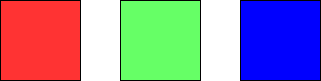

### [1931\. 用三种不同颜色为网格涂色](https://leetcode.cn/problems/painting-a-grid-with-three-different-colors/)

难度：困难

给你两个整数 `m` 和 `n`。构造一个 <code>m &times; n</code> 的网格，其中每个单元格最开始是白色。请你用 **红、绿、蓝** 三种颜色为每个单元格涂色。所有单元格都需要被涂色。

涂色方案需要满足：**不存在相邻两个单元格颜色相同的情况**。返回网格涂色的方法数。因为答案可能非常大， 返回 **对** <code>109 + 7</code> **取余** 的结果。

**示例 1：**

> **输入：** m = 1, n = 1
> **输出：** 3
> **解释：** 如上图所示，存在三种可能的涂色方案。

**示例 2：**

> **输入：** m = 1, n = 2
> **输出：** 6
> **解释：** 如上图所示，存在六种可能的涂色方案。

**示例 3：**

> **输入：** m = 5, n = 5
> **输出：** 580986

**提示：**

- `1 <= m <= 5`
- `1 <= n <= 1000`
