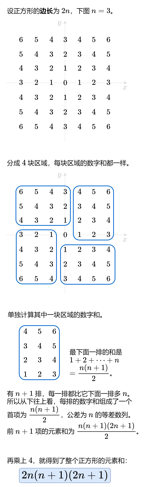

### [【图解】O(1) 做法（Python/Java/C++/Go/JS/Rust）](https://leetcode.cn/problems/minimum-garden-perimeter-to-collect-enough-apples/solutions/2577652/tu-jie-o1-zuo-fa-pythonjavacgojsrust-by-oms4k/)



设正方形的周长为 $8n$，则其边长为 $2n$。

问题相当于求最小的 $n$，满足

$$2n(n+1)(2n+1)\ge neededApples$$

上式变形为

$$n(n+1)(n+\dfrac{1}{2})\ge \dfrac{1}{4}neededApples$$

设 $m = \left\lfloor \sqrt[3]{\dfrac{1}{4}neededApples} \right\rfloor$。

- 由于 $(m-1)m(m-\dfrac{1}{2}) < m^3 \le \dfrac{1}{4}neededApples$，所以 $m-1$ 必不满足要求。
- 由于 $(m+1)(m+2)(m+\dfrac{3}{2}) > (m+1)^3 > \dfrac{1}{4}neededApples$，所以 $m+1$ 必满足要求。注意 $m+1>\left\lceil\sqrt[3]{\dfrac{1}{4}neededApples}\right\rceil$。
- $m$ 是否满足要求？计算一下就知道了。

因此，直接计算出 $n = \left\lfloor \sqrt[3]{\dfrac{1}{4}neededApples} \right\rfloor$，如果 $2n(n+1)(2n+1)< neededApples$ 则将 $n$ 加一。

注：在本题的数据范围下，cbrt 算出的整数部分是正确的，不会因为浮点误差导致对 xxx.999999 下取整的错误。

```python
class Solution:
    def minimumPerimeter(self, neededApples: int) -> int:
        n = int(cbrt(neededApples / 4))
        if 2 * n * (n + 1) * (2 * n + 1) < neededApples:
            n += 1
        return 8 * n
```

```java
class Solution {
    public long minimumPerimeter(long neededApples) {
        long n = (long) Math.cbrt(neededApples / 4.0);
        if (2 * n * (n + 1) * (2 * n + 1) < neededApples) {
            n++;
        }
        return 8 * n;
    }
}
```

```c++
class Solution {
public:
    long long minimumPerimeter(long long neededApples) {
        long long n = cbrt(neededApples / 4.0);
        if (2 * n * (n + 1) * (2 * n + 1) < neededApples) {
            n++;
        }
        return 8 * n;
    }
};
```

```go
func minimumPerimeter(neededApples int64) int64 {
    n := int64(math.Cbrt(float64(neededApples) / 4))
    if 2*n*(n+1)*(2*n+1) < neededApples {
        n++
    }
    return 8 * n
}
```

```javascript
var minimumPerimeter = function(neededApples) {
    let n = Math.floor(Math.cbrt(neededApples / 4));
    if (2 * n * (n + 1) * (2 * n + 1) < neededApples) {
        n++;
    }
    return 8 * n;
};
```

```rust
impl Solution {
    pub fn minimum_perimeter(needed_apples: i64) -> i64 {
        let mut n = (needed_apples as f64 / 4.0).cbrt() as i64;
        if 2 * n * (n + 1) * (2 * n + 1) < needed_apples {
            n += 1;
        }
        8 * n
    }
}
```

#### 复杂度分析

- 时间复杂度：$\mathcal{O}(1)$。开立方有专用的计算函数 cbrt，时间可以视作 $\mathcal{O}(1)$。
- 空间复杂度：$\mathcal{O}(1)$。

#### 相似题目

- [1739. 放置盒子](https://leetcode.cn/problems/building-boxes/)
