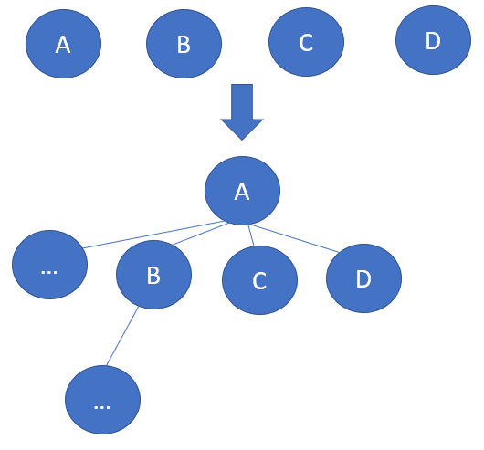
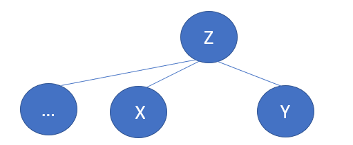
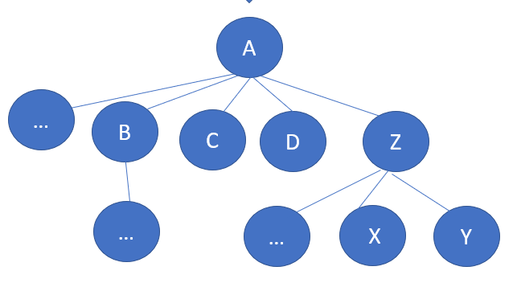
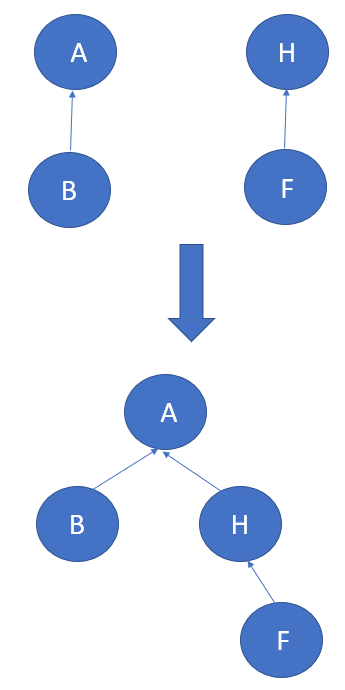
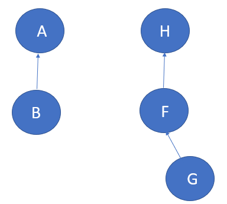
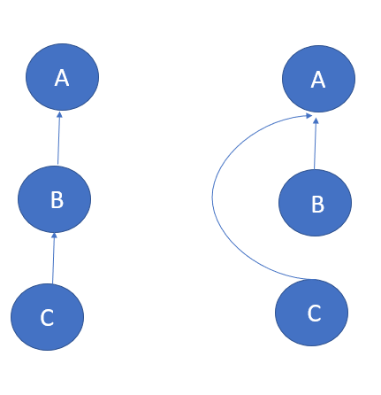

#### [并查集](https://leetcode.cn/problems/find-if-path-exists-in-graph/solutions/1316746/dai-ma-you-xiang-xi-zhu-shi-bing-cha-ji-p4t9f/)

CLRS（算法导论）第21章。

-   用于不相交集合的数据结构。
-   并查集的思想在于：用一个成员来代表这整个集合。

举个不恰当的例子：

A创建了一个公益组织，起初只有他自己一个人，后面B、C、D、...相继加入。一开始是组织所有人都要审核，后面人数太多了很麻烦，于是大家提议说，我们都相信A，把A作为老大吧。于是后面A就代表了组织。


后来，Z也同样的创建了一个组织，Y、X、…相继加入。同理Z也成为组织的代表。


那问大家一个问题，现在X和B有关系吗？

-   没有的，他们现在处于不同的组织，A和Z没有关系。

后来大家一看，我们组织和他们组织做的事情都一样，那我们一起做不是效率会更高吗？因为A那边组织人数比较多，所以Z这个组织所有人都同意认A做老大。


那还是问大家这个问题，现在X和B有关系吗？

-   那现在就肯定有了啊！两个组织合成一个了，我们两的老大都是A！

这就是并查集的思想。

并查集有三个基本操作：MAKE-SET(x)、UNION(x, y)、FIND-SET(x)

-   MAKE-SET(x) : 建立集合，相当于初始化新的元素，每个新元素的根节点一开始都是指向自己的。
-   UNION(x, y) : 将包含x，y的两个动态集合合并成一个新的集合。（假定这两个集合在操作之前是不相交的）
-   FIND-SET(x) : 返回包含x的集合的代表（根节点）

MAKE-SET(x)

```cpp
// 我这里是定死初始化元素个数n的，可以写成动态集合，每次makeSet就新加入一个元素
int[] nodes;
public void makeSet(int n) {
    nodes = new int[n];
    for (int i = 0; i < n; i++) {
        // 每个新元素的根节点一开始都是指向自己的
        nodes[i] = i;
    }
}
```

FIND-SET(x)

```cpp
public int findSet(int x) {
    // 如果此时父节点指向自己，说明已经是根结点了
    if (nodes[x] == x) return x;
    // 否则，根据父节点继续往上找，直到找到根节点
    else return findSet(nodes[x]);
}
```

UNION(x, y)可能有点抽象，我们画个图看看。 那么假如，F跟B说，我们两组织一起吧（此时F不知道包含B集合的代表是谁），B说那简单，你找你们老大H，我找我们老大A，他们两OK就行了！


```cpp
public void union(int x, int y) {
    int xRoot = findSet(x), yRoot = findSet(y);
    // 找到根节点后，x根做y根的子树，y根做x根的子树都可以
    nodes[xRoot] = yRoot; // nodes[yRoot] = xRoot;
}
```

UNION也可以继续一步优化，当两颗树深度不同时，深度小的接到深度比较深的。因为这样不会使得深度加深。这一步也叫路径优化


（大家想一下画一下就懂了）

-   那这里可以再有一个数组，用于保存深度。

```cpp
int[] nodes;
int[] depth;

public void makeSet(int n) {
    this.depth = new int[n];
    this.nodes = new int[n];
    for (int i = 0; i < n; i++) {
        nodes[i] = i;
        depth[i] = 1;
    }
}

public void union(int x, int y) {
    // 首先要找到两个结点的根节点（集合代表）
    int xRoot = findSet(x), yRoot = findSet(y);
    // 当根节点都相同时，没有必要继续执行合并
    if (xRoot == yRoot) return;
    // 找到后，如果此时两个结点深度是一致的，则没有要求；否则必须接到深度更深的树上
    if (depth[xRoot] <= depth[yRoot]) nodes[xRoot] = yRoot;
    else nodes[yRoot] = xRoot;
    // 接完后需要是否深度增加，当且仅当两棵树（且为不同结点）深度一样，深度才会加上
    if (depth[xRoot] == depth[yRoot]) depth[yRoot]++; // 因为上面默认深度一样时接到yRoot上，所以是yRoot++
    }
```

#### 路径压缩

回过头我们再看一下函数FIND-SET，我们要找C的根节点，C先找到B，B再找到A。这样如果这个链路一长，是不是很耗时？ 那其实我们可以优化直接把C指向A。这一步也叫做路径压缩。（只有在该结点被查找的时候才会压缩） 

```cpp
    /**
     * FIND-SET(x) : 找到结点x所在集合中的代表（相当于找这棵树的根节点）
     * 所有树高 <= 2 （在union的时候可能到达3）
     */
    public int findSet(int x) {
        // 直接把该集合所有节点接到根节点下面, 拍平, 此时树深度为2
        if (nodes[x] != x)
            nodes[x] = findSet(nodes[x]);
        return nodes[x];
    }
```

-   这步代码也可以优化成一句

```cpp
public int findSet(int x) {
    return x == nodes[x] ? x : (nodes[x] = findSet(nodes[x]));
}
```

有了路径压缩后，我们的函数UNION就不需要辅助数组了

```cpp
public int findSet(int x) {
    // 首先要找到两个结点的根节点（集合代表）
    int xRoot = findSet(x), yRoot = findSet(y);
    // 当根节点都相同时，没有必要继续执行合并
    if (xRoot == yRoot) return;
    // 有路径压缩后, 不用深度辅助数组, 直接接到根节点上
    nodes[xRoot] = yRoot;
    count--;
}
```

#### 并查集模板

```java
public class DisjointSet {
    // 结点信息，node[i]的值表示第 i 个结点的的根结点（集合元素代表）
    int[] nodes;
    // 记录有多少个单独的集合
    int count;
    //使用路径压缩后, 可以不用辅助数组

    // 初始化 : 相当于MAKE-SET(x)
    public DisjointSet(int x) {
        this.count = x;
        this.nodes = new int[x];
        for (int i = 0; i < x; i++)
            // 初始化时，每个结点都是以自己为单个集合（树）
            nodes[i] = i;
    }

    /**
     * UNION(x, y) : 将两个有关系的集合结点合并成一个新集合，相当于说一棵树接到另一棵树
     */
    public void union(int x, int y) {
        // 首先要找到两个结点的根节点（集合代表）
        int xRoot = findSet(x), yRoot = findSet(y);
        // 当根节点都相同时，没有必要继续执行合并
        if (xRoot == yRoot) return;
        // 有路径压缩后, 不用深度辅助数组, 直接接到根节点上
        nodes[xRoot] = yRoot;
        count--;
    }

    /**
     * FIND-SET(x) : 找到结点x所在集合中的代表（相当于找这棵树的根节点）
     * 所有树高 <= 2 （在union的时候可能到达3）
     */
    public int findSet(int x) {
        // 直接把该集合所有节点接到根节点下面, 拍平, 此时树深度为2
        if (nodes[x] != x)
            nodes[x] = findSet(nodes[x]);
        return nodes[x];
    }

    public int getCount() {
        return this.count;
    }

    public boolean isConnected(int x, int y) {
        return findSet(x) == findSet(y);
    }
}
```

#### 本题题解

```java
class Solution {
    public boolean validPath(int n, int[][] edges, int source, int destination) {
        DisjointSet djs = new DisjointSet(n);
        for (int[] edge : edges) 
            djs.union(edge[0], edge[1]);
        return djs.isConnected(source, destination);
    }
}

public class DisjointSet {
    // 结点信息，node[i]的值表示第 i 个结点的的根结点（集合元素代表）
    int[] nodes;
    // 记录有多少个单独的集合
    int count;
    //使用路径压缩后, 可以不用辅助数组

    // 初始化 : 相当于MAKE-SET(x)
    public DisjointSet(int x) {
        this.count = x;
        this.nodes = new int[x];
        for (int i = 0; i < x; i++)
            // 初始化时，每个结点都是以自己为单个集合（树）
            nodes[i] = i;
    }

    /**
     * UNION(x, y) : 将两个有关系的集合结点合并成一个新集合，相当于说一棵树接到另一棵树
     */
    public void union(int x, int y) {
        // 首先要找到两个结点的根节点（集合代表）
        int xRoot = findSet(x), yRoot = findSet(y);
        // 当根节点都相同时，没有必要继续执行合并
        if (xRoot == yRoot) return;
        // 有路径压缩后, 不用深度辅助数组, 直接接到根节点上
        nodes[xRoot] = yRoot;
        count--;
    }

    /**
     * FIND-SET(x) : 找到结点x所在集合中的代表（相当于找这棵树的根节点）
     * 所有树高 <= 2 （在union的时候可能到达3）
     */
    public int findSet(int x) {
        // 直接把该集合所有节点接到根节点下面, 拍平, 此时树深度为2
        if (nodes[x] != x)
            nodes[x] = findSet(nodes[x]);
        return nodes[x];
    }

    public int getCount() {
        return this.count;
    }

    public boolean isConnected(int x, int y) {
        return findSet(x) == findSet(y);
    }
}
```
