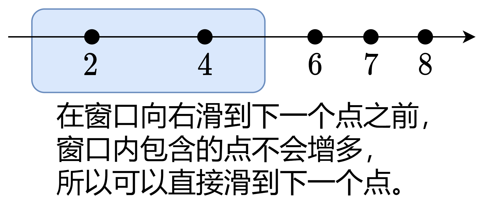

### [正难则反+滑动窗口，附题单（Python/Java/C++/Go/JS/Rust）](https://leetcode.cn/problems/minimum-number-of-operations-to-make-array-continuous/solutions/1005398/on-zuo-fa-by-endlesscheng-l7yi/)

正难则反，考虑最多**保留**多少个元素不变。

由于元素的位置不影响答案，且要求所有元素互不相同，我们可以将 $\textit{nums}$ 从小到大排序，并去掉重复元素。

设 $x$ 是连续数字的最大值，则连续数字的范围为闭区间 $[x-n+1, x]$，其中 $n$ 是 $\textit{nums}$ 的长度。

设 $a$ 为 $\textit{nums}$ 排序去重后的数组。把 $a[i]$ 画在一条数轴上，本题相当于有一个长度为 $n$ 的**滑动窗口**，我们需要计算窗口内最多可以包含多少个数轴上的点。

**定理：** 只需要枚举 $a[i]$ 作为窗口的右端点。

**证明：** 在窗口从左向右滑动的过程中，如果窗口右端点处没有点，那么继续滑动，在滑到下一个点之前，窗口内包含的点的个数是不会增多的。



为了算出窗口内有多少个点，我们需要知道窗口包含的最左边的点在哪，设这个点的位置是 $\textit{a}[\textit{left}]$，则它必须大于等于窗口的左边界，即

$$a[\textit{left}]\ge a[\textit{i}]-n+1$$

此时窗口内有 $\textit{i}-\textit{left}+1$ 个点。

关于滑动窗口算法，请看视频[【基础算法精讲 03】](https://leetcode.cn/link/?target=https%3A%2F%2Fwww.bilibili.com%2Fvideo%2FBV1hd4y1r7Gq%2F)。

关于原地去重算法，请参考 [26. 删除有序数组中的重复项](https://leetcode.cn/problems/remove-duplicates-from-sorted-array/)。

```python
class Solution:
    def minOperations(self, nums: List[int]) -> int:
        n = len(nums)
        a = sorted(set(nums))  # 去重排序
        ans = left = 0
        for i, x in enumerate(a):
            while a[left] < x - n + 1:  # a[left] 不在窗口内
                left += 1
            ans = max(ans, i - left + 1)
        return n - ans
```

```java
class Solution {
    public int minOperations(int[] nums) {
        int n = nums.length;
        Arrays.sort(nums);
        int j = 1;
        for (int i = 1; i < n; i++) {
            if (nums[i] != nums[i - 1]) {
                nums[j++] = nums[i]; // 原地去重
            }
        }

        int ans = 0;
        int left = 0;
        for (int i = 0; i < j; i++) {
            while (nums[left] < nums[i] - n + 1) { // nums[left] 不在窗口内
                left++;
            }
            ans = Math.max(ans, i - left + 1);
        }
        return n - ans;
    }
}
```

```c++
class Solution {
public:
    int minOperations(vector<int> &nums) {
        int n = nums.size();
        ranges::sort(nums);
        nums.erase(unique(nums.begin(), nums.end()), nums.end()); // 原地去重
        int ans = 0, left = 0;
        for (int i = 0; i < nums.size(); i++) {
            while (nums[left] < nums[i] - n + 1) { // nums[left] 不在窗口内
                left++;
            }
            ans = max(ans, i - left + 1);
        }
        return n - ans;
    }
};
```

```go
func minOperations(nums []int) int {
    n := len(nums)
    slices.Sort(nums)
    a := slices.Compact(nums) // 原地去重
    ans, left := 0, 0
    for i, x := range a {
        for a[left] < x-n+1 { // a[left] 不在窗口内
            left++
        }
        ans = max(ans, i-left+1)
    }
    return n - ans
}
```

```javascript
var minOperations = function(nums) {
    const n = nums.length;
    nums.sort((a, b) => a - b);
    let j = 1;
    for (let i = 1; i < n; i++) {
        if (nums[i] !== nums[i - 1]) {
            nums[j++] = nums[i]; // 原地去重
        }
    }

    let ans = 0, left = 0;
    for (let i = 0; i < j; i++) {
        while (nums[left] < nums[i] - n + 1) { // nums[left] 不在窗口内
            left++;
        }
        ans = Math.max(ans, i - left + 1);
    }
    return n - ans;
};
```

```rust
impl Solution {
    pub fn min_operations(mut nums: Vec<i32>) -> i32 {
        let n = nums.len() as i32;
        nums.sort_unstable();
        nums.dedup(); // 原地去重
        let mut ans = 0;
        let mut left = 0;
        for (i, &x) in nums.iter().enumerate() {
            while nums[left] < x - n + 1 { // nums[left] 不在窗口内
                left += 1;
            }
            ans = ans.max(i - left + 1);
        }
        n - ans as i32
    }
}
```

##### 复杂度分析

- 时间复杂度：$\mathcal{O}(n\log n)$，其中 $n$ 为 $\textit{nums}$ 的长度。瓶颈在排序上。
- 空间复杂度：使用哈希表去重为 $\mathcal{O}(n)$，原地去重为 $\mathcal{O}(1)$（忽略排序时的栈开销）。

#### 相似题目

- [1040. 移动石子直到连续 II](https://leetcode.cn/problems/moving-stones-until-consecutive-ii/)（[图解](https://leetcode.cn/problems/moving-stones-until-consecutive-ii/solution/tu-jie-xia-tiao-qi-pythonjavacgo-by-endl-r1eb/)）

#### 分类题单

- [滑动窗口（定长/不定长/多指针）](https://leetcode.cn/circle/discuss/0viNMK/)
- [二分算法（二分答案/最小化最大值/最大化最小值/第K小）](https://leetcode.cn/circle/discuss/SqopEo/)
- [单调栈（矩形系列/字典序最小/贡献法）](https://leetcode.cn/circle/discuss/9oZFK9/)
- [网格图（DFS/BFS/综合应用）](https://leetcode.cn/circle/discuss/YiXPXW/)
- [位运算（基础/性质/拆位/试填/恒等式/贪心/脑筋急转弯）](https://leetcode.cn/circle/discuss/dHn9Vk/)
- [图论算法（DFS/BFS/拓扑排序/最短路/最小生成树/二分图/基环树/欧拉路径）](https://leetcode.cn/circle/discuss/01LUak/)
- [动态规划（入门/背包/状态机/划分/区间/状压/数位/数据结构优化/树形/博弈/概率期望）](https://leetcode.cn/circle/discuss/tXLS3i/)
