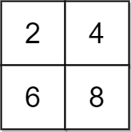
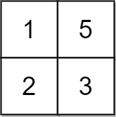
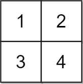

### [2033\. 获取单值网格的最小操作数](https://leetcode.cn/problems/minimum-operations-to-make-a-uni-value-grid/)

难度：中等

给你一个大小为 <code>m &times; n</code> 的二维整数网格 `grid` 和一个整数 `x`。每一次操作，你可以对 `grid` 中的任一元素 **加** `x` 或 **减** `x`。

**单值网格** 是全部元素都相等的网格。

返回使网格化为单值网格所需的 **最小** 操作数。如果不能，返回 `-1`。

**示例 1：**

> 
>
> **输入：** grid = \[[2,4],[6,8]], x = 2
> **输出：** 4
> **解释：** 可以执行下述操作使所有元素都等于 4：
>
> - 2 加 x 一次。
> - 6 减 x 一次。
> - 8 减 x 两次。
>
> 共计 4 次操作。

**示例 2：**

> 
>
> **输入：** grid = \[[1,5],[2,3]], x = 1
> **输出：** 5
> **解释：** 可以使所有元素都等于 3。

**示例 3：**

> 
>
> **输入：** grid = \[[1,2],[3,4]], x = 2
> **输出：** -1
> **解释：** 无法使所有元素相等。

**提示：**

- `m == grid.length`
- `n == grid[i].length`
- <code>1 <= m, n <= 105</code>
- <code>1 <= m &times; n <= 105</code>
- <code>1 <= x, grid[i][j] <= 104</code>
