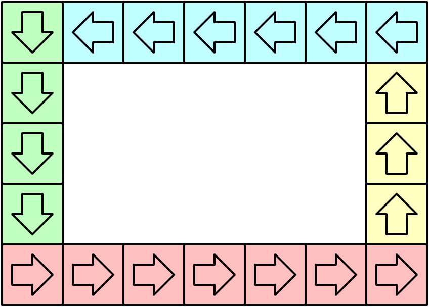

### [模拟行走机器人 II](https://leetcode.cn/problems/walking-robot-simulation-ii/solutions/1101837/mo-ni-xing-zou-ji-qi-ren-ii-by-leetcode-lhf24/)

#### 方法一：模拟

**思路与算法**

根据题目描述，我们可以发现：机器人总是会在网格的「最外圈」进行循环移动。



因此，我们可以将机器人移动的循环节（位置以及移动方向）预处理出来，存储在数组中，并用一个指针 $idx$ 指向数组中的某个位置，表示当前机器人的位置以及移动方向。

预处理可以分为四个步骤完成。如上图所示，不同颜色的网格表示机器人在对应网格上的不同方向，因此我们可以使用四个循环分别枚举每一种颜色对应的网格的位置，把它们加入预处理的数组即可。

对于题目要求实现的三个接口，我们可以依次实现：

- $void move(int num)$：我们可以将 $idx$ 的值增加 $num$。由于机器人的移动路径是循环的，我们需要将增加后的值对循环的长度取模。
- $int[] getPos()$：我们根据 $idx$ 返回预处理数组中的位置即可。
- $String getDir()$：我们根据 $idx$ 返回预处理数组中的朝向即可。

**细节**

需要注意的是。当机器人回到原点时，它的朝向为「南」，但机器人初始在原点时的朝向为「东」。因此我们可以将预处理数组中原点的朝向改为「南」，并使用一个布尔变量记录机器人是否移动过：

- 如果机器人未移动过，我们总是返回「东」朝向；
- 如果机器人移动过，我们根据 $idx$ 返回预处理数组中的朝向。

**代码**

```C++
class Robot {
private:
    bool moved = false;
    int idx = 0;
    vector<pair<int, int>> pos;
    vector<int> dir;
    unordered_map<int, string> to_dir = {
        {0, "East"},
        {1, "North"},
        {2, "West"},
        {3, "South"}
    };

public:
    Robot(int width, int height) {
        for (int i = 0; i < width; ++i) {
            pos.emplace_back(i, 0);
            dir.emplace_back(0);
        }
        for (int i = 1; i < height; ++i) {
            pos.emplace_back(width - 1, i);
            dir.emplace_back(1);
        }
        for (int i = width - 2; i >= 0; --i) {
            pos.emplace_back(i, height - 1);
            dir.emplace_back(2);
        }
        for (int i = height - 2; i > 0; --i) {
            pos.emplace_back(0, i);
            dir.emplace_back(3);
        }
        dir[0] = 3;
    }

    void step(int num) {
        moved = true;
        idx = (idx + num) % pos.size();
    }

    vector<int> getPos() {
        return {pos[idx].first, pos[idx].second};
    }

    string getDir() {
        if (!moved) {
            return "East";
        }
        return to_dir[dir[idx]];
    }
};
```

```Python
class Robot:

    TO_DIR = {
        0: "East",
        1: "North",
        2: "West",
        3: "South",
    }

    def __init__(self, width: int, height: int):
        self.moved = False
        self.idx = 0
        self.pos = list()
        self.dirs = list()

        pos_, dirs_ = self.pos, self.dirs

        for i in range(width):
            pos_.append((i, 0))
            dirs_.append(0)
        for i in range(1, height):
            pos_.append((width - 1, i))
            dirs_.append(1)
        for i in range(width - 2, -1, -1):
            pos_.append((i, height - 1))
            dirs_.append(2)
        for i in range(height - 2, 0, -1):
            pos_.append((0, i))
            dirs_.append(3)

        dirs_[0] = 3

    def step(self, num: int) -> None:
        self.moved = True
        self.idx = (self.idx + num) % len(self.pos)

    def getPos(self) -> List[int]:
        return list(self.pos[self.idx])

    def getDir(self) -> str:
        if not self.moved:
            return "East"
        return Robot.TO_DIR[self.dirs[self.idx]]
```

```Java
class Robot {
    private boolean moved = false;
    private int idx = 0;
    private List<int[]> pos = new ArrayList<>();
    private List<Integer> dir = new ArrayList<>();
    private Map<Integer, String> toDir = new HashMap<>();

    public Robot(int width, int height) {
        toDir.put(0, "East");
        toDir.put(1, "North");
        toDir.put(2, "West");
        toDir.put(3, "South");

        for (int i = 0; i < width; ++i) {
            pos.add(new int[]{i, 0});
            dir.add(0);
        }
        for (int i = 1; i < height; ++i) {
            pos.add(new int[]{width - 1, i});
            dir.add(1);
        }
        for (int i = width - 2; i >= 0; --i) {
            pos.add(new int[]{i, height - 1});
            dir.add(2);
        }
        for (int i = height - 2; i > 0; --i) {
            pos.add(new int[]{0, i});
            dir.add(3);
        }
        dir.set(0, 3);
    }

    public void step(int num) {
        moved = true;
        idx = (idx + num) % pos.size();
    }

    public int[] getPos() {
        return pos.get(idx);
    }

    public String getDir() {
        if (!moved) {
            return "East";
        }
        return toDir.get(dir.get(idx));
    }
}
```

```CSharp
using System;
using System.Collections.Generic;

public class Robot {
    private bool moved = false;
    private int idx = 0;
    private List<int[]> pos = new List<int[]>();
    private List<int> dir = new List<int>();
    private Dictionary<int, string> toDir = new Dictionary<int, string>();

    public Robot(int width, int height) {
        toDir[0] = "East";
        toDir[1] = "North";
        toDir[2] = "West";
        toDir[3] = "South";

        for (int i = 0; i < width; ++i) {
            pos.Add(new int[] { i, 0 });
            dir.Add(0);
        }
        for (int i = 1; i < height; ++i) {
            pos.Add(new int[] { width - 1, i });
            dir.Add(1);
        }
        for (int i = width - 2; i >= 0; --i) {
            pos.Add(new int[] { i, height - 1 });
            dir.Add(2);
        }
        for (int i = height - 2; i > 0; --i) {
            pos.Add(new int[] { 0, i });
            dir.Add(3);
        }
        dir[0] = 3;
    }

    public void Step(int num) {
        moved = true;
        idx = (idx + num) % pos.Count;
    }

    public int[] GetPos() {
        return pos[idx];
    }

    public string GetDir() {
        if (!moved) {
            return "East";
        }
        return toDir[dir[idx]];
    }
}
```

```Go
type Robot struct {
    moved bool
    idx   int
    pos   [][2]int
    dir   []int
    toDir map[int]string
}

func Constructor(width int, height int) Robot {
    robot := Robot{
        toDir: map[int]string{
            0: "East",
            1: "North",
            2: "West",
            3: "South",
        },
    }

    for i := 0; i < width; i++ {
        robot.pos = append(robot.pos, [2]int{i, 0})
        robot.dir = append(robot.dir, 0)
    }
    for i := 1; i < height; i++ {
        robot.pos = append(robot.pos, [2]int{width - 1, i})
        robot.dir = append(robot.dir, 1)
    }
    for i := width - 2; i >= 0; i-- {
        robot.pos = append(robot.pos, [2]int{i, height - 1})
        robot.dir = append(robot.dir, 2)
    }
    for i := height - 2; i > 0; i-- {
        robot.pos = append(robot.pos, [2]int{0, i})
        robot.dir = append(robot.dir, 3)
    }
    robot.dir[0] = 3

    return robot
}

func (this *Robot) Step(num int) {
    this.moved = true
    this.idx = (this.idx + num) % len(this.pos)
}

func (this *Robot) GetPos() []int {
    return []int{this.pos[this.idx][0], this.pos[this.idx][1]}
}

func (this *Robot) GetDir() string {
    if !this.moved {
        return "East"
    }
    return this.toDir[this.dir[this.idx]]
}
```

```C
typedef struct {
    bool moved;
    int idx;
    int **pos;
    int *dir;
    int posSize;
} Robot;

const char *toDir[4] = {"East", "North", "West", "South"};

Robot* robotCreate(int width, int height) {
    Robot* obj = (Robot*)malloc(sizeof(Robot));
    obj->moved = false;
    obj->idx = 0;
    int total = 2 * (width + height) - 4;
    obj->posSize = total;
    obj->pos = (int**)malloc(total * sizeof(int*));
    for (int i = 0; i < total; i++) {
        obj->pos[i] = (int*)malloc(2 * sizeof(int));
    }
    obj->dir = (int*)malloc(total * sizeof(int));

    int index = 0;
    for (int i = 0; i < width; ++i) {
        obj->pos[index][0] = i;
        obj->pos[index][1] = 0;
        obj->dir[index] = 0;
        index++;
    }
    for (int i = 1; i < height; ++i) {
        obj->pos[index][0] = width - 1;
        obj->pos[index][1] = i;
        obj->dir[index] = 1;
        index++;
    }
    for (int i = width - 2; i >= 0; --i) {
        obj->pos[index][0] = i;
        obj->pos[index][1] = height - 1;
        obj->dir[index] = 2;
        index++;
    }
    for (int i = height - 2; i > 0; --i) {
        obj->pos[index][0] = 0;
        obj->pos[index][1] = i;
        obj->dir[index] = 3;
        index++;
    }
    obj->dir[0] = 3;

    return obj;
}

void robotStep(Robot* obj, int num) {
    obj->moved = true;
    obj->idx = (obj->idx + num) % obj->posSize;
}

int* robotGetPos(Robot* obj, int* retSize) {
    *retSize = 2;
    int* result = (int*)malloc(2 * sizeof(int));
    result[0] = obj->pos[obj->idx][0];
    result[1] = obj->pos[obj->idx][1];
    return result;
}

char* robotGetDir(Robot* obj) {
    if (!obj->moved) {
        return "East";
    }
    return toDir[obj->dir[obj->idx]];
}

void robotFree(Robot* obj) {
    for (int i = 0; i < obj->posSize; i++) {
        free(obj->pos[i]);
    }
    free(obj->pos);
    free(obj->dir);
    free(obj);
}
```

```JavaScript
var Robot = function(width, height) {
    this.moved = false;
    this.idx = 0;
    this.pos = [];
    this.dir = [];
    this.toDir = {
        0: "East",
        1: "North",
        2: "West",
        3: "South"
    };

    for (let i = 0; i < width; ++i) {
        this.pos.push([i, 0]);
        this.dir.push(0);
    }
    for (let i = 1; i < height; ++i) {
        this.pos.push([width - 1, i]);
        this.dir.push(1);
    }
    for (let i = width - 2; i >= 0; --i) {
        this.pos.push([i, height - 1]);
        this.dir.push(2);
    }
    for (let i = height - 2; i > 0; --i) {
        this.pos.push([0, i]);
        this.dir.push(3);
    }
    this.dir[0] = 3;
};

Robot.prototype.step = function(num) {
    this.moved = true;
    this.idx = (this.idx + num) % this.pos.length;
};

Robot.prototype.getPos = function() {
    return this.pos[this.idx];
};

Robot.prototype.getDir = function() {
    if (!this.moved) {
        return "East";
    }
    return this.toDir[this.dir[this.idx]];
};
```

```TypeScript
class Robot {
    private moved: boolean = false;
    private idx: number = 0;
    private pos: number[][] = [];
    private dir: number[] = [];
    private toDir: Map<number, string> = new Map();

    constructor(width: number, height: number) {
        this.toDir.set(0, "East");
        this.toDir.set(1, "North");
        this.toDir.set(2, "West");
        this.toDir.set(3, "South");

        for (let i = 0; i < width; ++i) {
            this.pos.push([i, 0]);
            this.dir.push(0);
        }
        for (let i = 1; i < height; ++i) {
            this.pos.push([width - 1, i]);
            this.dir.push(1);
        }
        for (let i = width - 2; i >= 0; --i) {
            this.pos.push([i, height - 1]);
            this.dir.push(2);
        }
        for (let i = height - 2; i > 0; --i) {
            this.pos.push([0, i]);
            this.dir.push(3);
        }
        this.dir[0] = 3;
    }

    step(num: number): void {
        this.moved = true;
        this.idx = (this.idx + num) % this.pos.length;
    }

    getPos(): number[] {
        return this.pos[this.idx];
    }

    getDir(): string {
        if (!this.moved) {
            return "East";
        }
        return this.toDir.get(this.dir[this.idx])!;
    }
}
```

```Rust
use std::collections::HashMap;

struct Robot {
    moved: bool,
    idx: usize,
    pos: Vec<(i32, i32)>,
    dir: Vec<i32>,
    to_dir: HashMap<i32, String>,
}

impl Robot {
    fn new(width: i32, height: i32) -> Self {
        let mut pos = Vec::new();
        let mut dir = Vec::new();
        let mut to_dir = HashMap::new();

        to_dir.insert(0, "East".to_string());
        to_dir.insert(1, "North".to_string());
        to_dir.insert(2, "West".to_string());
        to_dir.insert(3, "South".to_string());

        for i in 0..width {
            pos.push((i, 0));
            dir.push(0);
        }
        for i in 1..height {
            pos.push((width - 1, i));
            dir.push(1);
        }
        for i in (0..=width-2).rev() {
            pos.push((i, height - 1));
            dir.push(2);
        }
        for i in (1..=height-2).rev() {
            pos.push((0, i));
            dir.push(3);
        }
        dir[0] = 3;

        Robot {
            moved: false,
            idx: 0,
            pos,
            dir,
            to_dir,
        }
    }

    fn step(&mut self, num: i32) {
        self.moved = true;
        self.idx = (self.idx + num as usize) % self.pos.len();
    }

    fn get_pos(&self) -> Vec<i32> {
        vec![self.pos[self.idx].0, self.pos[self.idx].1]
    }

    fn get_dir(&self) -> String {
        if !self.moved {
            return "East".to_string();
        }
        self.to_dir.get(&self.dir[self.idx]).unwrap().clone()
    }
}
```

**复杂度分析**

- 时间复杂度：预处理的时间复杂度为 $O(width+height)$，所有查询接口的时间复杂度均为 $O(1)$。
- 空间复杂度：$O(width+height)$，即为存储预处理数组需要的空间。
