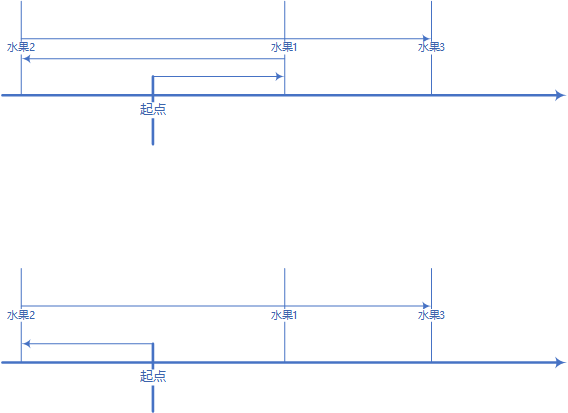

### 枚举折返点

基于题目的描述，可以得出下面几个几个结论：

1. 无论在哪个位置，最多只有两个选择：向左或者向右
2. 无论选择向左还是向右，一定至少到达第一个“水果点”，如果没到达第一个“水果点”
    - 如果选择的方向与原方向一致，相当于没有重新选择
    - 如果选择的方向与原方向相反，那么这次选择与上一次选择之间的路程，白走了一个来回
3. 如果想要得到最多的水果，那么至多能有一次折返

上面几个结论都显然易见，这里简单证明一下第3点结论：
如图：折返两次消耗的步数要大于折返一次。

