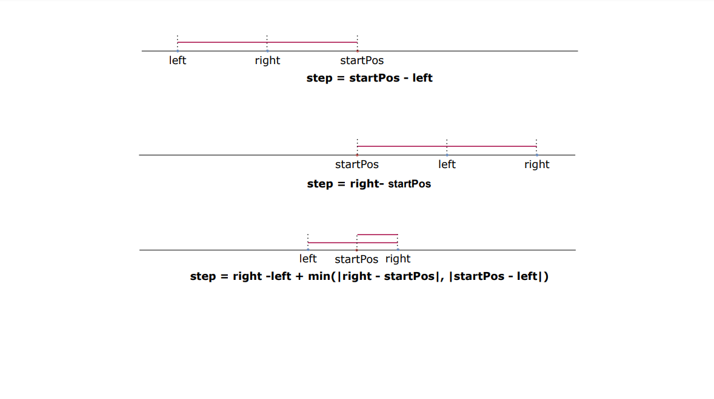

#### [方法二：滑动窗口](https://leetcode.cn/problems/maximum-fruits-harvested-after-at-most-k-steps/solutions/2254268/zhai-shui-guo-by-leetcode-solution-4j9v/)

**思路与算法**

我们可以换个思路来思考该问题，假设已知区间 $[left,right]$，现在从起点 $startPos$ 出发，至少需要走多少步才能遍历该区间，实际我们可以看到分为以下三种情况：

-   当 $startPos > right$ 时，即区间在 $startPos$ 的左边，此时应该从起点开始一直向左移动，直到 $left$ 为止，此时至少需要移动 $startPos - left$ 步；
-   当 $startPos < left$ 时，即区间在 $startPos$ 的右边，此时应该从起点开始一直向右移动，直到 $right$ 为止，此时至少需要移动 $right - startPos$ 步；
-   当 $left \le startPos \le right$ 时，即 $startPos$ 刚好在区间范围内，此时有两种选择：
    -   从起点开始一直向左移动，直到 $left$ 为止，然后再向右移动到 $right$，此时需要移动 $startPos - left + right - left$ 步；
    -   从起点开始一直向右移动，直到 $right$ 为止，然后再向左移动到 $left$，此时最少需要移动 $right - startPos + right - left$ 步；
    -   根据两种情形，最少需要移动 $right - left + \min(|right - startPos|,|startPos - left|)$ 步;
-   当然上述所有的情形都可以合并为一个计算公式，即实际最少需要移动 $right - left + \min(|right - startPos|,|startPos - left|)$ 步，才能覆盖区间 $[left,right]$，如下图所示： 

我们设函数 $step(left,right)$ 表示从起点 $startPos$ 出发可以覆盖区间 $[left,right]$ 的最少移动步数，此时 $step(left,right) = right - left + \min(|right - startPos|,|startPos - left|)$。当固定 $right$ 时，此时减少 $left$，可以观察到:

-   当 $left < startPos$ 时，$step(left - 1,right) < step(left,right)$;
-   当 $left \ge startPos$ 时，$step(left - 1,right) = step(left,right)$;

综上可以得到结论：

$$step(left - 1,right) \le step(left,right)$$

即随着 $left$ 的减小，$step(left,right)$ 可能会减小，但一定不会继续增大，利用这个特性我们即可利用滑动窗口来遍历所有符合要求的最大区间，然后找到区间内的覆盖水果的最大值即可，实际计算过程如下:

-   初始时 $left = 0, right = 0$，每次 $right$ 向右移动一步；
-   计算当前区间 $[left,right]$ 需要的移动步数 $step$，假设 $step > k$，则我们移动左起点 $left$，直达满足 $step < k,left \le right$，即可求出移动步数小于等于 $k$ 且以 $right$ 为终点的最长区间，计算出改区间覆盖的水果数目即可；
-   依次按照上述方式移动直到 $right$ 移动到终点为止。

**代码**

```cpp
class Solution {
public:
    int maxTotalFruits(vector<vector<int>>& fruits, int startPos, int k) {
        int left = 0;
        int right = 0;
        int n = fruits.size();
        int sum = 0;
        int ans = 0;

        auto step = [&](int left, int right) -> int {
            if (fruits[right][0] <= startPos) {
                return startPos - fruits[left][0];
            } else if (fruits[left][0] >= startPos) {
                return fruits[right][0] - startPos;
            } else {
                return min(abs(startPos - fruits[right][0]), abs(startPos - fruits[left][0])) + \
                       fruits[right][0] - fruits[left][0];
            }
        };
        // 每次固定住窗口右边界
        while (right < n) {
            sum += fruits[right][1];
            // 移动左边界
            while (left <= right && step(left, right) > k) {
                sum -= fruits[left][1];
                left++;
            }
            ans = max(ans, sum);
            right++;
        }
        return ans;
    }
};
```

```java
class Solution {
    public int maxTotalFruits(int[][] fruits, int startPos, int k) {
        int left = 0;
        int right = 0;
        int n = fruits.length;
        int sum = 0;
        int ans = 0;
        // 每次固定住窗口右边界
        while (right < n) {
            sum += fruits[right][1];
            // 移动左边界
            while (left <= right && step(fruits, startPos, left, right) > k) {
                sum -= fruits[left][1];
                left++;
            }
            ans = Math.max(ans, sum);
            right++;
        }
        return ans;
    }

    public int step(int[][] fruits, int startPos, int left, int right) {
        return Math.min(Math.abs(startPos - fruits[right][0]), Math.abs(startPos - fruits[left][0])) + fruits[right][0] - fruits[left][0];
    }
}
```

```csharp
public class Solution {
    public int MaxTotalFruits(int[][] fruits, int startPos, int k) {
        int left = 0;
        int right = 0;
        int n = fruits.Length;
        int sum = 0;
        int ans = 0;
        // 每次固定住窗口右边界
        while (right < n) {
            sum += fruits[right][1];
            // 移动左边界
            while (left <= right && Step(fruits, startPos, left, right) > k) {
                sum -= fruits[left][1];
                left++;
            }
            ans = Math.Max(ans, sum);
            right++;
        }
        return ans;
    }

    public int Step(int[][] fruits, int startPos, int left, int right) {
        if (fruits[right][0] <= startPos) {
            return startPos - fruits[left][0];
        } else if (fruits[left][0] >= startPos) {
            return fruits[right][0] - startPos;
        } else {
            return Math.Min(Math.Abs(startPos - fruits[right][0]), Math.Abs(startPos - fruits[left][0])) + fruits[right][0] - fruits[left][0];
        }
    }
}
```

```python
class Solution:
    def maxTotalFruits(self, fruits: List[List[int]], startPos: int, k: int) -> int:
        left = 0
        right = 0
        n = len(fruits)
        sum = 0
        ans = 0

        def step(left: int, right: int) -> int:
            if fruits[right][0] <= startPos:
                return startPos - fruits[left][0]
            elif fruits[left][0] >= startPos:
                return fruits[right][0] - startPos
            else:
                return min(abs(startPos - fruits[right][0]), abs(startPos - fruits[left][0])) + \
                    fruits[right][0] - fruits[left][0]

        # 每次固定住窗口右边界
        while right < n:
            sum += fruits[right][1]
            # 移动左边界
            while left <= right and step(left, right) > k:
                sum -= fruits[left][1]
                left += 1

            ans = max(ans, sum)
            right += 1

        return ans
```

```c
#define MAX(a, b) ((a) > (b) ? (a) : (b))
#define MIN(a, b) ((a) < (b) ? (a) : (b))

int step(const int** fruits, int left, int right, int startPos) {
    if (fruits[right][0] <= startPos) {
        return startPos - fruits[left][0];
    } else if (fruits[left][0] >= startPos) {
        return fruits[right][0] - startPos;
    } else {
        return MIN(abs(startPos - fruits[right][0]), abs(startPos - fruits[left][0])) + \
                fruits[right][0] - fruits[left][0];
    }
}

int maxTotalFruits(int** fruits, int fruitsSize, int* fruitsColSize, int startPos, int k) {
    int left = 0;
    int right = 0;
    int sum = 0;
    int ans = 0;

    /* 固定住窗口右边界 */
    while (right < fruitsSize) {
        sum += fruits[right][1];
        /* 移动左边界 */
        while (left <= right && step(fruits, left, right, startPos) > k) {
            sum -= fruits[left][1];
            left++;
        }
        ans = MAX(ans, sum);
        right++;
    }
    return ans;
}
```

```javascript
var maxTotalFruits = function(fruits, startPos, k) {
    let left = 0;
    let right = 0;
    const n = fruits.length;
    let sum = 0;
    let ans = 0;
    // 每次固定住窗口右边界
    while (right < n) {
        sum += fruits[right][1];
        // 移动左边界
        while (left <= right && step(fruits, startPos, left, right) > k) {
            sum -= fruits[left][1];
            left++;
        }
        ans = Math.max(ans, sum);
        right++;
    }
    return ans;
}

const step = (fruits, startPos, left, right) => {
    return Math.min(Math.abs(startPos - fruits[right][0]), Math.abs(startPos - fruits[left][0])) + fruits[right][0] - fruits[left][0];
};
```

```go
func maxTotalFruits(fruits [][]int, startPos int, k int) int {
    left := 0
    right := 0
    n := len(fruits)
    sum := 0
    ans := 0

    step := func(left int, right int) int {
        if fruits[right][0] <= startPos {
            return startPos - fruits[left][0]
        } else if fruits[left][0] >= startPos {
            return fruits[right][0] - startPos
        } else {
            return min(abs(startPos-fruits[right][0]), abs(startPos-fruits[left][0])) + fruits[right][0] - fruits[left][0]
        }
    }
    // 每次固定住窗口右边界
    for right < n {
        sum += fruits[right][1]
        // 移动左边界
        for left <= right && step(left, right) > k {
            sum -= fruits[left][1]
            left++
        }
        ans = max(ans, sum)
        right++
    }
    return ans
}

func min(a, b int) int {
    if a > b {
        return b
    }
    return a
}

func max(a, b int) int {
    if b > a {
        return b
    }
    return a
}

func abs(x int) int {
    if x < 0 {
        return -x
    }
    return x
}
```

**复杂度分析**

-   时间复杂度：$O(n)$，其中 $n$ 表示数组的长度。每次固定窗口的右侧，然后尝试移动左侧窗口，右侧端点最多移动 $n$ 次，左侧端点最多移动 $n$ 次，因此时间复杂度为 $O(2n) = O(n)$。
-   空间复杂度：$O(1)$。
