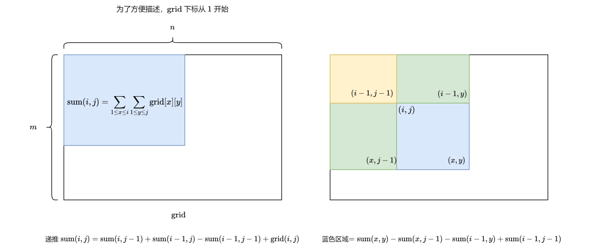
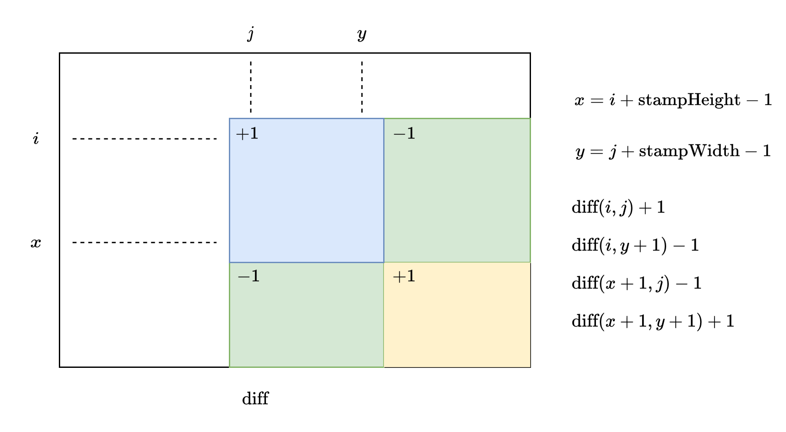

### [用邮票贴满网格图](https://leetcode.cn/problems/stamping-the-grid/solutions/2562069/yong-you-piao-tie-man-wang-ge-tu-by-leet-kiaq/)

#### 方法一：二维前缀和与二维差分

##### 思路与算法

题目要求使用固定尺寸的邮票贴进二进制矩阵中，由于邮票之间可以重叠，因此我们本着能放就放的原则，遍历每个空格作为邮票左上角，如果右下角形状为 $stampHeight \times stampWidth$ 的范围内都是空格子，那么就在这贴一个邮票。

最后，如果有空格子没有被邮票覆盖，则说明无法满足题目要求，返回 $false$，反之如果所有的空格子都被邮票覆盖，返回 $true$。

在这个算法中，我们需要解决两个问题：

1. 贴邮票时，如何快速判断右下角固定范围内不存在被占据的格子，而都是空格子呢？
2. 最后做检查时，如何快速判断每个空格子都被邮票覆盖呢？

对于第一个问题，可以用二维前缀和，详细原理请参考题目[「304. 二维区域检索 - 矩阵不可变」](https://leetcode.cn/problems/range-sum-query-2d-immutable/description/)的题解。简单来讲，基于题目给定的 $grid$ 我们可以求出其二维前缀和 $sum$，并利用 $sum$ 快速判断范围内是否存在被占据的格子：



对于第二个问题，可以用二维差分，差分是前缀和的逆运算。以上面为例，求解 $sum$ 时，$grid$ 数组其实就是差分数组，$grid[i][j]$ 会影响右下角所有 $sum$ 的计算。而在贴邮票的问题中，我们以 $(i,j)$ 为左上角贴了一张邮票，只到右下角 $(i+stampHeight, j+stampWidth)$ 的范围内计数 $+1$。因此我们定义一个二维数组 $diff$，如果要在 $(i,j)$ 处贴邮票，就令 $diff(i,j)$ 和 $diff(x+1,y+1)$ 加 $1$，令 $diff(i,y+1)$ 和 $diff(x+1,j)$ 减 $1$。



最终对 $diff$ 原地求前缀和：

$diff(i,j) = diff(i,j) + diff(i-1,j) + diff(i,j-1) - diff(i-1,j-1)$

此时$diff(i,j)$ 若大于 $0$，表示 $(i,j)$ 被邮票覆盖。

##### 代码

```c++
class Solution {
public:
    bool possibleToStamp(vector<vector<int>>& grid, int stampHeight, int stampWidth) {
        int m = grid.size(), n = grid[0].size();
        vector<vector<int>> sum(m + 2, vector<int>(n + 2, 0));
        vector<vector<int>> diff(m + 2, vector<int>(n + 2, 0));
        for (int i = 1; i <= m; i++) {
            for (int j = 1; j <= n; j++) {
                sum[i][j] = sum[i - 1][j] + sum[i][j - 1] - sum[i - 1][j - 1] + grid[i - 1][j - 1];
            }
        }

        for (int i = 1; i + stampHeight - 1 <= m; i++) {
            for (int j = 1; j + stampWidth - 1 <= n; j++) {
                int x = i + stampHeight - 1;
                int y = j + stampWidth - 1;
                if (sum[x][y] - sum[x][j - 1] - sum[i - 1][y] + sum[i - 1][j - 1] == 0) {
                    diff[i][j]++;
                    diff[i][y + 1]--;
                    diff[x + 1][j]--;
                    diff[x + 1][y + 1]++;
                }
            }
        }

        for (int i = 1; i <= m; i++) {
            for (int j = 1; j <= n; j++) {
                diff[i][j] += diff[i - 1][j] + diff[i][j - 1] - diff[i - 1][j - 1];
                if (diff[i][j] == 0 && grid[i - 1][j - 1] == 0) {
                    return false;
                }
            }
        }
        return true;
    }
};
```

```java
class Solution {
    public boolean possibleToStamp(int[][] grid, int stampHeight, int stampWidth) {
        int m = grid.length, n = grid[0].length;
        int[][] sum = new int[m + 2][n + 2];
        int[][] diff = new int[m + 2][n + 2];
        for (int i = 1; i <= m; i++) {
            for (int j = 1; j <= n; j++) {
                sum[i][j] = sum[i - 1][j] + sum[i][j - 1] - sum[i - 1][j - 1] + grid[i - 1][j - 1];
            }
        }

        for (int i = 1; i + stampHeight - 1 <= m; i++) {
            for (int j = 1; j + stampWidth - 1 <= n; j++) {
                int x = i + stampHeight - 1;
                int y = j + stampWidth - 1;
                if (sum[x][y] - sum[x][j - 1] - sum[i - 1][y] + sum[i - 1][j - 1] == 0) {
                    diff[i][j]++;
                    diff[i][y + 1]--;
                    diff[x + 1][j]--;
                    diff[x + 1][y + 1]++;
                }
            }
        }

        for (int i = 1; i <= m; i++) {
            for (int j = 1; j <= n; j++) {
                diff[i][j] += diff[i - 1][j] + diff[i][j - 1] - diff[i - 1][j - 1];
                if (diff[i][j] == 0 && grid[i - 1][j - 1] == 0) {
                    return false;
                }
            }
        }
        return true;
    }
}
```

```csharp
public class Solution {
    public bool PossibleToStamp(int[][] grid, int stampHeight, int stampWidth) {
        int m = grid.Length, n = grid[0].Length;
        int[][] sum = new int[m + 2][];
        int[][] diff = new int[m + 2][];
        for (int i = 0; i < m + 2; i++) {
            sum[i] = new int[n + 2];
            diff[i] = new int[n + 2];
        }
        for (int i = 1; i <= m; i++) {
            for (int j = 1; j <= n; j++) {
                sum[i][j] = sum[i - 1][j] + sum[i][j - 1] - sum[i - 1][j - 1] + grid[i - 1][j - 1];
            }
        }

        for (int i = 1; i + stampHeight - 1 <= m; i++) {
            for (int j = 1; j + stampWidth - 1 <= n; j++) {
                int x = i + stampHeight - 1;
                int y = j + stampWidth - 1;
                if (sum[x][y] - sum[x][j - 1] - sum[i - 1][y] + sum[i - 1][j - 1] == 0) {
                    diff[i][j]++;
                    diff[i][y + 1]--;
                    diff[x + 1][j]--;
                    diff[x + 1][y + 1]++;
                }
            }
        }

        for (int i = 1; i <= m; i++) {
            for (int j = 1; j <= n; j++) {
                diff[i][j] += diff[i - 1][j] + diff[i][j - 1] - diff[i - 1][j - 1];
                if (diff[i][j] == 0 && grid[i - 1][j - 1] == 0) {
                    return false;
                }
            }
        }
        return true;
    }
}
```

```python
class Solution:
    def possibleToStamp(self, grid: List[List[int]], stampHeight: int, stampWidth: int) -> bool:
        m, n = len(grid), len(grid[0])
        psum = [[0] * (n + 2) for _ in range(m + 2)]
        diff = [[0] * (n + 2) for _ in range(m + 2)]
        for i in range(1, m + 1):
            for j in range(1, n + 1):
                psum[i][j] = psum[i - 1][j] + psum[i][j - 1] - psum[i - 1][j - 1] + grid[i - 1][j - 1]

        for i in range(1, m + 2 - stampHeight):
            for j in range(1, n + 2 - stampWidth):
                x = i + stampHeight - 1
                y = j + stampWidth - 1
                if psum[x][y] - psum[x][j - 1] - psum[i - 1][y] + psum[i - 1][j - 1] == 0:
                    diff[i][j] += 1
                    diff[i][y + 1] -= 1
                    diff[x + 1][j] -= 1
                    diff[x + 1][y + 1] += 1

        for i in range(1, m + 1):
            for j in range(1, n + 1):
                diff[i][j] += diff[i - 1][j] + diff[i][j - 1] - diff[i - 1][j - 1]
                if diff[i][j] == 0 and grid[i - 1][j - 1] == 0:
                    return False
        return True
```

```go
func possibleToStamp(grid [][]int, stampHeight int, stampWidth int) bool {
    m, n := len(grid), len(grid[0])
    psum := make([][]int, m + 2)
    diff := make([][]int, m + 2)
    for i := 0; i <= m + 1; i++ {
        psum[i] = make([]int, n + 2)
        diff[i] = make([]int, n + 2)
    }
    for i := 1; i <= m; i++ {
        for j := 1; j <= n; j++ {
            psum[i][j] = psum[i - 1][j] + psum[i][j - 1] - psum[i - 1][j - 1] + grid[i - 1][j - 1]
        }
    }
    
    for i := 1; i + stampHeight - 1 <= m; i++ {
        for j := 1; j + stampWidth - 1 <= n; j++ {
            x, y := i + stampHeight - 1, j + stampWidth - 1
            if psum[x][y] - psum[x][j - 1] - psum[i - 1][y] + psum[i - 1][j - 1] == 0 {
                diff[i][j]++
                diff[i][y + 1]--
                diff[x + 1][j]--
                diff[x + 1][y + 1]++
            }
        }
    }
    for i := 1; i <= m; i++ {
        for j := 1; j <= n; j++ {
            diff[i][j] += diff[i - 1][j] + diff[i][j - 1] - diff[i - 1][j - 1]
            if diff[i][j] == 0 && grid[i - 1][j - 1] == 0 {
                return false
            }
        }
    }
    return true
}
```

```javascript
var possibleToStamp = function(grid, stampHeight, stampWidth) {
    const m = grid.length, n = grid[0].length;
    const psum = new Array(m + 2).fill(0).map(() => new Array(n + 2).fill(0));
    const diff = new Array(m + 2).fill(0).map(() => new Array(n + 2).fill(0));
    for (let i = 1; i <= m; i++) {
        for (let j = 1; j <= n; j++) {
            psum[i][j] = psum[i - 1][j] + psum[i][j - 1] - psum[i - 1][j - 1] + grid[i - 1][j - 1];
        }
    }
    
    for (let i = 1; i + stampHeight - 1 <= m; i++) {
        for (let j = 1; j + stampWidth - 1 <= n; j++) {
            const x = i + stampHeight - 1;
            const y = j + stampWidth - 1;
            if (psum[x][y] - psum[x][j - 1] - psum[i - 1][y] + psum[i - 1][j - 1] == 0) {
                diff[i][j]++;
                diff[i][y + 1]--;
                diff[x + 1][j]--;
                diff[x + 1][y + 1]++;
            }
        }
    }
    for (let i = 1; i <= m; i++) {
        for (let j = 1; j <= n; j++) {
            diff[i][j] += diff[i - 1][j] + diff[i][j - 1] - diff[i - 1][j - 1];
            if (diff[i][j] == 0 && grid[i - 1][j - 1] == 0) {
                return false;
            }
        }
    }
    return true;
};
```

```c
bool possibleToStamp(int** grid, int gridSize, int* gridColSize, int stampHeight, int stampWidth) {
    int m = gridSize, n = gridColSize[0];
    int psum[m + 2][n + 2];
    int diff[m + 2][n + 2];
    memset(psum, 0, sizeof(psum));
    memset(diff, 0, sizeof(diff));
    for (int i = 1; i <= m; i++) {
        for (int j = 1; j <= n; j++) {
            psum[i][j] = psum[i - 1][j] + psum[i][j - 1] - psum[i - 1][j - 1] + grid[i - 1][j - 1];
        }
    }
    
    for (int i = 1; i + stampHeight - 1 <= m; i++) {
        for (int j = 1; j + stampWidth - 1 <= n; j++) {
            int x = i + stampHeight - 1;
            int y = j + stampWidth - 1;
            if (psum[x][y] - psum[x][j - 1] - psum[i - 1][y] + psum[i - 1][j - 1] == 0) {
                diff[i][j]++;
                diff[i][y + 1]--;
                diff[x + 1][j]--;
                diff[x + 1][y + 1]++;
            }
        }
    }
    for (int i = 1; i <= m; i++) {
        for (int j = 1; j <= n; j++) {
            diff[i][j] += diff[i - 1][j] + diff[i][j - 1] - diff[i - 1][j - 1];
            if (diff[i][j] == 0 && grid[i - 1][j - 1] == 0) {
                return false;
            }
        }
    }
    return true;
}
```

##### 复杂度分析

- 时间复杂度：$O(mn)$。
- 空间复杂度：$O(mn)$。
