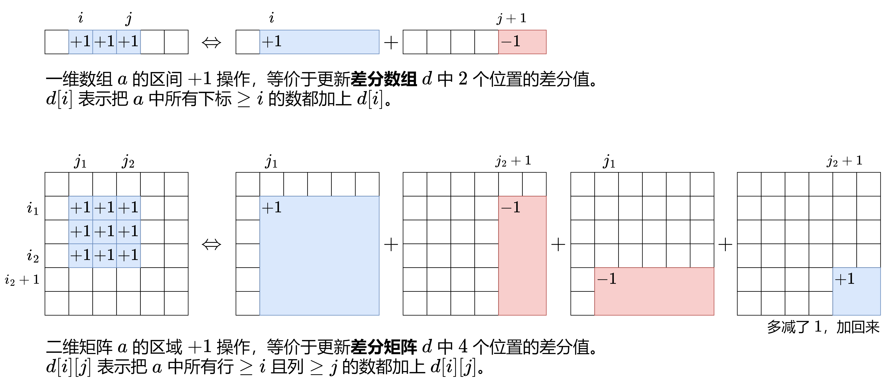

### [【图解】从一维差分到二维差分（Python/Java/C++/Go/JS/Rust）](https://leetcode.cn/problems/stamping-the-grid/solutions/1199642/wu-nao-zuo-fa-er-wei-qian-zhui-he-er-wei-zwiu/)

#### 前置知识：差分数组

关于一维差分，请看[【算法小课堂】差分数组](https://leetcode.cn/problems/car-pooling/solution/suan-fa-xiao-ke-tang-chai-fen-shu-zu-fu-9d4ra/)

一维差分的思想可以推广至二维，请点击图片放大查看：



##### 前置知识：二维前缀和

请看[【图解】二维前缀和](https://leetcode.cn/circle/discuss/UUuRex/)

##### 思路

1. 由于邮票可以互相重叠，贪心地想，能放邮票就放邮票。
2. 遍历所有能放邮票的位置去放邮票。注意邮票不能覆盖被占据的格子，也不能出界。
3. 放邮票的同时，记录每个空格子被多少张邮票覆盖。如果存在一个空格子没被邮票覆盖，则返回 $false$，否则返回 $true$。

##### 细节

1. 怎么快速判断一个矩形区域可以放邮票？求出 $grid$ 的**二维前缀和**，从而 $\mathcal{O}(1)$ 地求出任意矩形区域的元素和。如果一个矩形区域的元素和等于 $0$，就表示该矩形区域的所有格子都是 $0$。
2. 假设用一个二维计数矩阵 $cnt$ 记录每个空格子被多少张邮票覆盖，那么放邮票时，就需要把 $cnt$ 的一个矩形区域都加一。怎么快速实现？可以用**二维差分矩阵** $d$ 来代替 $cnt$。矩形区域都加一的操作，转变成 $\mathcal{O}(1)$ 地对 $d$ 中四个位置的更新操作。
3. 最后从二维差分矩阵 $d$ 还原出二维计数矩阵 $cnt$。类似对一维差分数组求前缀和得到原数组，我们需要**对二维差分矩阵求二维前缀和**。遍历 $cnt$，如果存在一个空格子的计数值为 $0$，就表明该空格子没有被邮票覆盖，返回 $false$，否则返回 $true$。代码实现时，可以直接在 $d$ 数组上**原地**计算出 $cnt$。

```python
class Solution:
    def possibleToStamp(self, grid: List[List[int]], stampHeight: int, stampWidth: int) -> bool:
        m, n = len(grid), len(grid[0])

        # 1. 计算 grid 的二维前缀和
        s = [[0] * (n + 1) for _ in range(m + 1)]
        for i, row in enumerate(grid):
            for j, v in enumerate(row):
                s[i + 1][j + 1] = s[i + 1][j] + s[i][j + 1] - s[i][j] + v

        # 2. 计算二维差分
        # 为方便第 3 步的计算，在 d 数组的最上面和最左边各加了一行（列），所以下标要 +1
        d = [[0] * (n + 2) for _ in range(m + 2)]
        for i2 in range(stampHeight, m + 1):
            for j2 in range(stampWidth, n + 1):
                i1 = i2 - stampHeight + 1
                j1 = j2 - stampWidth + 1
                if s[i2][j2] - s[i2][j1 - 1] - s[i1 - 1][j2] + s[i1 - 1][j1 - 1] == 0:
                    d[i1][j1] += 1
                    d[i1][j2 + 1] -= 1
                    d[i2 + 1][j1] -= 1
                    d[i2 + 1][j2 + 1] += 1

        # 3. 还原二维差分矩阵对应的计数矩阵（原地计算）
        for i, row in enumerate(grid):
            for j, v in enumerate(row):
                d[i + 1][j + 1] += d[i + 1][j] + d[i][j + 1] - d[i][j]
                if v == 0 and d[i + 1][j + 1] == 0:
                    return False
        return True
```

```java
class Solution {
    public boolean possibleToStamp(int[][] grid, int stampHeight, int stampWidth) {
        int m = grid.length;
        int n = grid[0].length;

        // 1. 计算 grid 的二维前缀和
        int[][] s = new int[m + 1][n + 1];
        for (int i = 0; i < m; i++) {
            for (int j = 0; j < n; j++) {
                s[i + 1][j + 1] = s[i + 1][j] + s[i][j + 1] - s[i][j] + grid[i][j];
            }
        }

        // 2. 计算二维差分
        // 为方便第 3 步的计算，在 d 数组的最上面和最左边各加了一行（列），所以下标要 +1
        int[][] d = new int[m + 2][n + 2];
        for (int i2 = stampHeight; i2 <= m; i2++) {
            for (int j2 = stampWidth; j2 <= n; j2++) {
                int i1 = i2 - stampHeight + 1;
                int j1 = j2 - stampWidth + 1;
                if (s[i2][j2] - s[i2][j1 - 1] - s[i1 - 1][j2] + s[i1 - 1][j1 - 1] == 0) {
                    d[i1][j1]++;
                    d[i1][j2 + 1]--;
                    d[i2 + 1][j1]--;
                    d[i2 + 1][j2 + 1]++;
                }
            }
        }

        // 3. 还原二维差分矩阵对应的计数矩阵（原地计算）
        for (int i = 0; i < m; i++) {
            for (int j = 0; j < n; j++) {
                d[i + 1][j + 1] += d[i + 1][j] + d[i][j + 1] - d[i][j];
                if (grid[i][j] == 0 && d[i + 1][j + 1] == 0) {
                    return false;
                }
            }
        }
        return true;
    }
}
```

```c++
class Solution {
public:
    bool possibleToStamp(vector<vector<int>> &grid, int stampHeight, int stampWidth) {
        int m = grid.size(), n = grid[0].size();

        // 1. 计算 grid 的二维前缀和
        vector<vector<int>> s(m + 1, vector<int>(n + 1));
        for (int i = 0; i < m; i++) {
            for (int j = 0; j < n; j++) {
                s[i + 1][j + 1] = s[i + 1][j] + s[i][j + 1] - s[i][j] + grid[i][j];
            }
        }

        // 2. 计算二维差分
        // 为方便第 3 步的计算，在 d 数组的最上面和最左边各加了一行（列），所以下标要 +1
        vector<vector<int>> d(m + 2, vector<int>(n + 2));
        for (int i2 = stampHeight; i2 <= m; i2++) {
            for (int j2 = stampWidth; j2 <= n; j2++) {
                int i1 = i2 - stampHeight + 1;
                int j1 = j2 - stampWidth + 1;
                if (s[i2][j2] - s[i2][j1 - 1] - s[i1 - 1][j2] + s[i1 - 1][j1 - 1] == 0) {
                    d[i1][j1]++;
                    d[i1][j2 + 1]--;
                    d[i2 + 1][j1]--;
                    d[i2 + 1][j2 + 1]++;
                }
            }
        }

        // 3. 还原二维差分矩阵对应的计数矩阵（原地计算）
        for (int i = 0; i < m; i++) {
            for (int j = 0; j < n; j++) {
                d[i + 1][j + 1] += d[i + 1][j] + d[i][j + 1] - d[i][j];
                if (grid[i][j] == 0 && d[i + 1][j + 1] == 0) {
                    return false;
                }
            }
        }
        return true;
    }
};
```

```go
func possibleToStamp(grid [][]int, stampHeight, stampWidth int) bool {
    m, n := len(grid), len(grid[0])

    // 1. 计算 grid 的二维前缀和
    s := make([][]int, m+1)
    s[0] = make([]int, n+1)
    for i, row := range grid {
        s[i+1] = make([]int, n+1)
        for j, v := range row {
            s[i+1][j+1] = s[i+1][j] + s[i][j+1] - s[i][j] + v
        }
    }

    // 2. 计算二维差分
    // 为方便第 3 步的计算，在 d 数组的最上面和最左边各加了一行（列），所以下标要 +1
    d := make([][]int, m+2)
    for i := range d {
        d[i] = make([]int, n+2)
    }
    for i2 := stampHeight; i2 <= m; i2++ {
        for j2 := stampWidth; j2 <= n; j2++ {
            i1 := i2 - stampHeight + 1
            j1 := j2 - stampWidth + 1
            if s[i2][j2]-s[i2][j1-1]-s[i1-1][j2]+s[i1-1][j1-1] == 0 {
                d[i1][j1]++
                d[i1][j2+1]--
                d[i2+1][j1]--
                d[i2+1][j2+1]++
            }
        }
    }

    // 3. 还原二维差分矩阵对应的计数矩阵（原地计算）
    for i, row := range grid {
        for j, v := range row {
            d[i+1][j+1] += d[i+1][j] + d[i][j+1] - d[i][j]
            if v == 0 && d[i+1][j+1] == 0 {
                return false
            }
        }
    }
    return true
}
```

```javascript
var possibleToStamp = function (grid, stampHeight, stampWidth) {
    const m = grid.length, n = grid[0].length;

    // 1. 计算 grid 的二维前缀和
    const s = Array(m + 1).fill(null).map(() => Array(n + 1).fill(0));
    for (let i = 0; i < m; i++) {
        for (let j = 0; j < n; j++) {
            s[i + 1][j + 1] = s[i + 1][j] + s[i][j + 1] - s[i][j] + grid[i][j];
        }
    }

    // 2. 计算二维差分
    // 为方便第 3 步的计算，在 d 数组的最上面和最左边各加了一行（列），所以下标要 +1
    const d = Array(m + 2).fill(null).map(() => Array(n + 2).fill(0));
    for (let i2 = stampHeight; i2 <= m; i2++) {
        for (let j2 = stampWidth; j2 <= n; j2++) {
            const i1 = i2 - stampHeight + 1;
            const j1 = j2 - stampWidth + 1;
            if (s[i2][j2] - s[i2][j1 - 1] - s[i1 - 1][j2] + s[i1 - 1][j1 - 1] === 0) {
                d[i1][j1]++;
                d[i1][j2 + 1]--;
                d[i2 + 1][j1]--;
                d[i2 + 1][j2 + 1]++;
            }
        }
    }

    // 3. 还原二维差分矩阵对应的计数矩阵（原地计算）
    for (let i = 0; i < m; i++) {
        for (let j = 0; j < n; j++) {
            d[i + 1][j + 1] += d[i + 1][j] + d[i][j + 1] - d[i][j];
            if (grid[i][j] === 0 && d[i + 1][j + 1] === 0) {
                return false;
            }
        }
    }
    return true;
};
```

```rust
impl Solution {
    pub fn possible_to_stamp(grid: Vec<Vec<i32>>, stamp_height: i32, stamp_width: i32) -> bool {
        let m = grid.len();
        let n = grid[0].len();

        // 1. 计算 grid 的二维前缀和
        let mut s = vec![vec![0; n + 1]; m + 1];
        for (i, row) in grid.iter().enumerate() {
            for (j, &v) in row.iter().enumerate() {
                s[i + 1][j + 1] = s[i + 1][j] + s[i][j + 1] - s[i][j] + v;
            }
        }

        // 2. 计算二维差分
        // 为方便第 3 步的计算，在 d 数组的最上面和最左边各加了一行（列），所以下标要 +1
        let mut d = vec![vec![0; n + 2]; m + 2];
        for i2 in stamp_height as usize..=m {
            for j2 in stamp_width as usize..=n {
                let i1 = i2 - stamp_height as usize + 1;
                let j1 = j2 - stamp_width as usize + 1;
                if s[i2][j2] - s[i2][j1 - 1] - s[i1 - 1][j2] + s[i1 - 1][j1 - 1] == 0 {
                    d[i1][j1] += 1;
                    d[i1][j2 + 1] -= 1;
                    d[i2 + 1][j1] -= 1;
                    d[i2 + 1][j2 + 1] += 1;
                }
            }
        }

        // 3. 还原二维差分矩阵对应的计数矩阵（原地计算）
        for (i, row) in grid.iter().enumerate() {
            for (j, &v) in row.iter().enumerate() {
                d[i + 1][j + 1] += d[i + 1][j] + d[i][j + 1] - d[i][j];
                if v == 0 && d[i + 1][j + 1] == 0 {
                    return false;
                }
            }
        }
        true
    }
}
```

#### 复杂度分析

- 时间复杂度：$\mathcal{O}(mn)$，其中 $m$ 和 $n$ 分别为 $grid$ 的行数和列数。
- 空间复杂度：$\mathcal{O}(mn)$。
