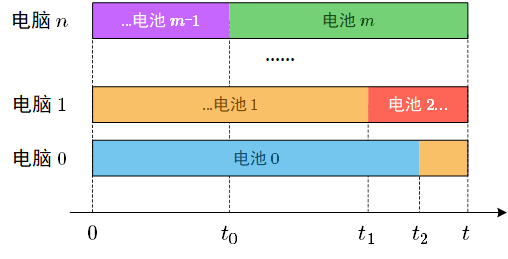

### [二分答案（证明+图解）](https://leetcode.cn/problems/maximum-running-time-of-n-computers/solutions/1213931/er-fen-da-an-by-newhar-swi2/)

#### 解法：二分法

假设所有电脑同时运行 $t$ 分钟。因为一个电池同时只能给一台电脑供电，所以一个电池最多有 $t$ 分钟的供电时间。我们只需要统计所有电池的可供电时间总和$S=\sum\limits_i min(t,batteries_i)$，然后检查它们是否可以给 $n$ 台电脑供电即可（即 $\dfrac{S}{t}\ge n$）。

为什么这个解法是正确的？实际上，如果 $\dfrac{S}{t}\ge n$，那么我们总可以找出一种符合要求的方案来支持 $n$ 台电脑的运行。

如下图所示，我们依次分配电池 $0\sim m$ 给电脑 $0\sim n$。图中，横轴代表时间，各个栏目代表各个电脑的电池分配情况。首先我们把电池 $0 $（蓝色）分配给电脑 $0$。电池 $0$ 给电脑 $0$ 供电时段为 $0\sim t_2$。然后，电脑 $0$ 由电池 $1$ 继续供电，而电池 $1$ 的余下电量用于供给电脑 $1$。然后，我们继续安排电池 $2,3,4...m-1$ 即可。



我们可以得出以下结论：**只要每个电池的供电时间不超过 $t$，那么每个电池的供电时间就不会发生重叠，也就不会发生同一个电池给多台电脑的情况。**

因此，每个电池的 **最大可供电时间** $= min(电池电量,t)$。只要最大可供电时间的 **总和** 可以 **覆盖** 所有的电脑的时间总和（$n\times t$），那么这个供电方案就是可行的。

```python
class Solution:
    def maxRunTime(self, n: int, batteries: List[int]) -> int:
        l, r = 1, 10 ** 15
        while l < r:
            m = (l + r + 1) >> 1
            if sum(min(x, m) for x in batteries) >= n*m:
                l = m
            else:
                r = m-1
        return l
```

```c++
class Solution {
public:
    long long maxRunTime(int n, vector<int>& batteries) {
        auto check = [&](long long t) {
            long long sum = 0;
            for(int i : batteries) sum += min(t, (long long)i);
            return sum / t >= n;
        };
        
        long long l = 1, r = 1e15;
        while(l < r) {
            long long m = (l + r + 1) / 2;
            if(check(m)) {
                l = m;
            }
            else {
                r = m - 1;
            }
        }
        return l;
    }
};
```
