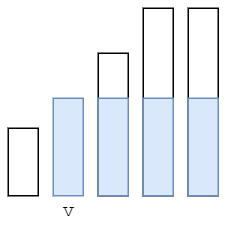

### [枚举最后袋子中魔法豆的数目（Python/Java/C++/Go/JS/Rust）](https://leetcode.cn/problems/removing-minimum-number-of-magic-beans/solutions/1262419/pai-xu-hou-yi-ci-bian-li-by-endlesscheng-36g8/)

我们可以将 $beans$ 从小到大排序后，枚举最终非空袋子中魔法豆的数目 $v$，将小于 $v$ 的魔法豆全部清空，大于 $v$ 的魔法豆减少至 $v$，这样所有非空袋子中的魔法豆就都相等了。

由于拿出魔法豆 + 剩余魔法豆 = 初始魔法豆之和，我们可以考虑最多能剩下多少个魔法豆，从而计算出最少能拿出多少个魔法豆。



如上图所示，可以保留蓝色矩形区域内的魔法豆。设 $beans$ 的长度为 $n$，以 $n-i$ 为矩形底边长，$v=beans[i]$ 为矩形高，则矩形面积为

$$(n-i) \cdot v$$

用 $\sum beans[i]$ 减去矩形面积的最大值，即为拿出魔法豆的最小值。

```python
class Solution:
    def minimumRemoval(self, beans: List[int]) -> int:
        beans.sort()
        return sum(beans) - max((len(beans) - i) * v for i, v in enumerate(beans))
```

```java
public class Solution {
    public long minimumRemoval(int[] beans) {
        Arrays.sort(beans);
        long sum = 0, mx = 0;
        int n = beans.length;
        for (int i = 0; i < n; i++) {
            sum += beans[i];
            mx = Math.max(mx, (long) (n - i) * beans[i]);
        }
        return sum - mx;
    }
}
```

```c++
class Solution {
public:
    long long minimumRemoval(vector<int> &beans) {
        ranges::sort(beans);
        long long sum = 0, mx = 0;
        int n = beans.size();
        for (int i = 0; i < n; i++) {
            sum += beans[i];
            mx = max(mx, (long long) (n - i) * beans[i]);
        }
        return sum - mx;
    }
};
```

```go
func minimumRemoval(beans []int) int64 {
    slices.Sort(beans)
    sum, mx := 0, 0
    for i, v := range beans {
        sum += v
        mx = max(mx, (len(beans)-i)*v)
    }
    return int64(sum - mx)
}
```

```javascript
var minimumRemoval = function(beans) {
    beans.sort((a, b) => a - b);
    const n = beans.length;
    let sum = 0, mx = 0;
    for (let i = 0; i < n; i++) {
        sum += beans[i];
        mx = Math.max(mx, (n - i) * beans[i]);
    }
    return sum - mx;
};
```

```rust
impl Solution {
    pub fn minimum_removal(mut beans: Vec<i32>) -> i64 {
        beans.sort_unstable();
        let mut sum = 0i64;
        let mut mx = 0i64;
        let n = beans.len();
        for i in 0..n {
            let v = beans[i] as i64;
            sum += v;
            mx = mx.max((n - i) as i64 * v);
        }
        sum - mx
    }
}
```

#### 复杂度分析

- 时间复杂度：$\mathcal{O}(n\log n)$，其中 $n$ 为 $beans$ 的长度。瓶颈在排序上。
- 空间复杂度：$\mathcal{O}(1)$。忽略排序的栈开销。
