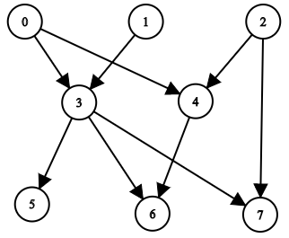

### [两种方法：逆向/正向（Python/Java/C++/Go/JS/Rust）](https://leetcode.cn/problems/all-ancestors-of-a-node-in-a-directed-acyclic-graph/solutions/2723203/liang-chong-fang-fa-ni-xiang-zheng-xiang-rwjs/)

#### 方法一：逆向 DFS

把边**反向**，从点 $i$ 出发 DFS，能访问到的点就是 $\textit{answer}[i]$。

例如示例 1，把边反向后，从 $6$ 出发 DFS，可以访问到 $0,1,2,3,4$。


从点 $i$ 出发 DFS，为避免重复访问节点，可以用 $\textit{vis}$ 数组标记访问过的节点，这样 DFS 结束后，有标记的节点就组成 $\textit{answer}[i]$ 了。

注：本题输入的是一个有向无环图，但该方法并不需要这个条件，即使图中有环，我们也可以找到所有能访问到 $i$ 的节点。

##### 代码

```python
class Solution:
    def getAncestors(self, n: int, edges: List[List[int]]) -> List[List[int]]:
        g = [[] for _ in range(n)]
        for x, y in edges:
            g[y].append(x)  # 反向建图

        def dfs(x: int) -> None:
            vis[x] = True  # 避免重复访问
            for y in g[x]:
                if not vis[y]:
                    dfs(y)  # 只递归没有访问过的点

        ans = [None] * n
        for i in range(n):
            vis = [False] * n
            dfs(i)  # 从 i 开始 DFS
            vis[i] = False  # ans[i] 不含 i
            ans[i] = [j for j, b in enumerate(vis) if b]
        return ans
```

```java
class Solution {
    public List<List<Integer>> getAncestors(int n, int[][] edges) {
        List<Integer>[] g = new ArrayList[n];
        Arrays.setAll(g, i -> new ArrayList<>());
        for (int[] e : edges) {
            g[e[1]].add(e[0]); // 反向建图
        }

        List<Integer>[] ans = new ArrayList[n];
        Arrays.setAll(ans, i -> new ArrayList<>());
        boolean[] vis = new boolean[n];
        for (int i = 0; i < n; i++) {
            Arrays.fill(vis, false);
            dfs(i, g, vis); // 从 i 开始 DFS
            vis[i] = false; // ans[i] 不含 i
            for (int j = 0; j < n; j++) {
                if (vis[j]) {
                    ans[i].add(j);
                }
            }
        }
        return Arrays.asList(ans);
    }

    private void dfs(int x, List<Integer>[] g, boolean[] vis) {
        vis[x] = true; // 避免重复访问
        for (int y : g[x]) {
            if (!vis[y]) {
                dfs(y, g, vis); // 只递归没有访问过的点
            }
        }
    }
}
```

```c++
class Solution {
public:
    vector<vector<int>> getAncestors(int n, vector<vector<int>> &edges) {
        vector<vector<int>> g(n);
        for (auto &e : edges) {
            g[e[1]].push_back(e[0]); // 反向建图
        }

        vector<vector<int>> ans(n);
        vector<int> vis(n);
        function<void(int)> dfs = [&](int x) {
            vis[x] = true; // 避免重复访问
            for (int y : g[x]) {
                if (!vis[y]) {
                    dfs(y); // 只递归没有访问过的点
                }
            }
        };
        for (int i = 0; i < n; i++) {
            ranges::fill(vis, false);
            dfs(i); // 从 i 开始 DFS
            vis[i] = false; // ans[i] 不含 i
            for (int j = 0; j < n; j++) {
                if (vis[j]) {
                    ans[i].push_back(j);
                }
            }
        }
        return ans;
    }
};
```

```go
func getAncestors(n int, edges [][]int) [][]int {
    g := make([][]int, n)
    for _, e := range edges {
        x, y := e[0], e[1]
        g[y] = append(g[y], x) // 反向建图
    }

    vis := make([]bool, n)
    var dfs func(int)
    dfs = func(x int) {
        vis[x] = true // 避免重复访问
        for _, y := range g[x] {
            if !vis[y] {
                dfs(y) // 只递归没有访问过的点
            }
        }
    }
    ans := make([][]int, n)
    for i := range ans {
        clear(vis)
        dfs(i) // 从 i 开始 DFS
        vis[i] = false // ans[i] 不含 i
        for j, b := range vis {
            if b {
                ans[i] = append(ans[i], j)
            }
        }
    }
    return ans
}
```

```javascript
var getAncestors = function(n, edges) {
    const g = Array.from({length: n}, () => []);
    for (const [x, y] of edges) {
        g[y].push(x); // 反向建图
    }

    function dfs(x) {
        vis[x] = true; // 避免重复访问
        for (const y of g[x]) {
            if (!vis[y]) {
                dfs(y, g, vis); // 只递归没有访问过的点
            }
        }
    }
    const ans = Array.from({length: n}, () => []);
    const vis = Array(n);
    for (let i = 0; i < n; i++) {
        vis.fill(false);
        dfs(i); // 从 i 开始 DFS
        vis[i] = false; // ans[i] 不含 i
        for (let j = 0; j < n; j++) {
            if (vis[j]) {
                ans[i].push(j);
            }
        }
    }
    return ans;
};
```

```rust
impl Solution {
    pub fn get_ancestors(n: i32, edges: Vec<Vec<i32>>) -> Vec<Vec<i32>> {
        let n = n as usize;
        let mut g = vec![vec![]; n];
        for e in &edges {
            g[e[1] as usize].push(e[0] as usize); // 反向建图
        }

        fn dfs(x: usize, g: &Vec<Vec<usize>>, vis: &mut Vec<bool>) {
            vis[x] = true; // 避免重复访问
            for &y in &g[x] {
                if !vis[y] {
                    dfs(y, g, vis); // 只递归没有访问过的点
                }
            }
        }
        let mut ans = vec![vec![]; n];
        let mut vis = vec![false; n];
        for i in 0..n {
            vis.fill(false);
            dfs(i, &g, &mut vis); // 从 i 开始 DFS
            vis[i] = false; // ans[i] 不含 i
            for (j, &b) in vis.iter().enumerate() {
                if b {
                    ans[i].push(j as i32);
                }
            }
        }
        ans
    }
}
```

##### 复杂度分析

- 时间复杂度：$\mathcal{O}(n(n+m))$。其中 $m$ 是 $\textit{edges}$ 的长度。对于每个起点 $i$，跑一次 DFS 的时间复杂度为 $\mathcal{O}(n+m)$。
- 空间复杂度：$\mathcal{O}(n+m)$。返回值不计入。

#### 方法二：正向 DFS

例如示例 1，从 $2$ 出发 DFS，可以访问到 $4,6,7$，那么把 $2$ 加到 $\textit{answer}[4], \textit{answer}[6], \textit{answer}[7]$ 中。



依次从起点 $\textit{start}=0,1,2,\cdots,n-1$ 出发 DFS，途中把 $\textit{start}$ 加到能访问到的点的 $\textit{answer}$ 中。由于 $\textit{start}$ 从小到大枚举，所以 $\textit{answer}[i]$ 列表自然就是有序的了。

例如：

- 从 $0$ 出发访问到 $5$，把 $0$ 加到 $\textit{answer}[5]$ 中，现在 $\textit{answer}[5]=[0]$。
- 从 $1$ 出发访问到 $5$，把 $1$ 加到 $\textit{answer}[5]$ 中，现在 $\textit{answer}[5]=[0,1]$。
- 从 $3$ 出发访问到 $5$，把 $3$ 加到 $\textit{answer}[5]$ 中，现在 $\textit{answer}[5]=[0,1,3]$。

**小技巧：** 无需每次 DFS 前都重新初始化 $\textit{vis}$ 数组。我们会跑 $n$ 个 DFS，每个 DFS 的 $\textit{start}$ 都是不同的。利用这一条件，当访问到节点 $x$ 时，标记 $\textit{vis}[x] = \textit{start}$，表示 $x$ 是本轮 DFS 中访问到的节点。当我们访问到某个节点 $y$ 时，如果发现 $\textit{vis}[y] = \textit{start}$，就表示 $y$ 访问过了，否则没有访问过。

注：本题输入的是一个有向无环图，但该方法并不需要这个条件，即使图中有环，我们也可以找到所有能访问到 $i$ 的节点。

```python
class Solution:
    def getAncestors(self, n: int, edges: List[List[int]]) -> List[List[int]]:
        g = [[] for _ in range(n)]
        for x, y in edges:
            g[x].append(y)

        def dfs(x: int) -> None:
            vis[x] = start  # 避免重复访问
            for y in g[x]:
                if vis[y] != start:
                    ans[y].append(start)  # start 是访问到的点的祖先
                    dfs(y)  # 只递归没有访问过的点

        ans = [[] for _ in range(n)]
        vis = [-1] * n
        for start in range(n):
            dfs(start)  # 从 start 开始 DFS
        return ans
```

```java
class Solution {
    public List<List<Integer>> getAncestors(int n, int[][] edges) {
        List<Integer>[] g = new ArrayList[n];
        Arrays.setAll(g, i -> new ArrayList<>());
        for (int[] e : edges) {
            g[e[0]].add(e[1]);
        }

        List<Integer>[] ans = new ArrayList[n];
        Arrays.setAll(ans, i -> new ArrayList<>());
        int[] vis = new int[n];
        Arrays.fill(vis, -1);
        for (int start = 0; start < n; start++) {
            dfs(start, start, g, vis, ans); // 从 start 开始 DFS
        }
        return Arrays.asList(ans);
    }

    private void dfs(int x, int start, List<Integer>[] g, int[] vis, List<Integer>[] ans) {
        vis[x] = start; // 避免重复访问
        for (int y : g[x]) {
            if (vis[y] != start) {
                ans[y].add(start); // start 是访问到的点的祖先
                dfs(y, start, g, vis, ans); // 只递归没有访问过的点
            }
        }
    }
}
```

```c++
class Solution {
public:
    vector<vector<int>> getAncestors(int n, vector<vector<int>> &edges) {
        vector<vector<int>> g(n);
        for (auto &e : edges) {
            g[e[0]].push_back(e[1]);
        }

        vector<vector<int>> ans(n);
        vector<int> vis(n, -1);
        int start;
        function<void(int)> dfs = [&](int x) {
            vis[x] = start; // 避免重复访问
            for (int y : g[x]) {
                if (vis[y] != start) {
                    ans[y].push_back(start); // start 是访问到的点的祖先
                    dfs(y); // 只递归没有访问过的点
                }
            }
        };
        for (start = 0; start < n; start++) {
            dfs(start); // 从 start 开始 DFS
        }
        return ans;
    }
};
```

```go
func getAncestors(n int, edges [][]int) [][]int {
    g := make([][]int, n)
    for _, e := range edges {
        x, y := e[0], e[1]
        g[x] = append(g[x], y)
    }

    ans := make([][]int, n)
    vis := make([]int, n)
    start := 0
    var dfs func(int)
    dfs = func(x int) {
        vis[x] = start + 1 // 避免重复访问
        for _, y := range g[x] {
            if vis[y] != start+1 {
                ans[y] = append(ans[y], start) // start 是访问到的点的祖先
                dfs(y) // 只递归没有访问过的点
            }
        }
    }
    for ; start < n; start++ {
        dfs(start) // 从 start 开始 DFS
    }
    return ans
}
```

```javascript
var getAncestors = function(n, edges) {
    const g = Array.from({length: n}, () => []);
    for (const [x, y] of edges) {
        g[x].push(y);
    }

    function dfs(x) {
        vis[x] = start; // 避免重复访问
        for (const y of g[x]) {
            if (vis[y] !== start) {
                ans[y].push(start); // start 是访问到的点的祖先
                dfs(y); // 只递归没有访问过的点
            }
        }
    }
    const ans = Array.from({length: n}, () => []);
    const vis = Array(n).fill(-1);
    let start = 0;
    for (; start < n; start++) {
        dfs(start); // 从 start 开始 DFS
    }
    return ans;
};
```

```rust
impl Solution {
    pub fn get_ancestors(n: i32, edges: Vec<Vec<i32>>) -> Vec<Vec<i32>> {
        let n = n as usize;
        let mut g = vec![vec![]; n];
        for e in &edges {
            g[e[0] as usize].push(e[1] as usize);
        }

        fn dfs(x: usize, start: usize, g: &Vec<Vec<usize>>, vis: &mut Vec<usize>, ans: &mut Vec<Vec<i32>>) {
            vis[x] = start; // 避免重复访问
            for &y in &g[x] {
                if vis[y] != start {
                    ans[y].push(start as i32); // start 是访问到的点的祖先
                    dfs(y, start, g, vis, ans); // 只递归没有访问过的点
                }
            }
        }
        let mut ans = vec![vec![]; n];
        let mut vis = vec![n; n];
        for start in 0..n {
            dfs(start, start, &g, &mut vis, &mut ans); // 从 start 开始 DFS
        }
        ans
    }
}
```

##### 复杂度分析

- 时间复杂度：$\mathcal{O}(n(n+m))$。其中 $m$ 是 $\textit{edges}$ 的长度。对于每个起点 $\textit{start}$，跑一次 DFS 的时间复杂度为 $\mathcal{O}(n+m)$。
- 空间复杂度：$\mathcal{O}(n+m)$。返回值不计入。

#### 分类题单

- [滑动窗口（定长/不定长/多指针）](https://leetcode.cn/circle/discuss/0viNMK/)
- [二分算法（二分答案/最小化最大值/最大化最小值/第K小）](https://leetcode.cn/circle/discuss/SqopEo/)
- [单调栈（矩形系列/字典序最小/贡献法）](https://leetcode.cn/circle/discuss/9oZFK9/)
- [网格图（DFS/BFS/综合应用）](https://leetcode.cn/circle/discuss/YiXPXW/)
- [位运算（基础/性质/拆位/试填/恒等式/贪心/脑筋急转弯）](https://leetcode.cn/circle/discuss/dHn9Vk/)
- [图论算法（DFS/BFS/拓扑排序/最短路/最小生成树/二分图/基环树/欧拉路径）](https://leetcode.cn/circle/discuss/01LUak/)
- [动态规划（入门/背包/状态机/划分/区间/状压/数位/数据结构优化/树形/博弈/概率期望）](https://leetcode.cn/circle/discuss/tXLS3i/)
